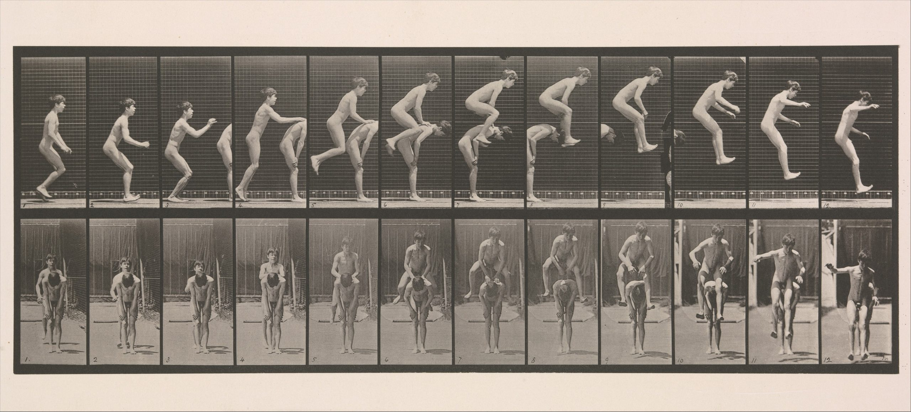

# Person in Time

Experimental Capture, Fall 2024 • Golan Levin & Nica Ross 
[Original Link](https://courses.ideate.cmu.edu/60-461/f2024/deliverables/person-in-time/index.html)

---

 *Edweard Muybridge*.

## Summary of Deadlines

* October 9: Looking Outwards #04
* October 23: Work-in-Progress posts & presentations
* November 6: Project presented during in-class critique

---

## Overview

*This project is due Wednesday, November 6th, at the beginning of class.*

Using expanded capture techniques, acquire an impression of a person¹ over time², and develop a media object³ from this impression which reveals your subject’s (or subjects’) [quiddity](https://en.wikipedia.org/wiki/Quiddity)⁴ — something essential, hidden or immaterial (or at least: *non-generic*) about the person and/or the event.

Give consideration to the nature of the event, activity or situation during which you capture your subject. This might be (for example) a breath, a parade, a ritual, a fight, a fart, a conversation, a party, a magic trick, a stillness, a performance, a micro-expression, something fleeting, something banal, or something that transpires over days. *This list is not exclusive or exhaustive.*

Regarding your media object: your project might take the form of one or more of the following (for example): a video; an animated GIF; an immersive VR or interactive game; a still image or sequence of still images; a 2D image or 3D form representing a trace over time; an audio recording; a database. *This list is not exclusive or exhaustive.*

### Small Print: Please Don’t Get Too Hung Up

*We anticipate that the median ExCap student will develop or adapt an experimental process to create some sort of time-based impression of a person. However, sometimes students get snagged by the language we use to describe our assignments. Thus, some footnotes to the above:*

1. Please don’t get too hung up on “a person”. You are not restricted to capturing one single person. You may capture couples or other groups of plural individuals, separately or simultaneously, and/or you may also capture crowds. An animal could count.
2. Please don’t get too hung up on “over time”. You are not restricted to capturing video. Even a still photograph has an exposure time.
3. Please don’t get too hung up on “media object”. The point is for you to make something reasonably self-contained,  reasonably polished, and reasonably shareable.
4. Please don’t get too hung up on “quiddity”. There is no test to determine whether you have successfully captured your subject’s soul. The point is to capture something non-generic about them.

---

## Considerations

### Technical Considerations

Consider the heart of what makes a process experimental: a certain degree of *unknown* in the outcome. We ask: “What if….?” Capturing a person-in-time event will almost certainly require that you research, devise, customize, and/or iterate on developing a capture process or apparatus:

* You could use **technologies and equipment** such as: high speed cameras, thermal cameras, 360º cameras, stereo cameras, motion capture systems, depth cameras (RGBD) or depth estimation (AI), robot arms and camera rails, software for tracking faces/hands/eyes, Wacom Cintiq, GPS logger, quadcopters, automatic transcription, silhouette extraction (green screen, AI, etc.), bullet time, and more. This list is not exclusive or exhaustive.
* You could explore **approaches to time** such as: slow-motion, time-lapse, stop-frame, long exposure, light-painting, retrograde, looping, multi-perspective capture, stroboscopy, and more. This list is not exclusive or exhaustive.
* You could explore **approaches to imaging** such as Schlieren, telecentric, superpositioning, microscopy, macrovideography, body-mounted instrumentation, first-person vs. third-person, Eulerian video magnification, slit-scan, and more. This list is not exclusive or exhaustive.

For this assignment, one *possible* way to develop your project could be to amalgamate synchronous recordings from two simultaneous data sources, such as video plus some parallel data stream. Examples (among many others) could include:

* Video plus GPS location or 3D orientation (using an Arduino shield or mobile phone)
* Video plus hand joint data (from a Leap controller)
* Audio plus body skeleton data (from a Kinect, OptiTrack, or OpenPose)
* Video plus breathing or pulse data (from an Arduino with sensors)
* RGBD point clouds plus thermal imaging
* Heartbeat (pulse) plus full-body motion capture
* …

### Ethical Considerations

* Keep in mind that when a subject allows you to record and represent them, this is an act of generosity.
* Please collaborate with and earn the trust of your subject. Make a good-faith effort to show them your project when it is complete.
* Please secure consent from your subject, beforehand, as to how you will use, display and store your captured data, especially if you are capturing any potentially compromising or embarrassing media.
* Nude photography/videography of persons under 18 years of age is prohibited in this course. For subjects over 18 years of age, you must have [clear-cut written permission](https://www.free-legal-document.com/free-model-release-form.html) to capture any nude images or video.
* You are prohibited from creating capture scenarios which put yourself, your subject, or anyone else in mortal danger.
* You may wish to consult information about [laws regarding street photography](https://www.theclickcommunity.com/blog/street-photography-and-the-law-7-things-you-need-to-know/) and your [rights to take photographs in public](https://www.aclu.org/issues/free-speech/photographers-rights#:~:text=Taking%20photographs%20and%20video%20of,officials%20carrying%20out%20their%20duties.).
Please feel free to contact the professors if you have any questions.

---

## Deliverables

This project will be evaluated in critique on **Wednesday, November 6th**. There will be at least two guest critics present, and a shared Google doc to compile notes from everyone present. You will be expected to present your project from a blog post on this course website.

Please be sure to complete all of the requirements below.

* **Create** a blog post on this WordPress site, in which you will document your project.
* **Categorize** your blog post with the WordPress category, *PersonInTime*.
* **Write** approximately 300 words (a page) discussing your process and results, in your blog post. Be sure to address the questions below: 
  * **Discuss**: What event, activity or situation did you choose to capture? Why did you select this subject (what opportunities did it present)?
  * **Cite** (and include an image) of at least one piece of prior work that inspired you, or which you see as related to your project.
  * **Discuss** the system you developed to capture this event. Describe your workflow or pipeline in detail, including diagrams if necessary. What led you to develop or select this specific process? What were your inspirations in creating this system?
  * **Discuss** the relationship between form and content in your project, including type of media object you created to present your findings. (Is it a map? a collection? an immersive VR? an animated GIF?) Why did you select this form? How does your chosen capture technique or display medium help illustrate something about your subject, beyond what a normal photograph could?
  * **Evaluate** your project. What findings does it make clear? That is, what aspects of your subject, or their activity or situation, does your process help reveal?
* **Embed** an image of your event in the blog post. This might be a screenshot, photo, CGI rendering, etc. Preferably include more than one!
* **Embed** a scan or photo of any relevant notebook sketches you made, if possible.
* If your media object is interactive and time-based (such as an interactive VR), be sure to create a video to document it. **Upload** this video to YouTube, Vimeo, or directly to this WordPress site. **Embed** this video in your blog post.
* **Create** a brief animated GIF of your project, no larger than 800 pixels wide, and ideally under 5MB. Make sure your GIF is set to loop infinitely. **Embed** this animated GIF in your blog post. Be sure to preview your blog post to make sure that your GIF plays correctly.

---

## Learning Objectives

Upon conclusion of this assignment, students will be able to:

* **Design** and **construct** a novel or non-traditional capture technique, and demonstrate an understanding of its application to the production of a poetic, elucidative, and/or revelatory temporal representation of one or more persons.