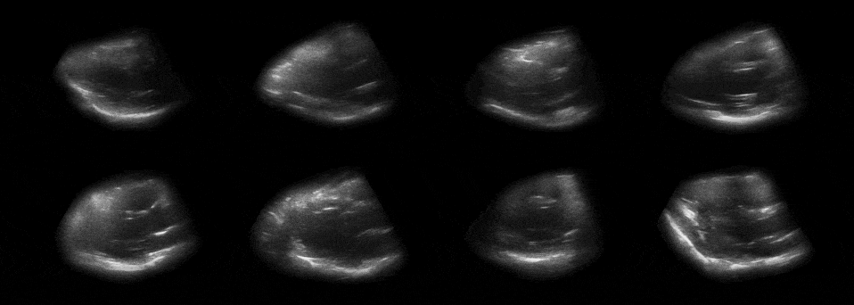
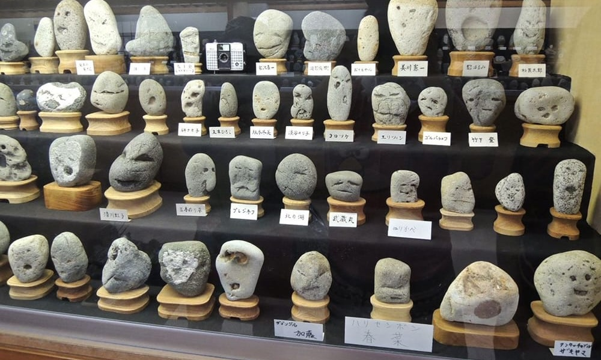

# Typology Machine

Experimental Capture, Fall 2024 • Golan Levin & Nica Ross 
[Original Link](https://courses.ideate.cmu.edu/60-461/f2024/deliverables/typology-machine/index.html)

---

 *“[Sonogram Portraits](https://courses.ideate.cmu.edu/60-461/s2020/index.html%3Fp=1263.html)” (2020), by ExCap student [Cathryn Ploehn](https://design.utexas.edu/people/ploehn-cathryn)*

## Overview

* **This project is due Wednesday October 2nd at the beginning of class.**
* **A proposal or WIP review is due Monday September 16 for presentation/discussion.**

Suppose you are a crewmember of an alien expedition, sent to study Earth. You are an expert in some  specialization (such as botany, zoology, geology, psychology, xenoarchaeology, exogastronomy, etc.). Your vehicle lands; you set up your devices; and you begin to investigate the people, places, or things which are the subject of your specialization. Your job is to:

* **build a data-collection “machine”** (i.e. system, process, ruleset, apparatus, or workflow) which, through capture, produces “media objects” that allow you to answer a question about your specific subject. Then,
* **use this system to create a typology** which presents your findings about your subject.

Acceptable sorts of media objects include, but are not limited to:

* a collection of static images, 3D models, 3D prints, 2D renderings, data visualizations, etc., or
* a collection of time-based videos, animations, animated GIFs, audio recordings, etc., or
* an ordered series of media objects, presented in a book, a video, etc.
* a structured database of media objects, presented with the aid of custom browsing software which supports explorations of your collection through interactions like sorting, filtering, querying, zooming, etc.

**Your objective in this assignment is to make a machine (i.e. system, apparatus, or workflow) which automates capturing things—for the purposes of producing a typology that allows us to see some slice of the world in a new way.** You are asked to use your typology machine to document *at least three items*—though preferably many more. Resources for your consideration include this [article on typologies](https://www.photopedagogy.com/typologies.html), and course lectures on [typologies](https://github.com/golanlevin/ExperimentalCapture/blob/master/docs/typologies.md), [portrait series](https://github.com/golanlevin/ExperimentalCapture/blob/master/docs/portraits_1_series.md), [candid capture systems](https://github.com/golanlevin/ExperimentalCapture/blob/master/docs/portraits_2_candid_machinery.md), and [proxy portraiture](https://github.com/golanlevin/ExperimentalCapture/blob/master/docs/portraits_3_indirect_portrait.md).

Here are some *Typology Machine* projects by prior ExCap students:

* Hizal built a [custom RC 3D scanner](https://ems.andrew.cmu.edu/excap17/author/hizlik/index.html) to capture the undersides of vehicles (2017).
* B created a [wholesome system to candidly capture people’s surprise](https://courses.ideate.cmu.edu/60-461/f2022/index.html%3Fp=925.html) (2022).
* Zeak built a [photobooth capture station for Etch-a-Sketch self-portraits](https://courses.ideate.cmu.edu/60-461/f2022/index.html%3Fp=892.html) (2022).
* Cathryn built a [system to collect and compare sonocardiograms](https://courses.ideate.cmu.edu/60-461/s2020/index.html%3Fp=1263.html) (2020).
* Huw made a [virtual gallery for comparing 3D-modeled vs. 3D-scanned objects](https://courses.ideate.cmu.edu/60-461/s2020/index.html%3Fp=1666.html) (2020).
* Policarpo made a [system for capturing the thermal signatures of hugging](https://courses.ideate.cmu.edu/60-461/s2020/index.html%3Fp=1424.html) (2020).
* Sean somehow managed to make [3D scans of the insides of phone charging ports](https://courses.ideate.cmu.edu/60-461/s2020/index.html%3Fp=1523.html) (2020).
* Izzy created a collection of [omphalospheric camera lucida drawings of different environments](https://courses.ideate.cmu.edu/60-461/s2020/index.html%3Fp=1413.html) (2020).

---

## Deliverables

 *“[Circles of Life](https://ems.andrew.cmu.edu/excap17/caro/05/07/caro-final/index.html)” Typology Machine (2017) by ExCap student, [Caroline Hermans](https://caro.io/) (BEA 2018)*

### Work-in-Progress / Proposal Report (due Monday, September 16th)

* Before September 16: **read** [this article](https://web.archive.org/web/20260205080914/https://www.photopedagogy.com/typologies.html) on typologies, and **review** the following course lectures:
  * [typologies and small multiples](https://github.com/golanlevin/ExperimentalCapture/blob/master/docs/typologies.md)
  * [portrait series: systems for collection and comparison](https://github.com/golanlevin/ExperimentalCapture/blob/master/docs/portraits_1_series.md)
  * [candid capture systems](https://github.com/golanlevin/ExperimentalCapture/blob/master/docs/portraits_2_candid_machinery.md)
  * [proxy portraiture: the indirect portrait](https://github.com/golanlevin/ExperimentalCapture/blob/master/docs/portraits_3_indirect_portrait.md)
* In the Discord channel *#Typology-Machine*, **write** a sentence or two about a typology that you’ve found compelling. This could be a typology presented in one of the above lectures, or one that you’ve come across elsewhere. Include an image.
* *A proposal and/or work-in-progress report* for this project is due Monday, September 16th at the beginning of class. This should take the form of a blog post, containing a clear description of your project-in-progress, explanatory illustrations, and links to references or inspirations. Be sure to discuss your *strategies for regularizing* the subject you plan to capture. Categorize your post with the WordPress category, *TypologyMachineWIP*. You will use this blog post to refine and discuss your project in small group meetings with your peers.

### Typology Machine Project (due Wednesday, October 2)

Please be sure to complete all of the requirements below.

* **Create** a blog post on this WordPress site, whereat you will document your project.
* **Categorize** your blog post with the WordPress category, TypologyMachine. This helps make it easy to find your project later.
* **Describe** your project, in a single, clear, compelling sentence, at the top of your blog post. This sentence should explain what the project is, and give a suggestion about why someone may find it interesting. (What was your research question?)
* **Write** approximately 300 words, in your blog post, discussing your process and results. Be sure to address the questions below.
  * *What was your research question or hypothesis?*
  * *What were your inspirations?*
  * *How did you develop your project? Describe your machine or workflow in detail, including diagrams if necessary. What was more complex than you thought? What was easier?*
  * *In what ways is your presentation (and the process by which you made it) specific to your subject? Why did you choose those tools/processes for this subject?*
  * *Evaluate your project. In what ways did you succeed, or fail? What opportunities remain?*
* **Embed** images of your project in the blog post. This might include screenshots, renderings, etc. Include a scan or photo of any relevant notebook sketches, if possible.
* **Embed** a quantity of your media objects (images, videos, GIFs) in the blog post.
* If your project is an interactive software system, **record** and **embed** a screengrabbed video demonstrating its use, ideally with narration.

---

## Learning Objectives

Upon conclusion of this assignment, students will be able to:

* **Recognize** and **discuss** the use of typologies (in photography and related media), as well as small multiples (in information visualization), and “minimum inventory, maximum diversity” systems (in science and the arts) in presenting collections of comparable units
* **Demonstrate** a practical understanding of the use of automation in data collection — whether by computational, algorithmic, mechanical, manual, or conceptual means
* **Design** and **construct** a novel or non-traditional capture workflow, and demonstrate an understanding of its application to the production of a poetic, elucidative, and/or revelatory work.

 *Chichibu Chinsekikan (Hall of Curious Stones) — a museum of rocks that resemble faces. Sometimes a capture “algorithm” or ruleset is simply a well-defined filter.*