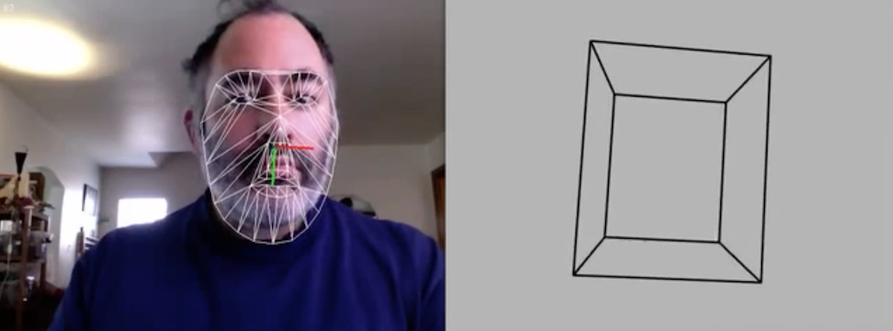

# Some Gesture Capture Tools 

This document lists some powerful, low-budget, resources for capturing gestural information. This document assumes you are aleady familiar with *why* you might want to capture gestural data, and that you have some familiarity with programming in e.g. Processing. 

**Contents:**

* **OSC Tools**
 * [touchOSC](touchOSC)
 * [gyrOSC](gyrOSC)
 * [FaceOSC](FaceOSC)
 * [blinkOSC](blinkOSC)
 * [EyeOSC](EyeOSC)
 * [PoseOSC](PoseOSC)
* **Non-OSC Tools**
 * [PoseNet in the Browser](PoseNet-in-the-Browser)
 * [Offline PoseNet](Offline-PoseNet)
 * [Brekel MoCap](Brekel-MoCap)
 * [Leap Motion for Processing](Leap-Motion-for-Processing)
 * [BodyPix and MaskRCNN](BodyPix-and-MaskRCNN)
 * [OpenTSPS](OpenTSPS)
* **Other Tools**
 * [Diagnostic Tools](Diagnostic-Tools)


---

### touchOSC

[TouchOSC](https://hexler.net/products/touchosc) is a modular OSC and MIDI control surface for iOS (iPhone/iPod Touch/iPad) and Android. It can send messages via OSC from interactions with its control panels. Custom control panels can be created by using the TouchOSC Editor, available for Windows/Mac OSX/Linux.

* Download [Processing templates for touchOSC](touchOSC.zip)
* [Documentation](http://hexler.net/docs/touchosc-setup-other)


---

### gyrOSC

[GyrOSC](http://www.bitshapesoftware.com/instruments/gyrosc/) is an iOS app that sends your phone's sensor data over your local wireless network over OSC. Control your live audio or video application with your device's built-in gyroscope, accelerometer, and compass. Known to work with iOS 12.3.

* Download [Processing template for gyrOSC](gyrOSC.zip)


---

### FaceOSC

[FaceOSC](https://github.com/kylemcdonald/ofxFaceTracker/) is an application by Kyle McDonald that transmits face landmark geometries over OSC. There are a wide variety of clients (Processing, openFrameworks, etc.) which can receive this data for further artistic play. Created 2012-2016 by Kyle McDonald in openFrameworks v0.98. Known to work with Mac OSX 10.13.6, includes Processing v3 demo. Windows FaceOSC is [also available](https://github.com/kylemcdonald/ofxFaceTracker/releases).

You will need: 

* [FaceOSC.zip](FaceOSC.zip) (local copy), or from [Kyle's repository](https://github.com/kylemcdonald/ofxFaceTracker/releases)
* [OSCp5 library](http://www.sojamo.de/libraries/oscP5/) (enables Processing to receive OSC); install with the inbuilt installer
* [FaceOSC Receiver Templates](https://github.com/CreativeInquiry/FaceOSC-Templates)


[](https://www.youtube.com/watch?v=SUJJn2yjc3g)

Of related interest, are face-trackers that work with JavaScript in the browser:

* [p5.js with clmTracker at Glitch](https://glitch.com/~cmuems-clm-networked-face)
* [p5.js with clmTracker at Editor.p5js.org](https://editor.p5js.org/Char/sketches/HkzbwITc7)
* [p5.js + BRFv4 (via handsfree.js) at Editor.p5js.org](https://editor.p5js.org/golan/sketches/AeEppZ4XR) or [here](https://editor.p5js.org/sovid/sketches/bmTRGd3b5)
* [Face Landmarks at RunwayML.com](https://runwayml.com/).


---

### blinkOSC

Sends blink signals when sufficient motion is detected around the subject's eyes. Created by Kyle McDonald in openFrameworks v0.98 in 2016, as a branch of his ofxFaceTracker. Known to work with Mac OSX 10.13.6, includes Processing v3 demo.

* Download [blinkOSC.zip](blinkOSC.zip)



---

### EyeOSC

Gaze estimation application by Kyle McDonald (2012) that sends data over OSC, developed in collaboration with Yusuke Sugano. Known to work with Mac OSX 10.13.6, includes Processing v3 demo.

* Download [EyeOSC.zip](EyeOSC.zip)
* [Original repository](https://github.com/kylemcdonald/AppropriatingNewTechnologies/downloads)


---

### PoseOSC

By Lingdong Huang (2019), developed in Node.js. Transmits pose data computed with OpenPose over OSC. For a Processing demo, use with [PoseOSCProcessingReceiverXML.pde](PoseOSCProcessingReceiverXML/PoseOSCProcessingReceiverXML.pde).

* [Download PoseOSC](https://github.com/LingDong-/PoseOSC/releases)
* [Main repository](https://github.com/LingDong-/PoseOSC)


---


### PoseNet in the Browser

* [ml5.js with PoseNet + WebCam at Editor.p5js.org](https://editor.p5js.org/Luxapodular/sketches/r18Rdesqm)
* [ml5.js with PoseNet + WebCam at Editor.p5js.org, *nose only*](https://editor.p5js.org/Luxapodular/sketches/HkWweYo9X)
* [ml5.js with PoseNet + WebCam at Glitch](https://cmuems-skeleton.glitch.me/)
* [ml5.js with PoseNet + WebCam + Networking at Glitch](https://glitch.com/~cmuems-skeleton-networked)


---


### Offline PoseNet


For body tracking in offline (pre-recorded) video, you can use this [template code](https://gist.github.com/golanlevin/701cec4696b61715879ccdb64855c155) for p5.js with PoseNet via ml5.js. A zipped template is also provided [here](PoseNet_video.zip).

To run this in OSX, run a local server using Python3, using the terminal commands below; then open the URL, *http://0.0.0.0:8000/*

```
> cd PoseNet_video 
> python -m http.server
```

For Python 2.7, use this command instead:

```
> cd PoseNet_video 
> python -m SimpleHTTPServer 8000
```

(If those commands don't work, see [this web page](https://github.com/processing/p5.js/wiki/Local-server#python-simplehttpserver) for more options.)

* Of related interest is [PoseNet at RunwayML.com](https://runwayml.com/).


---

### Brekel MoCap

Motion capture to industry-standard BVH files via Kinect v2.

* [Brekel Pro Body v2](https://brekel.com/brekel-pro-body-v2/)
* [BVH display templates](https://github.com/CreativeInquiry/BVH-Examples) (Processing, three.js, OF)


---


### Leap Motion for Processing

The Leap Motion sensor detects and tracks hands, fingers and finger-like tools. The device operates in an intimate proximity with high precision and tracking frame rate. Install Processing 3+, Leap drivers, and (using the inbuilt installer) the [*Leap Motion for Processing*](https://github.com/nok/leap-motion-processing) addon library for Processing. 

* [Main repository](https://github.com/nok/leap-motion-processing)


--- 

### BodyPix and MaskRCNN

* [ml5.js BodyPix at Editor.p5js.org with Webcam](https://editor.p5js.org/ml5/sketches/BodyPix_Webcam)
* [ml5.js BodyPix with Webcam and Part Segmentation](https://editor.p5js.org/ml5/sketches/BodyPix_Webcam_Parts)
* [Mask RCNN at RunwayML.com](https://runwayml.com/).


---

### OpenTSPS

* [v.1.3.7 (2014) at tsps.cc](http://www.tsps.cc/download)
* [v.1.3.8 (2016) at SourceForge](https://sourceforge.net/projects/tsps/files/)
* [Examples for v.1.3.8](TSPS_examples_1.3.8.zip)
* [Examples/integrations at Github](https://github.com/labatrockwell/openTSPS)


---

### Diagnostic Tools


[OSCDataMonitor](https://www.kasperkamperman.com/blog/processing-code/osc-datamonitor/) by Kasper Kamperman ([local download](OSCDataMonitor.zip)) <br />


[OSCDataPlotter](OSCDataPlotter.zip) by [Rebecca Fiebrink](http://www.wekinator.org/examples/#OSC_Data_Plotter) <br />


[oscHook](https://play.google.com/store/apps/details?id=com.hollyhook.oscHook&hl=en_US) on Google Play store (similar to GyrOSC) <br />


---

### *Not Yet Organized*

https://github.com/microcosm/KinectV2-OSC
https://github.com/microcosm/ofxKinectV2-OSC
Lots more at http://www.wekinator.org/examples/

[Squarepusher: *Terminal Slam*](https://www.youtube.com/watch?v=GlhV-OKHecI) (video by Daito Manabe)
