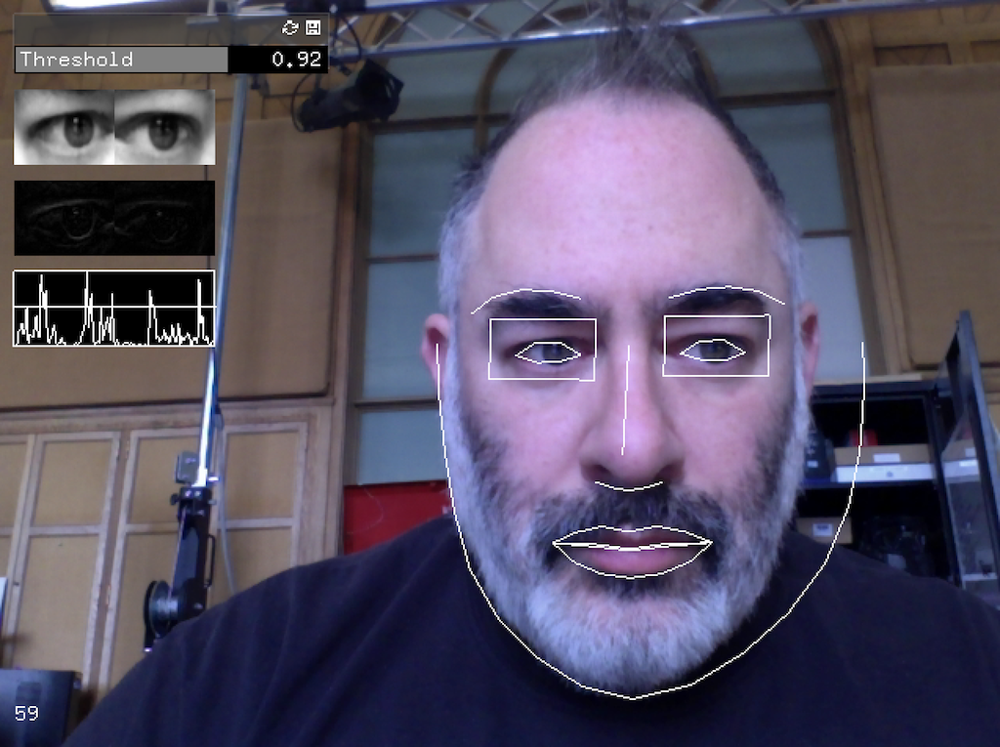

# Some Gesture Capture Tools 

---

### blinkOSC

Sends blink signals when sufficient motion is detected around the subject's eyes. Created by Kyle McDonald in openFrameworks v0.98 in 2016, as a branch of his ofxFaceTracker. Known to work with Mac OSX 10.13.6, includes Processing v3 demo.

* Download [blinkOSC.zip](blinkOSC.zip)


---

### EyeOSC

Gaze estimation application by Kyle McDonald (2012) that sends data over OSC, developed in collaboration with Yusuke Sugano. Known to work with Mac OSX 10.13.6, includes Processing v3 demo.

* Download [EyeOSC.zip](EyeOSC.zip)
* [Original repository](https://github.com/kylemcdonald/AppropriatingNewTechnologies/downloads)

---

### sendMultiTouches

This is a small bit of code that will allow you to send multitouch data
from a MacBook trackpad via OSC, by Duncan Boehle (2012).

* Download [sendMultiTouches.zip](sendMultiTouches.zip) for OSX
* [Original repository](https://github.com/dboehle/SendMultiTouches)

---

### PoseOSC

By Lingdong Huang (2019), developed in Node.js. Transmits pose data computed with OpenPose over OSC. For a Processing demo, use with [PoseOSCProcessingReceiverXML.pde](PoseOSCProcessingReceiverXML/PoseOSCProcessingReceiverXML.pde).

* [Download PoseOSC](https://github.com/LingDong-/PoseOSC/releases)
* [Main repository](https://github.com/LingDong-/PoseOSC)

---

### OpenTSPS

* [v.1.3.7 (2014) at tsps.cc](http://www.tsps.cc/download)
* [v.1.3.8 (2016) at SourceForge](https://sourceforge.net/projects/tsps/files/)
* [Examples for v.1.3.8](TSPS_examples_1.3.8.zip)
* [Examples/integrations at Github](https://github.com/labatrockwell/openTSPS)

---