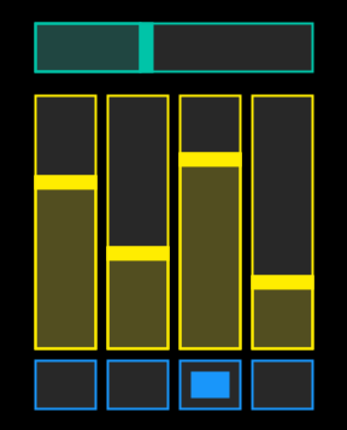
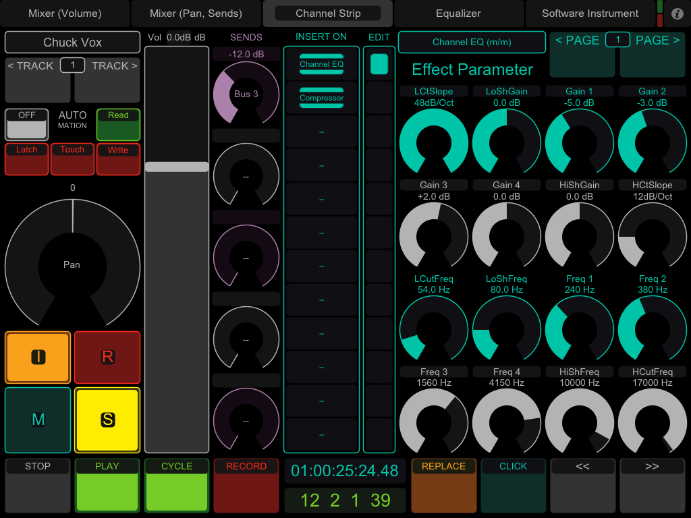
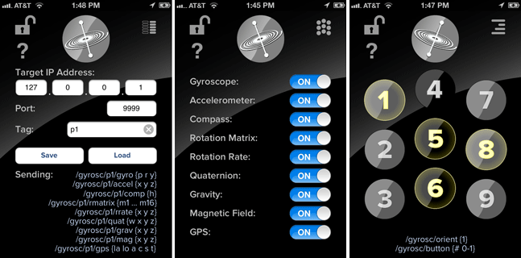
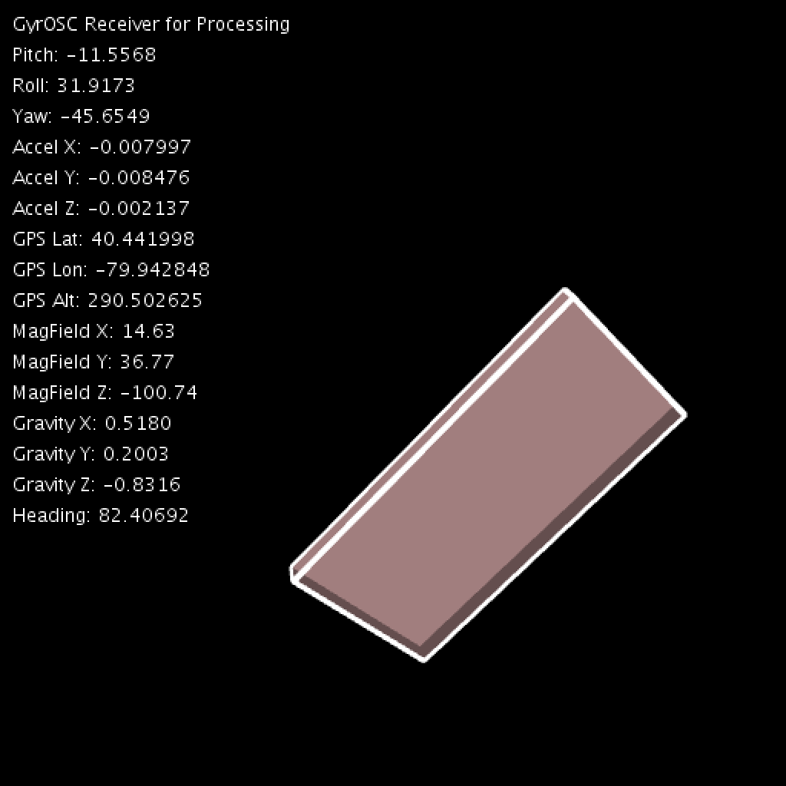
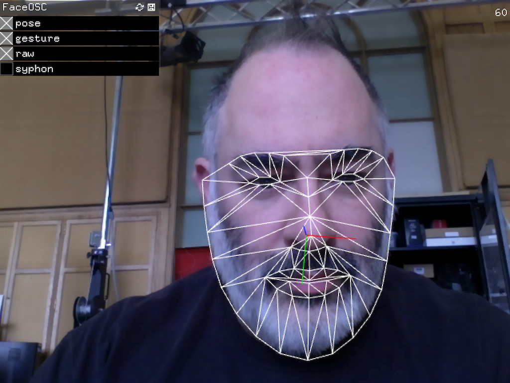
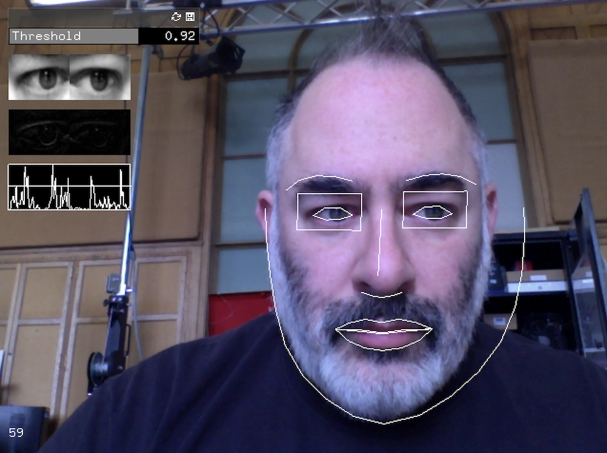

# OSC Demos

**Contents:**

* [touchOSC](touchOSC)
* [gyrOSC](gyrOSC)
* [FaceOSC](FaceOSC)
* [blinkOSC](blinkOSC)
* [EyeOSC](EyeOSC)

---

### touchOSC

[TouchOSC](https://hexler.net/products/touchosc) is a modular OSC and MIDI control surface for iOS (iPhone/iPod Touch/iPad) and Android. It can send messages via OSC from interactions with its control panels. Custom control panels can be created by using the TouchOSC Editor, available for Windows/Mac OSX/Linux.

* Download [Processing templates for touchOSC](touchOSC.zip)
* [Documentation](http://hexler.net/docs/touchosc-setup-other)

---

### gyrOSC

[GyrOSC](http://www.bitshapesoftware.com/instruments/gyrosc/) is an iOS app that sends your phone's sensor data over your local wireless network over OSC. Control your live audio or video application with your device's built-in gyroscope, accelerometer, and compass. Known to work with iOS 12.3.

* Download [Processing template for gyrOSC](gyrOSC.zip)

---

### FaceOSC

Created 2012-2016 by Kyle McDonald in openFrameworks v0.98. Known to work with Mac OSX 10.13.6, includes Processing v3 demo. Windows FaceOSC is [also available](https://github.com/kylemcdonald/ofxFaceTracker/releases).

* Download [FaceOSC.zip](FaceOSC.zip)
* [FaceOSC main repository](https://github.com/kylemcdonald/ofxFaceTracker/)
* [FaceOSC downloads & docs](https://github.com/kylemcdonald/ofxFaceTracker/releases)
* [FaceOSC Receiver Templates](https://github.com/CreativeInquiry/FaceOSC-Templates)

---

### blinkOSC

Sends blink signals when sufficient motion is detected around the subject's eyes. Created by Kyle McDonald in openFrameworks v0.98 in 2016, as a branch of his ofxFaceTracker. Known to work with Mac OSX 10.13.6, includes Processing v3 demo.

* Download [blinkOSC.zip](blinkOSC.zip)


---

### EyeOSC

Gaze estimation application by Kyle McDonald (2012) that sends data over OSC, developed in collaboration with Yusuke Sugano. Known to work with Mac OSX 10.13.6, includes Processing v3 demo.

* Download [EyeOSC.zip](EyeOSC.zip)
* [Original repository](https://github.com/kylemcdonald/AppropriatingNewTechnologies/downloads)

---

**Not yet exposed here:**

* [*LeapOSC*](LeapOSC)
* [*PoseOSC*](PoseOSC)
* [*KinectV2OSC*](KinectV2OSC)
* [*OpenTSPS*](OpenTSPS)

**More:** 

Windows prebuilt binary: 
https://github.com/eddietree/leap-osc/releases/tag/0.1

https://github.com/microcosm/KinectV2-OSC
https://github.com/microcosm/ofxKinectV2-OSC
oscHook
osculator
OSC_playback_recorder
http://www.wekinator.org/examples/#OSC_Data_Plotter
Lots more at http://www.wekinator.org/examples/
