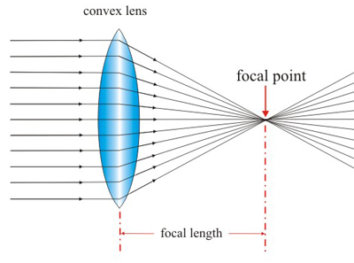

###Optical lenses

- **Convex (Converging) Lenses**
- 
  - **Shape:** Thicker in the middle than at the edges.
  - **Function:** Convex lenses converge light rays to a focal point. They are used to magnify objects or focus light, as seen in magnifying glasses, cameras, and human eyes.
  - **Applications:**
    - Magnifying glasses
    - Camera lenses
    - Eyeglasses for farsightedness
    - Telescopes
    - Microscopes

- **Concave (Diverging) Lenses**
  - **Shape:** Thinner in the middle than at the edges.
  - **Function:** Concave lenses diverge light rays, making them spread out. They make objects appear smaller and are used to correct nearsightedness or to spread light over a larger area.
  - **Applications:**
    - Eyeglasses for nearsightedness
    - Peepholes in doors
    - Flashlights (to disperse light)
    - Binoculars (part of the optical system)

- **Plano-Convex Lenses**
  - **Shape:** One side is flat (plano), and the other is convex.
  - **Function:** They focus light on a point on the flat side, commonly used for focusing or collimating light.
  - **Applications:**
    - Laser systems
    - Collimators
    - Projectors

- **Plano-Concave Lenses**
  - **Shape:** One side is flat (plano), and the other is concave.
  - **Function:** They diverge light and are often used to expand light beams.
  - **Applications:**
    - Beam expanders in lasers
    - Optical instruments to diverge beams

- **Biconvex (Double Convex) Lenses**
  - **Shape:** Both sides are convex.
  - **Function:** They converge light rays more strongly than a plano-convex lens and are used for focusing light.
  - **Applications:**
    - Magnifying glasses
    - Simple camera lenses
    - Imaging systems

- **Biconcave (Double Concave) Lenses**
  - **Shape:** Both sides are concave.
  - **Function:** They diverge light strongly and are used when a strong diverging effect is needed.
  - **Applications:**
    - Optical instruments where light needs to be spread out
    - Laser beam expanders

- **Cylindrical Lenses**
  - **Shape:** Cylindrical lenses have curvature in only one direction (like part of a cylinder).
  - **Function:** They focus light into a line rather than a point and are used in applications where light needs to be spread or focused along a single axis.
  - **Applications:**
    - Laser scanning
    - Astigmatism correction in glasses
    - Optical data storage

- **Aspheric Lenses**
  - **Shape:** The surface curvature changes progressively from the center to the edges, unlike spherical lenses.
  - **Function:** They reduce spherical aberration, allowing for a sharper focus.
  - **Applications:**
    - High-quality camera lenses
    - Telescope lenses
    - Corrective lenses in eyeglasses

- **Meniscus Lenses**
  - **Shape:** Curved on both sides, but with one surface being concave and the other convex.
  - **Function:** They can either converge or diverge light, depending on the relative curvatures of the two surfaces.
  - **Applications:**
    - Eyeglasses (to minimize distortion)
    - Telescopes

Each lens type manipulates light differently, and their specific applications depend on the needs of the optical system, such as magnification, correction of vision, focusing, or light dispersion.
```