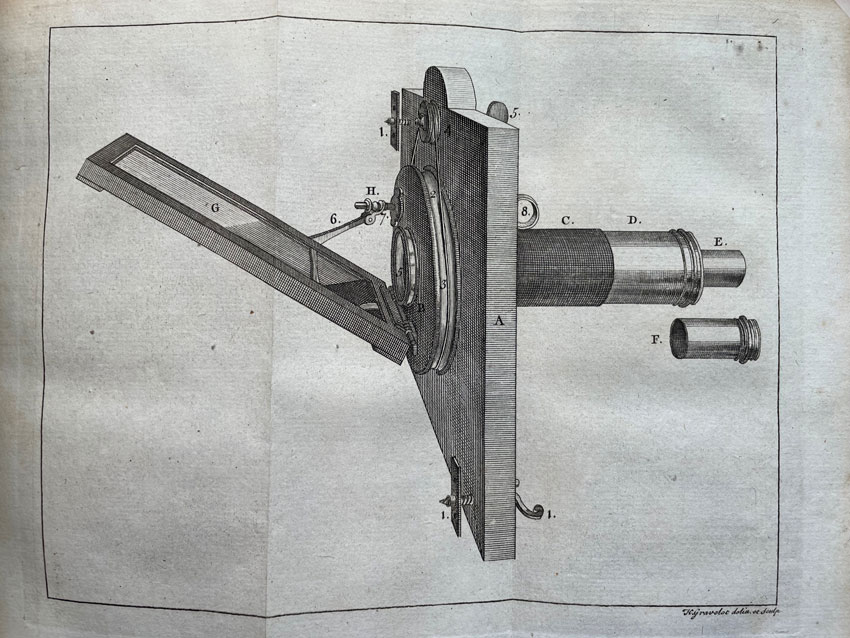

### Optical lenses 
Compiled by Nica Ross

**Convex (Converging) Lenses**
-

  
  - **Shape:** Thicker in the middle than at the edges.
  - **Function:** Convex lenses converge light rays to a focal point. They are used to magnify objects or focus light, as seen in magnifying glasses, cameras, and human eyes.
  - **Applications:**
    - Magnifying glasses
    - Camera lenses
    - Eyeglasses for farsightedness
    - Telescopes
    - Microscopes

**Concave (Diverging) Lenses**
-

  
  - **Shape:** Thinner in the middle than at the edges.
  - **Function:** Concave lenses diverge light rays, making them spread out. They make objects appear smaller and are used to correct nearsightedness or to spread light over a larger area.
  - **Applications:**
    - Eyeglasses for nearsightedness
    - Peepholes in doors
    - Flashlights (to disperse light)
    - Binoculars (part of the optical system)

**Plano-Convex Lenses**
- 

 
  - **Shape:** One side is flat (plano), and the other is convex.
  - **Function:** A plano-convex lens is primarily used to focus parallel light rays (such as those from a distant object or light source) into a single point. This occurs because the convex surface of the lens bends the incoming light rays toward the optical axis, while the flat side minimizes additional refraction. The result is a sharp focus, which is essential in many imaging and projection systems.
  - **Applications:**
    - Laser systems
    - Collimators
    - Projectors

**Plano-Concave Lenses**
- 

  
  - **Shape:** One side is flat (plano), and the other is concave.
  - **Function:** They diverge light and are often used to expand light beams.
  - **Applications:**
    - Beam expanders in lasers
    - Optical instruments to diverge beams

## Lensing in DIY Microscopy

**Critical Illumination**

Critical illumination in microscopy is a technique used to focus light directly onto the specimen. In this method, the light source itself (such as a lamp filament) is imaged onto the specimen, creating a bright and focused beam of light.

- Note: Critical illumination actually forms an image of the light source on the specimen to illuminate it. Any imperfections in the light source (such as uneven brightness or shadows) may be visible in the final image, leading to non-uniform illumination.
- The sun makes a great even light source with few imperfections!
- Contemporary microscopes use "Köhler illumination" which uses additional lenses in order to separate the image of the light source from the image of the specimen.

**Condenser Lens**

The condenser lens in the microscope collects light from the source and focuses it directly onto the specimen. This allows for a brightly lit field, making it useful for observing specimens that require high brightness.

**Projection**

Projector lenses rely heavily on **convex** lenses to enlarge the image as it emerges from the specimen. The nature of the convex lens flips the image - like the camera obscura.

 

## Building the Scioptic Scope

This process was modeled after William Gurstelle's instructional [How to Build a Solar Microscope](https://www.popsci.com/build-solar-microscope/).

Solar microscope Illustration from Henry Baker’s The Microscope Made Easy, 1742.

A solar microscope is a type of projection microscope that uses sunlight as its light source. The light is directed through the microscope's lenses onto a specimen, and the magnified image is projected onto a screen or wall. This allowed for large groups of people to view the same magnified image simultaneously, which was a significant advancement for educational and demonstration purposes at the time.

Optical enlargement for the single eye began in the 1500s but the Solar Microscope began to be widely used in the mid-1700s.

## Making Slides

How to make slides by hand and using a manual microtome.
[Compliation of Instructionals by ThomasTKtungnung](https://drive.google.com/file/d/1imMkkpWks-OOIdRK-Pr8M9Hwngi8Q9Tb/view?usp=sharing)

