# Surveillance as Artistic Material

### Surveillance as discipline.

> “Morals reformed—health preserved—industry invigorated—instruction diffused—public burthens lightened—Economy seated, as it were, upon a rock—the Gordian knot of the Poor-Laws are not cut, but untied—all by a simple idea in Architecture!”
>
> —Jeremy Bentham, Preface to *The Panopticon Writings* (1787)

In 1787, Jeremy Bentham—an English philosopher, jurist, social reformer, and founder of modern utilitarianism—wrote *The Panopticon Writings*, which described a circular building designed to allow for the constant surveillance of its inhabitants.

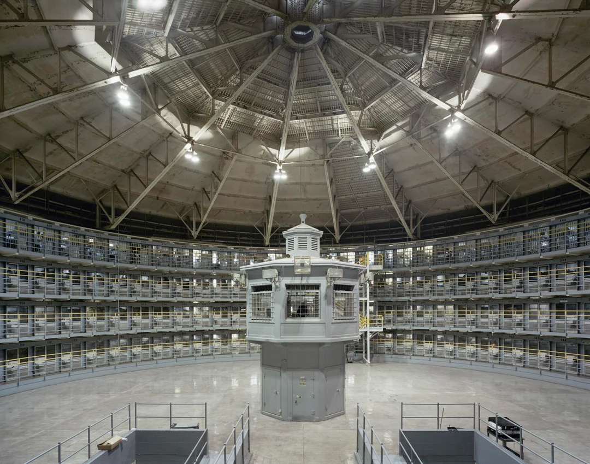

*F-House at Stateville Correctional Center, Joliet, Illinois, USA. Closed in 2016 and reopened for COVID-19 quarantine in 2020.*

Bentham viewed this architectural form as applicable to many kinds of institutions:

> “No matter how different, or even opposite the purpose: whether it be that of punishing the incorrigible, guarding the insane, reforming the vicious, confining the suspected, employing the idle, maintaining the helpless, curing the sick, instructing the willing in any branch of industry, or training the rising race in the path of education: in a word, whether it be applied to the purposes of perpetual prisons in the room of death, or prisons for confinement before trial, or penitentiary-houses, or houses of correction, or work-houses, or manufactories, or mad-houses, or hospitals, or schools.”

Central to Bentham’s design was the uncertainty of whether one was being watched:

> “The greater chance there is, of a given person’s being at a given time actually under inspection, the more strong will be the persuasion—the more intense, if I may say so, the feeling, he has of his being so.”
>
> —Jeremy Bentham, *Panopticon; or, The Inspection-House* (1791)

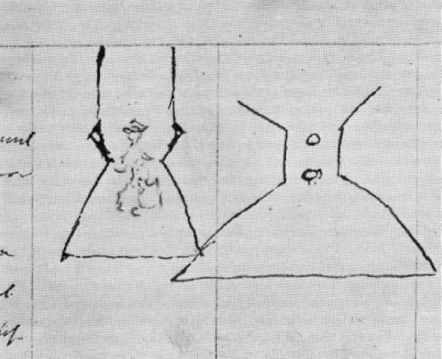

*Bentham’s drawing of a lantern designed to make a single prison guard appear to be perpetually facing the viewer, even when the guard’s back was turned.*

In 1975 French philosopher Michel Foucault wrote the book "Discipline & Punish" in which he revieved and criticized Bentham's Panopticon within the modern frameworks of surveillance beyond incarceration.

> "He is seen, but he does not see; he is the object of information, never a subject in communication."
> 
> —Michel Foucault, "Panopticism", Discipline & Punish: The Birth of the Prison (1975)

Foucault wrote of a more generalized "panopticism" beyond a building's walls stating:

> "The panoptic schema . . . was destined to spread throughout the social body; its vocation was to become a generalized function."
> 
> —Michel Foucault, "Panopticism", Discipline & Punish: The Birth of the Prison (1975)

Both Bentham and Foucault argued that the belief that one is being watched is in and of itself enough to control one's behavior. Foucault's critiscm continues with writers like Simone Browne in her book [Dark Matters: On the Surveillance of Blackness](https://www.dukeupress.edu/dark-matters?) and Toby Beauchamp's [Going Stealth: Transgender Politics and U.S. Surveillance Practices](https://read.dukeupress.edu/books/book/2570/Going-StealthTransgender-Politics-and-U-S)
Browne's Dark Matters is a crucial update to the blindspots in Foucalt's writing. She argues that surveillance studies cannot begin only with Bentham’s Panopticon; it must also confront the surveillance of Black people under slavery through branding, lantern laws, slave passes, fugitive notices, and the slave ship.

### Artists and Surveillance

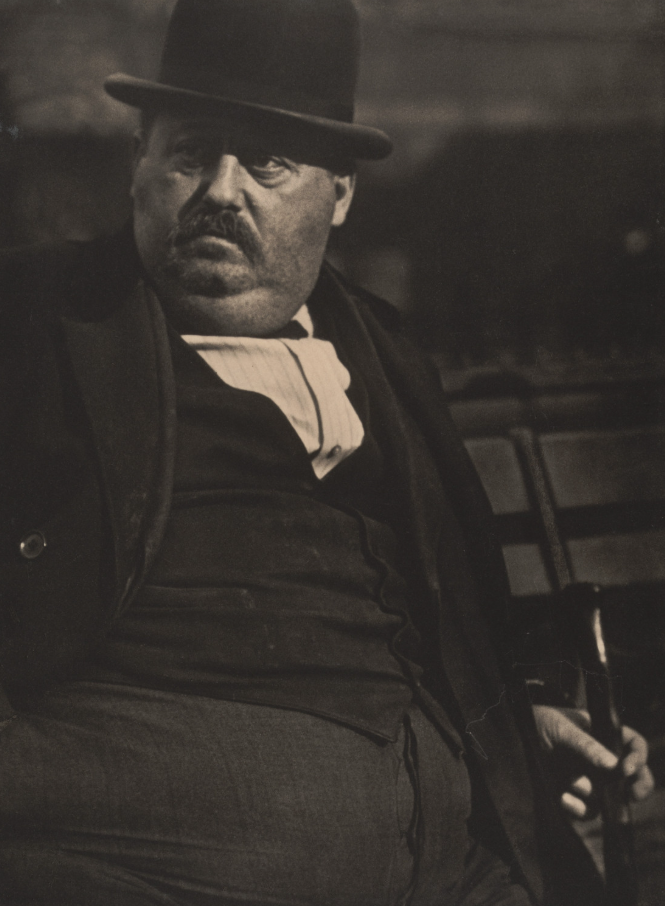
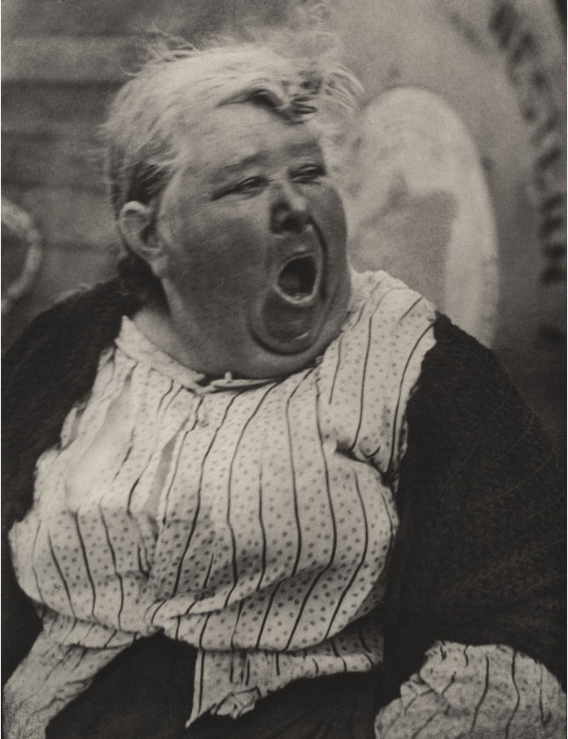
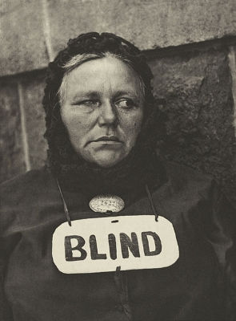

Paul Strand's Street Portraits (1916)
>""I suddenly got the idea of making portraits of people the way you see them in the New York parks—sitting around, not posing, not conscious of being photographed,” he recalls. “People involved in the process of daily living. But how could you conceal the camera in order to do this? There was no such thing as a candid camera in those days.” 
>
>Strand’s solution was to take the shiny brass lens from his uncle’s old view camera and screw it to one side of his Ensign reflex. By holding the camera so that the false lens pointed straight ahead and the real lens stuck out under his left arm, partly concealed by his sleeve, he was able to photograph someone at right angles to the apparent subject."
>
> via "Look to the Things Around You" By Calvin Tomkins, New Yorker, September 9, 1974

---
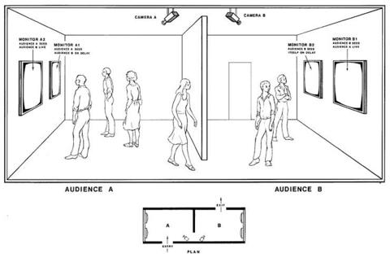
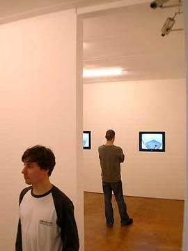

*Dan Graham, Time Delay Room, 1974*

Two rooms of equal size, connected by an opening at one side, under surveillance by two video cameras positioned at the connecting point between the two rooms. The front inside wall of each features two video screens - within the scope of the surveillance cameras. The monitor which the visitor coming out of the other room spies first shows the live behavior of the people in the respective other room. In both rooms, the second screen shows an image of the behavior of the viewers in the respectively other room - but with an eight second delay.
The time-lag of eight seconds is the outer limit of the neurophysiological short-term memory that forms an immediate part of our present perception and affects this «from within». If you see your behavior eight seconds ago presented on a video monitor «from outside» you will probably therefore not recognize the distance in time but tend to identify your current perception and current behavior with the state eight seconds earlier. Since this leads to inconsistent impressions which you then respond to, you get caught up in a feedback loop. You feel trapped in a state of observation, in which your self-observation is subject to some outside visible control. In this manner, you as the viewer experience yourself as part of a social group of observed observers [instead of, as in the traditional view of art, standing arrested in individual contemplation before an auratic object].

–via Gregor Stemmrich, «Dan Graham,» in Thomas Y. Levin, Ursula Frohne, Peter Weibel (eds.), CTRL[SPACE]. Rhetorics of Surveillance from Bentham to Big Brother, ZKM | Center for Art and Media, Karlsruhe, 2001, The MIT Press, Cambridge, MA, London, 2002, p. 68.

---

![scher information america 1995] (images/scher_info1995.png)

Julia Scher. Information America. 1995

*Metal office desk, five 9" NTSC monitors with metal wall brackets, 13" color monitor, plastic and vinyl signage, three black-and-white surveillance cameras, removable lenses, transformers, video matrix switchers, two time-lapse recorders, Amiga A1200HD computer, Sony Watch-Cam, two media players, desk lamp, office chair, wires and cables*

"Julia Scher has been dealing with video surveillance for more than 40 years. Her work addresses surveillance both as a concrete phenomenon of control, including its apparatus and architecture, as well as its impact on private and public sphere. Very early on, her performance and video installations drew attention to the effects of increasingly ubiquitous cameras and monitors, anticipating our surveillance alienated society."

—Julia's [Bio via her gallery](https://www.estherschipper.com/artists/51-julia-scher/biography/)

"In the early 1990s, Scher encountered a consumer database sold by the Lotus software company that, as the artist explains, “provided a guidance system in which one’s understanding of controls, of the command structure of the computer, was key to accessing information.” Information America connects a closed-circuit surveillance camera system, taking in and displaying video feeds of the gallery in real time, with a console for data collection. Since Scher made this work, private information, including user data, has become a commodity to be harvested, exploited, and controlled on a vast scale."

—Gallery label from Signals: How Video Transformed the World, March 5–July 8, 2023 [web](https://www.moma.org/collection/works/419367)

---

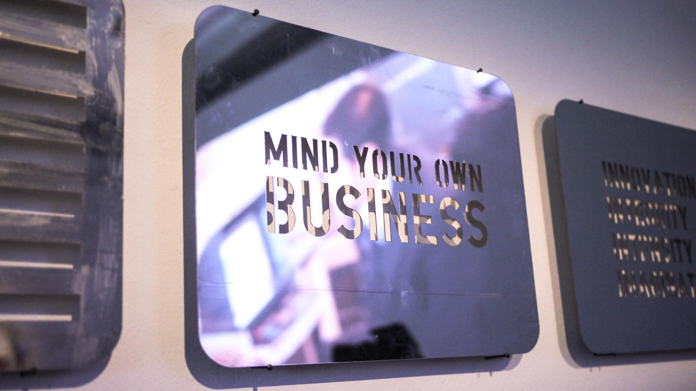
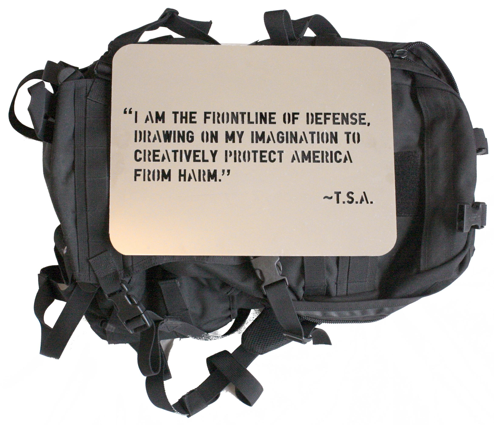
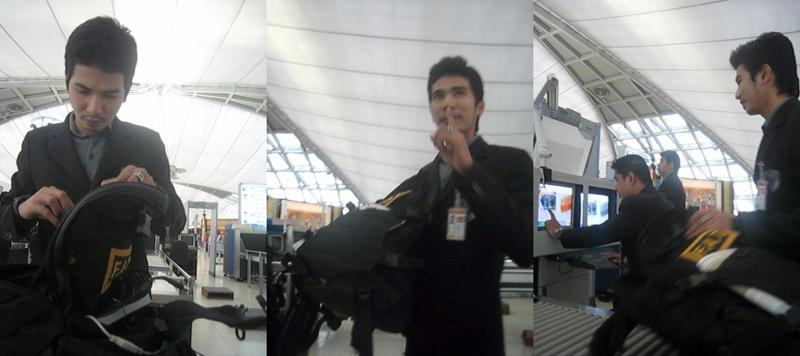

Evan Roth
TSA Communication (2008)

"TSA Communication is a project that alters the airport security experience, inviting the government to learn more about passengers than just the contents of their carry on bags. Messages are cut into thin 13" x 10" sheets of stainless steel designed to comfortably fit inside airline carry on baggage. During the x-ray screening process, the technology normally designed to view the contents of a traveler's baggage is transformed into a communication tool for displaying messages aimed at airport security. The content of the plates varies from flight to flight, but includes "NOTHING TO SEE HERE", an image of the American flag and the TSA's (Transportation Security Agency's) mission statement as listed on its website, "I AM THE FRONTLINE OF DEFENSE, DRAWING ON MY IMAGINATION TO CREATIVELY PROTECT AMERICA FROM HARM"."

–Via Evan Roth's [website](https://www.evan-roth.com/~/works/tsa-communication/#hemisphere=east&strand=51)

---
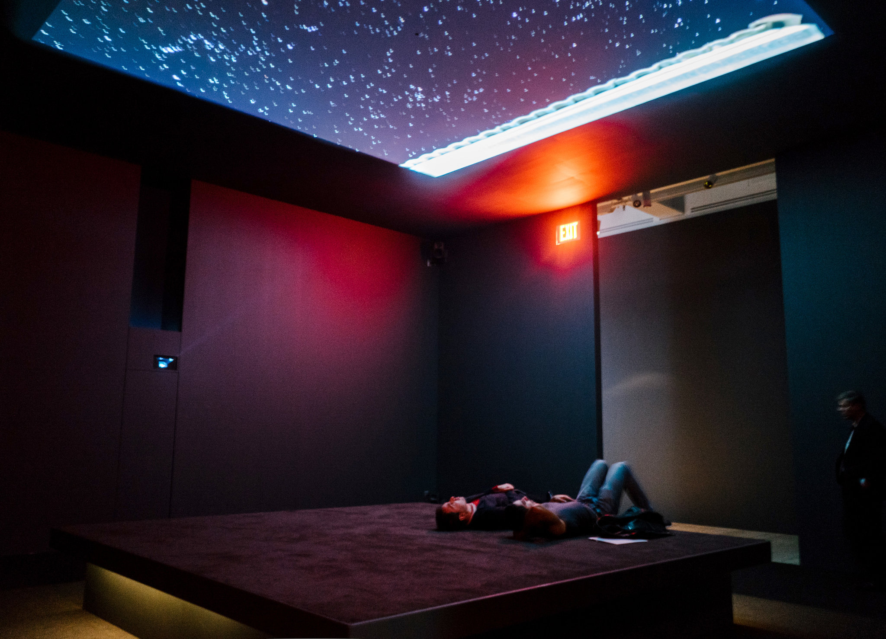

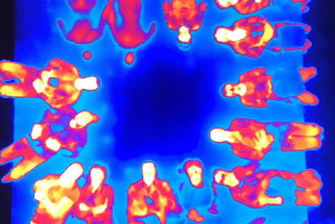

Laura Poitras: Astro Noise, Whitney Biennial, NYC (2016)

In Bed Down Location (2016), visitors lie on a raised platform and look up at night skies filmed over Yemen, Somalia, and Pakistan, as well as Creech Air Force Base in Nevada, a center of U.S. drone operations.
Later, in the final gallery, Last Seen (2016) displays those thermal recordings on a monitor; another monitor reveals Wi-Fi signals detected from visitors’ devices. 

Astro Noise, refers to the faint background disturbance of thermal radiation left over from the Big Bang and is the name Edward Snowden gave to an encrypted file containing evidence of mass surveillance by the National Security Agency that he shared with Poitras in 2013. She is the director of Oscar Award winning film Citizenfour (2014) which features Edward Snowden.
–via[ Whitney's website](https://whitney.org/exhibitions/laura-poitras)

---

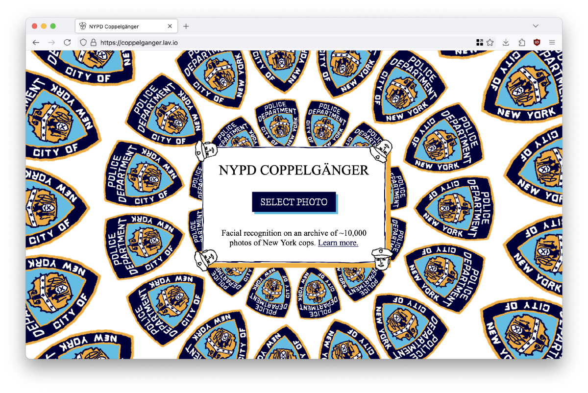

Sam Lavigne's Coppelganger (2024) which he describes as, "Coppelgänger: a tool that shows you what NYPD cop a machine learning model thinks you most resemble. Find the cop lurking deep inside yourself by visiting [coppelganger.lav.io](https://coppelganger.lav.io/)"

"Facial recognition systems are widespread, despite the growing body of work on the real and potential abuse of these systems (not to mention their general creep factor). These systems are typically deployed by government agencies, the police, and private companies, but basic facial recognition software is freely available to anyone who wishes to use it. I was curious how difficult it would be to make my own small facial recognition system using widely available tools. To do so, I plugged in a dataset of around 10,000 (publicly available) images of NYPD cops into a popular open source project called DeepFace."
–Source, Sam Lavigne

Sam used facial recognition software to analyze resemblance and perceived emotions. Reversing the tools of surveillance Sam points to some fairly obvious blurry conclusions via computer vision.

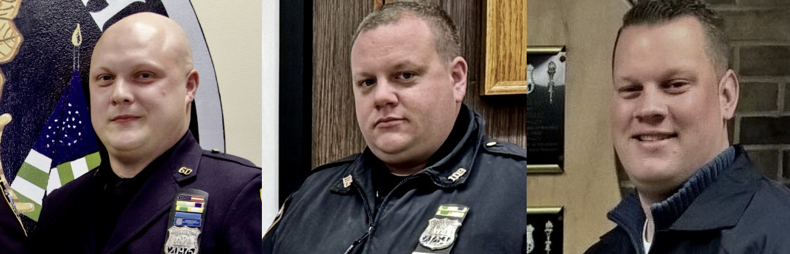
**dopplegangers**

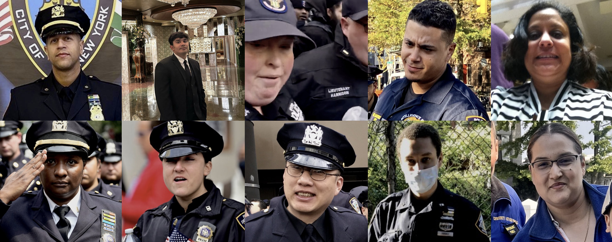
**"angry"**

**"sad"**

