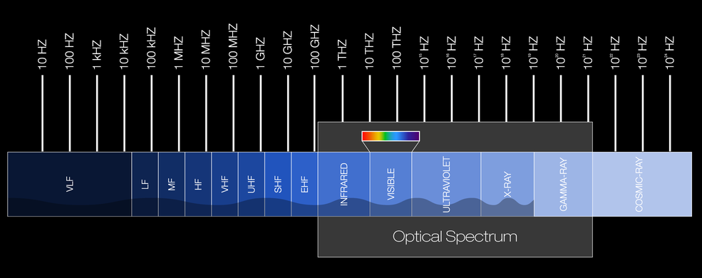
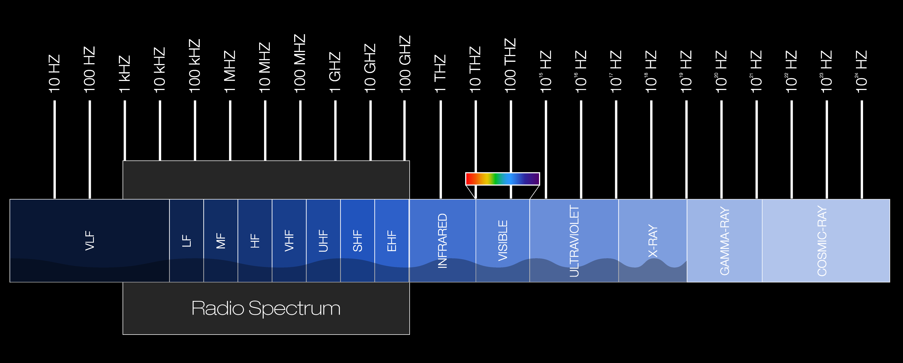
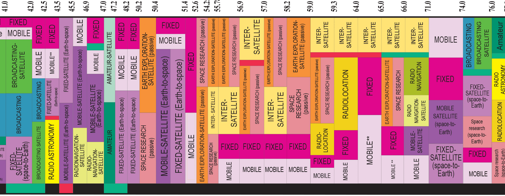
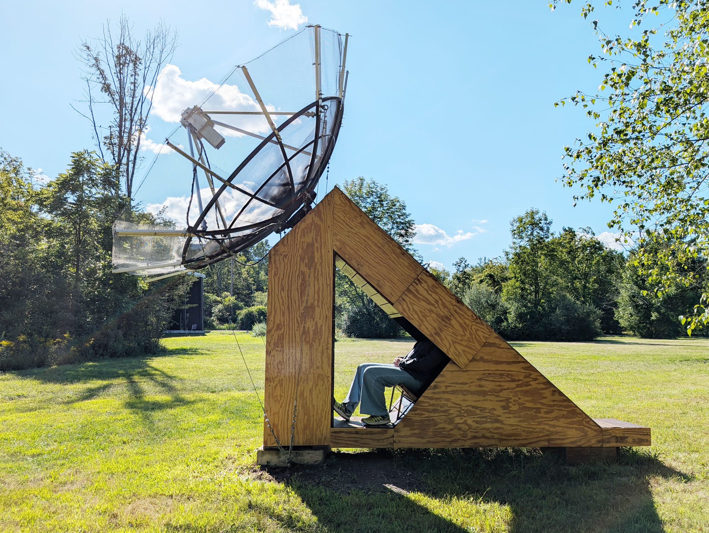
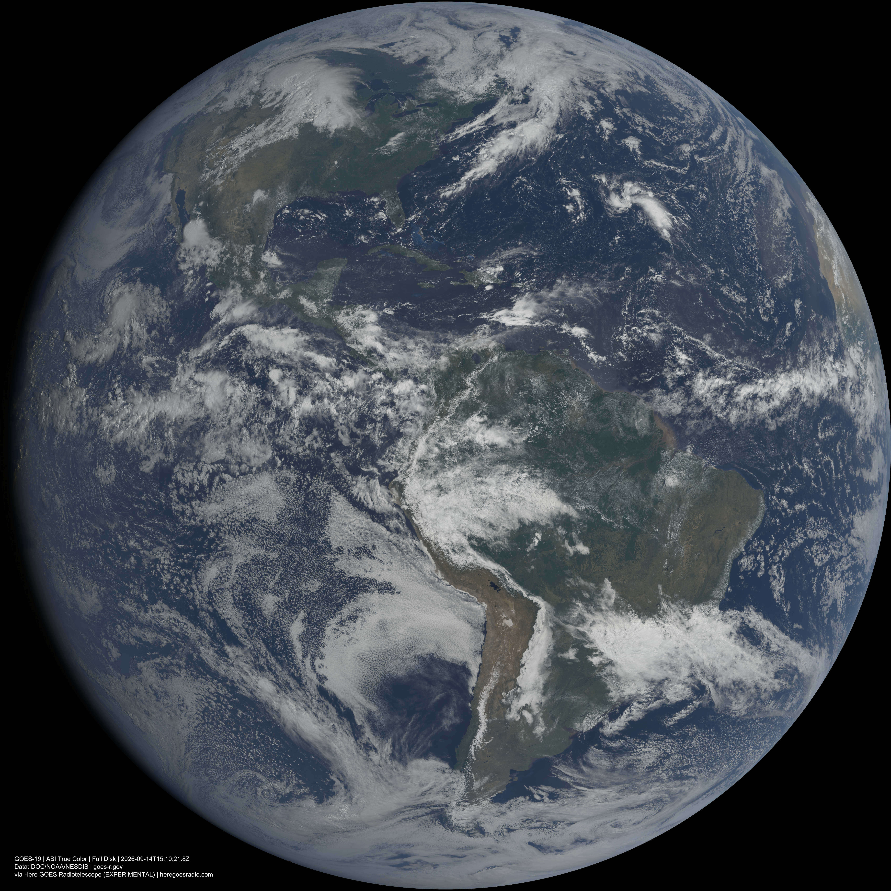
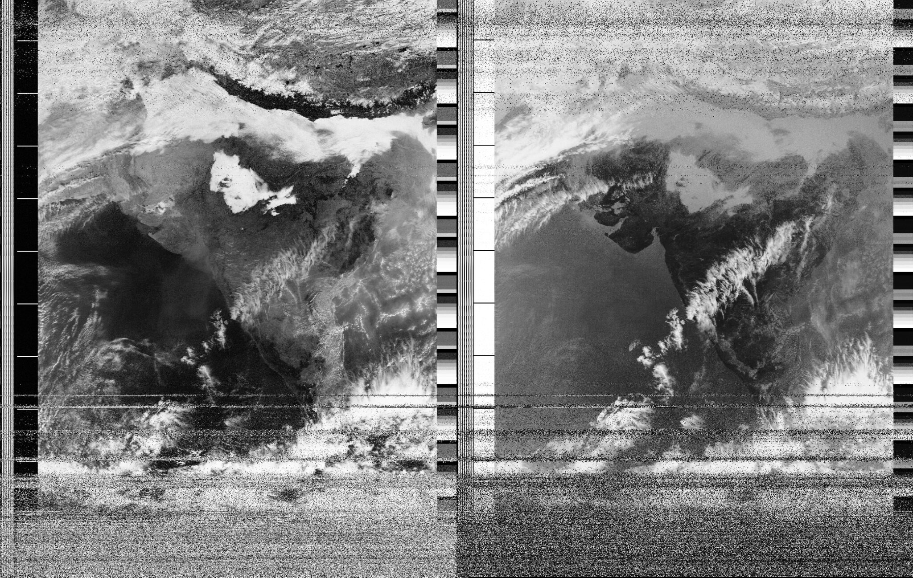
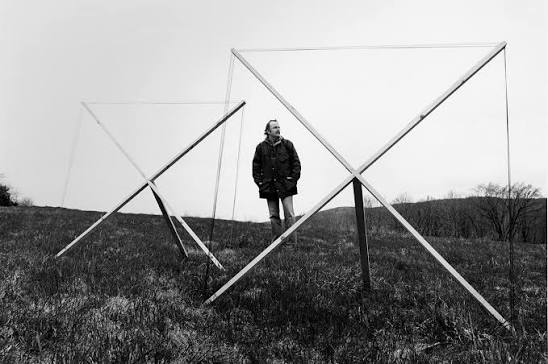
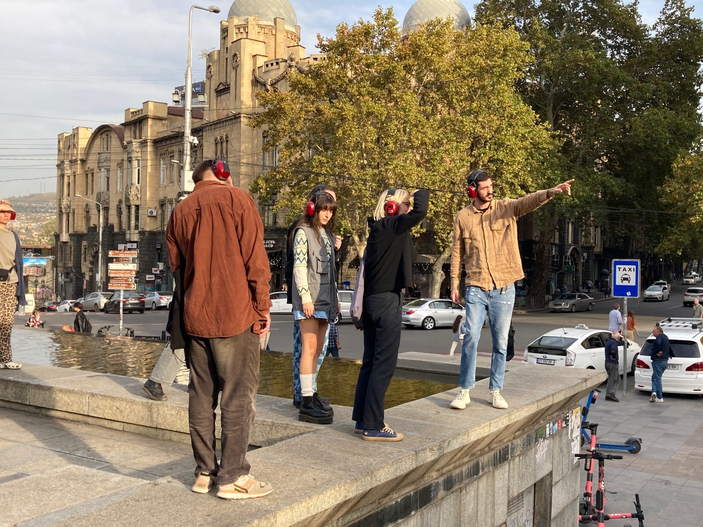
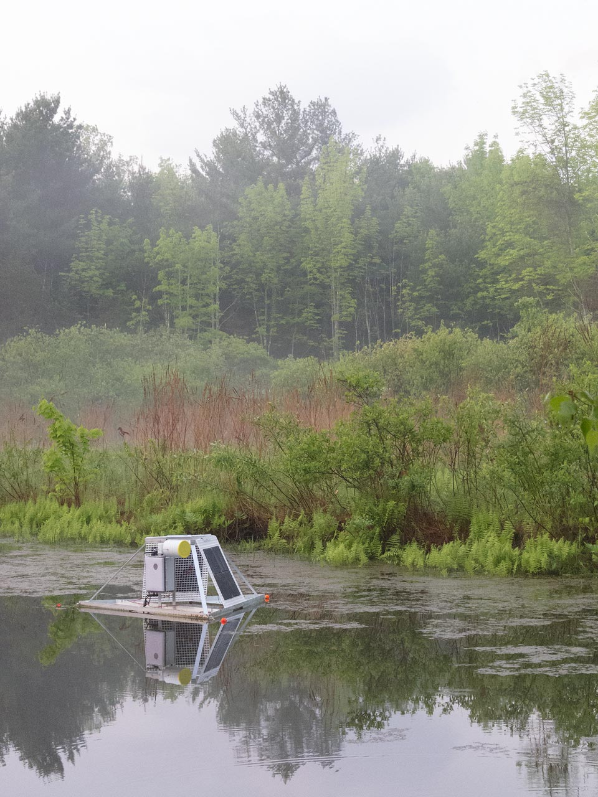
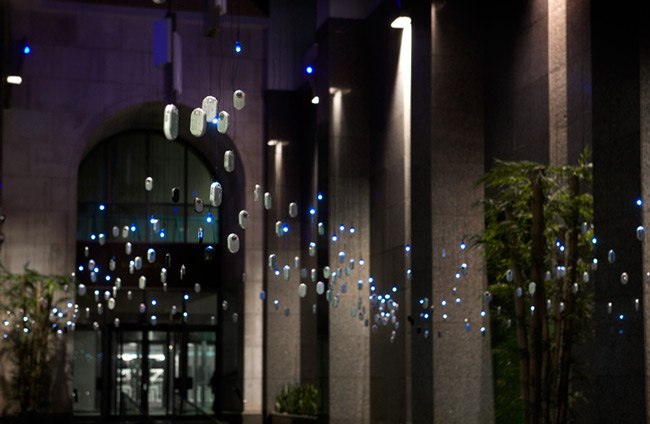

# Transmissions

## What is Transmission Art?

> Transmission art encompasses works in which the act of transmitting or receiving is not only significant, but the fulcrum for the artist's intention. The genre involves a multiplicity of practices that often engage aural and visual broadcast media, where in some instances works for traditional broadcast are created, and at other times artists harness preexisting broadcast signals as source material manipulated in live performance, installation, and public interactive networks and tools. Similarly interested in the synaesthetic possibilities of radio, much of contemporary transmission art values interplay with waves, informed by historical and emergent wireless technologies. These works often challenge a conventional one-to-many definition of transmitter (or artist) and receiver (or audience) in ways that celebrate Brechtian aspirations for more multi-nodal wireless interactions. Wave Farm considers Radio Art a subsection of Transmission Art.
>
> — via [Wave Farm](https://wavefarm.org/)

## The Spectrum

*The optical spectrum.*

*Transmission arts work within the radio spectrum.*

*Within the radio spectrum, the U.S. Department of Commerce's National Telecommunications and Information Administration (NTIA) Office of Spectrum Management allocates which bands of radio are accessible for specific purposes. [More detailed chart here.](https://www.ntia.gov/files/ntia/publications/2003-allochrt.pdf)*

Radio waves are treated as a publicly owned natural resource because they are a finite, shared medium that cannot be privately owned, but is instead managed to prevent signal interference. This means it is possible to transmit and receive on any frequency if you have the right equipment. Transmission is regulated by federal agencies, however, and certain frequencies require a license to transmit on — but no license is required to *listen* to any part of the spectrum.

---

# Artists Working with Transmissions

## Heidi Neilson — *Here GOES Radiotelescope* (2020–ongoing) and *Go GOES Radiotelescope* (2017)

*Here GOES Radiotelescope* is an artist-run DIY ground station receiving the satellite GOES-19's faint, data-dense GRB transmission, and is one of only about 15 independent civilian stations to do so. Visitors to the sculptural station sit within it, look through the "telescope," and see images of the Earth as they are being received from the satellite.

The sound heard onsite — and in the streaming audio online — is a *sonification* created from space weather data collected in real time by the station. It is an audio imagining of the soundscape of solar wind hitting and flowing around Earth, as if it were a field recording of the interaction of energies.

When seated within *Here GOES Radiotelescope*, visitors see the live view of Earth through the satellite's eyes and hear the space environment the satellite is sensing in real time.

*A 24-hour archive of the latest images can be found [here](https://heregoesradio.com/images-then.html).*

## Open Weather (Sasha Engelmann & Sophie Dyer) — *Year of Weather* (September 2024 – September 2025)

> Open-weather is a feminist experiment in imaging and imagining the earth and its weather systems using DIY tools. We weave speculative storytelling with low cost hardware and open-source software to transform our relations to a planet in climate crisis.
>
> Co-led by Soph Dyer and Sasha Engelmann since 2020, open-weather makes artworks, leads inclusive workshops and develops resources on satellite imagery reception and reading. Through these activities, a network has formed around the project, currently numbering more than one hundred DIY Satellite Ground Station operators around the world, from Buenos Aires to Berlin.
>
> — via the [Open Weather website](https://open-weather.community/open-weather/#about)

*NOAA-18 received by COSMOS Astronomy Club using an Automatic Ground Station in Pune, India, on 1 January 2025. Image: COSMOS Astronomy Club and open-weather.*

The *Year of Weather* [archive](https://open-weather.community/archive/) collects DIY downloads from the NOAA Polar-orbiting Operational Environmental Satellites (POES). The POES satellites were first launched in 1978, and in August 2025 NOAA decommissioned the last two: NOAA-19 on August 13, 2025, and NOAA-15 on August 19, 2025. The archive documents their final year of publicly accessible information.

The downloads are WAV files, and the project created an [open-source decoder](https://open-weather.community/decode/) that translates the audio signal from the satellites into a visual image. The decoder is specifically designed for WAV recordings of NOAA-15, NOAA-18, and NOAA-19 APT transmissions, emulating an amateur radio process called Slow Scan Television (SSTV), which translates an image into a sequence of audio tones. [Try it out here.](https://ckegel.github.io/Web-SSTV/)

If you'd like to build your own satellite listening station, check out the **NASA Radio JOVE kit**: [radiojove.gsfc.nasa.gov](https://radiojove.gsfc.nasa.gov/kits/)

## Alvin Lucier — *Sferics* (1981)

> "...if you put an antenna and a receiver, then you can hear them, they are very beautiful. That is all I have done, that is to make it available to people to hear. Very simple."
>
> — Alvin Lucier

> Sferics is the shortened term for atmospherics, natural radio-frequency emissions in the ionosphere, caused by electromagnetic energy radiated from nearby or distant lightning. . . . My interest in sferics goes back to 1967, when I discovered in the Brandeis University Library a disc recording of ionospheric sounds by astrophysicist Millett Morgan of Dartmouth College. I experimented with this material, processing it in various ways — filtering, narrow band amplifying and phase-shifting — but I was unhappy with the idea of altering natural sounds and uneasy about using someone else's material for my own purposes. I wanted to have the experience of listening to these sounds in real time and collecting them for myself.
>
> — Alvin Lucier

*Sferics* was recorded by the composer on August 27, 1981, in Church Park, Colorado. The sound material was collected continuously from midnight to dawn with a pair of homemade antennas and a stereo cassette tape recorder. At regular intervals the antennas were repositioned in order to explore the directivity of the propagated signals and to shift the stereo field. — via [Bandcamp](https://alvinlucierlovely.bandcamp.com/album/music-for-solo-performer-sferics)

**[Listen: Alvin Lucier – Sferics](https://www.youtube.com/watch?v=rxUvMl_IxoQ)**

## Pauline Oliveros — *Echoes from the Moon* (1987)

*Echoes from the Moon* uses radio transmissions to allow performers and audience members to broadcast their voices and other sounds to the moon and, subsequently, hear reflections of those signals received back on Earth. Oliveros worked with Dave Olean, a ham radio operator who participated in one of the first two-way Earth–Moon–Earth (EME) communications. "Moonbounce" was first developed through war efforts to communicate and spy across large distances before communication satellites.

Radio waves travel at the speed of light and cover the roughly 768,800 kilometers to the moon and back in about two and a half seconds. There is also a slight downward pitch-shift due to the Doppler effect caused by the moon's movement relative to Earth.

**[Example echo from a recreation of Pauline's piece](https://vimeo.com/684341553#t=1h25m00s)**

## Christina Kubisch — *Electrical Walks*

Using specially designed electromagnetic-induction headphones that make electromagnetic fields audible, along with a map of indicated magnetic landmarks, Christina Kubisch leads auditory tours through cities. The walks focus on the sounds of lighting systems, communications equipment, radar installations, anti-theft systems, surveillance cameras, cellphones, computers, antennas, navigation systems, ATMs, Wi-Fi routers, neon signs, and public transportation.

**[Virtual Walk: Tbilisi](https://electricalwalks.org/tbilisi/index.html#central_station_platform_1)**

[electricalwalks.org](https://electricalwalks.org/electrical-walks/)

## Zach Poff — *Pond Station*

*Pond Station* is a modular platform for monitoring the hidden activity of a freshwater pond. It has been transmitting since May 2015, when it was commissioned as a long-term sculpture at Wave Farm in Acra, NY. It floats on the water's surface, broadcasting underwater sounds through a live radio link, and operates from dawn to evening every day using solar-charged internal batteries. Pond Station's receiver is located in the Wave Farm radio studio, where resident artists and broadcasters on WGXC FM can experience the pond's natural sounds or remix and interpret them. International audiences are invited to do the same via the live web stream.

**[Listen Live](https://zachpoff.com/artwork/pondstation/)**

## Anna Friz — *Respire* (2008–09)

[Anna Friz](https://nicelittlestatic.com/) is a media, sound, radio, and transmission artist whose installations, broadcasts, films, and performances explore media ecologies, infrastructures, land, and radio history. She specializes in self-reflexive radio works in which radio serves simultaneously as source, subject, and medium. Friz is Associate Professor of Film and Digital Media at the University of California, Santa Cruz, and a longtime collaborator with the transmission arts center Wave Farm and ORF Kunstradio.

*Respire* consists of more than two hundred small FM radios suspended just above the audience, broadcasting a soundscape of breath, white noise, and radio interference. Because the receivers hang freely and rely on line-of-sight FM transmission, the installation registers the bodies moving beneath it: visitors create air currents that spin the radios and physically interrupt their reception, altering the sound. The work's structure therefore captures bodily presence as movement, interference, and changes within the composition.

More info — [Musicworks](https://www.musicworks.ca/featured-article/featured-article/anna-friz)