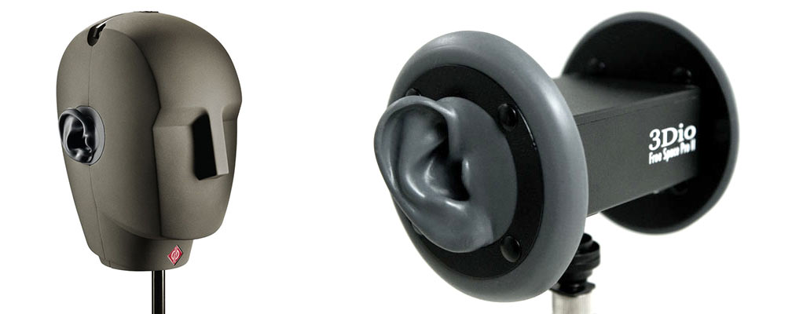
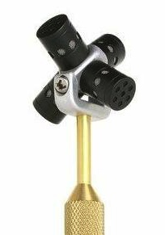

# Experimental Audio Capture

There are a variety of alternative techniques and/or experimental microphones for recording audio.

* [Binaural recording](https://en.wikipedia.org/wiki/Binaural_recording). *[From Wikipedia]* Binaural recording is a method of recording sound that uses two microphones, arranged with the intent to create a 3-D stereo sound sensation for the listener of actually being in the room with the performers or instruments. This effect is often created using a technique known as "dummy head recording", wherein a mannequin head is outfitted with a microphone in each ear. Binaural recording is intended for replay using headphones and will not translate properly over stereo speakers. 

* [Ambisonic recording](https://en.wikipedia.org/wiki/Ambisonics). *[From Wikipedia]* Ambisonics is a *full-sphere surround sound* technique: in addition to the horizontal plane, it covers sound sources above and below the listener.Unlike other multichannel surround formats, its transmission channels do not carry speaker signals. Instead, they contain a speaker-independent representation of a sound field called *B-format*, which is then decoded to the listener's speaker setup. This extra step allows the producer to think in terms of source directions rather than loudspeaker positions, and offers the listener a considerable degree of flexibility as to the layout and number of speakers used for playback. 

### Other Experimental/Alternative Microphones 

* piezo transducers & contact microphones
* magnetic pickups
* parabolic collectors
* laser microphones
* laryngophones
* accelerometers
