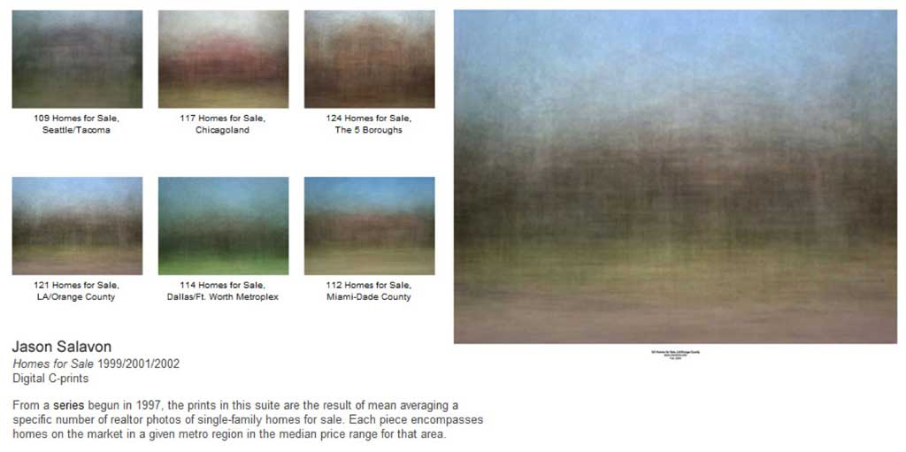
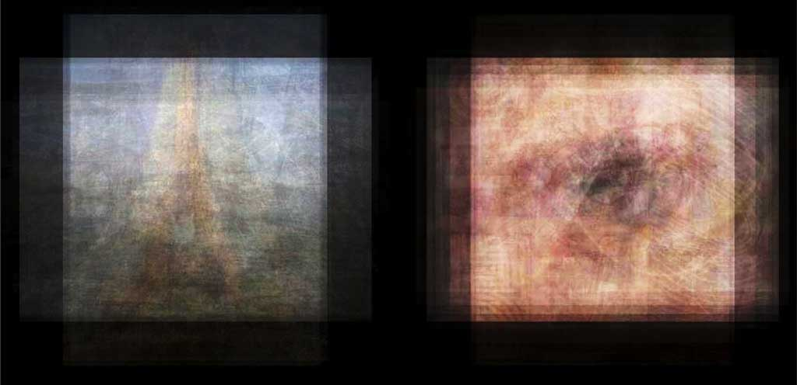
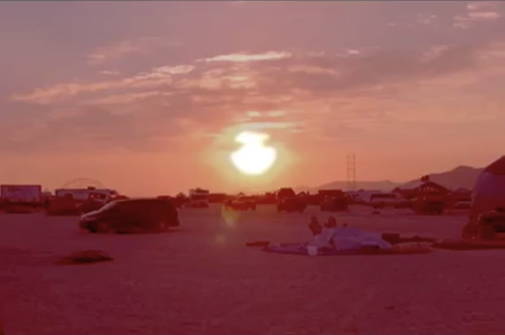

# Synthesis from Collections

 
Jason Salavon, *[Every Playboy Centerfold, The Decades](http://salavon.com/work/EveryPlayboyCenterfoldDecades/)*, 2002.

**Image averaging** is a technique whereby an average is made from a collection of images. It: 

* Represents the centroid of examples
* (Ostensibly) illustrates the category itself
* May suffer for a poverty of details, but...
* May still offer an excellent gestalt
* Requires only ten lines of code. 
* The hard part is selecting the subject.

---

## 2D Spatial Composites 

#### Nancy Burson

 
Nancy Burson, *[First and Second Beauty Composites](http://www.medienkunstnetz.de/works/first-and-second-beauty/)* (1982). *(Left: Bette Davis, Audrey Hepburn, Grace Kelly, Sophia Loren, Marilyn Monroe. Right: Jane Fonda, Jacqueline Bisset, Diane Keaton, Brooke Shields, Meryl Streep.)*

Nancy Burson invented what we now call "morphing" while working as an artist-in-residence at MIT in the late '70s. One of her best-known works was a series of composites, which created mathematically weighted averages of well-known individuals. Of them, Vilém Flusser [has written](http://www.medienkunstnetz.de/works/first-and-second-beauty/): 

> *«‹Chimera› is an ancient word meaning composite fabulous beast: a goat with a lion’s head and a tail of serpents. One might thus be led to believe that the mythical Ancients knew how to calculate and compute, but one would be mistaken. The mythical chimaera was a collage, a patchwork. If Bellerophon, who fought the Chimaera heroically, had kicked it instead of fighting it heroically, its head would have rolled to one side and its tail to another. This is quite different from the newly emerging, ‹true› chimaera. One may kick Burson’s Big Brother as often as one likes, he will never disintegrate into Hitler, Mussolini and the others. [...] 
The new ‹true› chimeras are consistent, autonomous phenomena. This is the way with myths: as soon as they become real, they look different from what was expected.»* 

Later, Burson posted classified ads in an effort to solicit images of "[Guys who Look Like Jesus](http://nancyburson.com/guys-who-look-like-jesuswomen-who-look-like-mary/)":
 

#### Jason Salavon

Jason Salavon became well known for working this way in the late 1990s. Befriending a department store photographer, he created averages of "[100 Special Moments](http://salavon.com/work/SpecialMoments/)": kids with Santa, newlyweds, etc. 

 

Salavon has also created [averages of homes-for-sale](http://salavon.com/work/Homes/) from classified advertisements in different metropolitan areas. 

 

Salavon writes about his "[amalgamations](http://salavon.com/work/category/amalgamations/)" work (as he calls it) in the [web page for his *Portrait* series](http://salavon.com/work/Portrait/).

#### Others 

Idris Khan interrogates the notion of a photo series by creating [these mashups](http://www.saatchigallery.com/artists/idris_khan.htm) of the [famous gas tanks by Bernd & Hilla Becher](http://c4gallery.com/artist/database/bernd-hilla-becher/bernd-hilla-becher.html):

 

In his "[Illuminated Average](http://www.jimcampbell.tv/portfolio/still_image_works/illuminated_averages/index.html)" series, Jim Campbell calculates the average frame of an entire movie, such as *The Wizard of Oz*": 

 

While an MFA student at CMU, [David Tinapple](http://herbergerinstitute.asu.edu/faculty/selectone.php?ID=4832) used a face tracker to calculate portraits of the average faces shown on different cable television channels: 

 

Through Animation

* [Play by R. Luke DuBois (2006)](https://www.youtube.com/watch?v=VzFA11pQIIo)

#### Expanded Automation with Image Search

The use of online databases of tagged images substantially expands our ability to learn about categories of images. 

In 2005, software developer Neil Kandalgaonkar, partially inspired by the work of Jason Salavon, "wrote a program ("*[50 People See](http://neilk.net/blog/2005/03/15/50-people-see/)*") to blend Flickr images which share the same tags. No human is involved in choosing, positioning, or blending the images."

 
Neil Kandalgaonkar, *[50 People See](http://neilk.net/blog/2005/03/15/50-people-see/)* (2005). *(Left: "Eiffel tower"; Right: "Eye")*

 
More recently, in her series "*Photo Opportunities*", artist [Corinne Vionnet](http://www.corinnevionnet.com/-photo-opportunities.html) works to create landscapes generated from *thousands* of tourist photos. An important difference is that she takes efforts to align them first. ([Additional article](http://petapixel.com/2013/10/23/photo-opportunities-interview-artist-corinne-vionnet/))

## Temporal Composites 

Cassandra C. Jones has pioneered a type of temporalized composite using found (Internet) imagery, which she calls [*Snap-Motion Re-Animations*](http://www.cassandracjones.com/snap-motion-re-animations).

An examples is her 2004 project, *Eventide*, comprised from more than 1300 carefully aligned and sequenced sunsets, which recreates the timing of an actual sunset.

## 3D Spatio-Temporal Composites

* Microsoft Photosynth [develops 3D models from thousands of tagged tourist photos](http://phototour.cs.washington.edu/).
* Noah Snavely, [Finding paths through the world's photos](http://phototour.cs.washington.edu/findingpaths/)
* Blaise Agüera y Arcas of Microsoft, TEDGlobal https://www.youtube.com/watch?v=4LxlhoemR3A

Noah Snavely, Photo Tourism
https://www.youtube.com/watch?v=IgBQCoEfiMs

Photosynth to 3D Conversion
https://www.youtube.com/watch?v=TuHJUS2olyc
https://www.youtube.com/watch?v=gtP6kaDv2kg

