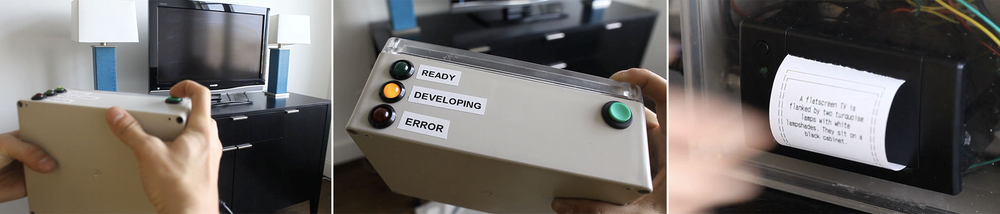
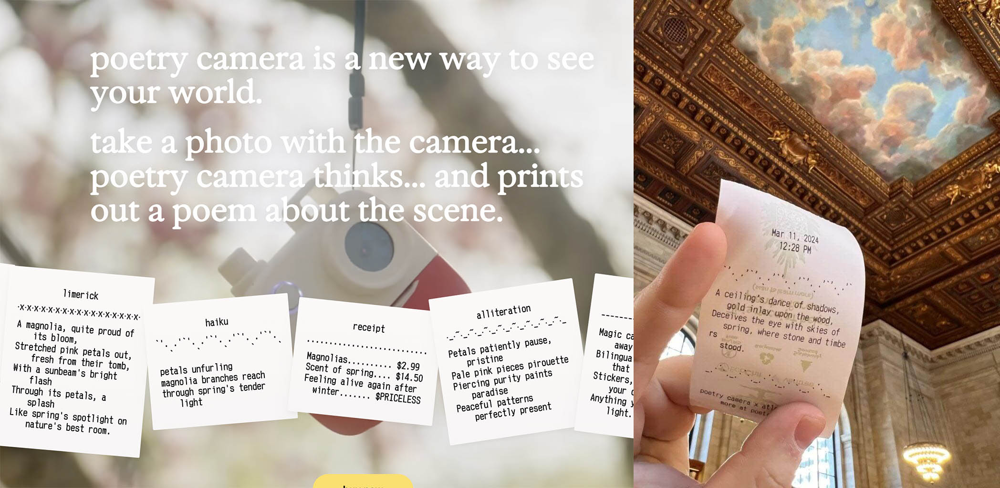
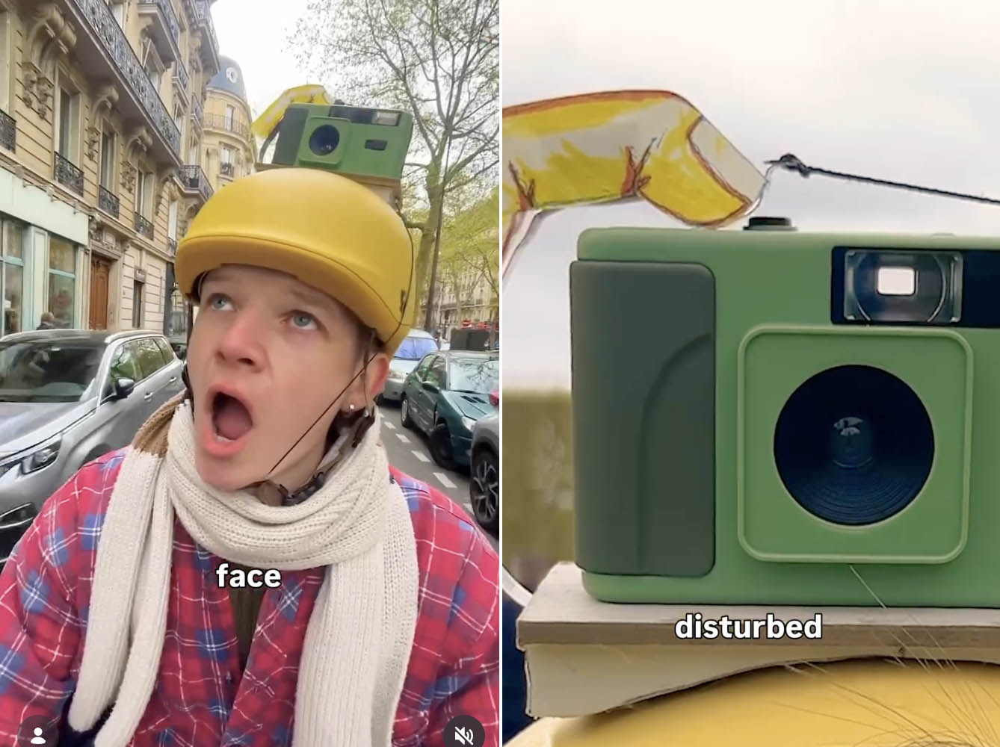
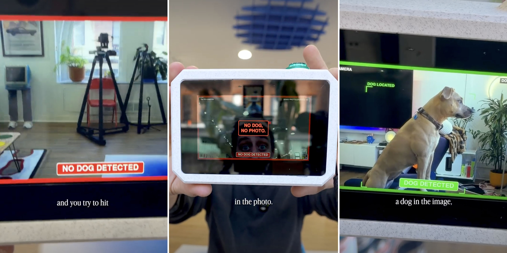
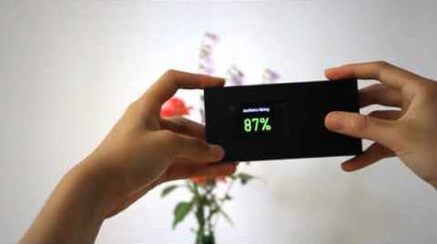
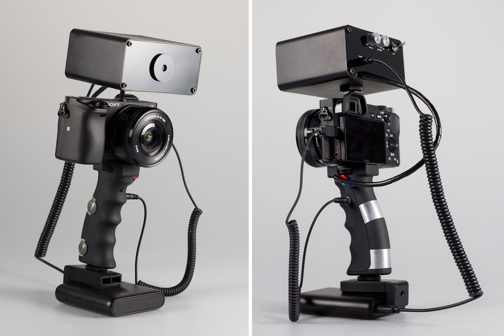
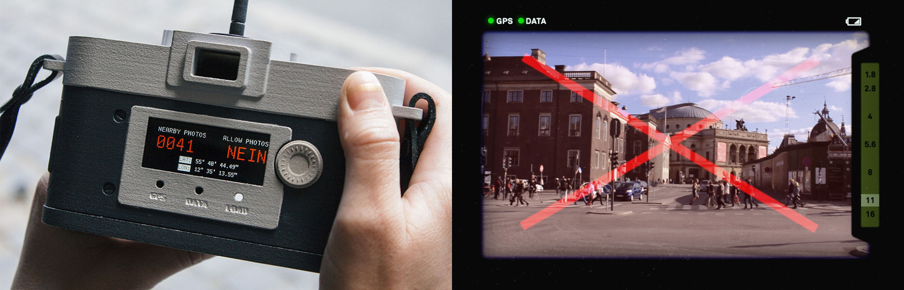
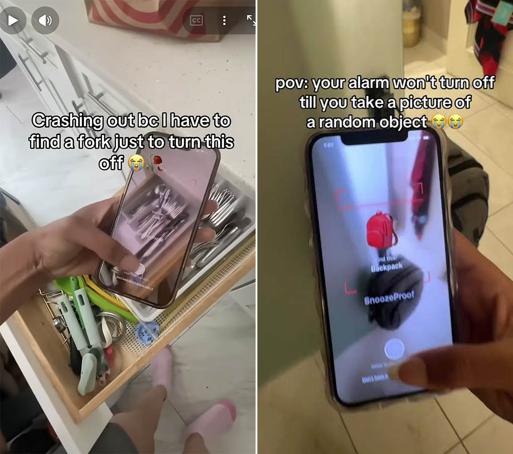
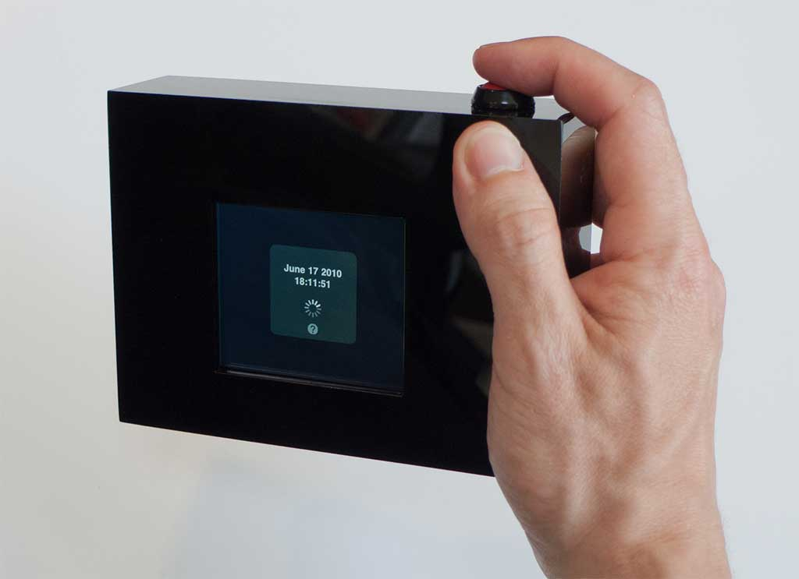

# Conceptual Cameras

*This presentation is intended to provoke reconsiderations about what a camera is, could be, or ought to be.*

A camera implies a kind of **contract**: between the photographer, the apparatus, the subject, and the resulting image. Normally, we take that contract for granted; these projects mess with it. 

These projects systematically perturb different parts of the photographic contract. They treat a camera not simply as a device for recording what is in front of it, but as something that can interpret, judge, refuse, compel, substitute, intervene, or take sides.

These project show that **capture is not neutral**. Designing a capture system means designing a particular relationship to the world.

--- 

### The Descriptive Camera

*What if a camera didn't make pictures?*

*[The Descriptive Camera](https://mattrichardson.com/descriptive-camera/)* (2012) by Matt Richardson works a lot like a regular camera—point it at a subject and press the shutter button to capture the scene. However, instead of producing an image, this prototype uses crowdsourcing (via Amazon Mechanical Turk) or automated analysis to output a text description of the scene. The "photo" (text) is printed on a built-in receipt printer.

---

### Poetry Camera

*Or, same idea, but less literal.*

Kelin Carolyn Zhang & Ryan Mather (2023–26) developed "[Poetry Camera](https://www.youtube.com/watch?v=FAsY40pbbnw)", initially as an art project, and now as commercial product.  Point it at something, press the shutter, and it prints an AI-generated poem about the scene on receipt paper.

---

### Wow Camera

*We can develop rules for the shutter.*

[A camera](https://www.instagram.com/p/DW1JJW8DbDt) triggered by the photographer saying the word "Wow", with an amusingly simple mechanism. Created by Nikita Merkushin. 

---

### Dog Camera

*Maybe the camera decides when it's OK to shoot.*

[A camera](https://www.instagram.com/reels/DVPClLnkgyH/) which only takes a photo if a dog is in frame.

--- 

### Nadia, Intelligent Camera Interface

*Or it can just give you advice.*

[*Nadia, Intelligent Camera Interface*](https://www.youtube.com/watch?v=ColrQao4Hlg) by Andrew Kupresanin (2010) is a critic-in-a-camera. "Unlike a conventional camera, Nadia has no display of the photographs to be taken, but rather gives the judgment of aesthetic quality to the machine, displaying only a current rating as feedback about when and what to snap."

 

---

### Prosthetic Photographer

*Or forget the advice and make you do it.*

[*Prosthetic Photographer*](http://peterbuczkowski.com/projects/prosthetic-photographer) by Peter Buczkowski (2018) "enables anybody to unwillingly take beautiful pictures." It is an AI-powered device that can recognize a well-composed scene and then force the photographer to press the shutter via a mild electrical shock to their hand. [It is](https://www.engadget.com/2018/02/16/prosthetic-photographer-shocks-you-into-taking-good-photos/) "a real, fully functional device that can attach to any DSLR camera. Its AI was trained on the much-used CUHKPQ data set, which contains 17,000 internet photos rated by humans. The box has a built-in camera that can detect when you've composed a scene to its standards, then fire a jolt of electricity into your hand, forcing your trigger finger to move and take the photo."

--- 

### Camera Restricta

*Of course, it can also stop you.*

*[Camera Restricta](http://philippschmitt.com/projects/camera-restricta)* (2014) by Philipp Schmitt is a 'disobedient' camera designed to take unique photographs. By using data of geotagged photos, the camera will refuse to operate in popular places. Camera Restricta says “you may not photograph this.” 

 

---

### SnoozeProof 

*Or turn that completely around: you must take the picture.*

[*SnoozeProof*](https://www.youtube.com/shorts/YMVSn8TpBZM) is a life-triggered camera. At certain moments, it gives its user a photographic assignment: find and photograph a spoon, for example. Computer vision determines whether the requested object is actually in the photograph; until you successfully photograph it, the task remains unresolved.

Unlike a normal camera, where you decide what is worth photographing and when, SnoozeProof reverses the relationship: the camera tells you what photograph it needs, and sends you out into the world to make it. SnoozeProof says “you must photograph this.”

---

### Between Blinks and Buttons

*So far, at least you got the picture you pointed at.*

Sascha Pohflepp's [*Between Blinks & Buttons*](http://pohflepp.net/Work/Buttons) (2006/2010) reduces the act of photo-taking to capturing a moment in time. Ignoring your location, pressing this camera's shutter button will retrieve another photo taken (elsewhere) at the exact same moment, potentially from the other side of the world. (As [seen in Wired](https://www.wired.com/2010/03/blind-camera-takes-photos-from-other-side-of-the-world/) and [Slashgear](https://www.slashgear.com/blind-camera-takes-the-skill-out-of-framing-271857/).)

Pohflepp writes: 

> "*Through making their photos public on the Internet, individuals create traces of themselves. In addition to their value as a memory, each image contains a multitude of information about the context of its creation. Through this meta-information, every image is linked to the precise moment in time when it was taken, making it possible to see what happened simultaneously in the world at that instant. This work tries to focus the user's imagination on that other, to create narratives that run between one's own memory and a stranger's moment which happened to coincide in time.*"

---

### Image Fulgurator

*And finally: what if it's not even your camera?*

Julius von Bismarck's *[Image Fulgurator](https://www.youtube.com/watch?v=c6RC6pSHijY&t=32s)* (2007) is a device for physically manipulating photographs at the instant they are captured. It intervenes when a photo is being taken, without the photographer being able to detect anything. The manipulation is only visible on the photo afterwards.

 

von Bismarck writes: 

> "*In principle, the Fulgurator can be used anywhere where there is another camera nearby that is being used with a flash. It operates via a kind of reactive flash projection that enables an image to be projected on an object exactly at the moment when someone else is photographing it. The intervention is unobtrusive because it takes only a few milliseconds. Every photo another photographer takes of an object at which the Fulgurator is also aimed is affected by the manipulation. Hence visual information can be smuggled unnoticed into the images of others.*"

---
