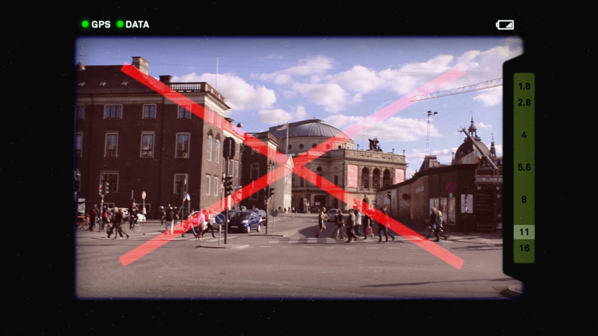

# Conceptual Cameras

-- 

### The Descriptive Camera

*[The Descriptive Camera](http://mattrichardson.com/Descriptive-Camera/)* by Matt Richardson works a lot like a regular camera: point it at subject and press the shutter button to capture the scene. However, instead of producing an image, this prototype uses crowdsourcing to output a text description of the scene. 

 

--

### Word.Camera

*[Word.Camera](https://word.camera/about)* by Ross Goodwin  sends the image it takes to a crude artificial intelligence, that then attempts to describe it in English. It uses convolutional neural networks (via Clarifai) to extract concept words from images; itn then expands those initial words (mostly nouns) into sentences and paragraphs using a lexical relationship database (ConceptNet) and a flexible template system.

 

Ross Goodwin has also made a similar [Sentient Surveillance Camera](http://motherboard.vice.com/read/sentient-surveillance-camera).

-- 

### Camera Restricta

*[Camera Restricta](http://philippschmitt.com/projects/camera-restricta)* by Philipp Schmitt is a 'disobedient' camera designed to take unique photographs. By using data of geotagged photos the camera will refuse to operate in popular places.

 
 

Closely related to this project is *[The Unoptic Camera](http://cl.ly/1h2Q0q0h1J32)* by Kyle McDonald and Chris Woebken.

-- 

### Nadia, Camera Intelligent Interface

[Nadia, Camera Intelligent Interface](https://www.youtube.com/watch?v=ColrQao4Hlg) by Andrew Kupresanin (2010) is a critic-in-a-camera. "Unlike a conventional camera, Nadia has no display of the photographs to be taken, but rather gives the judgment of aesthetic quality to the machine, displaying only a current rating as feedback about when and what to snap. Within pop culture and society artificial intelligence has been a topic that is approached with hope, fear, cynicism, curiousity and caution."

 

