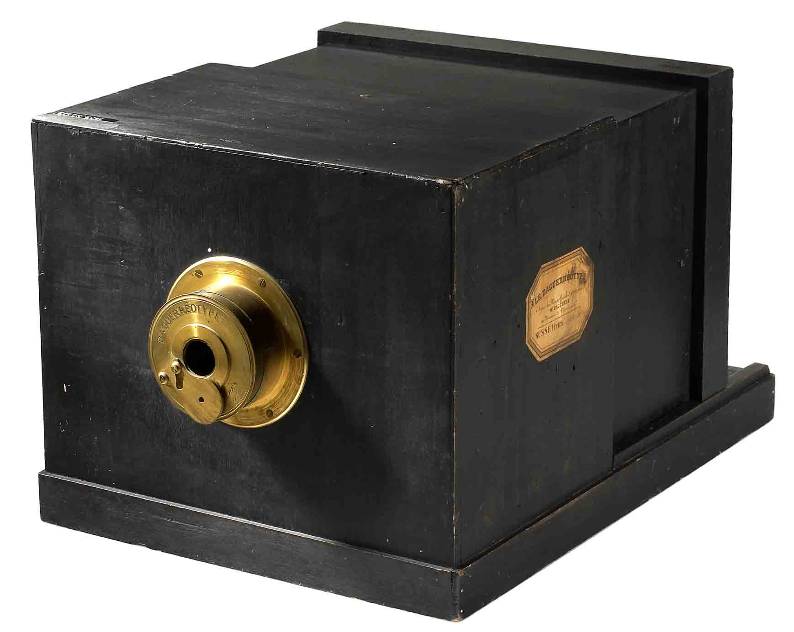
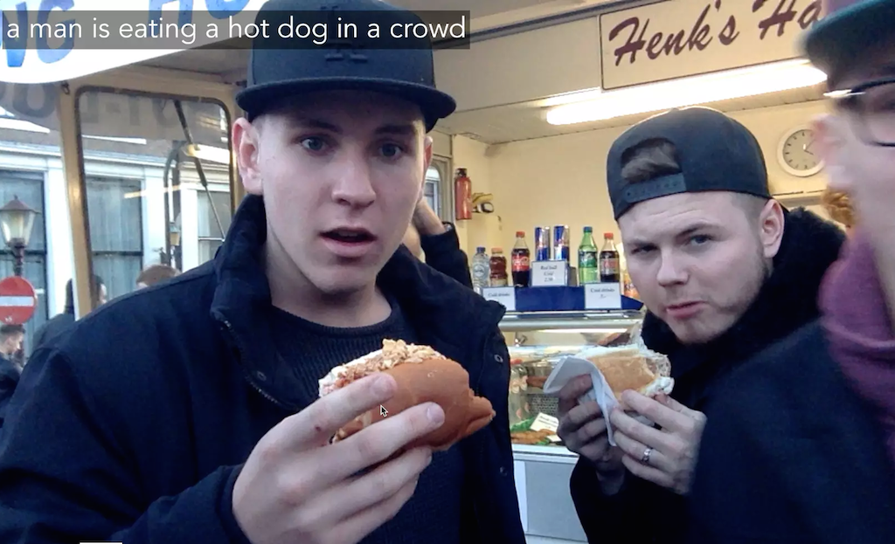
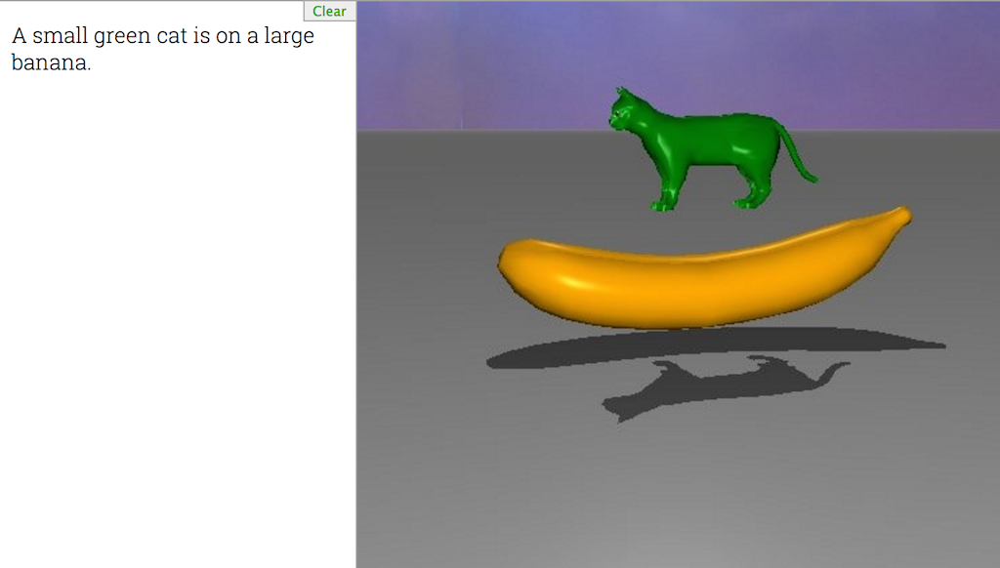
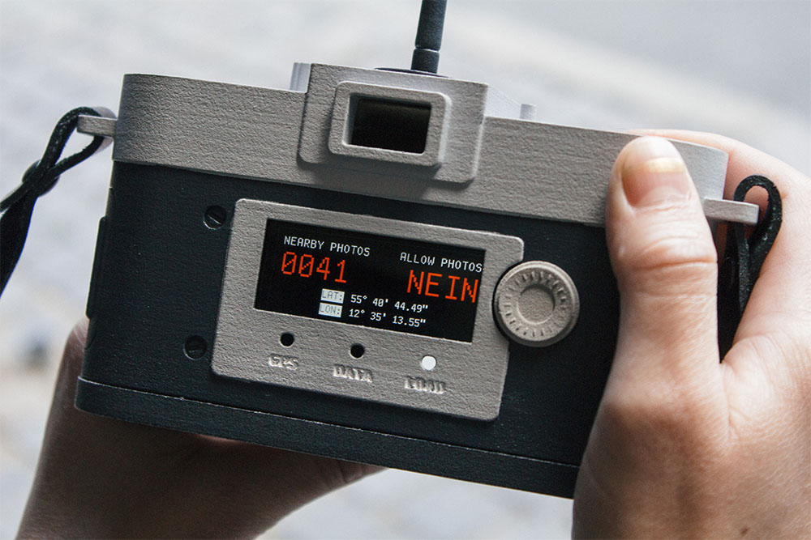
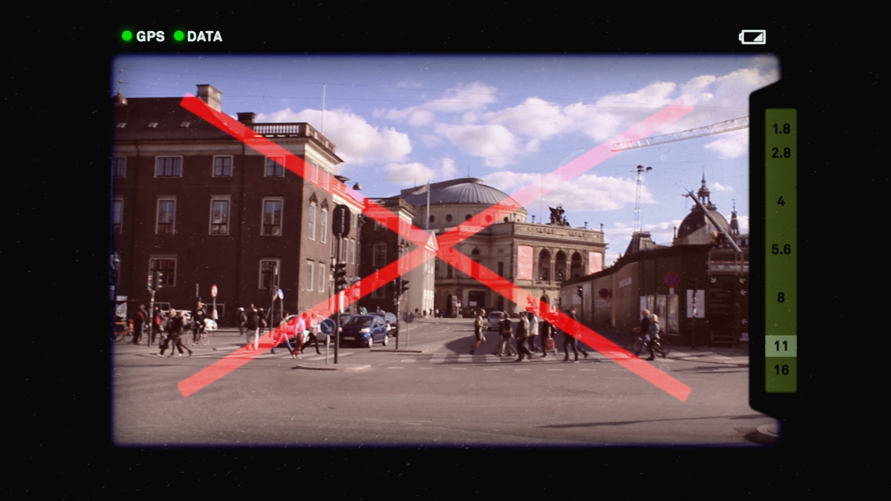
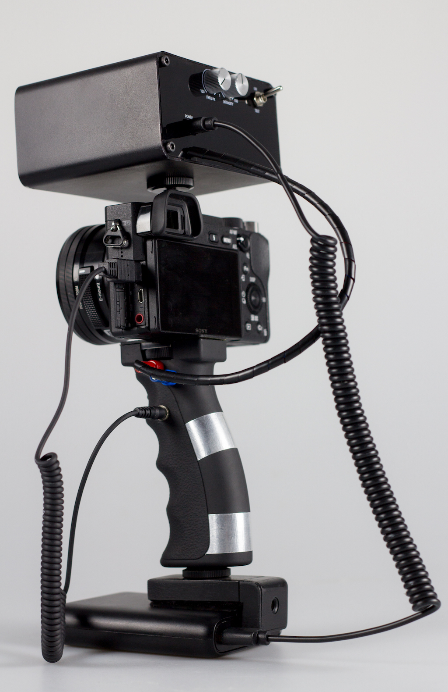
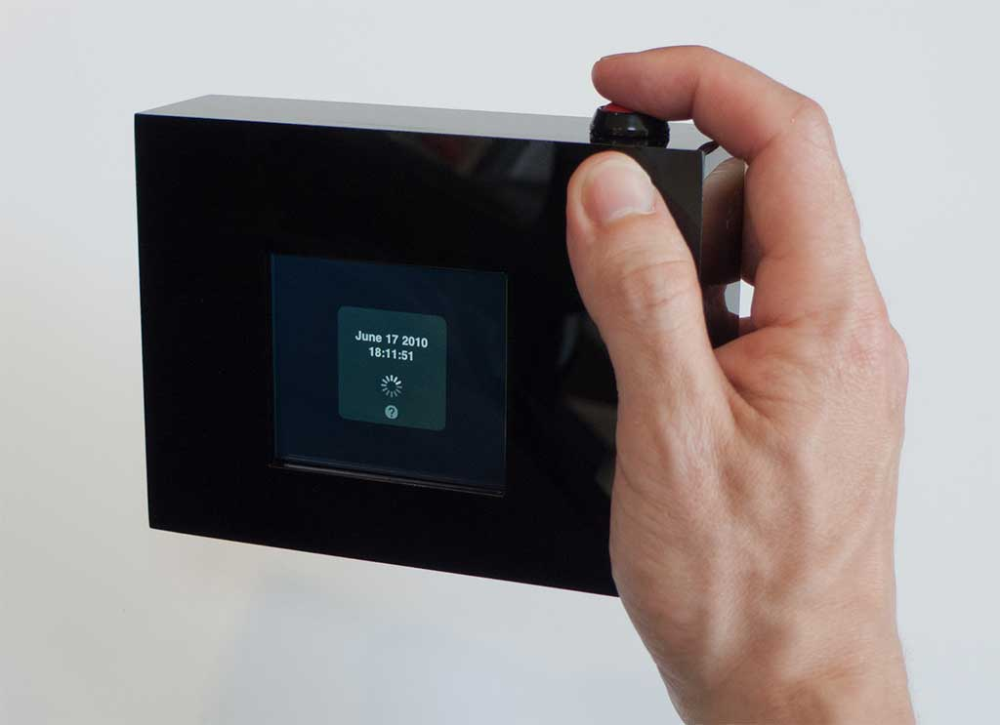

# Conceptual Cameras

*This lecture is intended to provoke reconsiderations about what a camera is, could be, or ought to be.*

### Contents

Several artist-made cameras probe the relationship between words and images, language and perception. 

* [*The Descriptive Camera*](#the-descriptive-camera) by Matt Richardson
* [*Word.Camera*](#wordcamera) by Ross Goodwin
* [*Neural Talk and Walk*](#neural-talk-and-walk) by Kyle McDonald
* [*WordsEye*](#wordseye)

Some artist-made cameras make aesthetic judgements about their surroundings, and prompt or prevent their operator from capturing the scene, accordingly.

* [*Camera Restricta*](#camera-restricta) by Philipp Schmitt
* [*Nadia, Intelligent Camera Interface*](#nadia-intelligent-camera-interface) by Andrew Kupresanin
* [*Prosthetic Photographer*](#prosthetic-photographer) by Peter Buczkowski
* [*The Unoptic Camera*](#the-unoptic-camera) by Kyle McDonald and Chris Woebken

Other experimental cameras bring politics and poetics to the act of image capture.

* [*Film Noir*](#film-noir) by Ayodele Odubela
* [*Between Blinks and Buttons*](#between-blinks-and-buttons) by Sascha Pohflepp
* [*Image Fulgurator*](#image-fulgurator) by Julius von Bismarck

--- 

### The Descriptive Camera

*[The Descriptive Camera](http://mattrichardson.com/Descriptive-Camera/)* (2012) by Matt Richardson works a lot like a regular camera: point it at subject and press the shutter button to capture the scene. However, instead of producing an image, this prototype uses crowdsourcing to output a text description of the scene. 

 

---

### Word.Camera

*[Word.Camera](https://word.camera/about)* (2015) by Ross Goodwin sends the image it takes to an artificial intelligence, that then attempts to describe it, *expressively*, in English prose. It uses convolutional neural networks (via Clarifai) to extract concept words from images; it then expands those initial words (mostly nouns) into sentences and paragraphs using a lexical relationship database (ConceptNet) and a flexible template system. 

 

Ross Goodwin has also made a similar [Sentient Surveillance Camera](http://motherboard.vice.com/read/sentient-surveillance-camera).

---

### Neural Talk and Walk

Kyle McDonald has made [a camera that describes what it sees in real-time](https://vimeo.com/146492001), *Neural Talk and Walk* (2015), using neural networks in OpenFrameworks. 

 

---

### WordsEye

The opposite of this is [*WordsEye*](http://www.wordseye.com/) (2015), an interactive, web-based system which produces visual renderings from a verbal description. (Try it!)

 

--- 

### Camera Restricta

*[Camera Restricta](http://philippschmitt.com/projects/camera-restricta)* (2014) by Philipp Schmitt is a 'disobedient' camera designed to take unique photographs. By using data of geotagged photos, the camera will refuse to operate in popular places.

 
 

--- 

### Nadia, Intelligent Camera Interface

[Nadia, Intelligent Camera Interface](https://www.youtube.com/watch?v=ColrQao4Hlg) by Andrew Kupresanin (2010) is a critic-in-a-camera. "Unlike a conventional camera, Nadia has no display of the photographs to be taken, but rather gives the judgment of aesthetic quality to the machine, displaying only a current rating as feedback about when and what to snap. Within pop culture and society artificial intelligence has been a topic that is approached with hope, fear, cynicism, curiousity and caution."

 

---

### Prosthetic Photographer

[*Prosthetic Photographer*](http://peterbuczkowski.com/projects/prosthetic-photographer) by Peter Buczkowski (2018) "enables anybody to unwillingly take beautiful pictures." It is an AI-powered device that can recognize a well-composed scene and then force the photographer to press the shutter via a mild electrical shock to their hand. [It is](https://www.engadget.com/2018/02/16/prosthetic-photographer-shocks-you-into-taking-good-photos/) "a real, fully functional device that can attach to any DSLR camera. Its AI was trained on the much-used CUHKPQ data set, which contains 17,000 internet photos rated by humans. The box has a built-in camera that can detect when you've composed a scene to its standards, then fire a jolt of electricity into your hand, forcing your trigger finger to move and take the photo."

---

### The Unoptic Camera

Closely related to the above projects is *[The Unoptic Camera](http://cl.ly/1h2Q0q0h1J32)* by Kyle McDonald and Chris Woebken.

---

### Film Noir

Data scientist [Ayodele Odubela](https://www.dazzlingdata.science/) is actively developing *Film Noir*, a camera optimized for black skin. She writes that the aim of *Film Noir* is 

> "*to improve the photo taking experience for black people. I am training a Convolutional Neural Network to learn features based off a variety of black faces, and then using a Generative Adversarial Network (GAN) to create a new image, that should highlight black people’s features better.*"

---

### Between Blinks and Buttons

Sascha Pohflepp's [*Between Blinks & Buttons*](http://pohflepp.net/Work/Buttons) (2006/2010) reduces the act of photo-taking to capturing a moment in time. Ignoring your location, pressing this camera's shutter button will retrieve another photo taken (elsewhere) at the same time, potentially from the other side of the world. (As [seen in Wired](https://www.wired.com/2010/03/blind-camera-takes-photos-from-other-side-of-the-world/).)

Pohflepp writes: 

> "*Through making their photos public on the Internet, individuals create traces of themselves. In addition to their value as a memory, each image contains a multitude of information about the context of its creation. Through this meta-information, every image is linked to the precise moment in time when it was taken, making it possible to see what happened simultaneously in the world at that instant. This work tries to focus the user's imagination on that other, to create narratives that run between one's own memory and a stranger's moment which happened to coincide in time.*"

---

### Image Fulgurator

Julius von Bismarck's *[Image Fulgurator](http://juliusvonbismarck.com/fulgurator/)* (2007) is a device for physically manipulating photographs at the instant they are captured. It intervenes when a photo is being taken, without the photographer being able to detect anything. The manipulation is only visible on the photo afterwards.

 

von Bismarck writes: 

> "*In principle, the Fulgurator can be used anywhere where there is another camera nearby that is being used with a flash. It operates via a kind of reactive flash projection that enables an image to be projected on an object exactly at the moment when someone else is photographing it. The intervention is unobtrusive because it takes only a few milliseconds. Every photo another photographer takes of an object at which the Fulgurator is also aimed is affected by the manipulation. Hence visual information can be smuggled unnoticed into the images of others.*"

