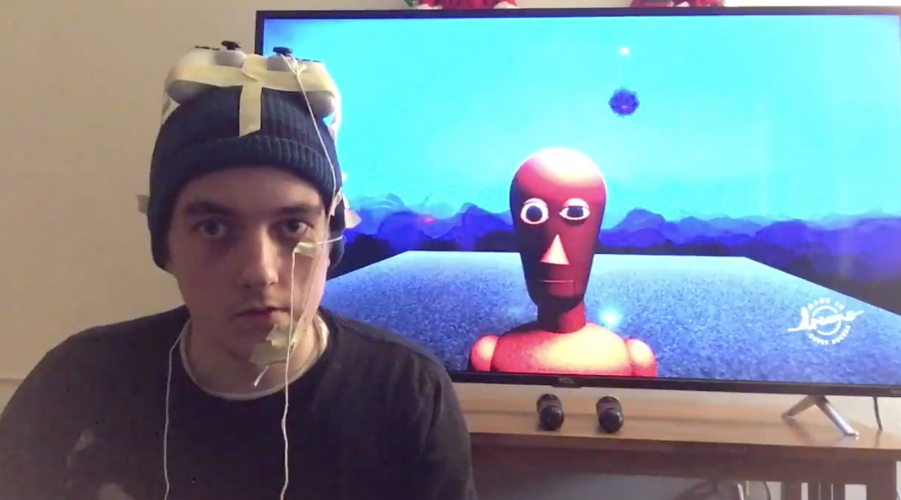
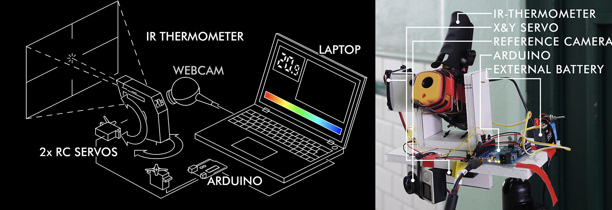
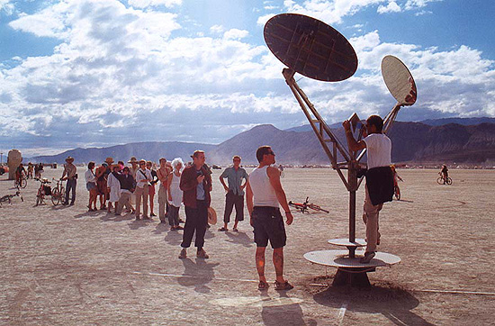
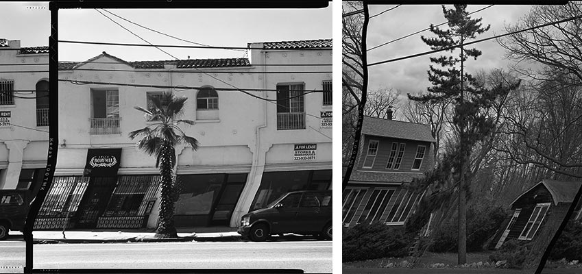
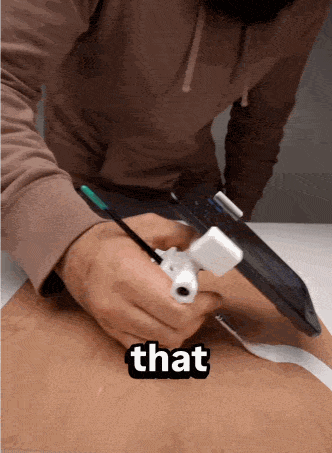
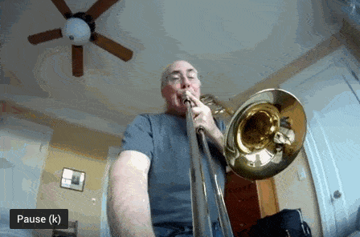
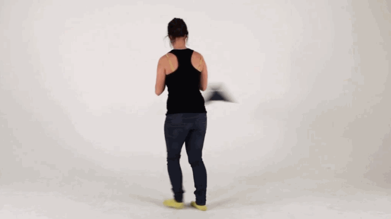
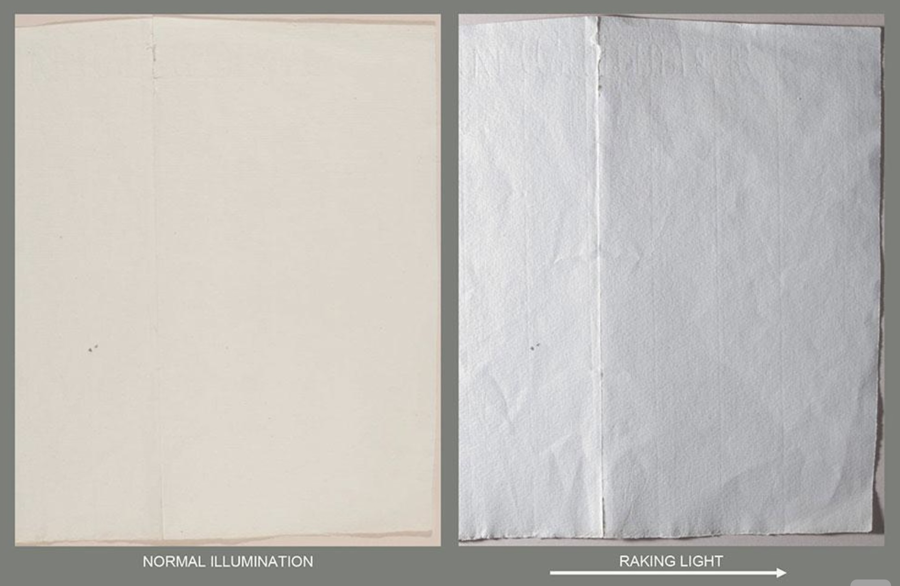
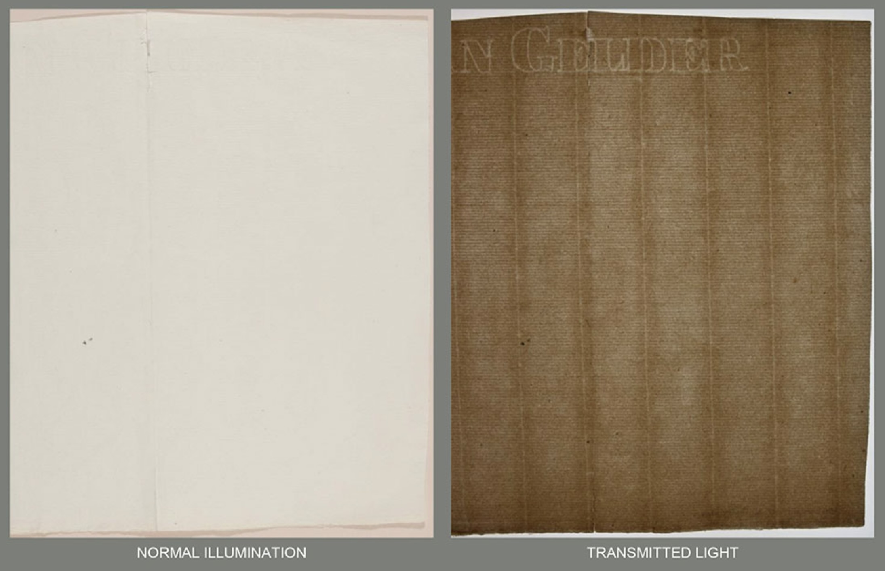
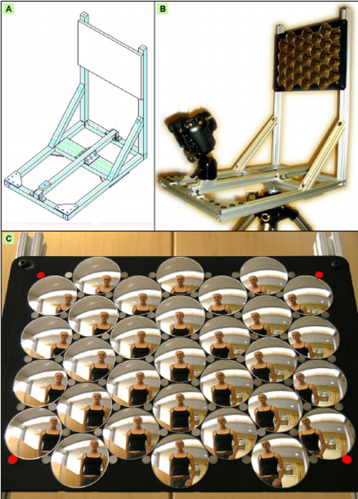

# DIY/LoFi ExCap

---

A touchless forehead thermometer (about USD20) is essentially a one-pixel thermal camera. Artist Niklas Roy made a [DIY Thermal Camera](https://www.youtube.com/watch?v=q49p4jXGQuA) by [mounting one on a pan/tilt servo](https://www.niklasroy.com/project/195/DIY_thermal_imaging): 

Daniel Temkin, [*Straightened Trees*](https://danieltemkin.com/StraightenedTrees)

[Trombone Camera](https://www.youtube.com/watch?v=rNdXezVKeOA&t=11s) 

[Roel Wouters, Camera Workshop at ECAL](https://vimeo.com/62869207) 

30 synchronized cameras for 4D capture? 

