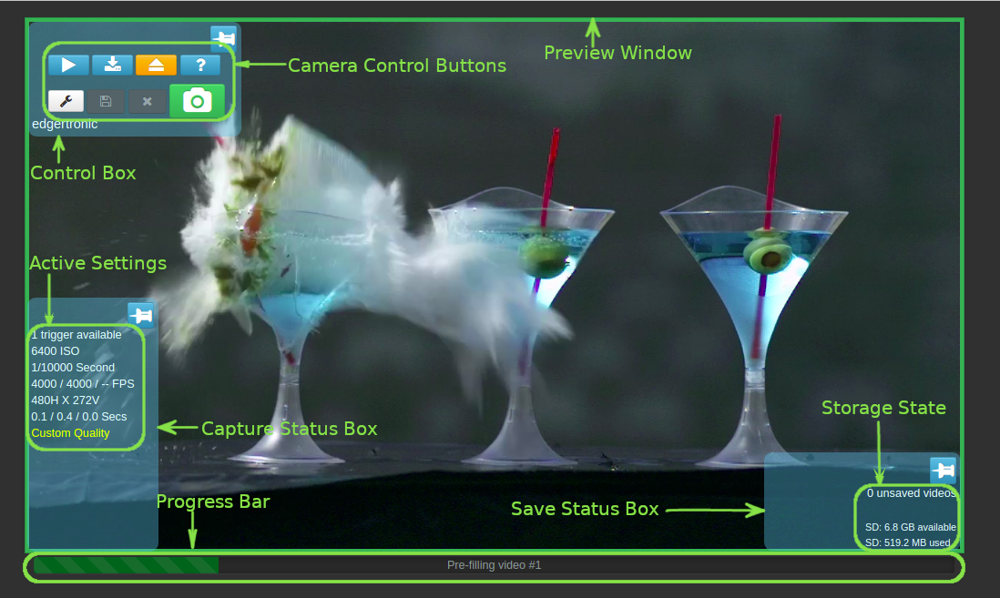
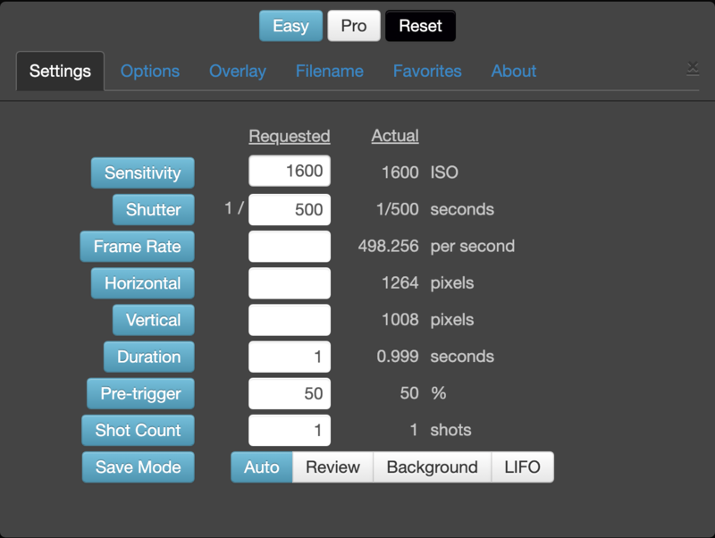

# How to Use the Edgertronic Slow Motion Cameras

For more information about overcranking aka slow motion videography see the [overcranking](overcranking.md) document in this repository. 

* We have two [Edgertronics](http://edgertronic.com/) high-speed cameras, capable of up to 18,000 fps. This camera does 720p video at 1000 fps.

Because the exposure time of each frame is so short, high-frame-rate cameras generally require a lot of light. A lighting kit or bright sunshine is essential for good results with slow-motion cameras. For very high speed cameras, it is essential to have lights without any appreciable flickering.

### Read the Manual

* [Edgertronic Wiki](https://wiki.edgertronic.com/wiki/User_Manual)

### Features and limits of the Edgertronic SC1

| Features                  | SC1            |
|---------------------------|----------------|
| Lens mount ring color      | Black          |
| Color / Monochrome         | Both (Build option) |
| Video memory               | 8 GB or 16 GB  |
| Exposure                   | 1/10 to 1/250,000 sec |
| ISO range                  | Color – 1,600 to 25,600 Mono – 6,400 to 102,400 |
| Supported resolutions      | 192 x 96 to 1280 x 1024 |
| Maximum Frame Rate @ Minimum Resolution | 17,791 fps @ 192 x 96 22,336 fps @ 192 x 96* |
| Maximum Frame Rate @ Maximum Resolution | 494 fps @ 1280 x 1024 621 fps @ 1280 x 1024* |
| Maximum Frame Rate @ 1280 x 720 | 701 fps 882 fps* |
| Maximum Frame Rate @ 1280 x 128 | 3,855 fps 4,846 fps* |
| Maximum Frame Rate @ 640 x 480  | 1,849 fps 2,324 fps* |
| Maximum Frame Rate @ 320 x 240  | 5,712 fps 7,181 fps* |
| IR Blocking Filter    | Optional       |
| Extended dynamic range    | 5 settings     |
| Subsampling               | Yes            |
| Overclock                 | 5 settings 0% to around 40% |
| CMOS sensor active area   | 17.92 x 14.34 mm |
| Price                 | $6,495.00      |

Note: *Overclock C - Most cameras produce usable videos up to overclock C.

### Recording Setup for the Edgertronic SC1

### **Set Up the Camera**
- **Mount the Camera**: Secure the Edgertronic camera on a stable tripod or mount to avoid any movement during recording.
- **Connect Power**: Plug in the power supply to the camera and connect it to a power source.
- **Connect to a Computer**: Use an Ethernet cable to connect the camera to a computer or a router that is connected to your computer. This allows you to control the camera via the web interface.

### **Access the Camera's Web Interface**
- **Setup you Computer's Network**:In your network settings change your ethernet's network IP to 10.11.12.1 and your subnet mask to 255.255.255.0. If you have issues connecting, turn off your wifi.
- **Open a Web Browser**: On your connected computer, open a web browser.
- **Enter the Camera’s IP Address**: Type the camera’s IP address into the browser's address bar and press Enter. The camera’s web interface should load.
 - Our cameras IP Addresses are: 
 		- 10.11.12.13 (note this is the default and will work as long as the led light in the back of the camera is yellow - do not change the IP address without prior instructor approval.)
	 
	  
### **Configure Camera Settings**

| Field        | Dependencies                                                                 | Description                                                                                                                                                                                                                                                                                 |
|--------------|-------------------------------------------------------------------------------|---------------------------------------------------------------------------------------------------------------------------------------------------------------------------------------------------------------------------------------------------------------------------------------------|
| Sensitivity  | Not dependent on other arguments                                              | ISO sensitivity. Typical 'Sensitivity' Values: 'Film Speed' 1600-25600 ISO (6400-102,400 mono) for SC1, SC2, SC2+. 1,200 to 19,200 ISO For SC2X                                                                                                                                            |
| Shutter      | Not dependent on other arguments                                              | Shutter speed (1/exposure time) of each frame. Use a higher shutter speed to allow a higher frame rate.                                                                                                                                                                                     |
| FrameRate    | Always dependent on Shutter and conditionally dependent on Horizontal, Vertical if specified | Frames per second. The higher the Frame Rate, the slower the motion.                                                                                                                                                                                                                       |
| Horizontal/Vertical | Conditionally dependent on Frame rate if specified                    | Horizontal and Vertical resolution in pixels.                                                                                                                                                                                                                                              |
| Duration     | Always dependent on Frame rate, Horizontal and Vertical resolutions           | Captured video duration, including pre and post trigger times                                                                                                                                                                                                                              |
| Pre-trigger  | Not dependent on other arguments                                              | Percentage of the saved video that occurred BEFORE the trigger event.                                                                                                                                                                                                                      |
| Save Mode    | Not dependent on other arguments                                              | Three Save Mode options available to select what happens after a video has been captured: Automatic capture then save, review before save, and Background save. Background save feature is available in software version 2.4 and later.                                                    |
| Shot Count   | Always dependent on Frame rate, Horizontal and Vertical resolutions, Duration, and Save Mode | Shot Count is the number of shots you can take with these settings. The camera captures videos as triggered until the shot count is reached, then the captured videos can be reviewed or are automatically saved, depending on the Save Mode setting. Shot count is ignored when Save Mode is set to Background save. |
| Overclock    | Only available on SC1/SC2+/SC2X Models. Not dependent on other arguments      | Overclocking allows the sensor to operate faster than the maximum design speed. A selection of overclock amounts from 'Off' being operating within the CMOS sensor's documented capabilities, and clock rate increasing A, B, C, and D for higher levels of overclocking, ranging approximately 10% to 40% faster. As a rule of thumb, we have observed good results with overclock C. |
| Sub-sampling | Only available on SC1 Models. Not dependent on other arguments                | Skips every other pixel and every other line when the resolution is 1/4 or smaller of the maximum resolution. This effectively allows you to get a larger field of view when the camera is configured at a lower resolution. Works well with monochrome cameras. Some color artifacts may be present when enabled on color cameras. |
The info above is from the [Edgertronic wiki] (https://wiki.edgertronic.com/wiki/User_Manual_-_Settings).
  

### **Focus and Frame Your Subject**
- **Focus the Lens**: Manually focus the lens on your subject. Use the camera’s live view feature on the web interface to ensure the subject is sharp.
- **Adjust the Frame**: Position the subject in the frame. Ensure that the subject’s movement will stay within the frame during recording.

### **Set Up Lighting**
- **Increase Lighting**: Ensure the subject is well-lit. High-speed filming requires a significant amount of light to maintain proper exposure at fast shutter speeds.
- **Avoid Flickering Lights**: Use continuous lighting or ensure that artificial lighting does not flicker at the frame rate you’re using.
- **Adjust Sensitivity**: The higher the ISO the more sensitive aka brighter your recording will be. Note that this also adds a lot of noisy video grain.

### **Record the Slow-Motion Video**
- **Press Record**: On the web interface, click the record button to start capturing video. It will record the pre-set length of time. Wait until the web interface fully processes. A green pre-recording and then purple recording bar will move across the bottom of your preview video. When the recording is done it will state "saving" in the top left corner and a blue bar will move across the bottom of the screen. When the blue bar completes and the menu reappears the recording is finished.

### **Download the Video**
- **Save the Video**: Use the web interface to download the recorded video to your computer.
