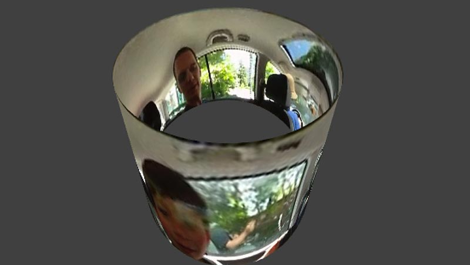

## Remarks on Final Project Proposals

### *AHEM...*

*The following students did not submit final project proposals as requested. I asked for 100 words and a doodle; please.*

* Charlotte
* Claire
* Dan 
* Melody
* Michelle
* Smokey
* Vidya
* Yizhi (Liz)
* Zach

---

# Feedback

Feedback is provided below for the students who completed the request: 

* [Akiva](#akiva)
* Benjamin
* Katie Rose
* Kevin
* Miles
* Miranda
* Nivetha
* Ryan
* Swetha
* [Will](#will)

---

### [Akiva](https://github.com/golanlevin/ExperimentalCapture/blob/master/students/akiva/Project%204%20proposal.md)

> I'm going to create long exposure style heat map images, Using videos from the FLIR heat camera.

This sounds good. Keep in mind that both of our thermal cameras are very low resolution; it's the nature of the imaging technology. Also, both thermal cams have a fairly narrow field of view; we don't have a wide-angle thermal imager. 

We have: 
* A FLIR E30bx. [Here are instructions](http://flong.com/deliver/fix-flir/index.html) for disabling the logo overlay.
* A [FLIR One](http://www.flir.com/flirone/content/?id=62912) for iOS. Claire Hentschker in our class has been using this. 

The FLIR One may be easier to work with. A quick test would be to record video with it, then apply a kind of "light painting" (luminance accumulation) filter to the video in e.g. AfterEffects.

There's another thermal camera I'm aware of at CMU; professor [Yang Cai](http://www.andrew.cmu.edu/user/ycai/) has a high-quality analog unit which he might be willing to loan you. It has a slightly wider field of view, but it's still an analog NTSC, SD video signal. 

Some other possibilities that might be interesting: 
* Thermal photogrammetry: creating a thermal environment map of an entire space, then viewing it in some navigable VR. 
* Registering a thermal camera with a DSLR camera (using depth data from a kinect). (Really, the same as the above)
* Creating panoramic (360-degree) thermal images of a place, with some kind of imaging stitching software and a borrowed [GigaPan tool](http://www.cmucreatelab.org/projects/GigaPan/pages/GigaPan_Education) from the CREATE Lab (or our little robot arm).

---

### [Benjamin](https://github.com/golanlevin/ExperimentalCapture/blob/master/students/benjamin/finalprojectproposal)

Glad to see you continue with your work from Project 3. I've prevously sent you some thoughts and suggestions by email. Go ahead and get started. You have my permission to interpret this work for 60-212 as well (perhaps something browser-based using three.js or OF in the browser?).

Note, your final project proposal was not saved as a markdown (.md) file, so it doesn't display correctly in the github site. 

I still think you should give yourself permission to walk *really slowly....*

---

### [Irene](https://github.com/golanlevin/ExperimentalCapture/blob/master/students/irene/final-project/final-project-proposal.md)

Drone-based topographic mapping is a great starting point. I've got a few thoughts. 

* You mention slums in Caracas. Is it your objective to do the topographic mapping as inexpensively as possible? In such a case, I'd recommend ditching the drones (which are expensive, fragile, require power charging infrastructure, deplete their power quickly), and instead consider using **balloons and kites**. Please check out [http://grassrootsmapping.org/](http://grassrootsmapping.org/) and [https://publiclab.org/](https://publiclab.org/), important work by Jeffrey Warren and colleagues in in grassroots disaster mapping and contestational cartography.

* We have an older GoPro, but for something even smaller, consider convincing me to buy one of the new the new $99 [Polaroid/Kodak cube cameras](http://petapixel.com/2014/08/13/polaroids-cube-action-cam-special/). 

* Other technical possibilities include [DIY LIDAR](https://blog.adafruit.com/2013/05/30/diy-virturange-lidar-3d-scanner-3dthursday/). In particular, check out the [Sparkfun LIDAR-Lite](https://www.sparkfun.com/products/13680) good up to 40 meters; [see how others](https://forums.adafruit.com/viewtopic.php?f=24&p=392228) are attempting to make topo scanners with it. This seems like an ideal use for the new $5 Raspberry PiZero.

* The LIDAR-Lite could complement the photogrammetry by providing absolute scale. In other words, there's a scale factor missing from the photogrammetry (the camera doesn't know whether it's looking at something small or large), but the LIDAR could resolve that.


---

### [Katie Rose](https://github.com/golanlevin/ExperimentalCapture/blob/master/students/katierose/finalprojectproposal.md)

Cool. I'm thoroughly satisfied with this proposal; thanks. I do have a few brief suggestions.

* I do realize it's just your sketch/diagram, but I was inspired by the ASCII rendering style you used. As an alternative to presenting a televised video signal to the viewer/user/audience, may I propose instead the idea, of presenting an ASCII image shown on a text terminal. This would *not* be a grayscale ASCII image (of the [familiar variety](https://en.wikipedia.org/wiki/ASCII_art#Image_to_text_conversion), in which dark pixels are represented with M's, etcetera), but rather an ASCII scene computed from an *edge-detected* version of your camera's view, exclusively rendered with the linear characters, / \ | - _ . I'd be happy to discuss this further. (Interestingly, you could transmit this text stream very compactly and view it in a browser.)

* I'm not sure which camera you're using on the mini-rover, but FWIW I have a number of very small analog cameras, as well as a wide variety of 12mm lenses (wide, fisheye, etc.) which might be useful. 

---

### [Kevin](https://github.com/golanlevin/ExperimentalCapture/blob/master/students/kevin/finalProject/finalprojectproposal.md)

Excellent. I realize this is connected to your large theater project in process. Go go go. 

Are the phones transmitting their location back to a server? It would be great if you could create a javascript application that visualized the locations of all the clients. That's an interesting and unique "capture" tool in itself. 

---

### [Miles](https://github.com/golanlevin/ExperimentalCapture/blob/master/students/miles/finalprojectproposal.md)

Great, solid proposal. Get started!

The Ee Ja Nai Ka uprisings sound fascinating. It could be worthwhile for there to be some kind of narration (voiceover text) about . Get a professional voice-over; you'll feel like a million bucks. 

---

### [Miranda](https://github.com/golanlevin/ExperimentalCapture/blob/master/students/miranda/finalprojectproposal.md)

**Timing**<br />
Broadly speaking, I felt your proposal(s) lacked sufficient detail. You mentioned a few things you're interested in exploring, but only in a very general way. You need to get a lot more specific, *soon*. 

**Re: Birds:**<br/>
I realize you may want to do something with birds. Keep in mind the famous wisdom from actor/comedian W.C. Fields, “Never work with children or animals.” One reason for this is because of the number of takes that are required in order to get the shot you want. Consider that [it took this photographer more than 6 years](http://www.thisiscolossal.com/2015/11/kingfisher-symmetry-alan-mcfadyen/) -- 4200 hours and more than 720,000 exposures -- to obtain the photo he wanted of a kingfisher diving. If you're interested in working with unpredictable living things, give yourself the necessary time.

I thought you might enjoy [this unique time lapse video](http://www.thisiscolossal.com/2014/01/amazing-video-clips-visually-isolate-the-flight-paths-of-birds/) of birds, showing their flight paths. 

**Re: Audio time compression:**<br/>
There are many good audio software systems and plugins for time-compression (also called time-stretching) of audio (i.e. changing the speed without changing the pitch. The free Audacity software [has this feature](https://www.youtube.com/watch?v=zdwQ9ShmPrg), and there are also free VST plugins such as [STRETCHA](http://bedroomproducersblog.com/2014/05/06/stretcha-vst-wok/) that work with many audio editors. 

If you decide to record something with the high-speed camera, I think it could be interesting to record something that makes noise, and to record its accompanying audio, and to use time-stretching to preserve its original pitch. If you do this, be sure to use the absolute highest sampling rate you can. For example, the STUDIO has a Zoom H6 audio recorder which has a (maximum) 96kHz sampling rate. 

**You proposed:**<br/>
> *Besides singing, are there other actions humans do that when sped up resemble small animals? What other kinds of distinctive bird songs would come through clearly? (Audio Recording Devices and a Camera)* 

I suppose you might be able to get an actor to mimic the (slowed down) movement of a frisky little animal (such as an ant, or a hamster), from a specific video recording; record the actor's movement with motion capture; then speed up the captured motion, etc. If you study *Dawn Chorus* carefully, you can see that the people are *already* imitating the motion of the birds, however, in the way that they are breathing.

> What would a slit-scanned time lapse look like? (Cameras 'n Programmin')

People have made time-lapse slit scanners; you can judge for yourself. See, for example, [*Last Clock*](http://www.creativeapplications.net/i-os/last-clock-ipad/), [*Khronos Projector*](http://www.k2.t.u-tokyo.ac.jp/members/alvaro/Khronos/), [*Time Maps*](http://www.flong.com/texts/lists/slit_scan/#mt), [*Time Flies*](http://www.flong.com/texts/lists/slit_scan/#mk) etc. You don't need much in the way of programming to make a slit scan. For example, here is a complete working slit scanner in 15 lines of Processing code: 

```
import processing.video.*;
Capture myCap;
int X=0;
void setup() {
    myCap = new Capture(this, 320, 240);
    myCap.start();  
    size(600, 240);
}
void draw() {
    if (myCap.available()) {
        myCap.read();
        myCap.loadPixels();
        copy(myCap, (myCap.width/2), 0, 1, myCap.height, (X++%width), 0, 1, height);
    }
}
```

> What if you had a cup whose interior is a small video view of another world? (Flock of Birds, 360 Video)

* Do you mean a real cup with a projection on the inside, or a virtual 3D cup? 
* Do you mean a cylindrical view of the world wrapped around the inside wall of a cup, or a circular view masked onto the top "lid"? 

My quick response to this is, that this sounds like more of an idea for something you'd like to *synthesize*, than an idea for something you'd like to *capture*. My questions are

* What do you want to capture? and why do you want to capture it? Put another way, what, in the world, are you curious about? 
* What's special about the way you propose to capture it? 
* What's special about your subject that it deserves or demands to be captured in the way you propose?

Also, not sure why you want the Flock of Birds (it's not working yet) but we do have a couple [Sparkfun 9DOF Razor IMU](https://www.sparkfun.com/products/10736) units (Ben and Nivetha have been using them). You might also like [this nice 9DOF IMU](http://www.adafruit.com/products/2472) from Adafruit.

---

### [Nivetha](https://github.com/golanlevin/ExperimentalCapture/blob/master/students/nivetha/finalProjectProposal.md)

As a conceptual starting point, I very much approve of the self-portraiture / data-selfie aspect of your proposal: building a tool to capture qualitative information about yourself.   

But, I do have some questions regarding the legibility of the proposed results, as an information visualization:

* Please watch [this video of Kyle McDonald](https://vimeo.com/69067074) from 5:07-6:58, then 12:28-14:14, in which he lectures about his experiences recording his own face (and those of other people) while they used computers. After seeing this: 
  * What do you expect to observe, or what information do you expect to obtain, or what (precisely) are you curious about, that you hope your recording of yourself will reveal? 
  * Do you think you might have a neutral expression the whole time? (If you don't, will you be "over-acting"?)
  * Just seeing a sequence of face photos, it's hard to know what information is being revealed.Would your project be more informative (or clear) if we also knew what you were looking at? (Perhaps you should be recording the screen as well as your facial reactions?)

I also have some technical suggestions and concerns: 

* For what it's worth, [here is a Processing program](https://github.com/golanlevin/ExperimentalCapture/tree/master/code/time_lapse) I wrote which allows you to create a time lapse recording from the webcam, on a **laptop**; you should get started right away testing your ideas with it.
* And [here is some information](http://www.html5rocks.com/en/tutorials/getusermedia/intro/) for doing camera capture from the browser using HTML5.
* It can be **very** difficult to access the camera of a smartphone from a "background application", i.e. an application which is running in the background while you're looking at something else (Facebook, etc.) in the foreground. Better try it out! The reason this is difficult is to prevent loss of privacy: it would be very bad if you visited a web page that secretly recorded you using the camera. 
* OpenFrameworks would be a very good choice for making a laptop application that recorded your camera and simultaneously screengrabbed whatever you were looking at, at that moment. [ofxDisplay](https://github.com/tobiasebsen/ofxDisplay) looks like a good addon for grabbing the contents of the screen.

---

### [Ryan](https://github.com/golanlevin/ExperimentalCapture/blob/master/students/ryan/finalprojectproposal.md)

OK, there's a lot of great stuff here, but some [technical] problems, too. Let's work this out before you get too far along. Here are my thoughts: 

* Broadly, I love the idea of the Pausch bridge lights responding to pedestrians who are crossing it. 
* I'm worried there is too much going on here technically. Can you do this all in 10 days?  
* The Pausch bridge controller is a piece of garbage, give yourself extra time to figure it out.

At the conceptual level: 

* It's a **real pity**, I mean a *massive* limitation, that someone needs to be running an app in order for this to work. Fooey!
* Are you really quite sure you haven't given up on computer vision too early? We have infrared cameras and wide-angle lenses that might work very well (and we also have IR illuminators to make people visible at night to such cameras). We also have a thermal camera. The problem is: are there sight lines and mounting points that would allow us to view the entire bridge? Let's give you a wide-angle IR camera ASAP.

Immediately, contact [Jake Marsico](jmarsico@gmail.com). He's a former masters student, based in Pittsburgh, who also has experience controlling the lights on the bridge; he may have some advice. See, for example, his [Traffic Lights project](http://jmarsico.com/Traffic-Lights). 

---

### [Swetha](https://github.com/golanlevin/ExperimentalCapture/blob/master/students/swetha/finalprojectproposal.md)

OK, this is a pretty funny idea. I mean, flower=vagina is a very *obvious* and *clichéd* symbology, in part because of O'Keefe's work, so I assume there's a kind of cheeky irony here. 

I gather from your illustration that you intend to do this with an instrumented chair. 

I'd like to recommend or suggest that you consider tracking the leg-spread with a Kinect, instead. The advantages would be that 
* You'd know for certain whether a person was present
* You'd be able to have the flower's open-ness tightly linked to the viewer's leg open-ness.

To do this, you would stream a skeleton over OSC to whatever you're using for the graphic display (Processing?). The KinectV2 in particular has exceptionally good skeleton tracking, and there are lots of apps that can do this for you (so you don't have to write the capture app yourself. For example:

* [SenseBloom OSCeleton](https://github.com/Sensebloom/OSCeleton)
* [SimpleKinect](https://cycling74.com/toolbox/simplekinect/#.VlvqLGSrRcw)
* [OSC-Kinect](https://code.google.com/p/osc-kinect/)
* Dan Moore's [ofxKinect2Sender](https://github.com/fakelove/ofxKinect2Sender)

---


### [Will](https://github.com/golanlevin/ExperimentalCapture/blob/master/students/will/finalprojectproposal.md)

Well, your description is a little vague; I wish you could be more precise when you say "exploring the concept of temporal stretching". 

That said, what if you explored the *annular* (cylindrical / ring-shaped) version of Martin Hilpoltsteiner's project? I've *never* seen this done before.

Here's a ring-shaped video, recorded with our class Bloggie, and screenshot from [an updated version](https://github.com/danthemellowman/CatadioptricUnwarp360) of [this app](http://www.flong.com/blog/2010/open-source-panoramic-video-bloggie-openframeworks-processing/): 


You would basically do some sort of background subtraction (or keying), in order to extract the foreground (i.e. people), then stack those people in a series of nested/concentric cylinders: 


An altogether different possibility is to use the Edgertronic high-speed camera for slit-scanning, body-stacking, etc.. You'd have so many more intermediate frames!


