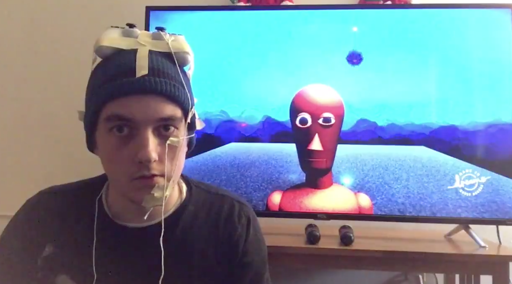

# 2D & 3D Gesture Capture

---

Some Code Resources: 

* [blinkOSC.zip](../code/osc/blinkOSC.zip)
* [EyeOSC.zip](../code/osc/EyeOSC.zip)
* [FaceOSC.zip](../code/osc/FaceOSC.zip)
* [gyrOSC.zip](../code/osc/gyrOSC.zip)
* [touchOSC.zip](../code/osc/touchOSC.zip)
* [poseOSC](https://github.com/LingDong-/PoseOSC)
* [trackpadOSC](https://github.com/LingDong-/TrackpadOSC)
* [leapOSC](https://github.com/genekogan/LeapMotionOSC/releases)
* Lots more at [Wekinator](http://www.wekinator.org/examples/)

Equipment Resources (Spring 2020): 

* Sensel Morph
* Leap Motion Sensor
* Tobii Eye-Tracker
* Kinect v1
* Kinect v2
* Kinect Azure
* Intel Real-Sense
* Hokuyo URG LIDAR
* Wacom Cintiq
* GameTrak "Real World Golf"
* Optitrak Motion Capture

