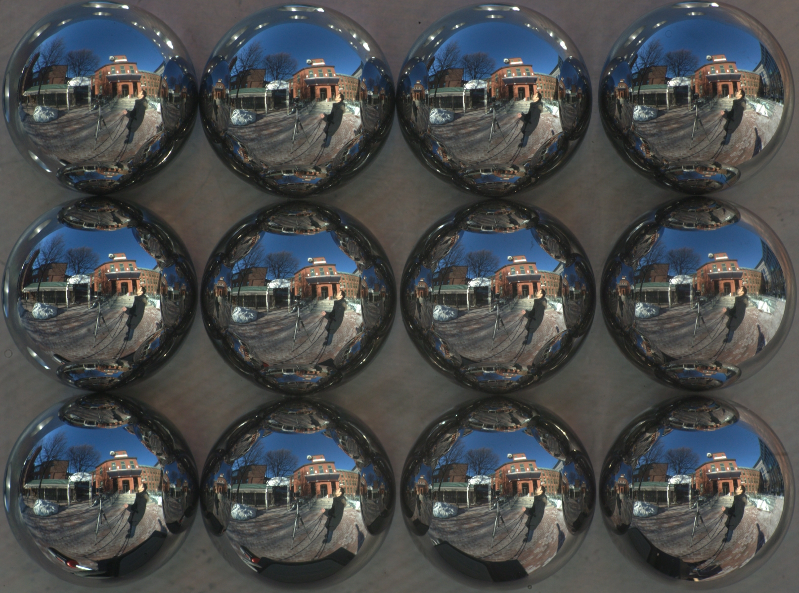
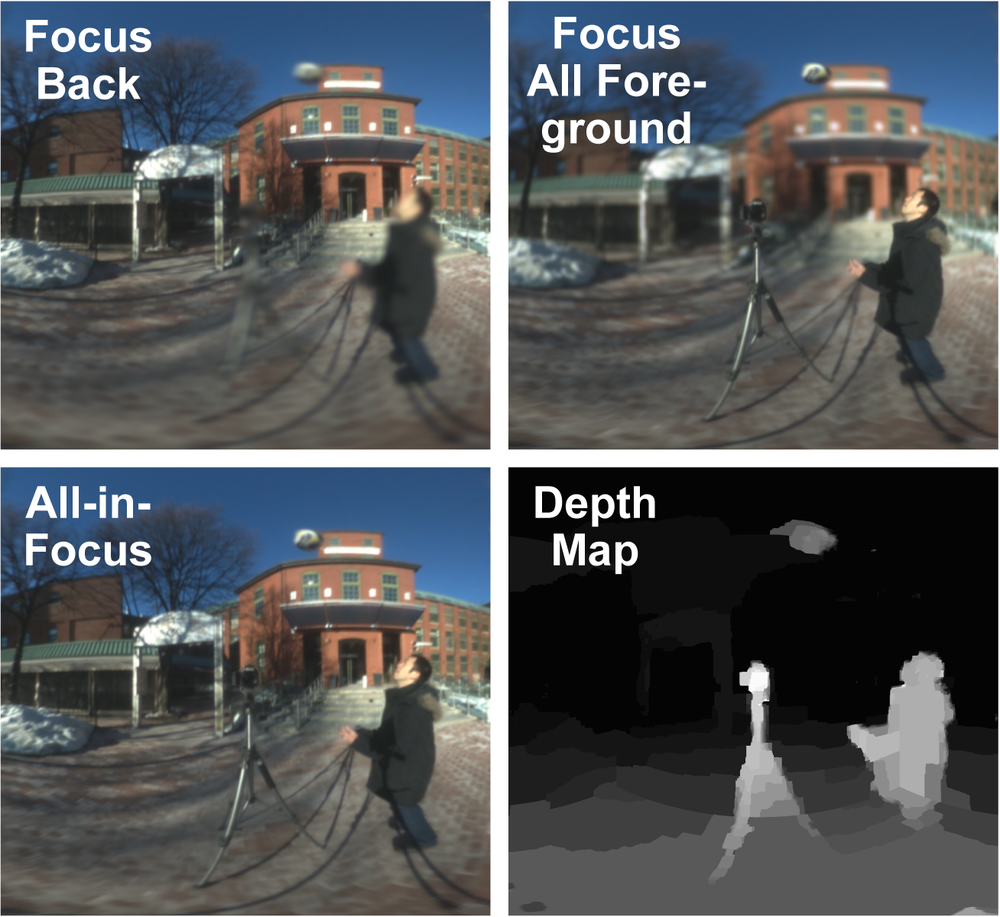
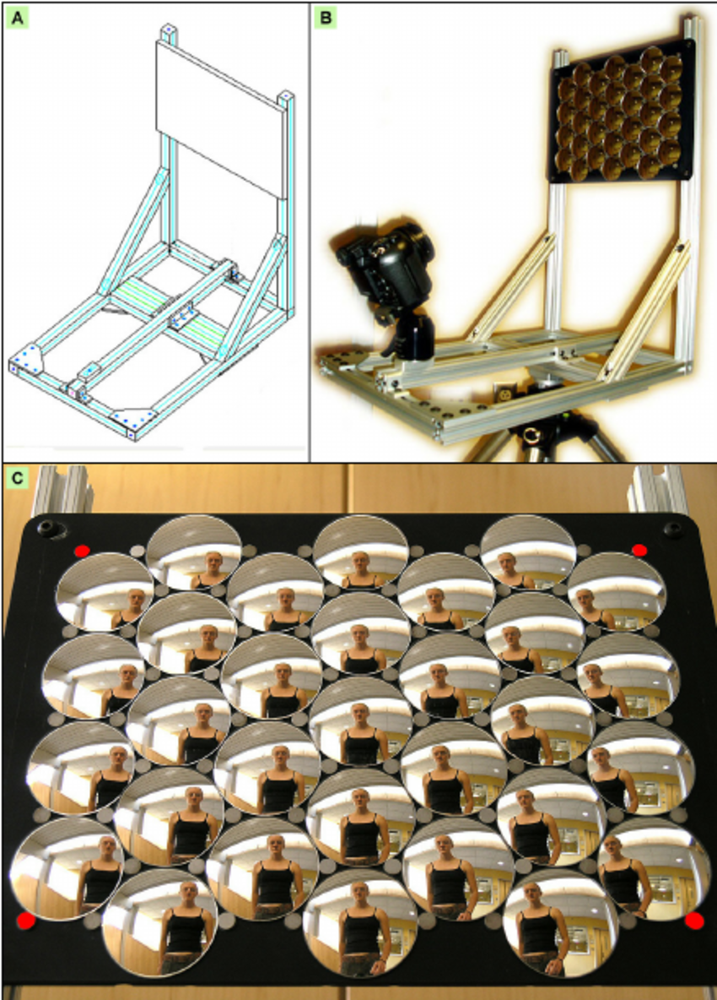

# Reflectometry and Light Field Capture

### The Catoptric Cistula

A [catoptric cistula](https://en.wikipedia.org/wiki/Catoptric_cistula), also called a catoptric theatre, is a box with several sides lined with mirrors, so as to magnify or multiply images of any object placed inside the box.

### Capturing Light Fields with Mirrors

* Spherical mirror arrays, which capture a scene from many simultaneous perspectives, [allow for interesting possibilities](http://yuichitaguchi.com/project/AxialCones/), including distortion correction, digital refocusing for artistic depth of field effects in wide-angle scenes, and wide-angle dense depth-map estimation.

* Another article on [Spherical Catadioptric Arrays: Construction, Multi-View Geometry, and Calibration](https://www.researchgate.net/publication/221625753_Spherical_Catadioptric_Arrays_Construction_Multi-View_Geometry_and_Calibration):

* Images of what someone is looking at can be recovered from reflections in their eyes. [Identifiable Images of Bystanders Extracted from Corneal Reflections](http://journals.plos.org/plosone/article?id=10.1371/journal.pone.0083325) (Rob Jenkins, Christie Kerr)
http://motherboard.vice.com/blog/humans-are-really-good-at-facial-recognition

* Surface reflectance can also be recovered using a *tapered kaleidoscope*, as in [this work by Ken Perlin and Jeff Han](http://mrl.nyu.edu/~perlin/cat-talks/kaleidoscope/#2)

### Light Field Capture

Paul Debevec captures the "light field" of a human face (i.e., how the face appears when illuminated from every possible direction). Multiplying these light fields against captured environments, he is able to relight subjects from new locations. 

 
*Paul Debevec, [Acquiring the Reflectance Field of a Human Face](http://www.pauldebevec.com/Research/LS/) (2000)*

### For further reading 

* [Gonioreflectometer](https://en.wikipedia.org/wiki/Gonioreflectometer)
* [Light Field](https://en.wikipedia.org/wiki/Light_field)
