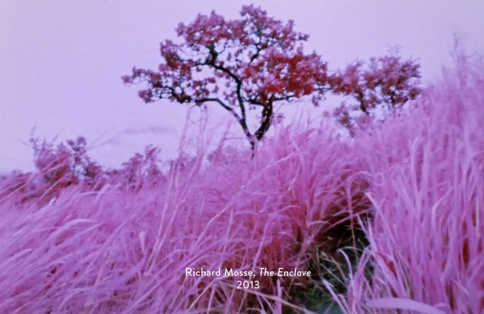
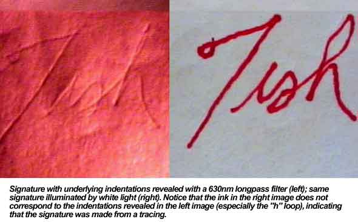
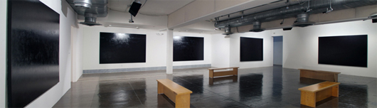
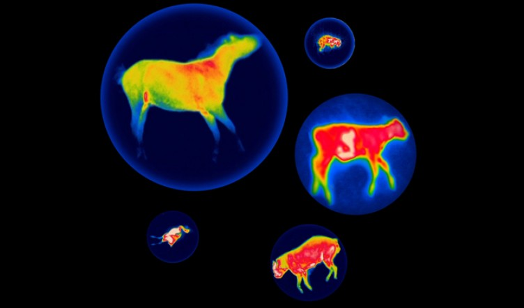
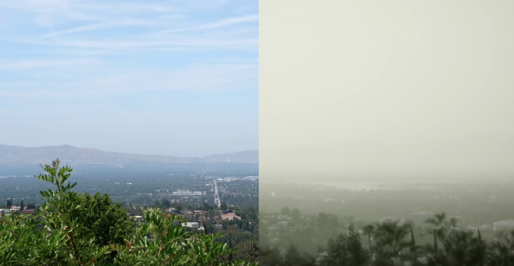

# Multispectral & Hyperspectral Imaging

[*Multispectral imaging*](https://en.wikipedia.org/wiki/Multispectral_image) employs additional channels of electromagnetic radiation beyond human perception, such as infrared (IR), ultraviolet (UV), X-rays, and more. 

[*Hyperspectral imaging*](https://en.wikipedia.org/wiki/Hyperspectral_imaging) attempts to capture the entire reflective or emissive spectrum for every pixel, essentially representing an image with a three-dimensional (x,y,λ) data cube.

This lesson includes a discussion of the following: 

* Overview of Multi/Hyperspectral Imaging
* Near-Infrared (NIR) Imaging
* X-Ray Imaging
* Thermal Imaging
* Thermochromic Imaging
* Ultraviolet (UV) Imaging
* Radar 
* Millimeter Wave & Terahertz Imaging
* CT Scans, MRI, CAT Etc.

In addition, two other imaging techniques, while not properly multi-spectral, deal with unusual properties of light and its transmissive medium: 
* Polarized Light
* Schlieren Photography

Finally, it's not even necessary to image with electromagnetic radiation; let's not forget about sound. 

* Sonar and Ultrasonic Imaging

--- 

### Overview. What does it look like? 

Because the human eye cannot see X-rays, long-wave infrared, ultraviolet light, and so forth, an imaging technology is required to translate energy patterns in these spectra into patterns we can see. The "right" way to visualize such energy patterns is always arbitrary, or, at least, an artifact of the sensing and display technology. 

 
*A face simultaneously imaged in the (a) visible spectrum, 0.4–0.7 µm, (b) short-wave infrared, 1.0–3.0µm, (c) mid-wave infrared, 3.0–5.0µm, and (d) long-wave infrared, 8.0-14.0µm.*

* [An excellent paper on multispectral face recognition](http://www.intechopen.com/books/reviews-refinements-and-new-ideas-in-face-recognition/thermal-infrared-face-recognition-a-biometric-identification-technique-for-robust-security-system)
* [Differences between UV, Vis, NIR (Wikipedia)](https://en.wikipedia.org/wiki/Full-spectrum_photography#/media/File:UV_Vis_IR_Portrait.jpg)
* More [faces viewed in multiple spectra](https://www.flickr.com/photos/rshephorse/4279928945)

--- 

### Some applications

* Satellites employ multispectral imaging to understand the Earth. [Charlie Loyd, Putting Landsat8's multispectral imaging to work.](https://www.mapbox.com/blog/putting-landsat-8-bands-to-work/). For example, here's a false-color Landsat8 image by in which SWIR (thermal) is used in the red channnel; NIR as green; and deep blue as blue:

* Astronomers use multispectral imaging to [understand the Sun](http://www.nasa.gov/images/content/719688main_Sun-Wavelength-Chart_full.jpg). 

* Forensic specialists use infrared and ultraviolet imaging and/or fluorescence to [recover writing lost to water damage](https://people.rit.edu/andpph/photofile-b/ir-letter-comparison-1.jpg), [analyze medieval frescoes](https://artcosnervationcsmodotcom.wordpress.com/category/rti/), [detect fraudulent documents](https://www.fbi.gov/about-us/lab/forensic-science-communications/fsc/oct1999/images/inkglowb.jpg), [determine the provenance of artifacts](https://www.fbi.gov/about-us/lab/forensic-science-communications/fsc/oct1999/images/matchb.jpg), [sort fragments of shredded documents](https://www.fbi.gov/about-us/lab/forensic-science-communications/fsc/oct1999/images/shredb.jpg), [detect underpaintings in famous artworks](http://www.artic.edu/collections/conservation/revealing-picasso-conservation-project/examination-techniques/infrared), [detecting previous versions of artworks (includes web interactive)](http://www.webexhibits.org/pigments/intro/visible.html).

---

### Near-Infrared (NIR) Imaging

Near-infrared is widely used in security cameras. 

* Owing to the different infrared reflectivity of blood, you can [see veins easily](https://www.flickr.com/photos/nebarnix/2034727799) in NIR.

It's important to distinguish between *monochromatic* IR images (a grayscale image whose content is exclusively from the infrared part of the spectrum), and various types of *CIR* (Color+IR) images, which store multiple channels of information from different parts of the spectrum. Since RGB images are a common display format for multichannel image data, one common CIR technique ([described in this PDF](images/using_cir_imagery.pdf)) stores IR information in the Red channel, Red information in the Green channel, and Green information in the Blue channel. Edward Thompson has compiled [an artful book](http://www.edwardthompson.co.uk/theunseen.html) of such images.

Incidentally, the visibility of veins in IR has been used in some medical AR applications, such as the Christie [VeinViewer](http://www.bayareahospital.org/Images/IV_Insertions_Get_Easier_For_Patients.aspx) device. 

It's common for CIR imaging to be used for aerial/satellite photography. Plants, in particular, become much more visible: 

Richard Mosse's *[The Enclave](https://vimeo.com/67115692)* (2013) is a documentary film about the ongoing civil war in Congo, shot on CIR film. 

* In some circumstances, depending on materials, NIR cameras can [kind of see through clothes](http://www.komonews.com/news/problemsolvers/94802064.html). 

* NIR imaging can be used to [detect traced (i.e. forged) signatures](https://www.fbi.gov/about-us/lab/forensic-science-communications/fsc/oct1999/images/tracingb.jpg)

* Osman Khan created a strictly [IR-viewable image](http://www.osmankhan.com/works.asp?name=Unviewed).
* The paintings [*"The Lynching of Leo Frank"*](http://www.oliverlutz.com/oliverlutz_prjct_lfrnk.htm) and [*"Stella at the Playground"*](http://www.oliverlutz.com/oliverlutz_prjct_plygrnd_inst.htm) by Oliver Lutz (2010) use a (visibly) black acrylic overpainting covering a secret image that can only be observed by a NIR security camera and a nearby CCTV. Lutz makes [many projects](http://www.oliverlutz.com/oliverlutz_prjct_nscr.htm) with this IR-clear, visibly-black overpainting. His work appeared in the exhibition [*"Exposed: Voyeurism, Surveillance and The Camera since 1870"*](http://www.walkerart.org/calendar/2011/exposed-voyeurism-surveillance-and-the-camera). 

Hey, here's an [infrared time-lapse](https://vimeo.com/58232705) video by Andrew Shurtleff. 

Here's a BBC [video of elephants, observed in a cave using NIR](https://youtu.be/kqadL9VeJDw).  

---

### X-Ray imaging

#### X-Ray Imaging in the Arts

* This is a stunning new project by Cohen+Van Balen: [Infrastructres of Natural History](http://www.cohenvanbalen.com/work/infrastructures-of-natural-history), X-rays of taxidermied animals:

* [X-ray portraits by Ayako Kanda and Mayuka Hayashi](http://www.boredpanda.com/x-ray-couple-portraits-ayako-kanda-mayuka-hayashi/)

* [*Lick* by Wim Delvoye](http://curiator.com/art/wim-delvoye/lick-1)

* [*Pinup Calendar* by German ad firm, BUTTER](http://www.themarysue.com/x-ray-pin-up-calendar/)

* [Xograms, by Hugh Turvey](http://www.smithsonianmag.com/arts-culture/x-ray-art-deeper-look-everyday-objects-180949540/?no-ist)

* [*X-Ray Photographic Art* (Survey)](http://www.theapricity.com/forum/showthread.php?147702-X-Ray-Photographic-Art-Seeing-Humans-Nature-Objects-Beneath-The-Surface)

It is also possible to design or arrange objects for the express purpose of having them discovered in X-Ray images.

* Evan Roth, *TSA Interventions*

* Arguably some of these people have done so. ([X-ray insertions](https://www.google.com/search?q=X-ray+insertions&tbm=isch))

---

### Thermal Imaging 

*Thermal imaging* senses light wavelengths in the range of ~8000-14000 nanometers, also called *long wave infrared*, which corresponds to what we experience as *heat*. Interestingly, most of what we see when we observe radiation in this range is *emissive* rather than *reflective*. In short, we see where something is hot. 

* David Attenborough discusses the use of thermal imaging to understand lizard temperature self-regulation, in [this BBC video](https://youtu.be/e4bprBup6w4)

* A cult classic, [*THE OPERATION*](https://vimeo.com/24149525) by Jacob Pander and Marne Lucas (1995) is a hybrid art/porn movie, shot completely with a thermal camera. (NSFW)

* [Route 94: *My Love*](https://vimeo.com/84702235) is a much more recent music video with much the same idea. 

* Terike Haapoja's [*Community* (2007)](http://www.av-arkki.fi/en/works/community_en/) presents thermal videos of animals which have just died. We see the heat leaving their bodies. 

* [This Photographer Shoots Portraits With a Thermal Camera](http://www.smithsonianmag.com/science-nature/this-photographer-shoots-portraits-with-a-thermal-camera-1437109/)
  * [Linda Alterwitz 1](http://www.lindaalterwitz.com/thermal_portrait.html)
  * [Linda Alterwitz 2](http://www.lindaalterwitz.com/thermal_core.html)

Note that there is no "correct" way to view thermal imagery. Cameras offer a variety of different spectra for mapping their temperature ranges, including grayscale, black-body, chromatic (blue = cold), etc. 

Sometimes simply presenting such alternative views can be a provocative, entertaining or educational experience for audiences. 

* Many science museums, such as the Exploratorium, have a "[Heat Camera](http://exs.exploratorium.edu/exhibits/heat-camera/)" display in which the public can see themselves in a thermal camera.

* [*City Thermogram*](http://thecreatorsproject.vice.com/blog/times-square-is-a-heat-sensitive-camera-thanks-to-peggy-ahwesh), by Peggy Ahwesh (2015), was commissioned to create a live-video installation in New York's Time Square, in which she connected up a thermal camera (trained on passersby) to a large electronic billboard.

* Google has recently made [satellite thermal imaging of roofs](http://mashable.com/2015/08/20/google-house-solar/?utm_cid=mash-com-fb-main-link) available to the public, to prompt people's awareness about the  heat inefficiency of their homes.

* Thermal video was also useful in [visualizing the Porter Ranch methane leak](https://www.youtube.com/watch?v=Jt_DffiFoTY). 

---

### Thermochromic Imaging

Some substances temporarily change color in response to heat. In different contexts, thermochromic pigments can work as a capture technology or a display technology. 

* Jay Watson's *[Thermochromic Table](http://www.fubiz.net/en/2014/02/21/thermochromic-table/)* (2011) reveals where and how people have sat at the furniture. 

* The *[Temperature Sensitive Object](http://www.mascontext.com/wp-content/uploads/2011/12/12_game_ornaments_09.jpg)* chair (2001) by Orléans-based design group, Archilab, is similar. 

* The revelatory potential of this technology is directly connected to considerations of mammalian territory-marking behavior in this *[thermochromic toilet seat](http://theluxuryofprotest.com/Thermochromic_Toilet_Seat.html)* and this remarkable *[thermochromic urinal](http://www.technocrazed.com/wp-content/uploads/2014/08/New-Thermochromic-Furniture-And-Pots-11.jpg)*

* Dutch artist [Carina Hesper](http://carinahesper.nl) has created a book, *[Like a Pearl in My Hand](http://www.carinahesper.nl/#!visually-impaired)*, in which portrait photographs have been overprinted with thermochromic coating. The reader of the book must interactively reveal the underlying photographs 

---

### Ultraviolet (UV) Imaging 

* [The World In UV](https://www.youtube.com/watch?v=V9K6gjR07Po), an excellent overview video. Discusses atmospheric haze, sunscreen, quinine, flowers, polar bears.

#### Ultraviolet animal vision and markings. 

Many animals [appear different, and can see in the ultraviolet](http://www.theatlantic.com/technology/archive/2011/08/6-animals-that-can-see-or-glow-in-ultraviolet-light/243634/). For example, 

* Butterflies are thought to have the widest visual range of any animal. Butterflies can use ultraviolet markings to find healthier mates. Ultraviolet patterns also help certain species of butterflies appear similar to predators, while differentiating themselves to potential mates.
* Reindeer rely on ultraviolet light to spot lichens that they eat. They can also easily spot the UV-absorbent urine of predators among the UV-reflective snow.
* One bird species was found to feed its young based on how much UV the chicks reflected.
* Some species of birds use UV markings to tell males and females apart.
* The flower Black-eyed Susans have petals that appear yellow to humans, but UV markings give them a bull's eye-like design that attracts bees.
* Sockeye salmon may use their ultraviolet perception to see food.
Scorpions glow under ultraviolet light, but scientists do not know why.

* [Kestrels can see in the UV](https://youtu.be/AUm-TabNFF0), which helps them find prey. 

* Scorpions glow in Ultraviolet. 

* [Spectra of different species' vision](https://fieldguidetohummingbirds.files.wordpress.com/2008/11/spectrum.jpg).

* [Birds & bees' UV vision](http://www.nature.com/scitable/blog/the-artful-brain/alternate_realities)

UV is also [widely used in forensics](http://ultravioletcameras.com/applications/longwave-ultraviolet-forensics-imaging-applications/). 

#### Artworks using UV

* [UV video overview by Thomas Leveritt](https://www.youtube.com/watch?v=o9BqrSAHbTc)

* [UV portraits by Cara Phillips](http://www.theguardian.com/artanddesign/gallery/2012/aug/03/ultraviolet-beauties-cara-phillips-photographs)

#### UV imaging in practice

* [UV-pass, visible-cut filters](http://www.savazzi.net/photography/baader_u.htm) are available. 
* It is also relatively inexpensive to have a [Canon SLR permanently converted for UV](http://www.lifepixel.com/shop/ultraviolet-camera-conversion/canon-dslr-uv-camera-conversion). 
* It is [worth pointing out](http://www.savazzi.net/photography/uv.htm) that UV & NIR photography also benefit from using [special lenses](http://www.savazzi.net/photography/coastalopt_60.html) which better focus these wavelengths. 
* Of course, [dedicated UV cameras](http://www.edmundoptics.com/cameras/nir-uv-cameras/sony-xc-e-series-monochrome-ccd-cameras/56346/) also exist. 

---
### Radar

[From [Wikipedia](https://en.wikipedia.org/wiki/Radar)] **Radar** is an object-detection system that uses radio waves to determine the range, angle, or velocity of objects. It can be used to detect aircraft, ships, spacecraft, missiles, motor vehicles, weather formations, and terrain. A radar transmits radio waves or microwaves that reflect from any object in their path. 

 

**Marine radar** is surprisingly inexpensive and produces fascinating images of the world, allowing (for example) imaging of nearby whales. Devices such as the [Furuno 1623](http://www.thegpsstore.com/Furuno-1623-22-kw-Radar-P125.aspx) or Furuno DRS4W systems cost under $1500. 

 *(Image from [here](http://www.malags.com/getattachment/Innovation/GPR-Explained/MALA-GPR-principle.jpg)).*

**Ground-penetrating radar** images features such as underground pipes. Speak to the professor if you're interested in this; we have a contact at Pittsburgh-area providers, [Geospatial Corporation](http://www.geospatialcorporation.com/).

--- 
### And Beyond...

#### Seeing through Walls with Radio & ML

[RF-Pose](https://www.youtube.com/watch?v=HgDdaMy8KNE) by researchers at MIT CSAIL

#### Millimeter Wave & Terahertz Imaging

This is the stuff that *really* sees through clothing. 

* [Millimeter wave scanners](https://en.wikipedia.org/wiki/Full_body_scanner#Controversies), also called backscatter imaging, are used by the TSA 
* [Terahertz imagers](http://www.stamparein3d.it/wp-content/uploads/2015/04/Lenti-a-Onde-THZ-05.jpg), which operate around 300 micrometers.

Indeed, it can see through [more than just clothing](http://www.propublica.org/article/drive-by-scanning-officials-expand-use-and-dose-of-radiation-for-security-s). 

 
*"Treating people like luggage"*

#### CT Scans, MRI, CAT etc. 

X-ray computed tomography (X-ray CT) and magnetic resonance imaging (MRI) and are medical imaging techniques that employ significant computation to produce 3D models of internal body structures and activities. Perhaps if you have a good reason, you can get a scan of yourself at the hospital. 

 
*Kyle McDonald experimenting with some of his own CT scan data in openFrameworks.*

 [CT scan by Scott Echols](https://www.theguardian.com/science/2017/mar/05/wellcome-image-awards-2017-shortlist-science-visions-photography) capturing tiny blood vessels in the head of a pigeon, created by a special ‘contrast agent’ to highlight the microvasculatory system. 

---

### Polarized Light

Polarization is a property of light which describes, not its frequency or wavelength, but the orientation of the spatial plane in which its waves are traveling. It is useful in visualizing several phenomena which cannot otherwise be seen by the human eye. 

 
Polarized light eliminates reflections. Here, a circular polarizer eliminates reflections on water, making another world visible beneath. From ["Removing Glare with a Circular Polarizer"](https://nicolesyblog.com/2014/07/24/removing-glare-with-a-circular-polarizer-filter/), which includes a nice [video](https://www.youtube.com/watch?v=ZC6DNx0F1o0). 

By computing the difference between images of scenes taken with and without polarizations, it's possible to cleave the diffuse appearance of an object from its specular appearance. The images below, taken from "[How To Split Specular And Diffuse In Real Images](http://filmicgames.com/archives/233)", show how this can be done. The first image is the 'regular' appearance, and then (through image differencing) the diffuse-only and specular-only images. 

 
 
 

You can see this technique applied to a human face in [this video](https://www.youtube.com/watch?v=piJ4Zke7EUw) of the photoreal Digital Emily Project.

Incidentally, there are some [other very clever ways of separating specular from diffuse appearances](http://www.mit.edu/~yzli/ECCV02-Sep.pdf) of objects.

[More information about polarized light](https://www.youtube.com/watch?v=CSu0cV3fqi8) in this video from PBS:

#### Transmissive Polarized Light: Visualizing Stress

Polarized light can also reveal internal stresses in (clear) materials, in a phenomenon known as [*photoelasticity*](https://en.wikipedia.org/wiki/Photoelasticity). Here's a plastic ruler between cross-polarized filters:

 

 
Here's the setup to achive this. More information can be found at (e.g.) [Andrew Davidhazy's site](https://people.rit.edu/andpph/text-polarizer-by-glare.html). 

Some nice videos of polarization and stress visualization:
* [https://www.youtube.com/watch?v=3QBGgypAjkY](https://www.youtube.com/watch?v=3QBGgypAjkY)
* [https://www.youtube.com/watch?v=gP751qpm4n4](https://www.youtube.com/watch?v=gP751qpm4n4)
* [https://www.youtube.com/watch?v=7YaoSODkymc](https://www.youtube.com/watch?v=7YaoSODkymc)

---

### Schlieren Photography

Schlieren photography creates images which reveal, and depend on, minute differences in the index of refraction of air. In short, it depends not on a property of light, but on a property of light's medium. 

[Schlieren photography](https://www.youtube.com/watch?v=mLp_rSBzteI)

--- 
### Sonar and Ultrasound

It's well-known that bats and dolphins image the world through ultrasonic reflections. 

But were you aware of *human echolocation*? Here are three different individuals, who despite being blind are able to map a detailed mental plan of their surroundings:
* [Ben Underwood](https://www.youtube.com/watch?v=Wby1CIhnYWI)
* [Sam](https://www.youtube.com/watch?v=zXtExOMCDfE)
* [Daniel](https://www.youtube.com/watch?v=2IKT2akh0Ng)

Of course, there are also *devices* for sonar imaging. You are probably familiar with ultrasonic fetal imaging. 2D is more common, but recently 3D ultrasound has become available. 

 

It has become popular in Japan to [3D-print copies of the unborn](http://microfabricator.com/articles/view/id/54cc021d313944ec4a8b456c/unborn-babies-come-to-life-through-new-full-color-ultrasound-3d-printing-service). 

 

Sonar can also be used to image *environments* in both 2D and 3D. Using equipment such as [this](http://www.blueview.com/products/3d-multibeam-scanning-sonar/3/), for example, people investigate and discover seafloor shipwrecks. 

 

