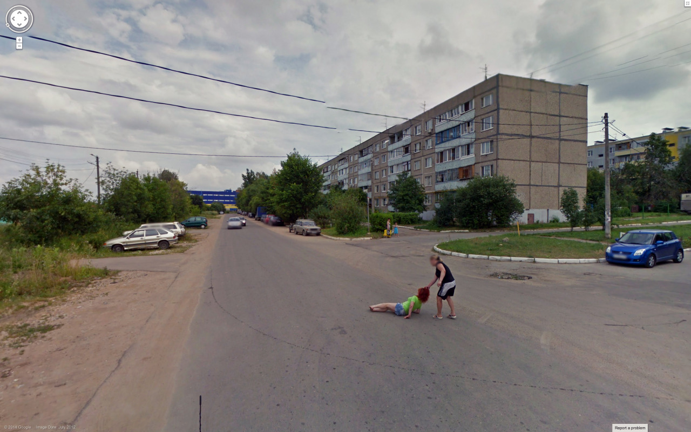
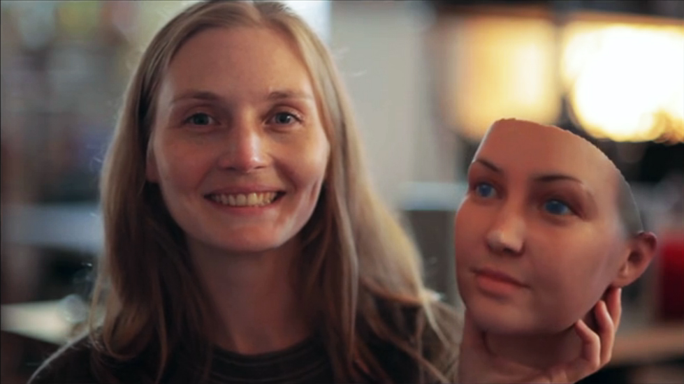

# Some Inspirations

---

### Westinghouse Works, 1904

[Westinghouse Works, 1904](https://lightcone.org/en/film-5890-westinghouse-works-panorama-views)

---

[James George at Eyeo 2015](https://vimeo.com/134973504) (from 7:34, "Camera of the Future") 

---

### Eye Formation in Cheese

Tomography and [Holes in Swiss Cheese](https://www.nytimes.com/2015/05/29/world/europe/switzerland-scientists-find-the-secret-to-the-holes-in-swiss-cheese-hay-dust.html); "Mechanism and control of the eye formation in cheese" [paper](https://scinapse.io/papers/2024396341), [paper](https://link.springer.com/article/10.1007/s13594-012-0105-2), e.g. ["There is demand for non‐destructive monitoring of eye formation in cheese during ripening."](https://onlinelibrary.wiley.com/doi/abs/10.1111/j.1471-0307.2009.00478.x), [[PDF](docs/pdf/eye-formation-in-cheese.pdf)]

---

### The Visual Microphone

[The MIT visual microphone](https://www.youtube.com/watch?v=FKXOucXB4a8)

---

### Marcus Coates, *Dawn Chorus*

* Marcus Coates, [*Dawn Chorus* (2007)](https://www.youtube.com/watch?v=enpuy1WLezY)
* [Original audio](http://audio.theguardian.tv/sys-audio/Arts/Culture/2007/01/24/yellowhammerfinal.mp3) (MP3)
* [Original audio](sounds/dawn_chorus_original_yellowhammer_audio.mp3) (MP3)

---

### Samantha Taylor-Johnson, *A Little Death*

Samantha Taylor-Johnson (also known as Sam Taylor-Wood) has created some exceptional time-lapse still-lifes which make heavy reference to the history of painting, such as [*A Little Death*](https://www.youtube.com/watch?v=NYka4ouQXqk) (2002):

---
### Bill Viola, *The Raft*

[High-speed recordings of composed tableaus.](https://www.youtube.com/watch?v=uFCKSccanSI) 

---

### Adam Magyar, *Stainless*

High-speed recordings of people on subway platforms,
such as [*Stainless, 42 Street*](https://vimeo.com/83664407):
  

---

### Steve Giralt, *Deconstructed Burger*

[Burger assembly and documentation system](https://vimeo.com/178939743):

---

### Evan Roth et al., *White Glove Tracking*

[*White Glove Tracking*](http://whiteglovetracking.com/) project by Evan Roth and Ben Engebreth, et al., e.g.: [Zach Lieberman for White Glove Tracking](https://youtu.be/jrktgrUPxjo) or at their [gallery](http://whiteglovetracking.com/gallery.html)

---
### Zbig Rybczynski, *Media*

[Zbig Rybczynski, *Media*](https://vimeo.com/71936364)

---

### Wonbin Yang, *Abandoned memories*

"A video made with the reconstructed but damaged jpeg images from the computer I got from the thrift store." [Abandoned Memories](https://www.instagram.com/tv/Cgc9ZG6FRHo/?igshid=YmMyMTA2M2Y%3D)

---

### Cassandra C. Jones, *Eventide*

*[Eventide](https://vimeo.com/84883569)* (2004) represents a single object — the Sun — constructed from hundreds of photos by different people. The full video shows a complete sunset.

---

### Trevor Paglen

Trevor Paglen [uses photography to reveal secret sites and satellites](https://www.youtube.com/watch?v=9Igfu0VwdkQ) as a mode of artistic practice. Trevor is "a guy who points his camera through astronomy telescopes at secret military sites to photograph things that are off limits to the public." To produce his work, he designs photographic processes using astronomy telescopes.

---

### Berg, *Light Painting WiFi*

[Berg: *Immaterials: Light Painting WiFi*](https://vimeo.com/20412632) 

---

### Timo Arnall, *Robot Readable World*

Timo Arnall, [*Robot Readable World*](https://vimeo.com/36239715) 

---

### Corneal Imaging

Images of what someone is looking at can be recovered from reflections in their eyes. See: Ko Nishino et al., ["Corneal Imaging System: Environment from Eyes". ](http://www1.cs.columbia.edu/CAVE/publications/pdfs/Nishino_IJCV06.pdf)

[Corneal imaging](http://www1.cs.columbia.edu/CAVE/projects/world_eye/)

---

### FlatCam, a lensless camera

[A lensless camera](https://www.youtube.com/watch?v=BdgwO_i5p54)

---

### Jon Rafman, *The Nine Eyes of Google Street View*

In *The Nine Eyes of Google Street View*, Canadian artist Jon Rafman collects the bizarre and beautiful sights captured by the Google streetview. There's no need to take new photos; one can just find them. [*The 9 Eyes of Google Streetview*](http://9-eyes.com/)

---

### Aertryck & Danielson, *Ten Meter Tower*

[Maximilien van Aertryck and Axel Danielson, *Ten Meter Tower*](https://www.nytimes.com/2017/01/30/opinion/ten-meter-tower.html) (2017)

> "*Our objective in making this film was something of a psychology experiment: We sought to capture people facing a difficult situation, to make a portrait of humans in doubt. We’ve all seen actors playing doubt in fiction films, but we have few true images of the feeling in documentaries. To make them, we decided to put people in a situation powerful enough not to need any classic narrative framework. A high dive seemed like the perfect scenario.*"

--- 

### Heather Dewey-Hagborg, *Stranger Visions*

Regarding Heather Dewey-Hagborg's tour-de-force [*Stranger Visions*](http://deweyhagborg.com/projects/stranger-visions) (2013), the artist writes:

> In *Stranger Visions* I collected hairs, chewed up gum, and cigarette butts from the streets, public bathrooms and waiting rooms of New York City. I extracted DNA from them and analyzed it to computationally generate 3d printed life size full color portraits representing what those individuals might look like, based on genomic research. Working with the traces strangers unwittingly left behind, the project was meant to call attention to the developing technology of forensic DNA phenotyping, the potential for a culture of biological surveillance, and the impulse towards genetic determinism. [*Video*](https://www.youtube.com/watch?v=o5ijy2xboZs)



