# Some Inspirations

---

### Eye Formation in Cheese

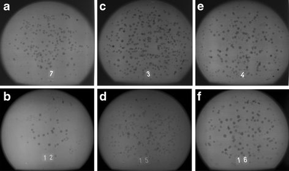

Tomography and [Holes in Swiss Cheese](https://www.nytimes.com/2015/05/29/world/europe/switzerland-scientists-find-the-secret-to-the-holes-in-swiss-cheese-hay-dust.html); "Mechanism and control of the eye formation in cheese" [paper](https://scinapse.io/papers/2024396341), [paper](https://link.springer.com/article/10.1007/s13594-012-0105-2), e.g. ["There is demand for non‐destructive monitoring of eye formation in cheese during ripening."](https://onlinelibrary.wiley.com/doi/abs/10.1111/j.1471-0307.2009.00478.x), [[PDF](docs/pdf/eye-formation-in-cheese.pdf)]

---

### The Visual Microphone

[The MIT visual microphone](https://www.youtube.com/watch?v=FKXOucXB4a8)

[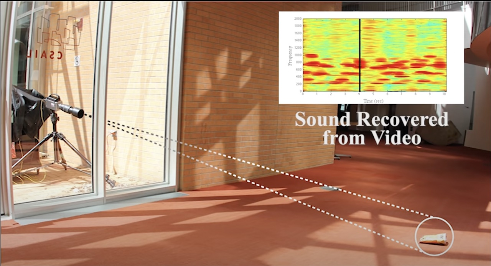](https://www.youtube.com/watch?v=FKXOucXB4a8)

---

### Marcus Coates, *Dawn Chorus*

* Marcus Coates, [*Dawn Chorus* (2007)](https://www.youtube.com/watch?v=enpuy1WLezY)
* [Original audio](http://audio.theguardian.tv/sys-audio/Arts/Culture/2007/01/24/yellowhammerfinal.mp3) (MP3)
* [Original audio](sounds/dawn_chorus_original_yellowhammer_audio.mp3) (MP3)

---

### Samantha Taylor-Johnson, *A Little Death*

Samantha Taylor-Johnson (also known as Sam Taylor-Wood) has created some exceptional time-lapse still-lifes which make heavy reference to the history of painting, such as [*A Little Death*](https://www.youtube.com/watch?v=NYka4ouQXqk) (2002):

[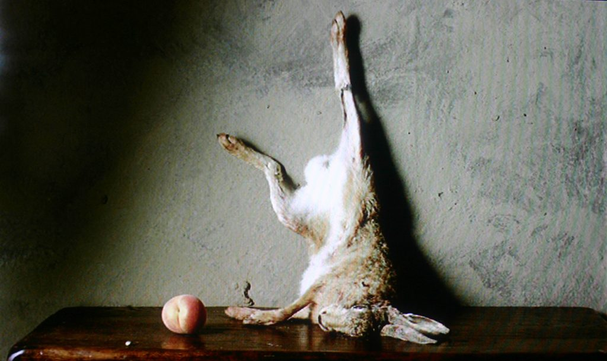](https://www.youtube.com/watch?v=NYka4ouQXqk)

---

### Adam Magyar, *Stainless*

High-speed recordings of people on subway platforms,
such as [*Stainless, 42 Street*](https://vimeo.com/83664407):
  
[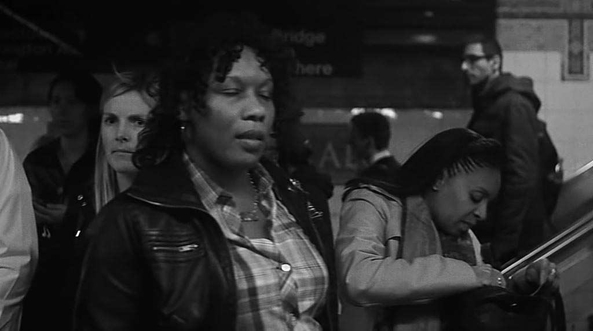](https://vimeo.com/83664407)

---

### Evan Roth et al., *White Glove Tracking*

[*White Glove Tracking*](http://whiteglovetracking.com/) project by Evan Roth and Ben Engebreth, et al., e.g.: [Zach Lieberman for White Glove Tracking](https://youtu.be/jrktgrUPxjo) or at their [gallery](http://whiteglovetracking.com/gallery.html)

[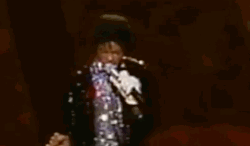](https://youtu.be/jrktgrUPxjo)

---

### Wonbin Yang, *Abandoned memories*

"A video made with the reconstructed but damaged jpeg images from the computer I got from the thrift store." [Abandoned Memories](https://www.instagram.com/tv/Cgc9ZG6FRHo/?igshid=YmMyMTA2M2Y%3D)

[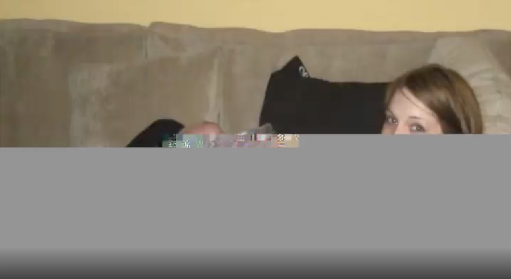](https://www.instagram.com/tv/Cgc9ZG6FRHo/?igshid=YmMyMTA2M2Y%3D)

---

### Cassandra C. Jones, *Eventide*

*[Eventide](https://vimeo.com/84883569)* (2004) represents a single object — the Sun — constructed from hundreds of photos by different people. The full video shows a complete sunset.

[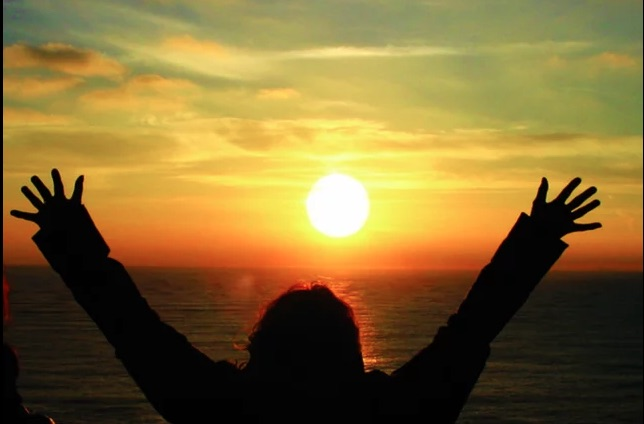](https://vimeo.com/84883569)

---

### Berg, *Light Painting WiFi*

[Berg: *Immaterials: Light Painting WiFi*](https://www.youtube.com/watch?v=cxdjfOkPu-E) 
[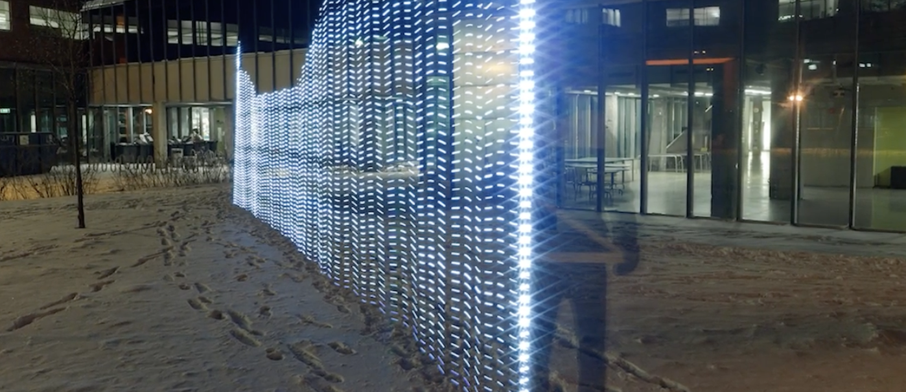](https://www.youtube.com/watch?v=cxdjfOkPu-E)

---

### Timo Arnall, *Robot Readable World*

Timo Arnall, [*Robot Readable World*](https://www.youtube.com/watch?v=cxdjfOkPu-E) 
[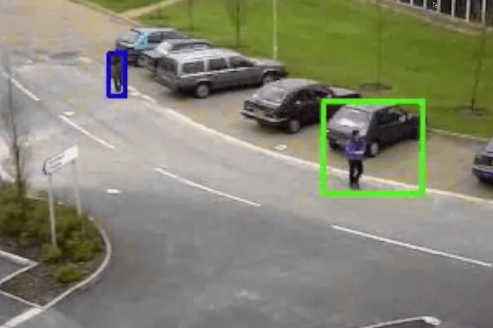](https://www.youtube.com/watch?v=cxdjfOkPu-E)

---

### Corneal Imaging

Images of what someone is looking at can be recovered from reflections in their eyes. See: Ko Nishino et al., ["Corneal Imaging System: Environment from Eyes". ](http://www1.cs.columbia.edu/CAVE/publications/pdfs/Nishino_IJCV06.pdf)

[Corneal imaging](http://www1.cs.columbia.edu/CAVE/projects/world_eye/)
[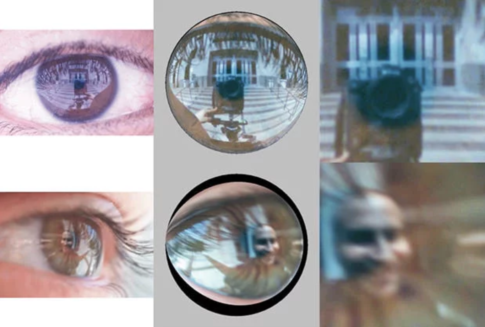](http://www1.cs.columbia.edu/CAVE/projects/world_eye/)

---

### Jon Rafman, *The Nine Eyes of Google Street View*

In *The Nine Eyes of Google Street View*, Canadian artist Jon Rafman collects the bizarre and beautiful sights captured by the Google streetview. There's no need to take new photos; one can just find them. [*The 9 Eyes of Google Streetview*](http://9-eyes.com/)

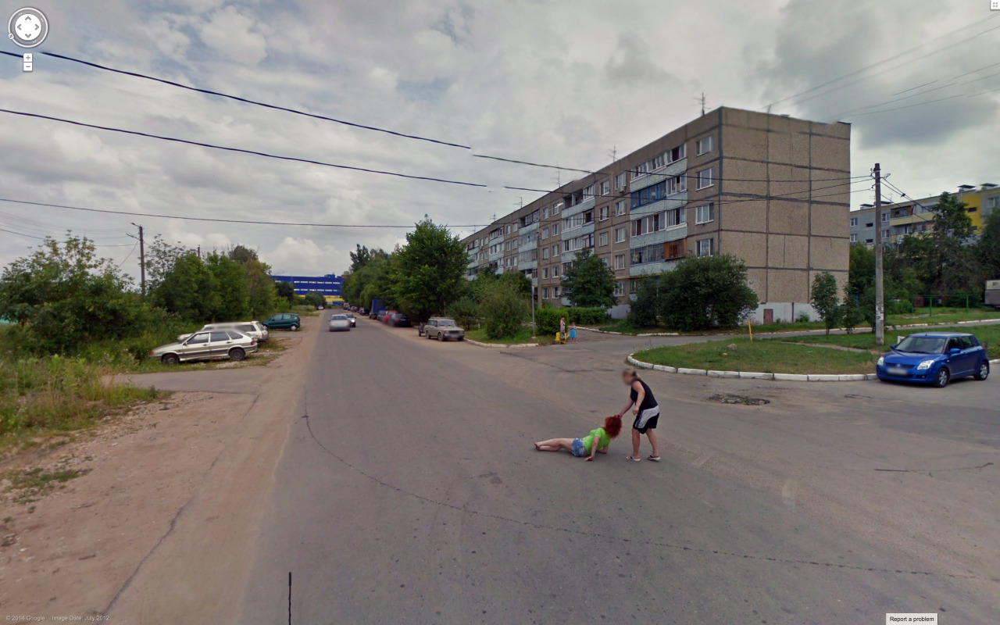

---

### Aertryck & Danielson, *Ten Meter Tower*

[Maximilien van Aertryck and Axel Danielson, *Ten Meter Tower*](https://www.nytimes.com/2017/01/30/opinion/ten-meter-tower.html) (2017)

> "*Our objective in making this film was something of a psychology experiment: We sought to capture people facing a difficult situation, to make a portrait of humans in doubt. We’ve all seen actors playing doubt in fiction films, but we have few true images of the feeling in documentaries. To make them, we decided to put people in a situation powerful enough not to need any classic narrative framework. A high dive seemed like the perfect scenario.*"

[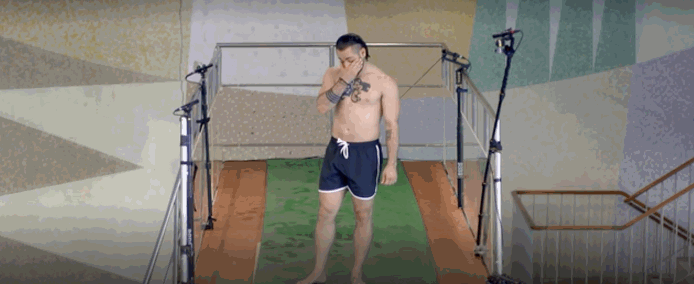](https://www.youtube.com/watch?v=cU2AvkKA4kM)

