#Long Exposure and Light Painting

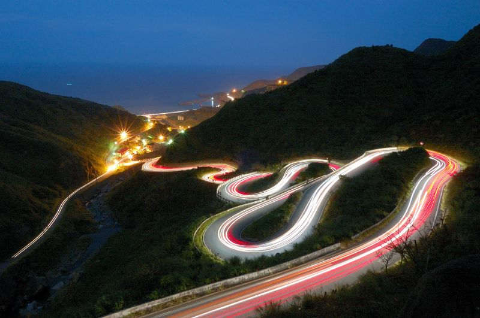

Long exposure is an ideal technique for visualizing trajectories, gestures and other movements. *Technically*, we can accomplish long exposures through techniques such as: 

* An actual long exposure, i.e. controlling shutter timing on a DSLR
* Custom software and other scripts which blend adjacent frames
* iPhone apps, etc.

Many terrific examples of long-exposure photography can be found in Nicholas Felton's new book, [*PhotoViz*](http://usshop.gestalten.com/photoviz.html), and are discussed in [this terrific lecture at Webstock '15](https://vimeo.com/122852255). Felton speaks about how "the intersection of photography and data visualization is a place where optical techniques reveal complex phenomena and data viz starts to resemble a photographic process."

[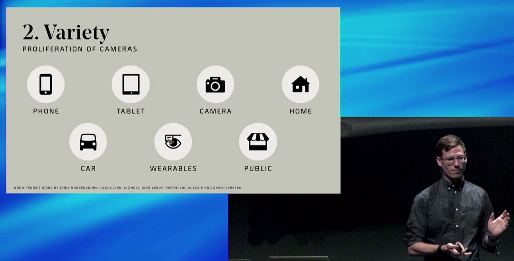](https://vimeo.com/122852255)

--

### For viewing and consideration: Nature

* [David Rokeby, *Plot Against Time*](http://www.davidrokeby.com/PlotAgainstTime.html) (Pedestrians, Fireflies, Birds, etc.)

[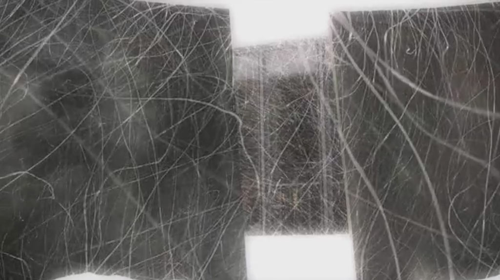](http://www.davidrokeby.com/PlotAgainstTime.html)

* [Long Exposure Photographs of Gold Fireflies in Japan](http://www.thisiscolossal.com/2011/12/stunning-time-lapse-photographs-of-gold-fireflies-in-japan/)

[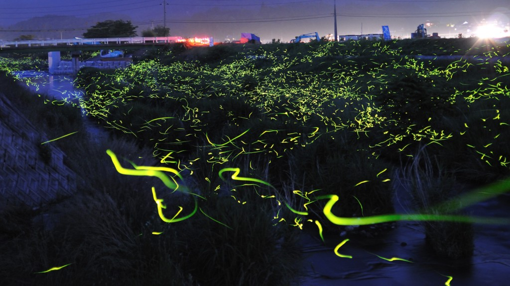](http://www.thisiscolossal.com/2011/12/stunning-time-lapse-photographs-of-gold-fireflies-in-japan/)

* [Vincent Brady, *Fireflies (Backyard Bioluminescence)*](http://www.vincentbrady.com/fireflies)

[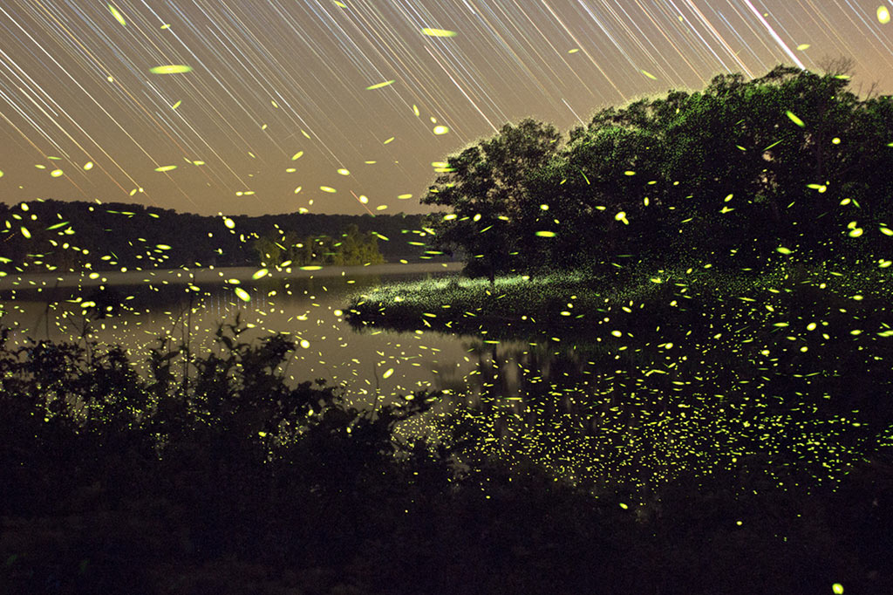](http://www.vincentbrady.com/fireflies)

* [Dennis Hlynsky, *Starlings in Flight*](https://aeon.co/videos/starlings-in-flight-sketch-entrancing-abstract-patterns-across-an-autumn-sky)
* [Dennis Hlynsky: *Ground Cloud*, Long Exposure Photographs of Birds](https://vimeo.com/149022523)

[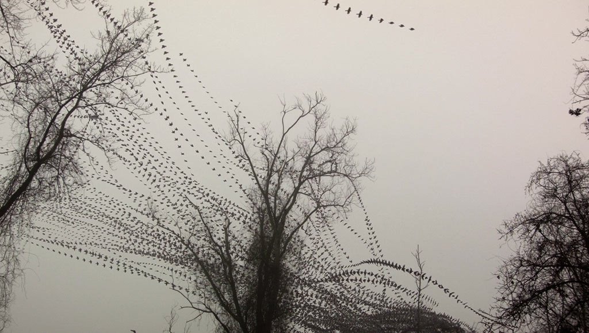](https://vimeo.com/149022523)

--

### Machines and Signals

* [Terence Chang, long exposure photos of airplane takeoffs](http://www.amusingplanet.com/2011/05/long-exposure-shots-of-airline-takeoffs.html)

[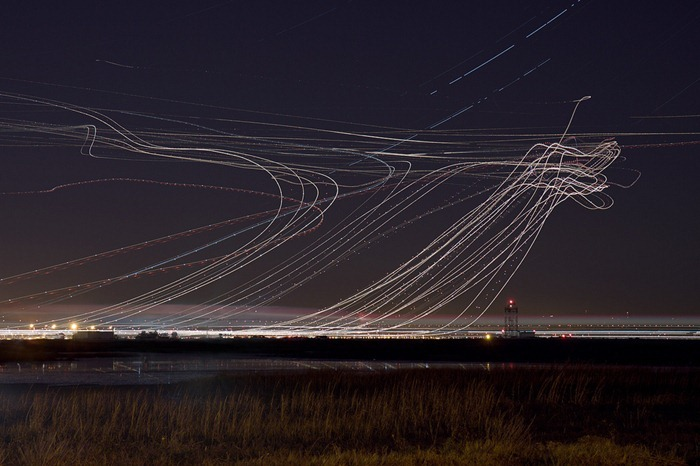](http://www.amusingplanet.com/2011/05/long-exposure-shots-of-airline-takeoffs.html)

* [Berg+Dentsu, *Making Future Magic* (iPad Light Painting, 2010)](https://vimeo.com/14958082)

[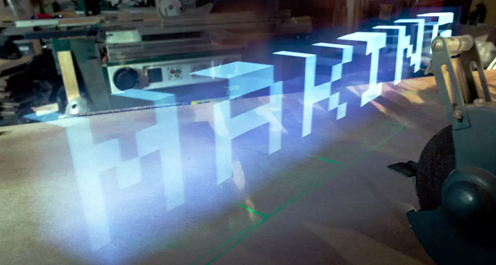](https://vimeo.com/14958082)

* [Berg: *Immaterials: the ghost in the field*](https://vimeo.com/7022707)

[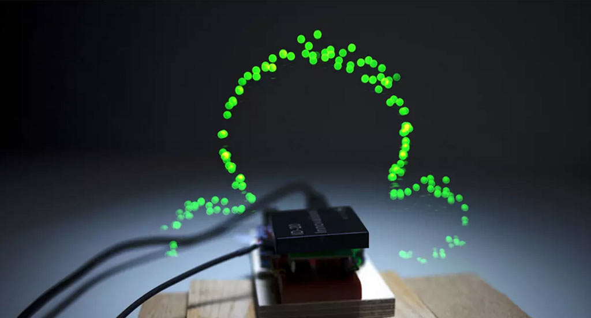](https://vimeo.com/7022707)

* [Berg: *Immaterials: Light painting WiFi*](https://vimeo.com/20412632)

[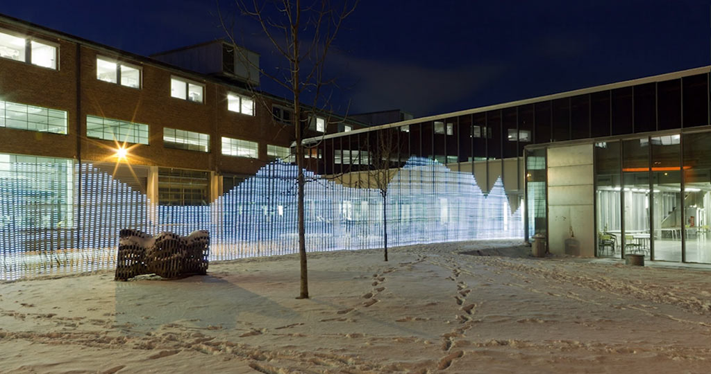](https://vimeo.com/20412632)

--

### The Body

* Pedestrians in *Plot Against Time* by David Rokeby: 

[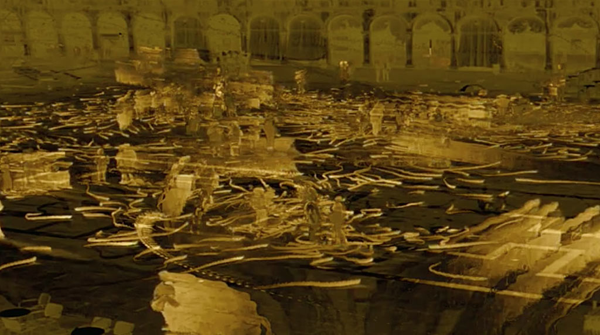](http://www.davidrokeby.com/PlotAgainstTime.html)

* [Croix Gagnon and Frank Schott, *12:31*. (iPad Light Painting, 2011)](http://www.project1231.com/)

[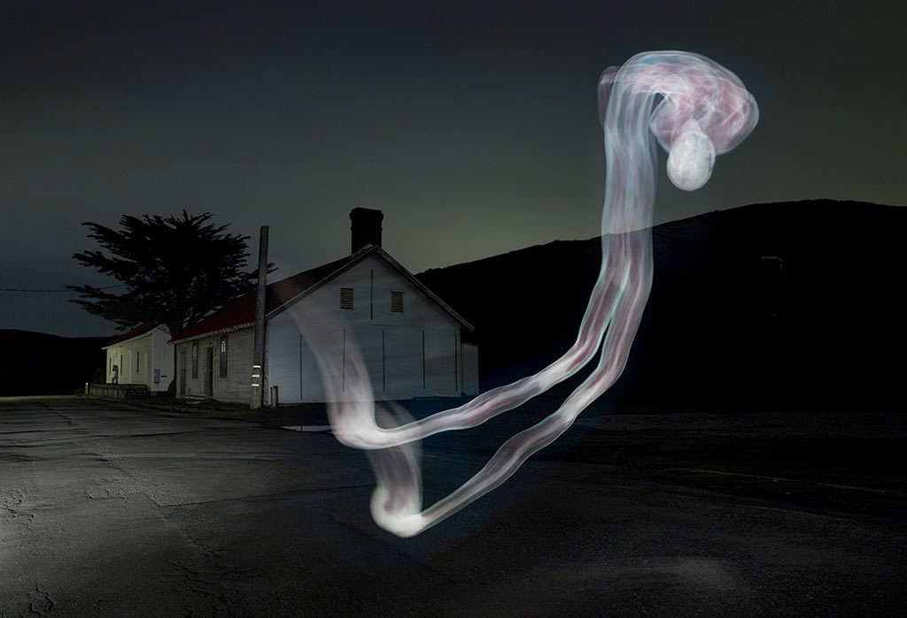](http://www.project1231.com/)

* [Shinichi Maruyama, *Nudes*](http://www.shinichimaruyama.com/)

* [Olivier Gondry (dir.) for Tiga, *You Gonna Want Me*](https://www.youtube.com/watch?v=b7IJVdBecqQ): long exposure bullet time. 

[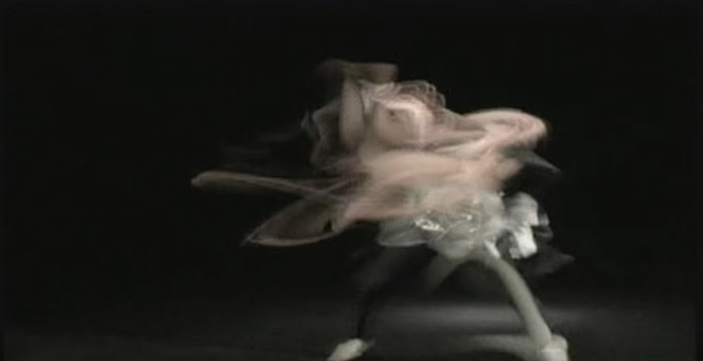](https://www.youtube.com/watch?v=b7IJVdBecqQ)