# Long Exposure and Light Painting

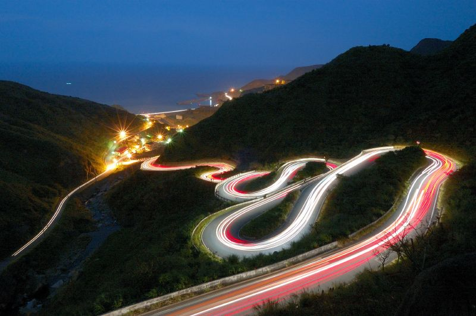

Long exposure is an ideal technique for visualizing trajectories, gestures and other movements. *Technically* long exposures are accomplished through two main techniques:

* An actual single long exposure, i.e. controlling the timing of a shutter on a physical sensor or piece of light-sensitive film
* Apps and other scripts which sum and/or blend multiple consecutive frames of video.

### For Further Reference

* A good history and technical overview of light-painting is available at [https://lightpaintingphotography.com/](https://lightpaintingphotography.com/)
* Many terrific examples of long-exposure photography can be found in Nicholas Felton's book, [*PhotoViz*](https://www.amazon.com/dp/3899556453), and are discussed in [this 2016 lecture](https://www.youtube.com/watch?v=aRg1PxDRL5o&t=580s) (9'40"–17'20"). Felton speaks about how "the intersection of photography and data visualization is a place where optical techniques reveal complex phenomena and data viz starts to resemble a photographic process."

[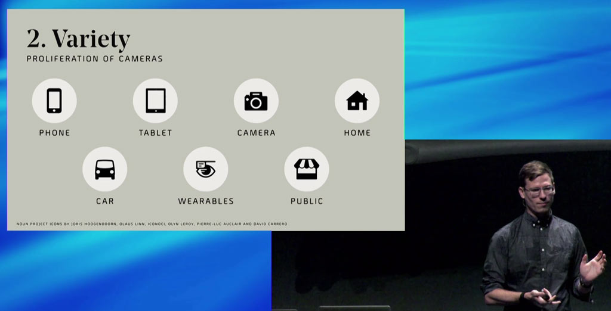](https://www.youtube.com/watch?v=aRg1PxDRL5o&t=580s)

---

## Key Examples

Owing to the slow speed of early photographic chemicals, nearly every image made in the first half-century of photography was already a long-exposure by necessity. But the invention of the electric light (~1870s) allowed for a degree of *contrast* which opened the doors to totally new types of long-exposure imaging — especially as a "chronophotographic" method to understand human movement. 

An important early example of this was Etienne-Jules Marey's 1883 motion capture suit, which used *pulsed* electric light during long-exposure photographs. Marey had been hired by the French Government to develop new exercises for soldiers, following France's defeat in the Franco-Prussian war.  

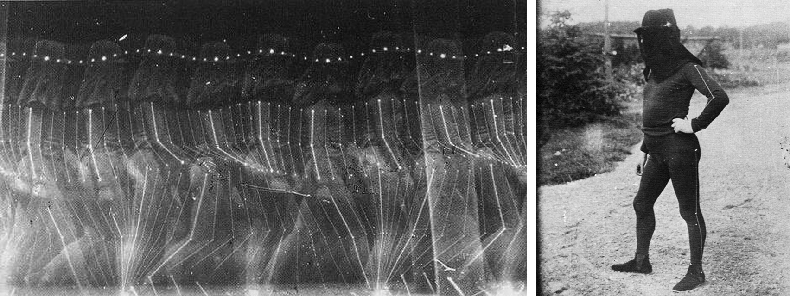

In 1914, to support the US effort in World War I, 
Lillian and Frank Gilbreth made long-exposures of lights attached to human bodies, i.e. light painting. They used this "chronocyclegraph" to conduct "Motion Efficiency Studies", with the goal of reducing repetitive work cycles (such as cleaning a rifle) to their shortest and most efficient sequence of gestures:

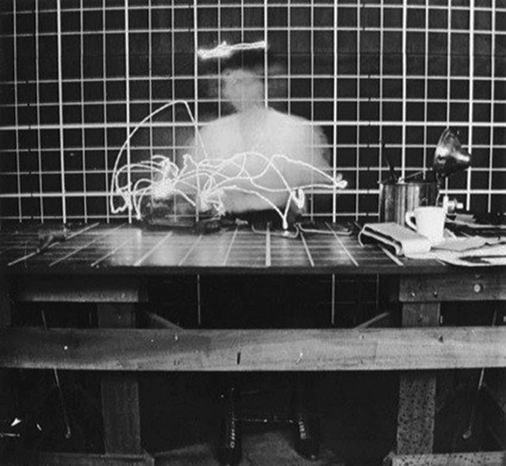

Here, long exposure works as a revelatory scientific instrument. By integrating movement over time into a single image, long exposures reveal patterns that are difficult or impossible to perceive directly. Rather than recording a single instant, they visualize the accumulated behavior of systems, making them valuable tools for studying transportation, crowds, weather, animal behavior, and other dynamic phenomena.

[Terence Chang, long exposure photos of airplane takeoffs](http://www.amusingplanet.com/2011/05/long-exposure-shots-of-airline-takeoffs.html)

[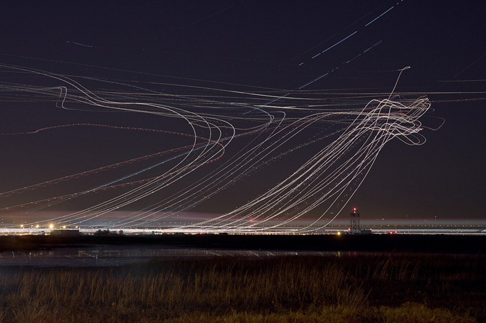](http://www.amusingplanet.com/2011/05/long-exposure-shots-of-airline-takeoffs.html)

[Dennis Hlynsky](https://vimeo.com/dennishlynsky)'s long exposure videos of birds and insects: [*Starlings at Sunset*](https://vimeo.com/987651028), [*Ground Cloud*](https://vimeo.com/149022523), [*Small Brains en Masse*](https://vimeo.com/109039750) • [**Terrific interview with Hlynsky**](https://www.youtube.com/watch?v=ML6n2t6uy1Q) (2m17s)

[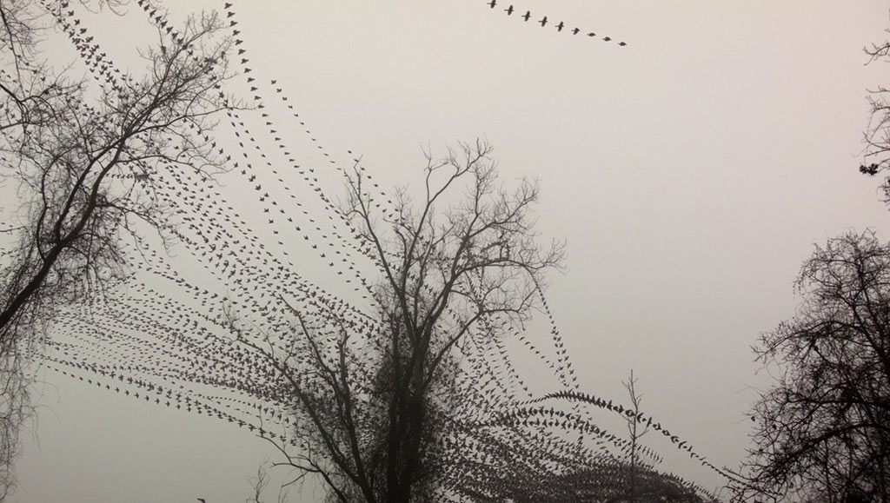](https://vimeo.com/149022523)

Long exposure can also be used to visualize otherwise invisible physical phenomena. In these clever projects by the BERG design group, light sources respond to some hidden property of the environment. Moving that light through space during a long exposure effectively "draws" a map of that unseen field.

[Berg: *Immaterials: Light painting WiFi*](https://www.youtube.com/watch?v=cxdjfOkPu-E)

[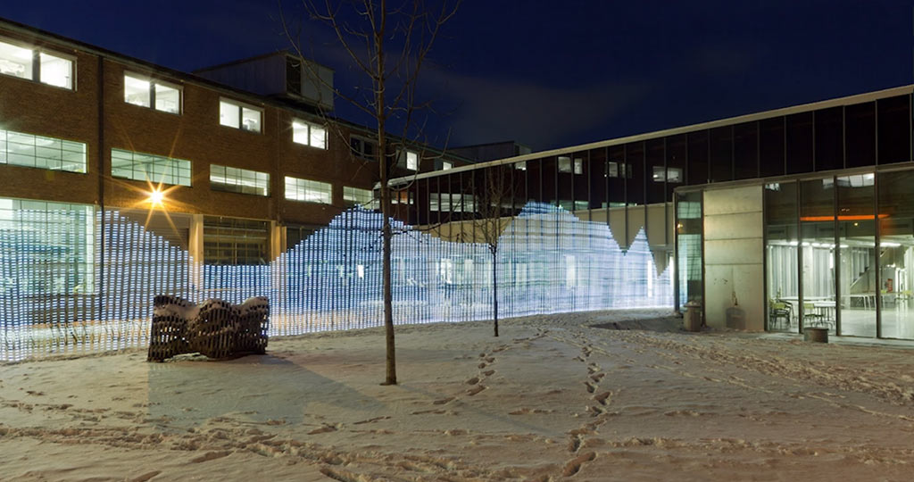](https://www.youtube.com/watch?v=cxdjfOkPu-E)

[Berg: *Immaterials: the ghost in the field*](https://vimeo.com/7022707)

[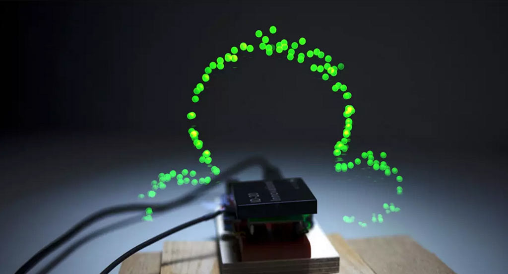](https://vimeo.com/7022707)

These examples apply long exposure to movement of the body, in order to create beautiful and provocative volumes in space: 

[Shinichi Maruyama, *Nudes*](http://www.shinichimaruyama.com/)

[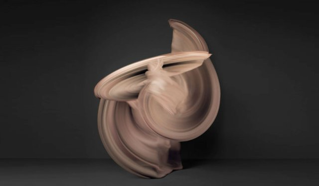](http://www.shinichimaruyama.com/)

[Croix Gagnon and Frank Schott, *12:31*. (iPad Light Painting, 2011)](https://cargocollective.com/twelvethirtyone): long exposures of animations from [the Visible Human project](https://www.youtube.com/watch?v=dPPjUtiAGYs).

[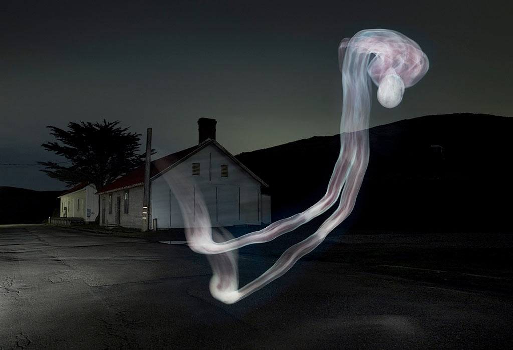](https://cargocollective.com/twelvethirtyone)

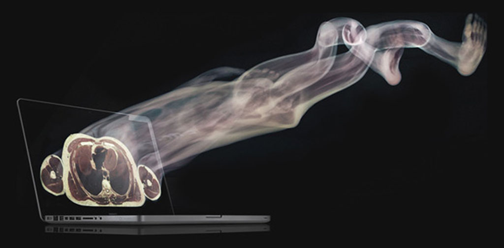

---

## Additional Examples

* Man Ray, [*Space Writing*](https://www.manray.net/space-writing-self-portrait.jsp) (1935). Possibly the first major artist to intentionally use light-painting in art.

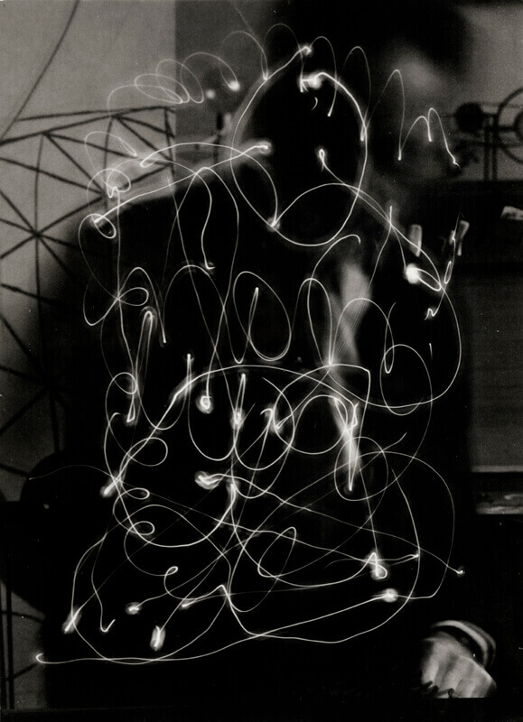

* In 1940-41, photograher Barbara Morgan (1900-1992) created a series of light-paintings called [*Emanations*](https://collection.carnegieart.org/objects/6133e622-5040-4fe9-82a8-06c473ff4650), in which she recorded the movements of dancers holding lights. 

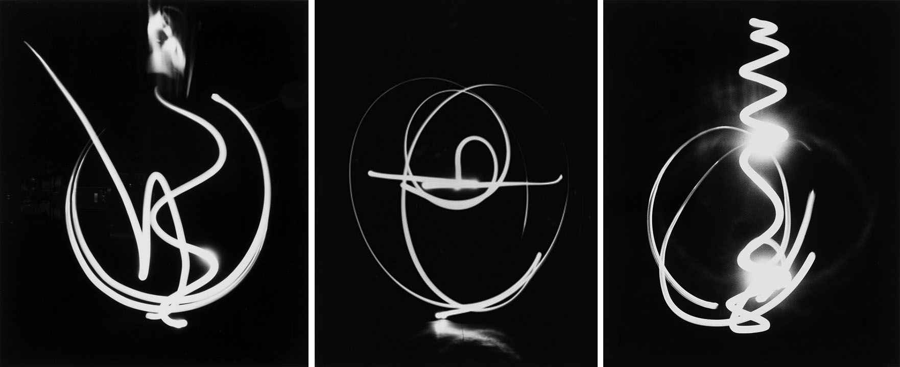

* From 1949-1952, photographer Gjon Mili made a series of influential long exposures for LIFE magazine, including subjects like artist [Pablo Picasso](https://www.life.com/arts-entertainment/behind-the-picture-picasso-draws-with-light/) and violinist [Jascha Heifetz](https://fenado.ai/articles/1952-gjon-mili-photograph-visually-traces-jascha-heifetzs-bow-movements-with-light). These works illustrate a time/space technique combining **long exposure** (which captures the trail left by a small light) and a single **stroboscopic flash** (which captures the subject in a brief instant) — providing a detailed spatial "explanation" of the temporal trail. 

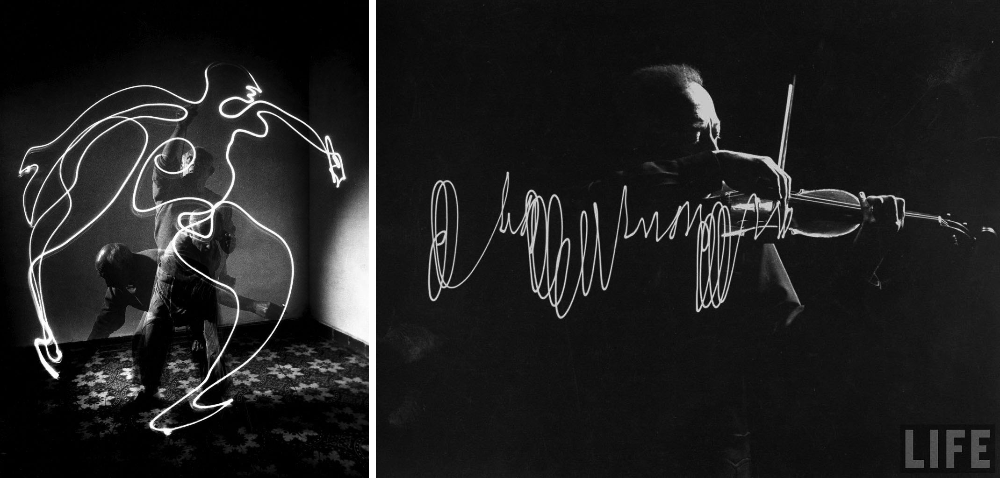

* Around 1968-1970, [Ernst Haas](https://gioeledaka.blogspot.com/2015/12/unit-1-ernst-haas.html) introduced greater subjectivity into long exposure photography, by recentering the camera as the source of movement, and not the depicted object.

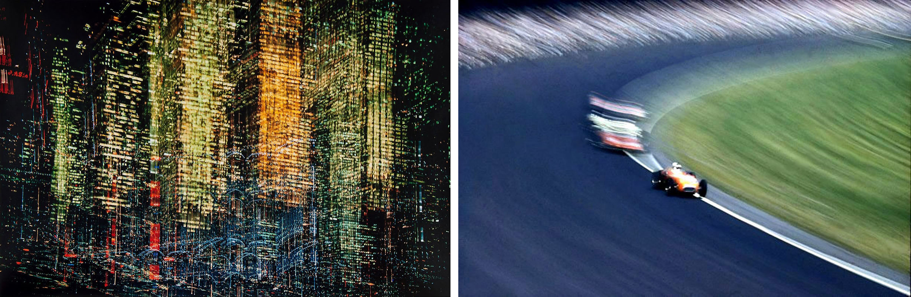

* In the late 1970s and 1980s, Eric Staller pioneered contemporary urban light painting, using graffiti-like light trails to embellish and define architectures. 

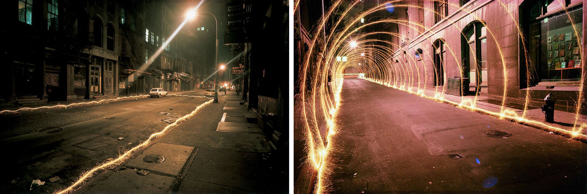

* [David Rokeby, *Plot Against Time*](http://www.davidrokeby.com/PlotAgainstTime.html) (Snowflakes, Pedestrians, Fireflies, Birds, etc.)

[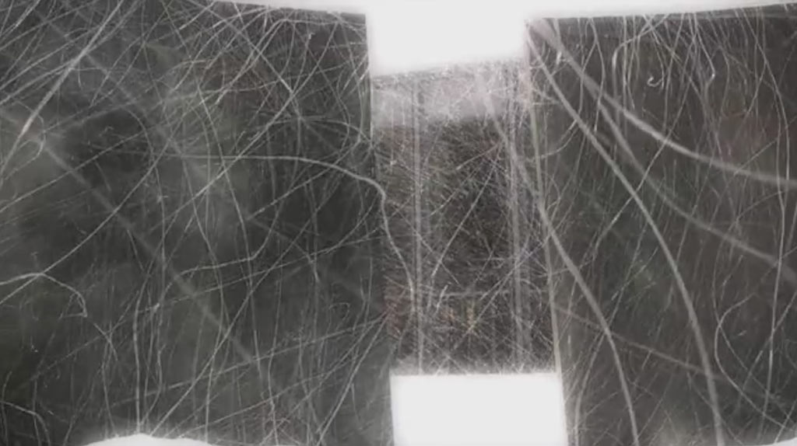](http://www.davidrokeby.com/PlotAgainstTime.html)

* [Yuki Karo, Long Exposure Photographs of Gold Fireflies in Japan](https://www.boredpanda.com/long-exposure-photography-gold-fireflies-yuki-karo/)

[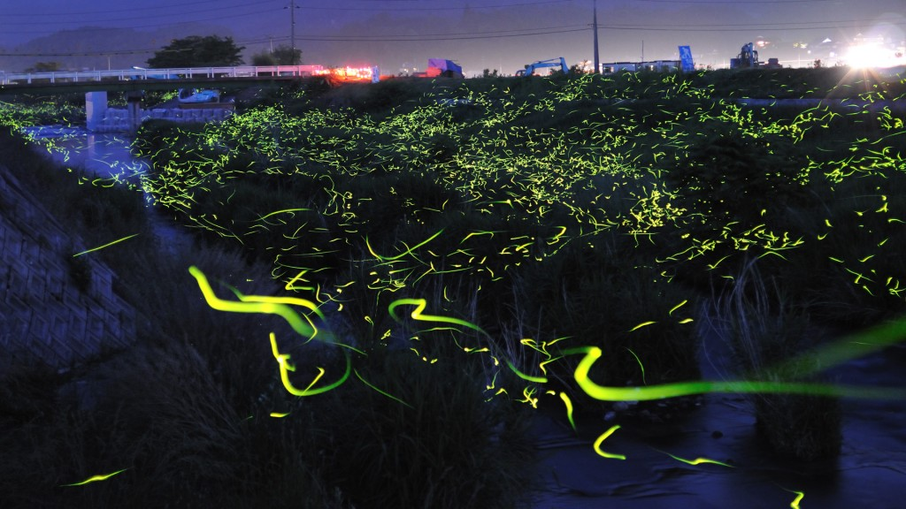](https://www.boredpanda.com/long-exposure-photography-gold-fireflies-yuki-karo/)

* [Vincent Brady, *Fireflies (Backyard Bioluminescence)*](https://www.youtube.com/watch?v=y4pWAxnfL8w)

[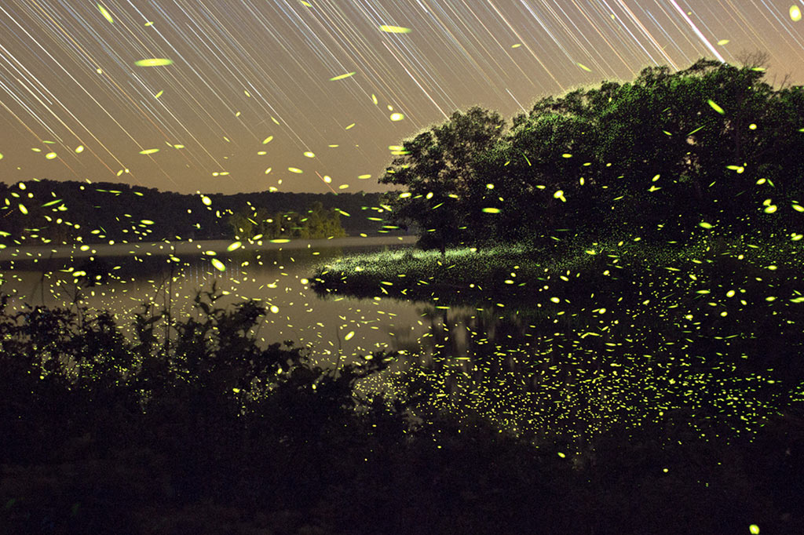](https://www.youtube.com/watch?v=y4pWAxnfL8w)

Solargraphy is a technique in which a fixed pinhole camera is used to expose photographic paper for an extremely long amount of time. It is most often used to show the path taken by the Sun across the sky. The image below was recorded with a pinhole camera made from a drink can lined with a piece of photographic paper. The simple camera continuously records the Sun's path each day as a glowing trail burned into the photosensitive paper. Dark gaps in the daily arcs are caused by cloud cover, whereas continuous bright tracks record glorious spells of sunny weather. This work is from [a series by Regina Valkenborgh](https://www.smithsonianmag.com/smart-news/someone-took-eight-year-photo-exposure-beer-can-180976552/), including an 8-year exposure that may be the longest-exposure image ever taken.

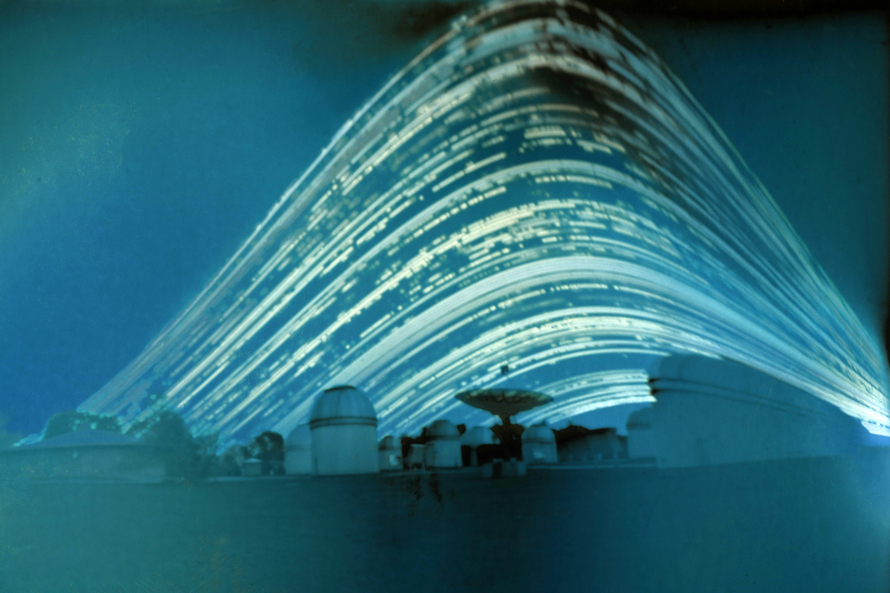

* Reuben Wu, [*Lux Noctis*](https://reubenwu.com/selected-works/lux-noctis/) and [*Phantom Circuit*](https://www.instagram.com/p/Da3yio0GWuN/), long-exposures of drone-illuminated landscapes. ([Documentary](https://www.youtube.com/watch?v=QMbdMdI-To8))

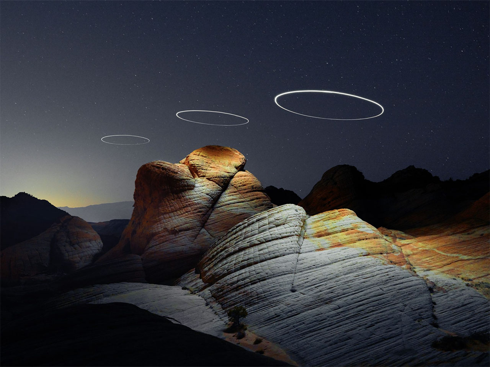

* Reuben Wu, [Time lapse of train](https://www.instagram.com/p/DY26RVVDA15/)

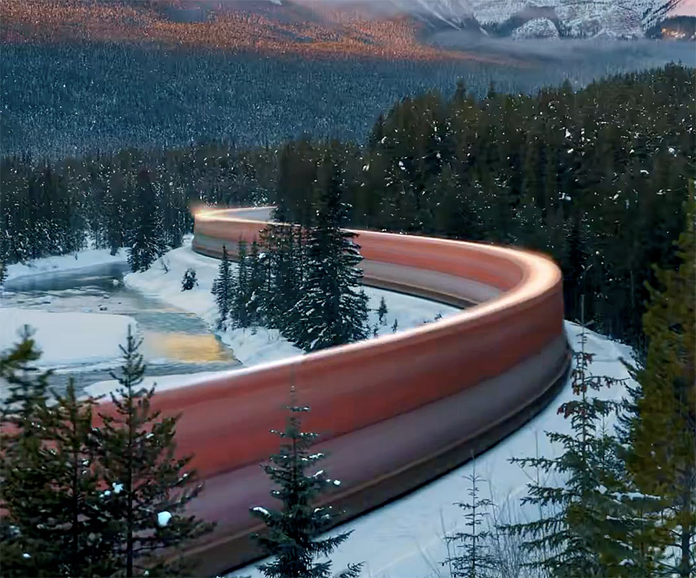

* @prashantvatsafilms, [Long exposure in a train tunnel](https://www.instagram.com/reels/DSAe4v5gp7K/)

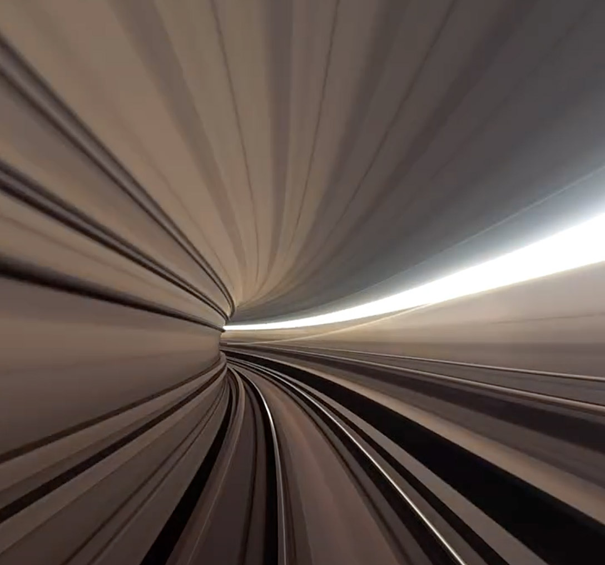

* Reddit user @gsuhrie, *Wind Turbines*:

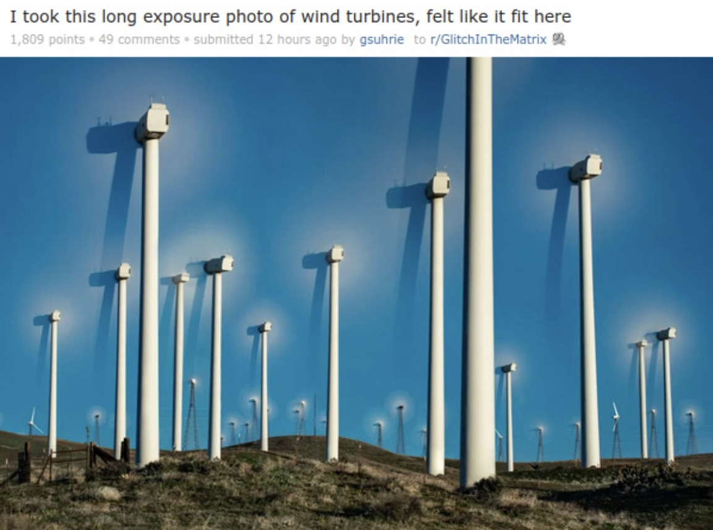

* [Olivier Gondry (dir.) for Tiga, *You Gonna Want Me*](https://www.youtube.com/watch?v=b7IJVdBecqQ): long exposure bullet time (especially at 1'00"). 

[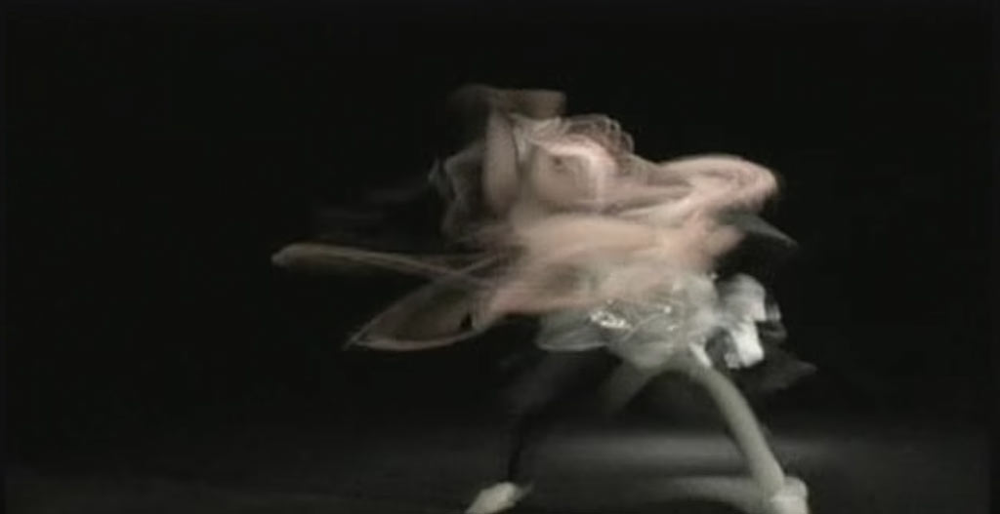](https://www.youtube.com/watch?v=b7IJVdBecqQ)

* [Berg+Dentsu, *Making Future Magic* (iPad Light Painting, 2010)](https://vimeo.com/14958082)

[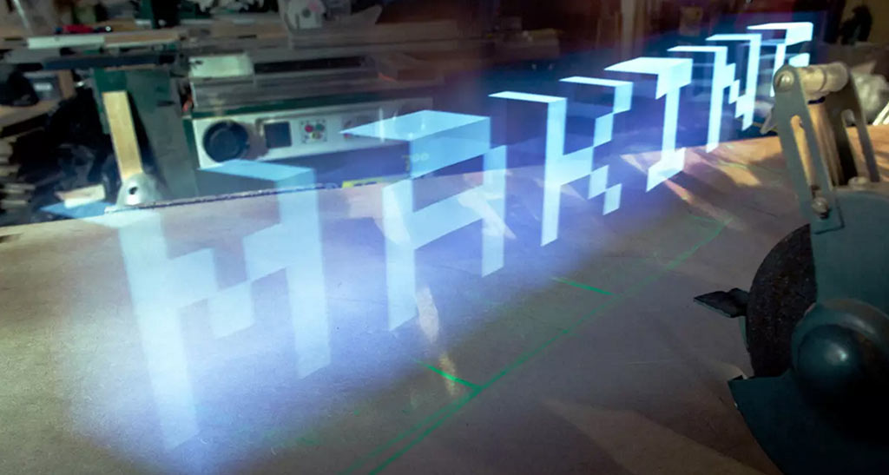](https://vimeo.com/14958082)

* @itisi_siru (Nathaniel Maddison), [multiple exposure of birds](https://www.instagram.com/p/DKaM2CDxFs4/)

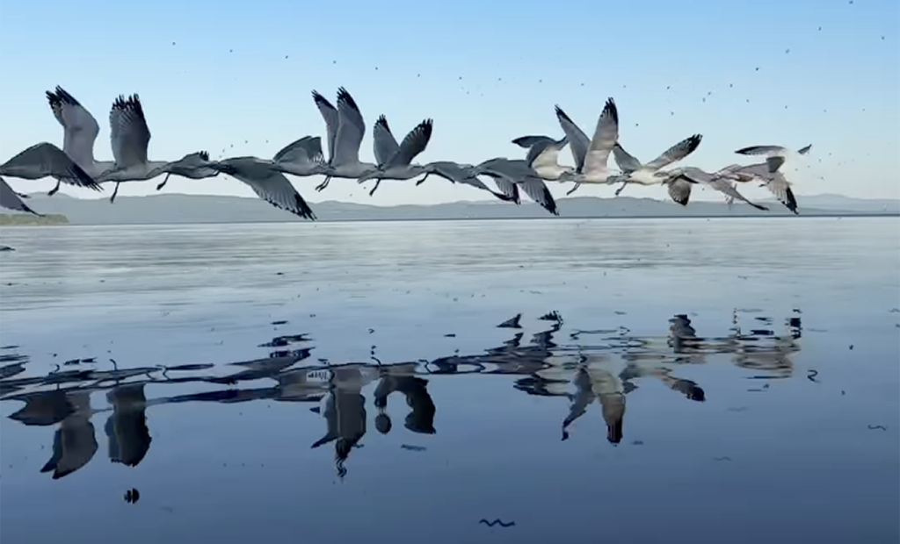

