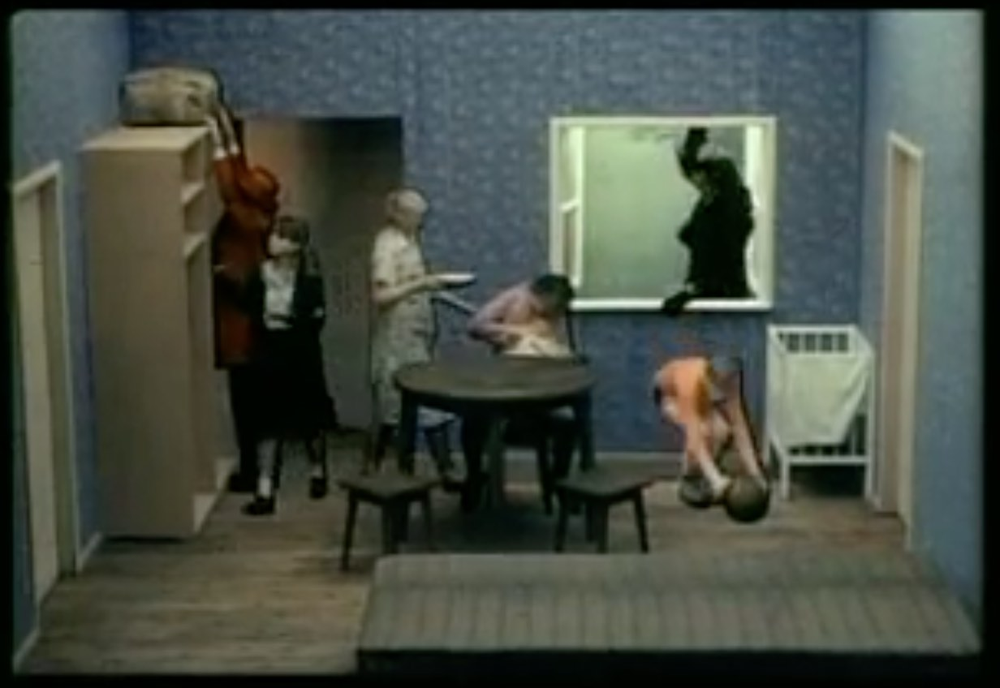

### Looping (Canon) Time

[Norman McLaren, *Canon*](https://www.youtube.com/watch?v=2VrnXw9waJI) (1964) 

[Zbigniew RybczynÃÅski, *Tango*](https://vimeo.com/90339479) (1980) 

[Alex Rothera, Kinect-based *Tango Software*](https://www.youtube.com/watch?v=-8Oos2AD_U4) (2012) 

[Michel Gondry for Kylie Minogue, *Come Into My World*](https://www.youtube.com/watch?v=63vqob-MljQ) (2002) 

[Michel Gondry, *Come Into My World* (Making of)](https://www.youtube.com/watch?v=Qw9FAxywDJ8) 

[Naren Wilks, *One Man, Eight Cameras*](https://www.youtube.com/watch?v=sWEdDBA1R2w) 

[Cyriak Harris, *Cycles*](https://www.youtube.com/watch?v=-0Xa4bHcJu8) (2010) 


