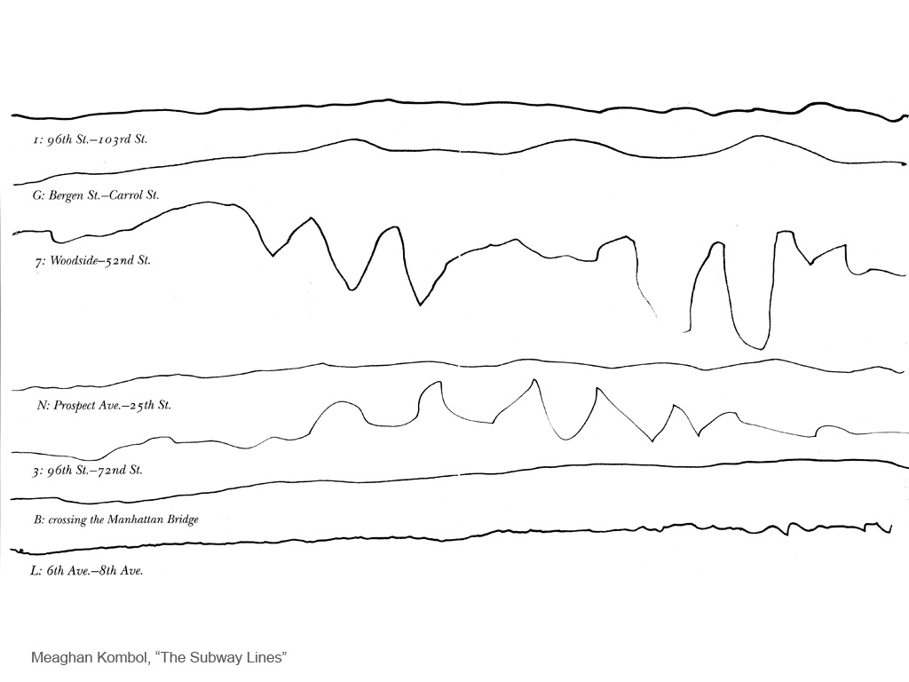

# Experimental Capture with the Everyday

## A Touchstone

We remind ourselves of the "motto" of ExCap, by Egon Erwin Kisch (1885-1948): 

> ***Nothing is more amazing than the simple truth, nothing is more exotic than our own surroundings, nothing is more fantastic in effect than objective description, and nothing is more remarkable than the time in which we live.*  —Egon Erwin Kisch**

Kisch was widely regarded as one of the most outstanding journalists of the twentieth century. He is credited with defining reportage as a form of literary art in which accuracy of observation and fidelity to facts combine with creative narrative.

## A Re-Orientation

This presentation reflects a re-orientation in our semester. We are:

* de-centering exotic or 'high' technologies, in favor of an emphasis on resourcefulness with limited means; and
* undergoing a shift: from objectivity to subjectivity, and from exteriority to interiority (centered in the uniqueness of your experience).

In short: Using the materials we have at hand, to get at more personal truths. 

---

## Finding a Truth

In Meaghan Kombol's *The Subway Lines*, the artist attempted to draw straight lines while riding the NYC subway. The result is a set of small multiples which are at once highly personal, yet also utterly valid depictions of reality.

---

 
*Buckleheads*

[Nina Katchadourian's *Seat Assignment*](http://www.ninakatchadourian.com/photography/seatassignment.php) (2010-) is a set of photo series, which consist of  observations made in flight using only a camera phone and improvising with materials close at hand. The project began spontaneously on a flight in March 2010; the material generated on the nearly 200 flights since then constitute the raw material of the project. Many of the artworks make use of the *Skymall* in-flight magazine.

 
Many of the images in the *High-Altitude Spirit Photography* series are made by capturing glare as it glances off the page. Whereas a good number of the *Seat Assignment* images are made by physically placing something on top of an existing image, in these images nothing is added in any material sense. It is a matter of working with the way the camera mechanically enhances what the eye overlooks.

 
*Window Seat Suprematism*

---

[Tehching Hsieh, *One Year Performance* (Time Clock Piece)](https://vimeo.com/16280427) (1980 – 1981). For one year, the artist punched a worker’s time clock located in his studio, on the hour, every hour. Marking the occasion by taking a self-portrait on a single frame of 16mm film, the resulting reel documents a year in his life at approximately one second per day.

---

[*Earthrise*, Apollo 8, 1968](https://www.nasa.gov/centers/johnson/home/earthrise.html). The photograph itself is the event — the event of getting to the photograph's point of view.

> "I don't know who said it, maybe all of us said, 'Oh my God. Look at that!'" Anders said. "And up came the Earth. We had had no discussion on the ground, no briefing, no instructions on what to do. I jokingly said, 'well it's not on the flight plan,' and the other two guys were yelling at me to give them cameras. I had the only color camera with a long lens. So I floated a black and white over to Borman. I can't remember what Lovell got. There were all yelling for cameras, and we started snapping away."

---

## Constructing a Truth

[John Baldessari, *Throwing Three Red Balls in the Air Trying to Make a Straight Line*](http://www.invaluable.com/auction-lot/baldessari,-j.-throwing-three-balls-in-the-air-to-194-c-4ee4252adf), 1973.

---

In *Alone Together* (2018), Addie Wagenknecht modified a Roomba to paint on canvas as it enacts its preprogrammed algorithm intended to clean. As the Roomba maneuvers around the canvas, the artist reclines nude. The Roomba relentlessly attempts to navigate around her body because it is designed to continue on a trajectory until the entire area has been mapped by its algorithm. The result is a void in the shape of a female form surrounded by the blue strokes of the robot. The works speak to the artist’s longtime preoccupation with gendered labor, power structures, and technology.

Part of Wagenknecht's inspiration came from [this news item](images/everyday/robot-vacuum-cleaner-spreads-dog-shit-everywhere-7.jpg).

--- 

[Janine Antoni, *Touch*](https://www.youtube.com/watch?v=r_n2kfqNmpY) (2002). Antoni set up a temporary tightrope on the beach in front of her childhood home. Through the camera, the line of the tight rope appears parallel to the ocean’s horizon as Antoni walks back and forth. Under her weight, the wire dips to touch the horizon allowing Antoni to balance there for just a moment. Antoni says: “I wanted to walk in this impossible place, to walk on the line of my vision, or along the edge of my imagination.”

---

Richard Long, *A Line Made by Walking* (1967), made while still a student at St Martin's School of Art. Long walked a continuous line into a field of grass in Wiltshire, England, and then photographed the result. The work is considered to be an important early work in the history of both land art and conceptual art. Where is the art: the line, the act of making the line, or the documentation of the finished line? 

---

[Charles Ray, *Plank Piece*](http://www.tate.org.uk/art/artworks/ray-plank-piece-i-ii-ar00342) (1973). The image is the summarizing image of that work. Ray created the work using his own body, balanced against a single plank of wood. Ray presents the arrangements of body and plank as completed structures, offering no evidence of how he arrived in these poses. The works were created while Ray was still a student at the University of Iowa.

---

 
Francis Alÿs, [*Paradox of Praxis (Sometimes Making Something Leads to Nothing)*](https://www.youtube.com/watch?v=ZedESyQEnMA), 1997. Francis Alÿs pushed a block of ice through the streets of Mexico City until it completely melted. After nine hours the block was reduced to no more than an ice cube, so small that he could casually kick it along the street.

---

[Tom Sachs - SPACE PROGRAM, 2007](http://tomsachs.org/exhibition/space-program)
* [(space program video)](https://www.youtube.com/watch?v=FAfYCpeBHi4)
* [(suiting up video)](https://www.youtube.com/watch?v=e-jSSTGqU5c&t=2m20s) 

For more than a decade Sachs has pondered the homespun technical ingenuity and romance with the unknown that brought America the Apollo program. This has culminated in the realization of his own life-size SPACE PROGRAM.

---

[Miranda July, *Learning to Love You More*](http://www.learningtoloveyoumore.com/reports/23/23.php) (2002-2009). *Learning to Love You More* is comprised of work made by the general public in response to assignments given by artists Miranda July and Harrell Fletcher — a *truth construction machine*. Participants online accepted an assignment, completed it by following the simple but specific instructions, sent in the required "report" (photograph, text, video, etc), and their work got posted on-line. Like a recipe, meditation practice, or familiar song, the prescriptive nature of these assignments was intended to guide people towards their own experience. From 2002 to its close in 2009, over 8000 people participated in the project.

* Climb to the top of a tree and take a picture of the view.
* Make a field guide to your yard.
* Interview someone who has experienced war.
* Record the sound that is keeping you awake.
* Take a flash photo under your bed.
* Draw a picture of your friend's friend.
* Re-enact a scene from a movie that made someone else cry.
* Make an exhibition of the art in your parent's house.
* Ask your family to describe what you do.
* Draw a scene from a movie that made you cry.
* Take a picture of the sun.
* [Recreate this snapshot.](http://www.learningtoloveyoumore.com/reports/23/23.php)
* Recreate a poster you had as a teenager.
* Photograph a scar and write about it.
* Make a poster of shadows.
* Make a neighborhood field recording.

