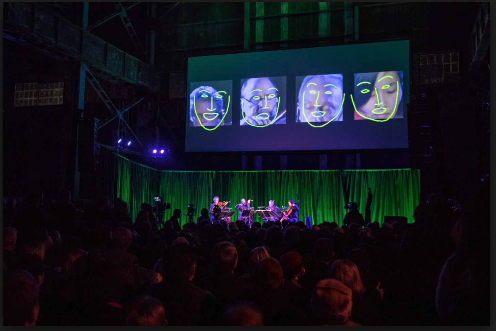

### Machine Learning

---

Timo Arnall, [Robot Readable World](https://vimeo.com/36239715)

[The Camera, Transformed by Machine Learning](https://www.core77.com/posts/77683/).
Excellent article by Christian Ervin / Tellart. 

Trevor Paglen's [Sight Machine](https://vimeo.com/205149078) with the Kronos Quartet:

[PRNet](https://github.com/YadiraF/PRNet) uses machine learning to allow estimation of a 3D face from a single 2D photo.  

[MonoPerfCap: Human Performance Capture from Monocular Video](http://gvv.mpi-inf.mpg.de/projects/wxu/MonoPerfCap/)

[Tracking animal kinematics](https://www.biorxiv.org/content/early/2018/05/25/331181) and [more](https://twitter.com/neuroecology/status/1000047514161213442)

