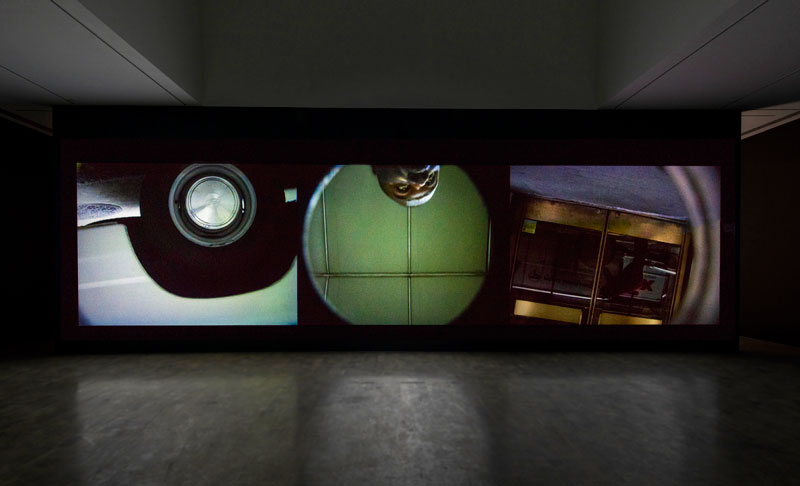
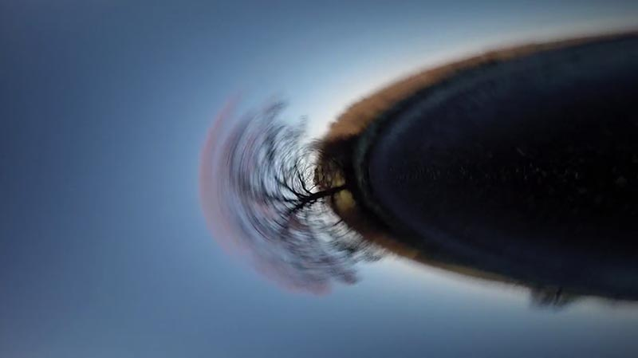

### Moving Cameras and Point of View

 
[Steve McQueen, *Drumroll*](https://www.youtube.com/watch?v=9oGO2mawifA) (1998)

 
[*Time Tunnel (Camera on a Car Wheel)*, by Dirk Roy for Boris Blank/Yello](https://vimeo.com/84162988)

More: 

* [Roel Wouters, Camera Workshop at ECAL](http://gizmodo.com/these-designers-make-boring-old-video-cameras-do-imposs-1444863383)
* [*Full Circle* from Callum Cooper (Jump Rope Camera)](https://vimeo.com/37077712)
* [Hula Hoop Camera](https://www.youtube.com/watch?v=EumsgPn9xaM)
* [Another camera on a drill](https://www.youtube.com/watch?v=FIJfshJ757s)
* [Centriphone by Nicolas Vuignier](https://www.youtube.com/watch?v=aqncOP7OzMg)
* [Trombone Camera](https://www.youtube.com/watch?v=soDn2puEuL8)

> I had the idea of a new astro time-lapse technique in which the camera is pointed right at the north star and mounted to a motorized pivot point directly lined up with the sensor so the camera is able to spin with the stars through the night. Sit back, relax and Ride the Sky.

* [Lance Page, *Ride the Sky*](https://vimeo.com/98679934)
* [Time Lapse Sky Shows Earth Rotating Instead of Stars](https://www.youtube.com/watch?v=nkn2ZXWDl6k)
* [Vincent Brady, *Planetary Panorama: 360 Degree Night-Sky Time-Lapse*](https://www.youtube.com/watch?v=azJaOQAGTJo)

Sometimes the camera is moving relative to the reference frame of gravity, but not to the apparent scene:

[Studio Moniker, *Sally*](http://roelwouters.com/sally) or see [on YouTube](https://www.youtube.com/watch?v=mrPe6bpAgI8)

---

* [Paul Pfeiffer' *The Rules of Basketball*](https://www.youtube.com/watch?v=ssJZJs9g_xQ)

* [White Glove Tracking](http://whiteglovetracking.com/) project by Evan Roth and Ben Engebreth, et al., e.g.: [Zach Lieberman for White Glove Tracking](images/zl_pf_tribute.mov) or at their [Gallery](http://whiteglovetracking.com/gallery.html)

