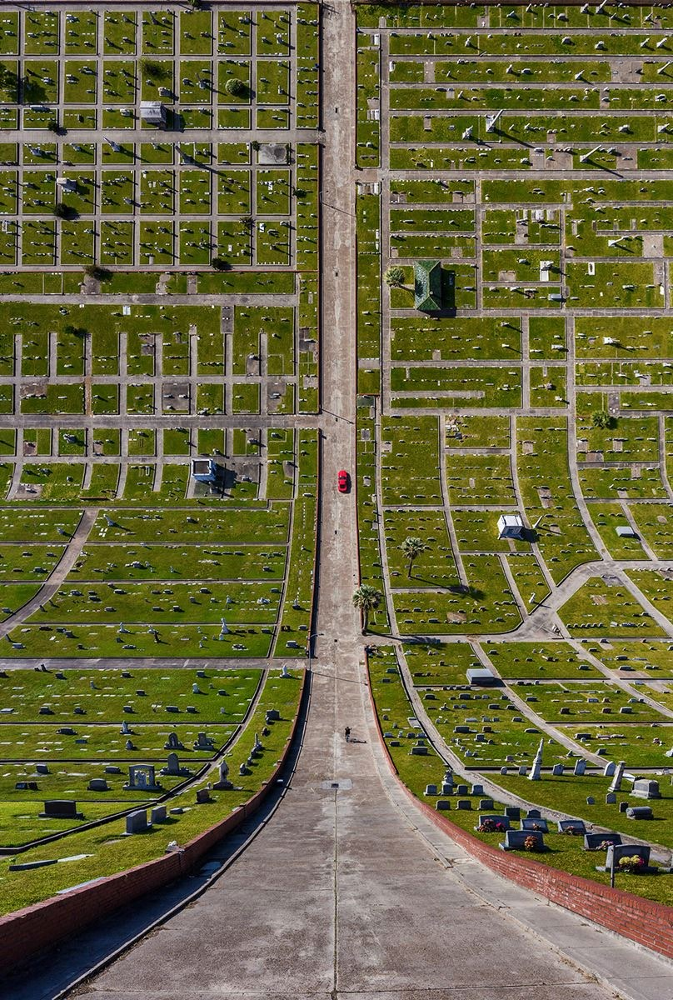
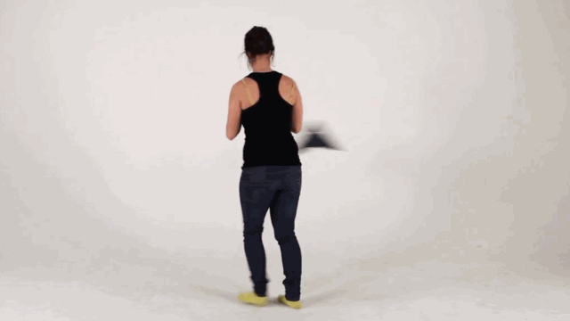
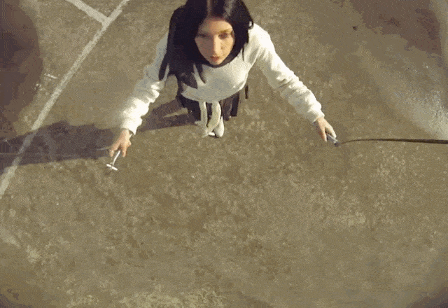
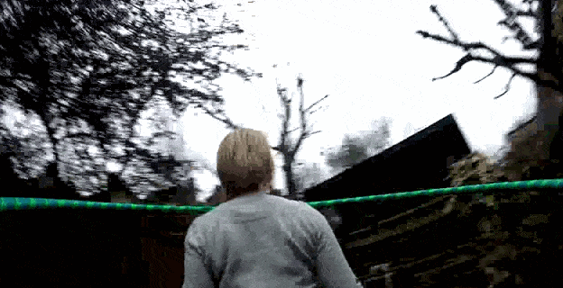
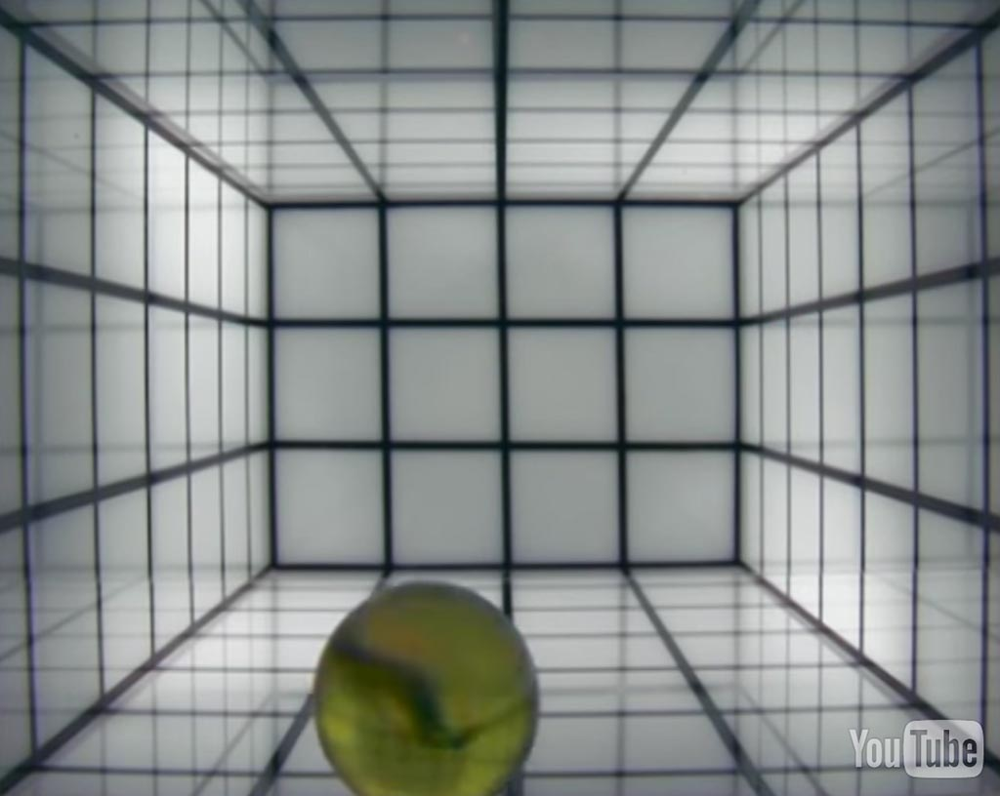
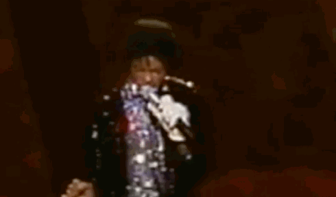
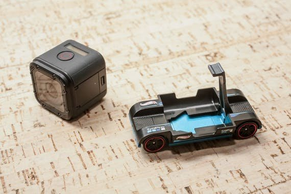

### Moving Cameras and Point of View

[Aydın Büyüktaş](http://www.aydinbuyuktas.com/), using drone photograpbhy, produces surreal 'folded' [landscapes](https://www.wired.com/2017/03/aydin-buyuktas-flatland-ii/) that seamlessly combine aerial and ground-level perspectives.

---

 

[Steve McQueen, *Drumroll*](https://www.youtube.com/watch?v=9oGO2mawifA) (1998)

--- 

 

[*Time Tunnel (Camera on a Car Wheel)*, by Dirk Koy for Boris Blank/Yello](https://vimeo.com/84162988)

--- 

[Roel Wouters, Camera Workshop at ECAL](https://vimeo.com/62869207)

---

[*Full Circle* from Callum Cooper (Jump Rope Camera)](https://vimeo.com/37077712) 

[Hula Hoop Camera](https://www.youtube.com/watch?v=EumsgPn9xaM) 

* [Another camera on a drill](https://www.youtube.com/watch?v=FIJfshJ757s)
* [Centriphone by Nicolas Vuignier](https://www.youtube.com/watch?v=aqncOP7OzMg)
* [Trombone Camera](https://www.youtube.com/watch?v=soDn2puEuL8)

> I had the idea of a new astro time-lapse technique in which the camera is pointed right at the north star and mounted to a motorized pivot point directly lined up with the sensor so the camera is able to spin with the stars through the night. Sit back, relax and Ride the Sky.

* [Lance Page, *Ride the Sky*](https://vimeo.com/98679934)
* [Time Lapse Sky Shows Earth Rotating Instead of Stars](https://www.youtube.com/watch?v=nkn2ZXWDl6k)
* [Vincent Brady, *Planetary Panorama: 360 Degree Night-Sky Time-Lapse*](https://www.youtube.com/watch?v=azJaOQAGTJo)

Sometimes the camera is moving relative to the reference frame of gravity, but not to the apparent scene:

[Studio Moniker, *Sally*](http://roelwouters.com/sally) or see [on YouTube](https://www.youtube.com/watch?v=mrPe6bpAgI8) 

---

Here the camera is made to "move" in post-production, in order to produce an apparently stationary object.  

[Paul Pfeiffer' *The Rules of Basketball*](https://www.youtube.com/watch?v=ssJZJs9g_xQ) 

[*White Glove Tracking*](http://whiteglovetracking.com/) project by Evan Roth and Ben Engebreth, et al., e.g.: [Zach Lieberman for White Glove Tracking](images/zl_pf_tribute.mov) or at their [Gallery](http://whiteglovetracking.com/gallery.html) 

Dirk Koy, "Fixed" series:

* [*Fixed02* (Diver)](https://vimeo.com/350977026)
* [*Fixed03* (Gymnast)](https://vimeo.com/352532472)
* [*Fixed04* (PingPong)](https://vimeo.com/354368811)
* [*Fixed05* (Bicyclist)](https://vimeo.com/358530638)
* [*Fixed08* (Trampolinist)](https://vimeo.com/367279236)

---

"Bullet lens" moving quickly through narrow spaces: the [Laowa 24mm f/14 Probe Lens](https://www.kickstarter.com/projects/laowa/revolutionize-macro-videography-laowa-24mm-f-14-pr)

"[Zoom In](https://www.youtube.com/watch?v=yQM7-6hWvNA)", Hotwheels+GoPro mount: 

