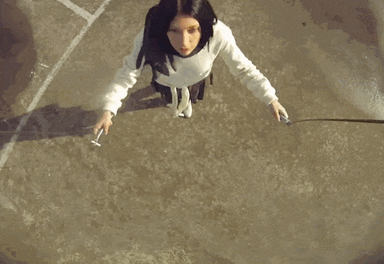
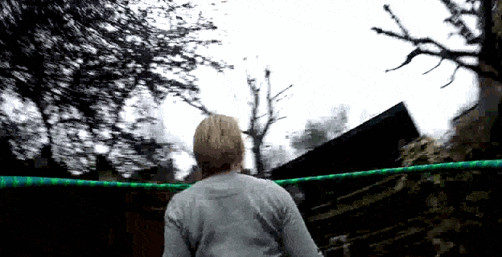
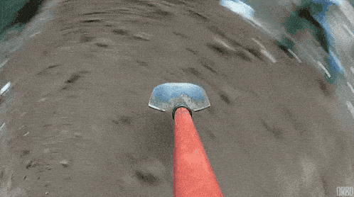
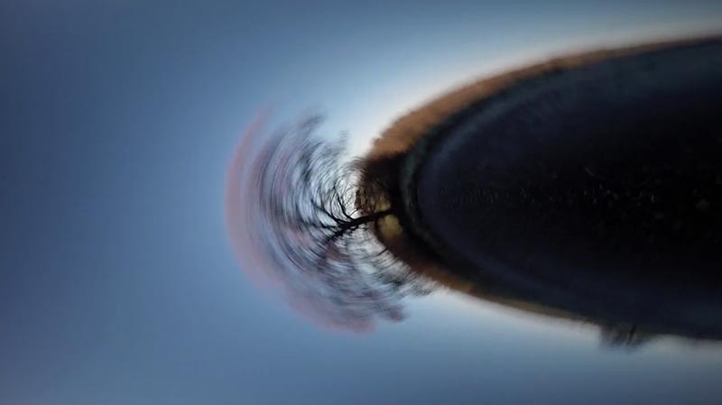
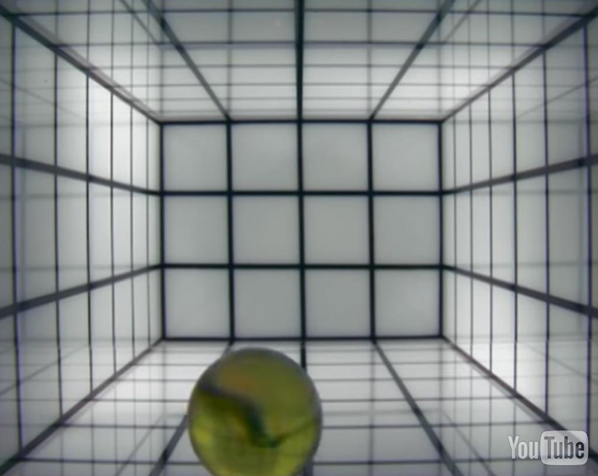
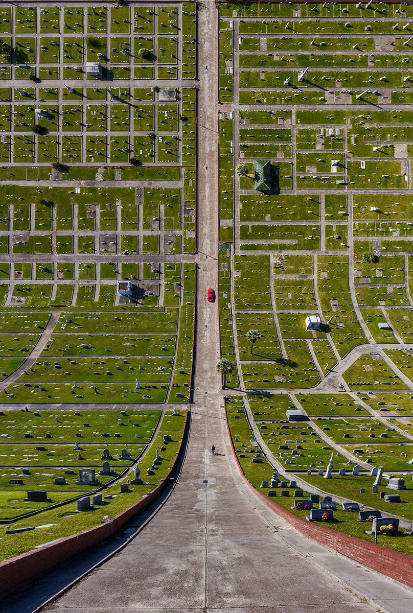
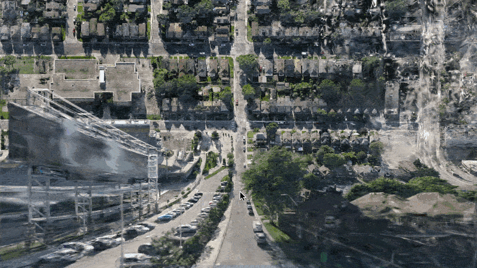
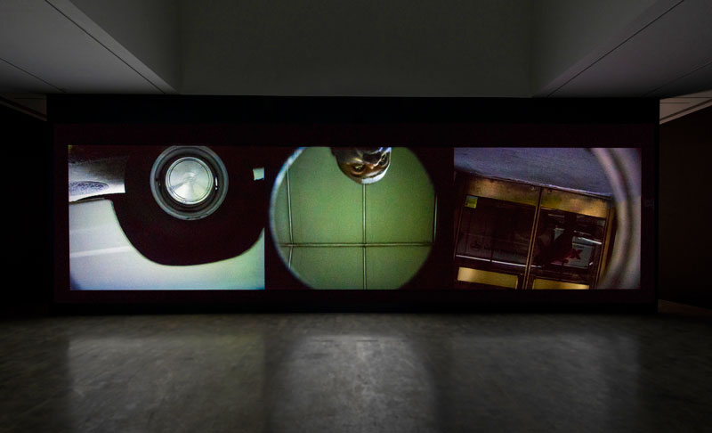
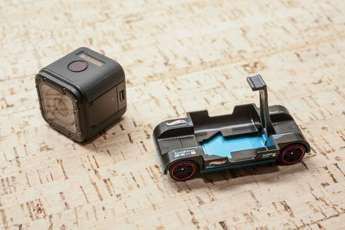

### Point of View: Moving Cameras

--- 

[Roel Wouters, Camera Workshop at ECAL](https://vimeo.com/62869207) 

---

[*Full Circle* from Callum Cooper (Jump Rope Camera)](https://vimeo.com/37077712) 

[Hula Hoop Camera](https://www.youtube.com/watch?v=EumsgPn9xaM) 

[Trombone Camera](https://www.youtube.com/watch?v=rNdXezVKeOA&t=11s) 

[3D-printed brushcam mount](https://www.instagram.com/p/DUtnlaqjzkF) 

* [Drill + Camera](https://www.youtube.com/watch?v=2XzZrkILgKk) • [Another camera](https://www.youtube.com/watch?v=FIJfshJ757s)
* [Centriphone by Nicolas Vuignier](https://www.youtube.com/watch?v=aqncOP7OzMg)
* [Gimbal-stabilized camera on a dog](https://www.youtube.com/watch?v=r9UfGtM-kHc&t=616s)
* [360° camera in a cannon](https://www.youtube.com/watch?v=RhGwPa92QKc)

> I had the idea of a new astro time-lapse technique in which the camera is pointed right at the north star and mounted to a motorized pivot point directly lined up with the sensor so the camera is able to spin with the stars through the night. Sit back, relax and Ride the Sky.

* [Lance Page, *Ride the Sky*](https://vimeo.com/98679934)
* [Time Lapse Sky Shows Earth Rotating Instead of Stars](https://www.youtube.com/watch?v=nkn2ZXWDl6k)
* [Vincent Brady, *Planetary Panorama: 360 Degree Night-Sky Time-Lapse*](https://www.youtube.com/watch?v=azJaOQAGTJo)

---

Here the camera is made to "move" in post-production, in order to produce an apparently stationary object.  

[Paul Pfeiffer' *The Rules of Basketball*](https://www.youtube.com/watch?v=x4JTLchLNCo&t=55s) 

[*White Glove Tracking*](http://whiteglovetracking.com/) project by Evan Roth and Ben Engebreth, et al., e.g.: [Zach Lieberman for White Glove Tracking](images/zl_pf_tribute.mov) or at their [Gallery](http://whiteglovetracking.com/gallery.html) 

---

#### Dirk Koy's [*Fixed* Series](https://vimeo.com/showcase/7609491)

Dirk Koy's ["Fixed" series](https://vimeo.com/showcase/7609491):  [#2 Diver](https://vimeo.com/350977026) • [#3 Gymnast](https://vimeo.com/352532472) • [#4 PingPong](https://vimeo.com/354368811) • [#5 Bicyclist](https://vimeo.com/358530638) • [#8 Trampolinist](https://vimeo.com/367279236)

More from Koy: [*Time Tunnel (Camera on a Car Wheel)*, for Boris Blank/Yello](https://vimeo.com/84162988) 
 

---

Sometimes the camera is moving relative to the reference frame of gravity, but not to the apparent scene:

[Studio Moniker, *Sally*](http://roelwouters.com/sally) or see [on YouTube](https://www.youtube.com/watch?v=mrPe6bpAgI8) 

---

[Aydın Büyüktaş](http://www.aydinbuyuktas.com/), using drone photography, produces surreal 'folded' [landscapes](https://www.wired.com/2017/03/aydin-buyuktas-flatland-ii/) that seamlessly combine aerial and ground-level perspectives.

Büyüktaş has inspired [this interactive Gaussian-splat transformation](https://www.orbify.eu/demo/) by Orbify.eu: 

---

 

[Steve McQueen, *Drumroll*](https://www.youtube.com/watch?v=9oGO2mawifA) (1998)

---

"Bullet lens" moving quickly through narrow spaces: the [Laowa 24mm f/14 Probe Lens](https://www.youtube.com/watch?v=WrzQjUQds6g)

---

<!--
"[Zoom In](https://www.youtube.com/watch?v=yQM7-6hWvNA)", Hotwheels+GoPro mount: 

-->

