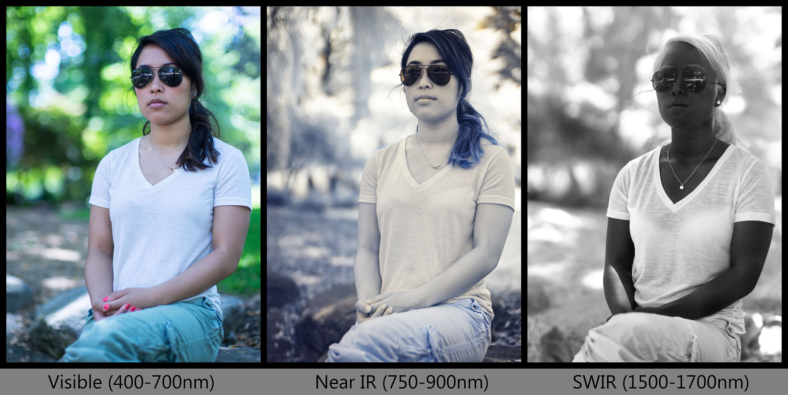
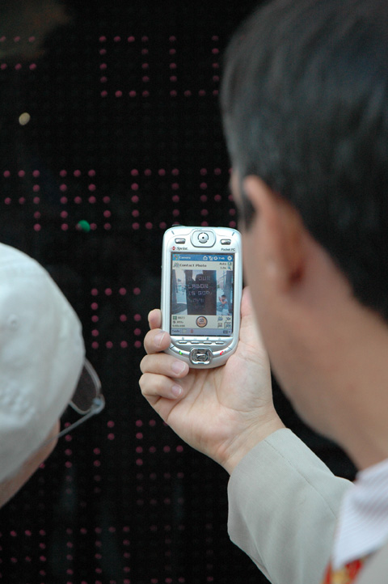

# Multispectral Imaging

In this lesson, we discuss images captured from electromagnetic frequencies beyond the range of human perception. [**Multispectral imaging**](https://en.wikipedia.org/wiki/Multispectral_image) employs additional channels of electromagnetic radiation beyond human perception, such as infrared (IR), ultraviolet (UV), X-rays, and more.

*Here's a rainbow over CMU. Water droplets in the air split up the sun's white light into component colors.*

*Here's a prism in someone's window, splitting up sunlight into its component colors.*

*The visible spectrum is just one slice of electromagnetic radiation that human eyes happen to be able to see. But there are many other frequencies of "light" which can be detected and imaged using special cameras, such as ultraviolet and infrared.*

*Here is a useful chart showing different spectral bands and some of their applications. (Note that the direction of the spectrum is reversed from the two diagrams above.)*

---

This lesson includes a discussion of the following:

* [Overview of Multispectral Imaging](#overview)
* [Some Applications](#some-applications)
* [Near-Infrared Imaging](#near-infrared-imaging)
* [Thermal Imaging](#thermal-imaging)
* [Thermochromic Imaging](#thermochromic-imaging)
* [Ultraviolet Imaging](#ultraviolet-imaging)
* [X-Ray Imaging](#x-ray-imaging)
* [Hyperspectral Imaging](#hyperspectral-imaging)
* [Radio-Wave Imaging](#radio-wave-imaging)
* [Neutron Imaging](#neutron-imaging)

In addition, two other imaging techniques discussed here, while not "multi-spectral", deal with unusual properties of light and its transmissive medium:

* [Polarimetry](#polarimetry)
* [Schlieren Imaging and Shadowgraphy](#schlieren-imaging-and-shadowgraphy)

Finally, it's not even necessary to image with electromagnetic radiation; let's not forget about sound.

* [Sonar and Ultrasound](#sonar-and-ultrasound)
* [Sonic Imaging](#sonic-imaging)

---

## Overview

#### What does the world look like when observed with non-visible light frequencies?

Because the human eye cannot see things like X-rays, IR, UV, etc., we need to use some sort of imaging technology to translate energy patterns in these spectra into patterns that our eyes can see. The "right" way to visualize such energy patterns is *always arbitrary* — or, at least, an artifact of the sensing and display technology.

*Here is a face, simultaneously imaged in the (a) visible spectrum, 0.4–0.7 µm, (b) SWIR or short-wave infrared, 1.0–3.0µm, (c) MWIR or mid-wave infrared, 3.0–5.0µm, and (d) LWIR or long-wave infrared, 8.0-14.0µm. As we image using increasingly long wavelengths, we shift from seeing the **reflective** (color) properties of the subject, to the **emissive** (heat) properties of the subject.*

 

* [An excellent paper on multispectral face recognition](http://www.intechopen.com/books/reviews-refinements-and-new-ideas-in-face-recognition/thermal-infrared-face-recognition-a-biometric-identification-technique-for-robust-security-system)
* [Differences between UV, Vis, NIR (Wikipedia)](https://en.wikipedia.org/wiki/Full-spectrum_photography#/media/File:UV_Vis_IR_Portrait.jpg)
* More [faces viewed in multiple spectra](https://www.flickr.com/photos/rshephorse/4279928945)

*Here are some faces viewed in UV, visible light, and IR. What sorts of features appear differently in different forms of light?*

In the photos below, by Nick Spiker and Nevada Weir, it's clear that depending on the imaging frequency, light skin can look dark, and vice-versa.

---

## Some Applications

Satellites employ multispectral imaging to understand the Earth. Here are a set of aligned images taken simultaneously, in different IR bands, by the Chinese weather satellite FY4A-AGRI. Whereas most images you see have three channels of information (RGB), this satellite records 14 different channels of visible, SWIR, MWIR, and LWIR light. Note how for some bands, like 5.8-6.7μm, the water vapor in the atmosphere is opaque.

In order to visualize the structure of such multichannel data, a common trick in satellite imaging is to re-map a channel of invisible light (like IR) to the R,G,B channels of a regular image. [Charlie Loyd discusses this in his terrific article, *Putting Landsat8's multispectral imaging to work*](https://www.mapbox.com/blog/putting-landsat-8-bands-to-work/). This is called **false-color imaging**.

For example, here's a false-color Landsat8 image by in which SWIR data is used in the "red" channel of the image; NIR data as "green"; and near-UV as "blue". The purpose of doing this is not to create some sort of garish, psychedelic image; rather, the false-color imaging makes the patch of forest in the lower-left (which had been affected by forest fire) starkly visible:

Astronomers use multispectral imaging to [understand the Sun](http://www.nasa.gov/images/content/719688main_Sun-Wavelength-Chart_full.jpg). This set of images of the Sun was recorded using mostly deep ultraviolet and X-rays:

.

Forensic specialists use infrared and ultraviolet imaging and/or fluorescence to [recover writing lost to water damage](https://people.rit.edu/andpph/photofile-b/ir-letter-comparison-1.jpg), [analyze medieval frescoes](hhttps://artcosnervationcsmodotcom.wordpress.com/2012/06/02/the-balkan-heritage-field-school-2012-project/), [detect fraudulent documents](https://blog.fraudfighter.com/why-uv-counterfeit-detection-continues-to-be-an-effective-solution), [determine the provenance of artifacts](https://webharvest.gov/peth04/20041026091256/http://www.fbi.gov/hq/lab/fsc/backissu/oct1999/mokrzyck.htm), [sort fragments of shredded documents](https://webharvest.gov/peth04/20041026091256/http://www.fbi.gov/hq/lab/fsc/backissu/oct1999/mokrzyck.htm), [detect underpaintings in famous artworks](https://www.artic.edu/articles/971/lights-camera-reaction-technical-imaging), and [detect earlier versions of artworks (includes web interactive)](http://www.webexhibits.org/pigments/intro/visible.html).

*It's common to [examine paintings under many sorts of light](https://www.artic.edu/articles/971/lights-camera-reaction-technical-imaging). In addition to visible, UV, IR, and X-Rays, experts may also use grazing/raking light (from the side), transmitted light (from behind), and co-axial light (retroreflective) [to examine a painting](http://www.webexhibits.org/pigments/intro/visible.html).*

---

## Near-Infrared Imaging

IR is light that is beyond the red end of the visible spectrum. Wavelengths in the range of ~770 to ~1400 nanometers are called the near-infrared (or NIR) region of the electromagnetic spectrum, while longer wavelengths include Short-Wave IR (SWIR) and Long-Wave IR (LWIR).  Near-infrared is widely used in standard security cameras, while far infrared is known as thermal imaging (which we discuss in the section after this).

NIR cameras can be inexpensive and easy to obtain. Given the presence of IR illumination, they allow us to see in the "dark", so they are widely used as security cameras. Here's a BBC video tracking animals, unobtrusively, licking salt in a cave at night:

Owing to the different infrared reflectivity of blood, you can [see veins easily](https://www.flickr.com/photos/nebarnix/2034727799) in NIR:

It's important to distinguish between *monochromatic* IR images (a grayscale image whose content is exclusively from the infrared part of the spectrum), such as the image above, and various types of *CIR* (Color+IR) images: false-color images which store multiple (spatially aligned) channels of information from different parts of the spectrum. Since RGB images are a common display format for multichannel image data, one common CIR technique ([described in this PDF](pdf/using_cir_imagery.pdf)) stores IR information in the Red channel, Red information in the Green channel, and Green information in the Blue channel. This is conceptually similar to the LandSat satellite imaging trick described above. Edward Thompson has compiled [an artful book](http://www.edwardthompson.co.uk/theunseen.html) of such images, such as this one:

Incidentally, the visibility of veins in IR has been used in some medical augmented-projection applications, such as the Christie [VeinViewer](http://www.bayareahospital.org/Images/IV_Insertions_Get_Easier_For_Patients.aspx) device:  

It's common for CIR imaging to be used for aerial/satellite photography. Foliage, in particular, becomes much more visible: 

Richard Mosse's *[The Enclave](https://vimeo.com/67115692)* (2013) is a documentary film about the ongoing civil war in Congo, shot on CIR film. Mosse's work has spurred controversy for the way in which it aestheticizes turmoil, especially as captured by a European working in Africa. 

Andrew Shurtleff explicitly aestheticizes NIR in this otherworldly [infrared time-lapse](https://vimeo.com/58232705) video: 

Some materials are opaque in visible wavelengths, but transparent in NIR wavelengths. This means that NIR can be used to see certain kinds of obscured or invisible information. A common technique for this is *infrared reflectography*, which takes advantage of the NIR-transparency of some kinds of paint, in order to view a painting's underlayers:

For example, *The Blue Boy* (ca. 1770), an oil painting by Thomas Gainsborough (1727-1788), has an overpainted dog, discovered in 1994. Here the painting is shown in normal light photography (left), digital x-radiography, and infrared reflectography (right).

The paintings [*"The Lynching of Leo Frank"*](http://www.oliverlutz.com) and [*"Stella at the Playground"*](http://www.oliverlutz.com) by Oliver Lutz (2010) use a (visibly) black, IR-transparent overpainting—covering a "secret" image that can only be observed by means of a NIR security camera and a nearby CCTV. Lutz makes [many projects](http://www.oliverlutz.com/oliverlutz_prjct_nscr.htm) with this IR-clear, visibly-black overpainting. His work appeared in the Walker Art Center exhibition [*"Exposed: Voyeurism, Surveillance and The Camera since 1870"*](http://www.walkerart.org/calendar/2011/exposed-voyeurism-surveillance-and-the-camera).

Artist Osman Khan created a strictly [IR-viewable image](http://www.osmankhan.com/works.asp?name=Unviewed), whose content is visible only through the audience's personal digital capture devices. 

In some circumstances, depending on materials, NIR cameras can [see through clothes](https://www.youtube.com/watch?v=RdtJlHVDcmM), as in this example with a tattoo, below. 

NIR imaging can be used to [detect traced (i.e. forged) signatures](https://www.fbi.gov/about-us/lab/forensic-science-communications/fsc/oct1999/images/tracingb.jpg):

There are also many uses of NIR imaging for real-time body tracking and computer vision.

---

## Thermal Imaging

*Thermal imaging* senses light wavelengths in the range of ~8000-14000 nanometers, also called *long wave infrared*, which corresponds to what we experience as *heat*. In short, we see where something is hot.

What we see when we observe radiation in this range is *emissive* rather than *reflective*.

Interestingly, there is a band that is not used for imaging — the "low transmittance window", between 5000-8000nm, because *air is opaque* (absorbs IR) at those wavelengths. Put another way: those are the wavelengths of light-energy that *heat the air itself*.

* David Attenborough discusses the use of thermal imaging to understand lizard temperature self-regulation, in [this BBC video](https://youtu.be/e4bprBup6w4):

* A cult classic, [*THE OPERATION*](https://vimeo.com/24149525) by Jacob Pander and Marne Lucas (1995) is a hybrid art/porn movie, shot completely with a thermal camera. (NSFW)

* Lucas and Pander have also produced [*Incident Energy*](https://vimeo.com/119734456), a multi-channel thermal video which explores "themes of nature and humanity", including live human birth.

* [Route 94: *My Love*](https://vimeo.com/84702235) (2013) is a more recent music video with much the same idea. Note how the intensity of thermal energy can be interpreted according to a grayscale spectrum, color spectrum, etc.

* Terike Haapoja's [*Community* (2007)](https://vimeo.com/129644890/610d5965f5) presents thermal videos of animals which have just died. We see the heat leaving their bodies.

* [This Photographer Shoots Portraits With a Thermal Camera](http://www.smithsonianmag.com/science-nature/this-photographer-shoots-portraits-with-a-thermal-camera-1437109/)
  * [Linda Alterwitz 1](http://www.lindaalterwitz.com/thermal_portrait.html)
  * [Linda Alterwitz 2](http://www.lindaalterwitz.com/thermal_core.html)

Note that there is no "correct" way to view thermal imagery. Cameras offer a variety of different spectra for mapping their temperature ranges, including grayscale, black-body, chromatic (blue = cold), etc.

Sometimes simply presenting such alternative views can be a provocative, entertaining or educational experience for audiences.

* Many science museums, such as the Exploratorium, have a "[Heat Camera](http://exs.exploratorium.edu/exhibits/heat-camera/)" display in which the public can see themselves in a thermal camera.

* [*City Thermogram*](http://thecreatorsproject.vice.com/blog/times-square-is-a-heat-sensitive-camera-thanks-to-peggy-ahwesh), by Peggy Ahwesh (2015), was commissioned to create a live-video installation in New York's Time Square, in which she connected up a thermal camera (trained on passersby) to a large electronic billboard.

* In the exhibition "Laura Poitras: Astro Noise" (2016) at the Whitney Museum of American Art, the installation "Bed Down Location" features time-lapse video projections of night skies in Yemen and Somalia. In the next room over is Poitras' project "Last Seen", which shows a time-lagged view of the previous room's mattress, showing the viewer's own fading thermal imprints.

* Google has recently made [satellite thermal imaging of roofs](http://mashable.com/2015/08/20/google-house-solar/?utm_cid=mash-com-fb-main-link) available to the public, to prompt people's awareness about the  heat inefficiency of their homes.

* Different gases absorb energy in different parts of the thermal radiation spectrum. Just as air is opaque from 5-8um (MWIR), methane is opaque in the LWIR. Thermal LWIR video was thus useful in [visualizing the 2015 Porter Ranch methane leak](https://www.youtube.com/watch?v=Jt_DffiFoTY):

* These Swedish researchers have built a modified thermal camera [specifically for seeing methane](https://www.discovermagazine.com/planet-earth/a-camera-that-sees-methane). This is important because methane is 86 times more impactful in greenhouse warming.

#### Additional thermal videos of possible interest:

* [High-resolution (1024x768) thermal video](https://vimeo.com/220133177) of bats, accompanied by their audibleized ultrasound
* [High-resolution thermal imaging of owls](https://vimeo.com/246577570)
* [Envisioning Chemistry: Getting Hot](https://vimeo.com/236209234)
* [Envisioning Chemistry: Getting Cold](https://vimeo.com/354855897)
* [Simple liquid experiments](https://vimeo.com/208078286): boiling water, water convection, oil heating, ice floating in water, etc.
* ["3D thermography" (thermal imaging + photogrammetry)](https://vimeo.com/110217187)
* [Terike Haapoja: *Community* (2007)](https://vimeo.com/129644890/610d5965f5)

---

## Thermochromic Imaging

*While we're on the topic of visualizing heat:* Some substances temporarily change color in response to heat. In different contexts, thermochromic pigments can work as a capture technology or a display technology.

* Jay Watson's *[Thermochromic Table](http://www.fubiz.net/en/2014/02/21/thermochromic-table/)* (2011) reveals where and how people have sat at the furniture.

* The *[Temperature Sensitive Object](http://www.mascontext.com/wp-content/uploads/2011/12/12_game_ornaments_09.jpg)* chair (2001) by Orléans-based design group, Archilab, is similar.

* The revelatory potential of this technology is directly connected to considerations of mammalian territory-marking behavior in this *[thermochromic toilet seat](http://theluxuryofprotest.com/Thermochromic_Toilet_Seat.html)* and this remarkable *[thermochromic urinal](http://www.technocrazed.com/wp-content/uploads/2014/08/New-Thermochromic-Furniture-And-Pots-11.jpg)*

* Dutch artist [Carina Hesper](http://carinahesper.nl) has created a book, *[Like a Pearl in My Hand](http://www.carinahesper.nl/#!visually-impaired)*, in which portrait photographs have been overprinted with thermochromic coating. The reader of the book must interactively reveal the underlying photographs

 has created a book, [*Like a Pearl in My Hand*](http://www.carinahesper.nl/#!visually-impaired)

---

## Ultraviolet Imaging

* [*The World In UV*](https://www.youtube.com/watch?v=V9K6gjR07Po), an excellent overview video by science YouTuber, Veritasium, discusses how UV offers new understandings of atmospheric haze, sunscreen, quinine, flowers, polar bears, and more:

#### Ultraviolet animal vision and markings.

The vast majority of humans cannot see ultraviolet light. However, [this person](https://www.komar.org/faq/colorado-cataract-surgery-crystalens/ultra-violet-color-glow/) was able to see UV light after he had cataract surgery.

Many animals [appear different, and can see in the ultraviolet](http://www.theatlantic.com/technology/archive/2011/08/6-animals-that-can-see-or-glow-in-ultraviolet-light/243634/). For example,

* Butterflies are thought to have the widest spectral visual range of any land animal. Butterflies can use ultraviolet markings to find healthier mates. Ultraviolet patterns also help certain species of butterflies appear similar to predators, while differentiating themselves to potential mates.
* Reindeer rely on ultraviolet light to spot lichens that they eat. They can also easily spot the UV-absorbent urine of predators among the UV-reflective snow.
* One bird species was found to feed its young based on how much UV the chicks reflected.
* Some species of birds use UV markings to tell males and females apart.
* The flower Black-eyed Susans have petals that appear yellow to humans, but UV markings give them a bull's eye-like design that attracts bees.
* Sockeye salmon may use their ultraviolet perception to see food.

[Kestrels can see in the UV](https://youtu.be/AUm-TabNFF0), which helps them find prey from their UV-fluorescent urine. Here's David Attenborough: 

* Scorpions glow under ultraviolet light, but scientists do not know why.

* [Spectra of different species' vision](https://fieldguidetohummingbirds.files.wordpress.com/2008/11/spectrum.jpg).

* [Birds & bees' UV vision](http://www.nature.com/scitable/blog/the-artful-brain/alternate_realities)

[UV video overview by Thomas Leveritt](https://www.youtube.com/watch?v=o9BqrSAHbTc), promoting sunscreen: 

UV is also [widely used in forensics](http://ultravioletcameras.com/applications/longwave-ultraviolet-forensics-imaging-applications/): 

#### Fluorescence is not UV Imaging

*UV fluorescence reveals hidden imagery in a Canadian Passport and Danish currency:* 

> UV photography is very different from the photography of UV-excited fluorescence in the visible range. Fluorescence is the emission of longer wavelengths than those of incident light. Thus, illumination with UV radiation can cause the subject to fluoresce by emitting visible light. This is, for all practical purposes, photography in the visible range. [(Source)](http://www.savazzi.net/photography/uv.htm)

In addition to psychedelic posters and hidden features of paper currency, there's lots of interesting UV fluorescence in nature, such as in these minerals: 

#### Artworks using UV

Cara Phillips makes portraits that explore the [aesthetics of the human skin in UV](http://www.theguardian.com/artanddesign/gallery/2012/aug/03/ultraviolet-beauties-cara-phillips-photographs): 

Using the *wet collodion* chemical process, an early photographic technique invented by Frederick Scott Archer in 1851, photographer Michael Bradley [developed a series of portraits](https://fstoppers.com/film/cultural-tattoos-invisible-wet-collodion-prints-259738), featuring facial tattoos from the indigenous New Zealand culture, the Māori. 

The wet collodion process primarily records UV information, as can be seen in the spectrum recording below. The spectrum was generated by a prism, and was directly photographed using collodion. A photograph of the same spectrum was taken simultaneously with digital color. The two photographs were then overlaid using registration marks to ensure accuracy. 

#### UV imaging in practice

* [UV-pass, visible-cut filters](http://www.savazzi.net/photography/baader_u.htm) are available.
* It is also relatively inexpensive to have a [Canon SLR permanently converted for UV](http://www.lifepixel.com/shop/ultraviolet-camera-conversion/canon-dslr-uv-camera-conversion).
* It is [worth pointing out](http://www.savazzi.net/photography/uv.htm) that UV & NIR photography also benefit from using [special lenses](http://www.savazzi.net/photography/coastalopt_60.html) which better focus these wavelengths.
* Of course, [dedicated UV cameras](http://www.edmundoptics.com/cameras/nir-uv-cameras/sony-xc-e-series-monochrome-ccd-cameras/56346/) also exist, some of which, like this [Nurugo UV camera attachment](https://www.amazon.com/Nurugo-SmartUV-Detachable-Lamp-Connectable/dp/B079YVY7PB) for Android, are relatively inexpensive.

 
*The STUDIO has an extremely sensitive monochrome security camera which, used with a UV-pass filter, is able to view the world in UV. The image above was recorded with this camera.*

Ultraviolet light can also produce dramatic fluorescence in some materials.  

> Fluorescence is the emission of light by a substance that has absorbed light or other electromagnetic radiation. It is a form of luminescence. In most cases, the emitted light has a longer wavelength, and therefore lower energy, than the absorbed radiation. The most striking example of fluorescence occurs when the absorbed radiation is in the ultraviolet region of the spectrum, and thus invisible to the human eye, while the emitted light is in the visible region, which gives the fluorescent substance a distinct color that can be seen only when exposed to UV light. Fluorescent materials cease to glow nearly immediately when the radiation source stops, unlike phosphorescent materials, which continue to emit light for some time after.

Because the material is *absorbing* UV light, most fluorescent materials appear dark or black in UV.

* Vitamin B2 fluoresces yellow.
* Tonic water fluoresces blue due to the presence of quinine.
* Highlighter ink is often fluorescent due to the presence of pyranine.

---

## X-Ray Imaging

#### X-Ray Imaging in the Arts

As X-rays can reveal the interior structure of objects and people, we expect to see artists exploring this form of 'revelation'. For example, here is a Rose by Bryan Whitney, from this [*Survey of X-Ray Photographic Art*](http://www.theapricity.com/forum/showthread.php?147702-X-Ray-Photographic-Art-Seeing-Humans-Nature-Objects-Beneath-The-Surface):

* In his series '[Xograms](http://www.smithsonianmag.com/arts-culture/x-ray-art-deeper-look-everyday-objects-180949540/?no-ist)', Hugh Turvey (Artist in Residence, The British Institute of Radiology) takes a "deeper look at everyday objects":

* This is a stunning project by Cohen+Van Balen: [Infrastructures of Natural History](http://www.cohenvanbalen.com/work/infrastructures-of-natural-history), X-rays of taxidermied animals:

* [Scans of historic sculptures by David Maisel](https://davidmaisel.com/works/historys-shadow/)

* [X-ray portraits by Ayako Kanda and Mayuka Hayashi](http://www.boredpanda.com/x-ray-couple-portraits-ayako-kanda-mayuka-hayashi/)

* [*Lick* by Wim Delvoye](http://curiator.com/art/wim-delvoye/lick-1)

* [*Pinup Calendar* by German ad firm, BUTTER](http://www.themarysue.com/x-ray-pin-up-calendar/)

It is also possible to design or arrange objects for the express purpose of having them discovered in X-Ray images.

* Evan Roth's *[TSA Communication](http://www.evan-roth.com/work/tsa-communication/)* project, a series of custom sheet metal cutouts placed in luggage, adopts a strategy similar to the [Surveillance Camera Players](http://imaginationforpeople.org/en/project/surveillance-camera-players/):

* We can also reimagine extreme insertions as a mode of performance art, for the audience of radiologists. ([X-ray insertions](https://www.google.com/search?q=X-ray+insertions&tbm=isch))

---

## Multispectral Imaging

Using [Bayer filters](https://en.wikipedia.org/wiki/Bayer_filter), standard color digital cameras record three channels (RGB) of spectral information. Using less-common Bayer filters, a few [specialized cameras have four channels](https://www.e-consystems.com/OV4682-RGB-IR-USB3-camera.asp) (RGB+NIR), or even [as many as 8 or 16](https://www.spectraldevices.com/products/multispectral-snapshot-cameras). As the number of channels increases even further, multi-spectral imaging becomes [*hyperspectral imaging*](https://en.wikipedia.org/wiki/Hyperspectral_imaging), which attempts to capture the entire reflective or emissive spectrum for every pixel — essentially representing an image with a three-dimensional (x,y,λ) *data cube*. Some hyperspectral cameras have [as many as 200 spectral channels](https://www.specim.fi/iq/tech-specs/), some with bandwidth as narrow as 7 nanometers per channel.

Multivariate statistics and machine learning are often required for the analysis of hyperspectral images, in order to perform "spectral unmixing": discriminating the spectral contributions from different image sources ("endmembers"), based on their unique spectral signatures. For example, in remote sensing and satellite imagery: vegetation, soil, moisture, certain minerals, etc.:

or, [in human skin](https://www.spiedigitallibrary.org/journals/journal-of-biomedical-optics/volume-24/issue-06/066002/Three-dimensional-maps-of-human-skin-properties-on-full-face/10.1117/1.JBO.24.6.066002.full?SSO=1): melanin, hemoglobin, oxyhemoglobin (blood oxygenation), and bilirubin.

#### Case Studies

There are lots of applications in agriculture, food processing, dermatology, forensics, art conservation, etc....

* [SpecIM camera](https://www.specim.fi/iq/casestudies/)
* [A Hyperspectral Survey of New York City Lighting Technology](https://www.mdpi.com/1424-8220/16/12/2047/htm)
* [VideometerLab sphere](https://www.youtube.com/watch?v=SlYYmAKQBLM)

#### Technologies

Multispectral and hyperspectral cameras are built using several different technologies. Most methods require a great deal of time to capture a scene at all of the supported frequencies.

* [Liquid Crystal Tunable Filter (LCTF)](https://en.wikipedia.org/wiki/Liquid_crystal_tunable_filter): a device that filters the color of transmitted light, under computer control 
* [Linear Variable Bandpass Filter](https://www.edmundoptics.com/p/linear-variable-vis-bandpass-filter/30623): literally a strip of glass with a rainbow on it. Imaging is accomplished by moving the camera and the filter relative to each other at a known rate, and then compiling image columns in a slit-scan-like process.  
* Multiplexed monochromatic illumination. Here's a semi-DIY [hyperspectral camera using 17 color LEDS](https://www.youtube.com/watch?v=2txnWR_zcpY) 
* Filter wheels. 
* [Adjustable bandpass filter employing a prism](https://www.semanticscholar.org/paper/Adjustable-bandpassfilter-employing-a-prism.-Burch/6416df9018aee6ebaa46b52bbcfddaf7352c2f1a)
* [Multispectral Bayer Filter](https://www.spectraldevices.com/products/multispectral-snapshot-cameras). Such cameras can operate at video rates, but sacrifice resolution. 

---

## Radio-Wave Imaging

[From [Wikipedia](https://en.wikipedia.org/wiki/Radar)] **Radar** is an object-detection system that uses radio waves to determine the range, angle, or velocity of objects. It can be used to detect aircraft, ships, spacecraft, missiles, motor vehicles, weather formations, and terrain. A radar transmits radio waves or microwaves that reflect from any object in their path.

 

**Marine radar** is surprisingly inexpensive and produces fascinating images of the world, allowing (for example) imaging of nearby whales. Devices such as the [Furuno 1623](http://www.thegpsstore.com/Furuno-1623-22-kw-Radar-P125.aspx) or Furuno DRS4W systems cost under $1500.

 *(Image from [here](http://www.malags.com/getattachment/Innovation/GPR-Explained/MALA-GPR-principle.jpg)).*

**Ground-penetrating radar** images features such as underground pipes. Speak to the professor if you're interested in this; we have a contact at Pittsburgh-area providers, [Geospatial Corporation](http://www.geospatialcorporation.com/).

**Radio waves** can be used in other ways for imaging, as in [RF-Pose](https://www.youtube.com/watch?v=HgDdaMy8KNE) by researchers at MIT CSAIL: 

#### Millimeter Wave & Terahertz Imaging

This is the stuff that *really* sees through clothing.

* [Millimeter wave scanners](https://en.wikipedia.org/wiki/Full_body_scanner#Controversies), also called backscatter imaging, are used by the TSA
* [Terahertz imagers](http://www.stamparein3d.it/wp-content/uploads/2015/04/Lenti-a-Onde-THZ-05.jpg), which operate around 300 micrometers.

Indeed, it can see through [more than just clothing](http://www.propublica.org/article/drive-by-scanning-officials-expand-use-and-dose-of-radiation-for-security-s).  

#### CT Scans, MRI, CAT etc.

X-ray computed tomography (X-ray CT) and magnetic resonance imaging (MRI) and are medical imaging techniques that employ significant computation to produce 3D models of internal body structures and activities. Perhaps if you have a good reason, you can get a scan of yourself at the hospital.

 
*Kyle McDonald experimenting with some of his own CT scan data in openFrameworks.*

Angiography is the process of imaging blood vessels. Recent progress in MRI imaging has made possible whole-body magnetic resonance angiography (MRA): 

 [CT scan by Scott Echols](https://www.theguardian.com/science/2017/mar/05/wellcome-image-awards-2017-shortlist-science-visions-photography) capturing tiny blood vessels in the head of a pigeon, created by a special ‘contrast agent’ to highlight the microvasculatory system.

---

## Neutron Imaging

[Neutron Imaging](https://en.wikipedia.org/wiki/Neutron_imaging) is based on the neutron attenuation properties of the imaged object. The resulting images have much in common with X-ray images, but some things easily visible with neutron imaging may be very challenging or impossible to see with X-ray imaging techniques (and vice versa). X-rays are attenuated based on a material's density. Denser materials will stop more X-rays. With neutrons, a material's likelihood of attenuation of neutrons is not related to its density. Some light materials such as boron will absorb neutrons while hydrogen will generally scatter neutrons, and many commonly used metals allow most neutrons to pass through them completely.

Neutron imaging is often used to see the movement of fluids, such as oil or water, in large metal objects. (Car makers regularly visit neutron imaging facilities to carry out quality control tests on engines). Another application of imaging is the study of wooden objects. [Video](https://www.youtube.com/watch?v=VESMU7JfVHU)

---

## Polarimetry

Polarization is a property of light which describes, not its frequency or wavelength, but the orientation of the spatial plane in which its waves are traveling. It is useful in visualizing several phenomena which cannot otherwise be seen by the human eye.

 
Polarized light eliminates reflections. Here, a circular polarizer eliminates reflections on water, making another world visible beneath. From ["Removing Glare with a Circular Polarizer"](https://nicolesyblog.com/2014/07/24/removing-glare-with-a-circular-polarizer-filter/), which includes a nice [video](https://www.youtube.com/watch?v=ZC6DNx0F1o0).

By computing the difference between images of scenes taken with and without polarizations, it's possible to cleave the diffuse appearance of an object from its specular appearance. The images below, taken from "[How To Split Specular And Diffuse In Real Images](http://filmicgames.com/archives/233)", show how this can be done. The first image is the 'regular' appearance, and then (through image differencing) the diffuse-only and specular-only images.

 
 
 

You can see this technique applied to a human face in [this video](https://www.youtube.com/watch?v=piJ4Zke7EUw) of the photoreal Digital Emily Project.

This [face analysis research](https://deepai.org/publication/decomposing-multispectral-face-images-into-diffuse-and-specular-shading-and-biophysical-parameters) combines machine learning, polarimetry (to split specular and diffuse reflections), and hyperspectral imaging (to visualize differences in blood oxygenation and skin pigmentation): 

*Polarimetric thermal* imaging enhances standard thermal imaging (2nd frame, below) with polarizing filters (generally wire-grid polarizers). This produces perpendicularly- and cross-polarized views of the thermal radiation (3rd and 4th frames), which reveal structures not visible in uniform thermal imagery. This information encodes the spatial orientation of the surface emitting the heat. 

[More information about polarized light](https://www.youtube.com/watch?v=CSu0cV3fqi8) in this video from PBS: 

Incidentally, there are some [other very clever ways of separating specular from diffuse appearances](http://www.mit.edu/~yzli/ECCV02-Sep.pdf) of objects.

#### Transmissive Polarized Light: Visualizing Stress

Polarized light can also reveal internal stresses in (clear) materials, in a phenomenon known as [*photoelasticity*](https://en.wikipedia.org/wiki/Photoelasticity). Here's a plastic ruler between cross-polarized filters:

 

 
Here's the setup to achive this. More information can be found at (e.g.) [Andrew Davidhazy's site](https://people.rit.edu/andpph/text-polarizer-by-glare.html).

Some nice videos of polarization and stress visualization:
* [https://www.youtube.com/watch?v=3QBGgypAjkY](https://www.youtube.com/watch?v=3QBGgypAjkY)
* [https://www.youtube.com/watch?v=gP751qpm4n4](https://www.youtube.com/watch?v=gP751qpm4n4)
* [https://www.youtube.com/watch?v=7YaoSODkymc](https://www.youtube.com/watch?v=7YaoSODkymc)

---

## Schlieren Imaging and Shadowgraphy

[**Schlieren imaging**](https://www.youtube.com/watch?v=mLp_rSBzteI) creates images which reveal, and depend on, minute differences in the index of refraction of air. In short, it depends not on a property of light, but on a property of light's medium.

Video: 

Video: 

* Kyle McDonald has explored [Moiré-Schlieren imaging](https://vimeo.com/322380229).

[**Shadowgraphy**](https://en.wikipedia.org/wiki/Shadowgraph) is an optical method that reveals non-uniformities in transparent media like air, water, or glass. It is related to, but simpler than, Schlieren methods, generally using a flash image and extremely brief exposure. (It's literally just the shadows of shimmering heat in the air.) [*Video*](https://vimeo.com/13430625)



> [The shadowgraph](http://www.thermopedia.com/content/1117/) is the simplest form of optical system suitable for observing a flow exhibiting variations of the fluid density. In principle, the system does not need any optical component except a light source and a recording plane onto which to project the shadow of the varying density field (Figure 1). A shadow effect is generated because a light ray is refractively deflected so that the position on the recording plane where the undeflected ray would arrive now remains dark. At the same time the position where the deflected ray arrives appears brighter than the undisturbed environment.

Here are some [smartphone shadowgraphy techniques](https://www.sciencedirect.com/science/article/abs/pii/S0143816617303858).

Dr. Gary Settles at Penn State University, an expert in Schlieren imaging and shadowgraphy, has built a "Full Scale Schlieren" system using retroreflective material.



---

## Sonar and Ultrasound

It's well-known that bats and dolphins image the world through ultrasonic reflections.

But were you aware of *human echolocation*? Here are three different individuals, who despite being blind are able to map a detailed mental plan of their surroundings:
* [Ben Underwood](https://www.youtube.com/watch?v=XUXh-X1iveU)
* [Sam](https://www.youtube.com/watch?v=zXtExOMCDfE)
* [Daniel](https://www.youtube.com/watch?v=2IKT2akh0Ng)

Of course, there are also *devices* for sonar imaging. You are probably familiar with ultrasonic fetal imaging. 2D is more common, but recently 3D ultrasound has become available.

 

It has become popular in Japan to [3D-print copies of the unborn](http://microfabricator.com/articles/view/id/54cc021d313944ec4a8b456c/unborn-babies-come-to-life-through-new-full-color-ultrasound-3d-printing-service).

 

Sonar can also be used to image *environments* in both 2D and 3D. Using equipment such as [this](http://www.blueview.com/products/3d-multibeam-scanning-sonar/3/), for example, people investigate and discover seafloor shipwrecks.

---

## Sonic Imaging

Microphone arrays, in combination with appropriate analysis software, can be used to localize audible or near-ultrasonic audio, in order to (for example) localize gas leaks in pipes — so-called "acoustic cameras".

* [Fluke ii900 Sonic Industrial Imager](https://www.youtube.com/watch?v=7Wx9B_0n1co)
* [Acoustic camera](https://www.cae-systems.de/en/products/acoustic-camera-sound-source-localization.html)
* [Microphone arrays for sound localization](https://www.acoustic-camera.com/en/products/microphone-arrays/paddle-2x52-ac-pro.html)
* [*Video*](https://www.youtube.com/watch?v=wSB_h7NPuxc)
* [*Video*](https://www.youtube.com/watch?v=_w9WdTvryfw)

