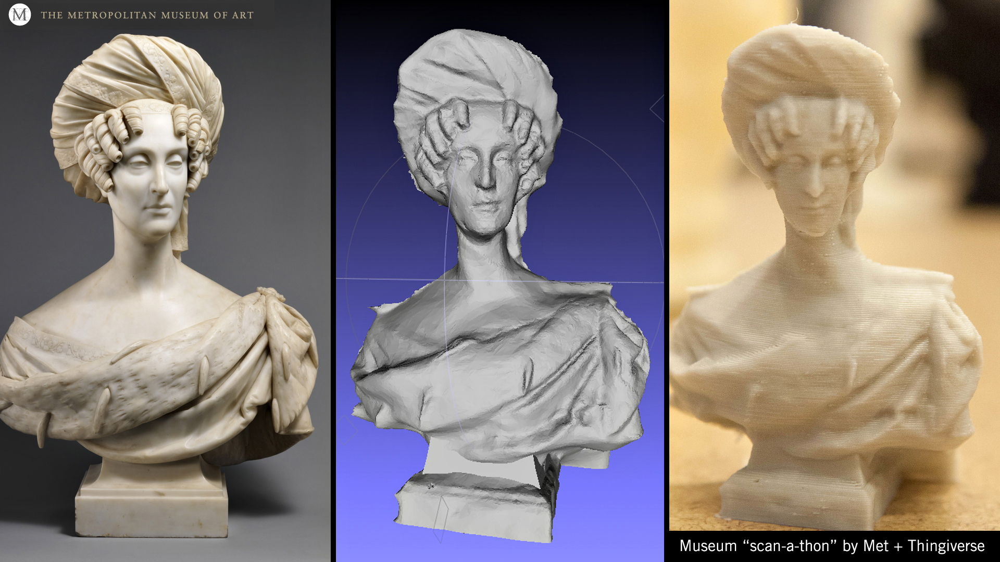
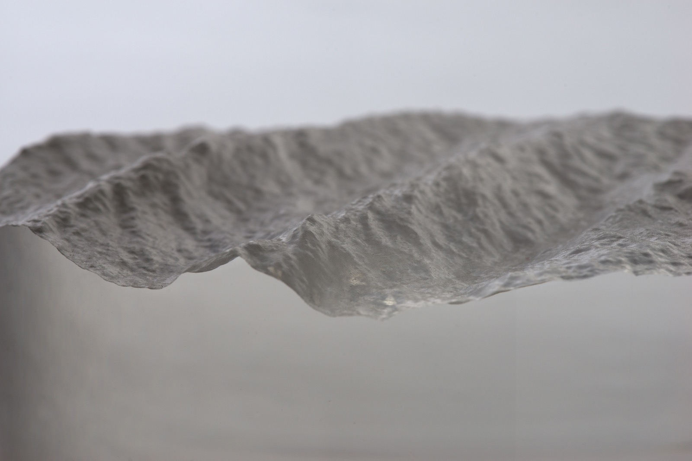
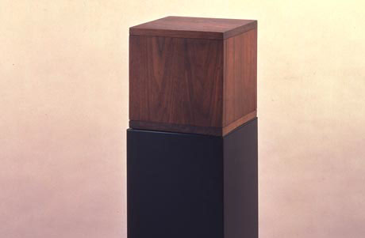

# 'Object' References

What does it mean? Still Life Symbolism in Photograpy
https://www.youtube.com/watch?v=iQ_ftM0ZXy8
Art of Arrangement: Photography and the Still Life Tradition i

## Some Things to Contemplate

In 2012, the Metropolitan Museum of Art in NYC and Makerbot collaborated on a "Scanathon", in which the public roamed the museum with 123DCatch iPhone software, and uploaded [hundreds of 3D CAD models to Thingiverse](http://www.thingiverse.com/met/designs). Considered progressive for its time, more and more museums are publishing their [archives of sculpture as 3D models] (http://sites.museum.upenn.edu/monrepos/evidence/evidence.html). Scanning and sharing 3D models of objects is a common thing now. 

 

Perhaps less common is the kind of conceptual leap that's made when an artist like David Bowen produces a work like [46°41’58.365″ lat. -91°59’49.0128″ long. @ 30m](http://www.creativeapplications.net/objects/longitude-and-latitude-david-bowens-cnc-routed-sculptures-capture-the-waves/), a collection of CNC-routed clear acrylic sculptures generated from the 3D-scanned surface of the ocean: 

 

--

#### Various still lifes by Samantha Taylor-Johnson

3D scanning is cool and I'mma let you finish, but

Samantha Taylor-Johnson (also known as Sam Taylor-Wood) has created some exceptional time-lapse still-lifes which make heavy reference to the history of painting: 
* [*Still Life* (2001)](https://www.youtube.com/watch?v=pXPP8eUlEtk)
* [*A Little Death* (2002)](https://www.youtube.com/watch?v=01tx6u3lasM)

--

#### Large and Small

In capturing representations of objects, keep in mind that the world of the microscope and the telescope are available to you.

* [*Brilliant Noise*](https://vimeo.com/1284717) (2006) is a hyperspectral portrait of the Sun, by the British media arts collective SemiConductor (Ruth Jarman and Joe Gerhardt
* *[Snowtime](https://vimeo.com/87342468)*, Microscopic timelapse of snowflakes forming, by Slava Ivanov (2014). Also by Slava Ivanov is *[Daphnia](https://vimeo.com/136739473)* (2015), high-speed microvideography of a water-flea.

 

--

#### Box with the Sound of Its Own Making

 

[Box with the Sound of Its Own Making](http://www.wikiart.org/en/robert-morris/box-with-the-sound-of-its-own-making-1961), by Robert Morris (1961) represents a unique scenario of superimposed capture and presentation: 

> As its title indicates, Morris's "Box with the Sound of Its Own Making" consists of an unadorned wooden cube, accompanied by a recording of the sounds produced during its construction. Lasting for three-and-a-half hours, the audio component of the piece denies the air of romantic mystery surrounding the creation of the art object, presenting it as a time-consuming and perhaps even tedious endeavor. In so doing, the piece also combines the resulting artwork with the process of artmaking, transferring the focus from one to the other. Fittingly, the first person in New York Morris invited to see the piece was John Cage. Cage was reportedly transfixed by Box with the Sound of Its Own Making, as Morris later recalled: *"When Cage came, I turned it on... and he wouldn't listen to me. He sat and listened to it for three hours and that was really impressive to me. He just sat there."*

--

#### Capturing *Archives*; Presenting *Archives*

 

*Pockets Full of Memories* (2003-2006) by [George Legrady](http://pulse.mat.ucsb.edu/~g.legrady/) is an installation in which a data collection station allows the public to contribute a digital image of an object from their pockets, and add descriptive keywords. A Kohonen self-organizing map algorithm is used to visualize the data, arranging the contributors' objects according to similarities defined by their semantic descriptions.

 

The *[Nail Art Museum](https://www.youtube.com/watch?v=40pSU5ZM784&t=2m26s)*, by Jeremy Bailey (2014) is an augmented reality archive of virtual objects, presented on the artist's hands. 

 

