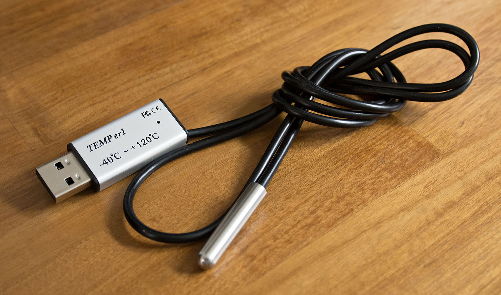
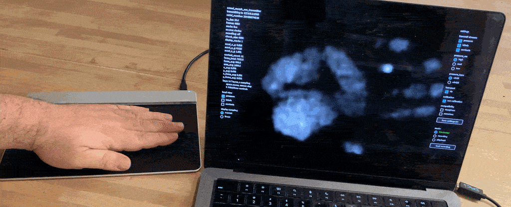
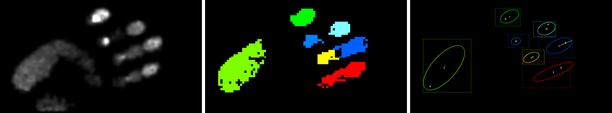
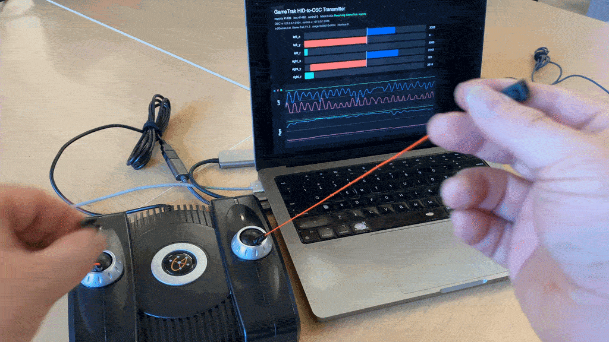

# Examples of Capture with OSC


**Open Sound Control (OSC)** is a simple protocol for sending structured, real-time data between computers, phones, sensors, instruments, and other devices. Originally developed for electronic music, OSC has become a widely used *lingua franca* for connecting interactive systems, especially in creative coding, media art, performance, and physical computing. OSC messages are commonly sent as UDP packets over a local network: one device sends messages to another device’s IP address and port. (I could tell you a UDP signaling joke, but you might not get it.)

OSC organizes data in a simple, hierarchical, quasi-human-readable form. A message consists of an **address** followed by one or more **values**, for example:

```text
/phone/accelerometer/x   -0.37
/phone/accelerometer/y    0.81
/phone/accelerometer/z    0.12

/hand/left/x             427.5
/hand/left/y             216.2

/button/record             1
```

The address names what the data represents; the values contain the changing measurements. This makes OSC particularly convenient for connecting otherwise unrelated tools: the sender and receiver only need to agree on what messages such as `/hand/left/x` mean.

---

*Demonstrations of various kinds of live data over OSC.* 

### Setup

Make sure your transmitter (e.g. phone) and receiver (e.g. laptop) are on the same network, and that your laptop is not blocking UDP packets. 
Next, find out your receiver's IP address. On your Mac laptop, use:

* `ipconfig getifaddr en0` — or better:
* `ipconfig getifaddr "$(networksetup -listallhardwareports | awk '/Wi-Fi/{getline; print $2}')"`


### [TrackOSC](https://github.com/JGL/TrackOSC)

* Download TrackOSC [free from the Apple app store](https://apps.apple.com/app/trackosc/id6795593815)
* Processing demo: [TrackOSC.zip](../code/gesture_tools/TrackOSC.zip)

### [GyrOSC](https://www.bitshapesoftware.com/instruments/gyrosc/)

* Download GyrOSC [on the Apple app store](http://itunes.apple.com/us/app/gyrosc/id418751595) (\$0.99)
* Processing demo: [gyrOSC.zip](../code/gesture_tools/gyrOSC.zip)
* Some alternatives: 
  * [Data OSC](https://apps.apple.com/us/app/data-osc/id6447833736)
  * [SeeOSC](https://apps.apple.com/us/app/seeosc/id6740987202)

### [TouchOSC](https://hexler.net/touchosc)

* Download TouchOSC Mk1 [on the Apple app store](https://apps.apple.com/us/app/touchosc-mk1/id288120394) or [Google Play](https://play.google.com/store/apps/details?id=net.hexler.lex) ($4.99)
* Processing demo: [touchOSC.zip](../code/gesture_tools/touchOSC.zip)

### [TrackpadOSC](https://github.com/LingDong-/TrackpadOSC)

* Original [repo by Lingdong Huang](https://github.com/LingDong-/TrackpadOSC)
* App and Processing demo: [gyrOSC.zip](../code/gesture_tools/TrackpadOSC.zip)


---

## Some Recent OSC Projects

*Some recent work to make old devices speak OSC.* 

### Temperature Sensor 

[This is an open-source OSC shim](https://github.com/CreativeInquiry/TEMP_er1_USB_temperature_sensor) for the TEMP_er1 USB temperature sensor.




### Sensel Morph

[This is an open-source OSC shim](https://github.com/CreativeInquiry/Sensel-Morph-Liberation) for the Sensel Morph. an unusually expressive pressure-sensitive input device.






### Gametrak Controller

[This is an open-source OSC shim](https://github.com/CreativeInquiry/GameTrak-Liberation) for the Gametrak PlayStation controller, a six-axis position-sensing device. 



