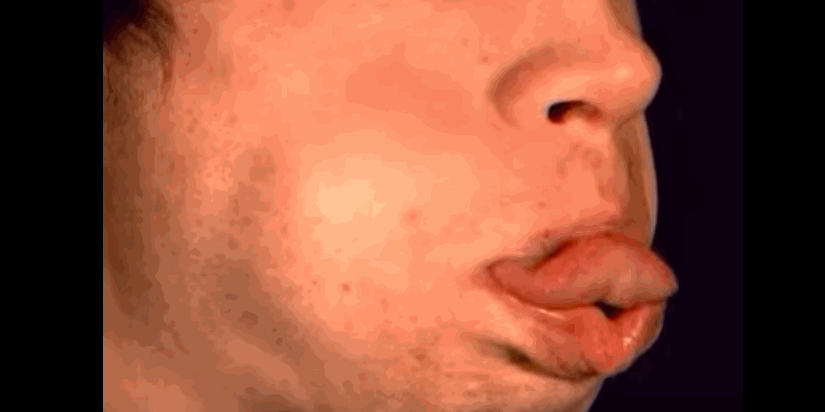
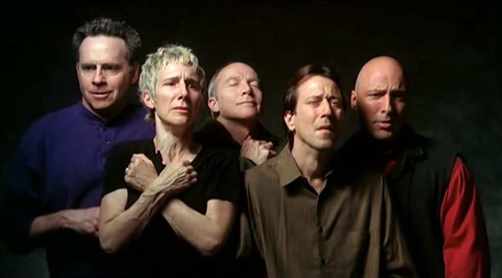
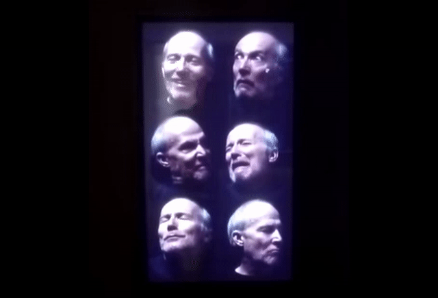
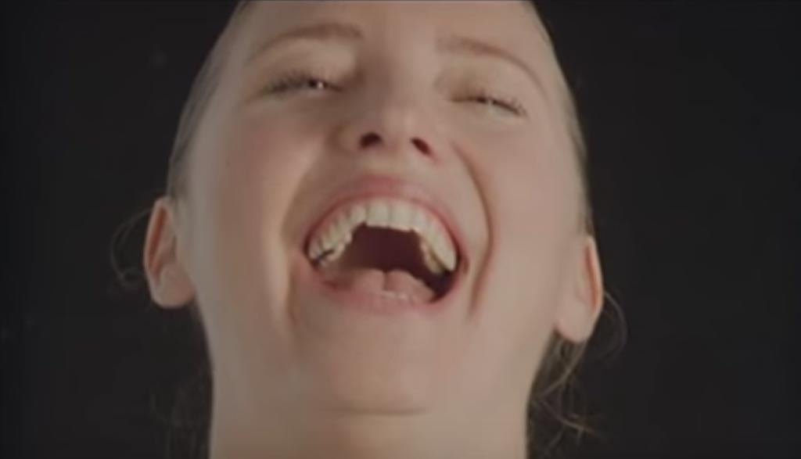
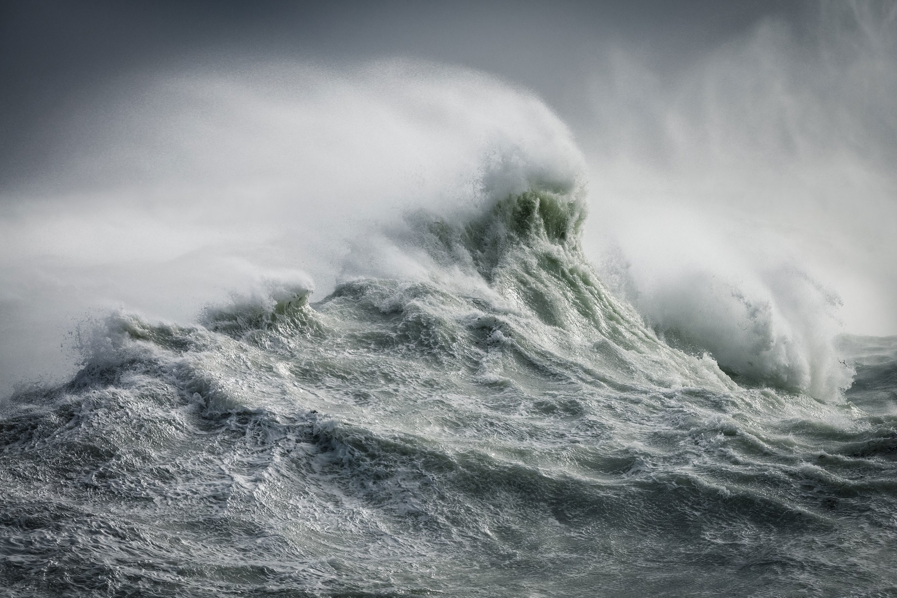
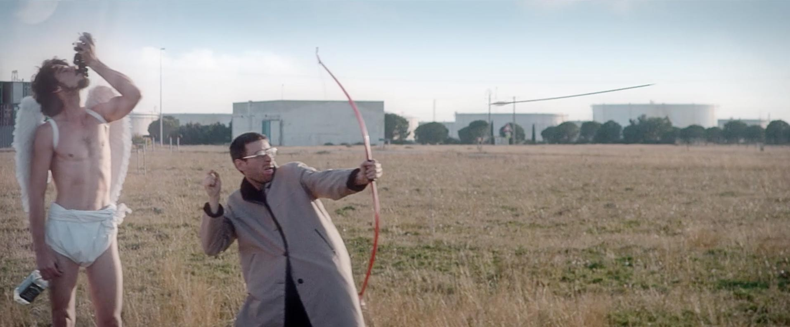
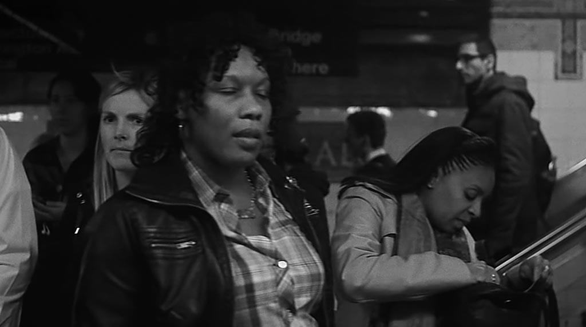
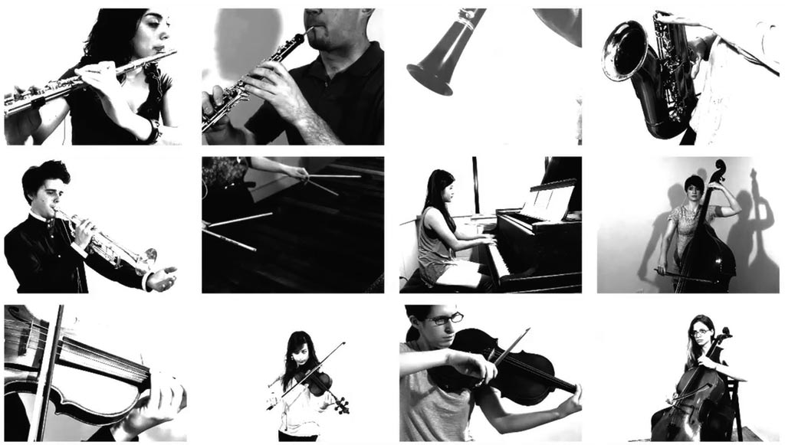
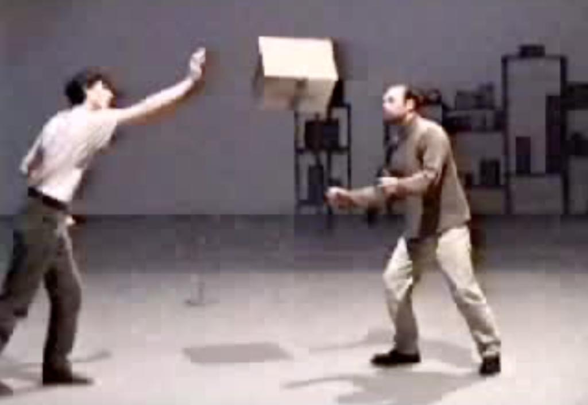
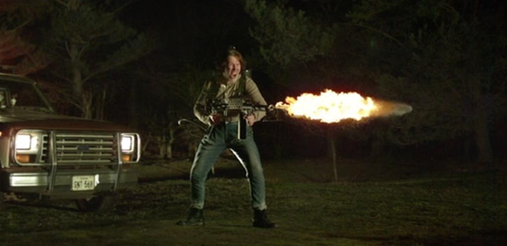

# Overcranking (Slow-Motion)

### High-Speed Photography & Videography
*This page includes contributions by [Matt Gray](http://www.northeastern.edu/camd/theatre/people/matt-gray/)*. 

Ordinary video is customarily 25 (Europe) or approximately 30 (USA) frames per second (fps). Slow-motion cinema, also known as *overcranking*, is achieved by using a special camera which can record events at higher frame rates, such as 1000fps. When this video is then played back at the usual frame rate, it appears slowed down. 

Some practical options available to our class are: 
* Modern iPhones can achieve 240 frames per second.
* We have an [Edgertronics](http://edgertronic.com/) high-speed camera, capable of up to 18,000 fps. This camera does 720p video at 700 fps. 
* We have a Casio Exilim Pro EX-F1 ($750-1000), which can record low-resolution video at 300, 600, and 1200 frames per-second. 
* Another option is the inexpensive Sony PS3-Eye USB webcam (less than $50). Using Chris Baker's addon for openFrameworks, the PS3 eye can achieve can record 320x240 video at frame rates of 60,120, 187, and (with some glitches) 205 fps, yielding up to a 8x slowdown.

Because the exposure time of each frame is so short, high-frame-rate cameras generally require a lot of light. A lighting kit or bright sunshine is essential for good results with slow-motion cameras. 

### Readings

* [Wikipedia article on Slow Motion cinema](https://en.wikipedia.org/wiki/Slow_motion)

### Things to see and consider

1. [Edgerton](https://www.youtube.com/watch?v=SMoIKNZGyf8) Documentary developing strobe light & using it to capture fast movements 
1. [Edgerton stroboscopy, 1940](https://www.youtube.com/watch?v=gspK_Bi0aoQ)
1. Slow-motion as an analytic tool for "microexpressions"
  * Slow-motion is widely used for analyzing ballistics and other very short events ([gunshots](https://www.youtube.com/watch?v=7y9apnbI6GA), [impacts](https://www.youtube.com/watch?v=QfDoQwIAaXg), etc.). However, it can also be used for analysis of ultra-fast facial expressions.
  * [Paul Ekman on microexpressions](https://www.youtube.com/watch?v=EXm6YbXxSYk)
  * [David Matsumoto on A-Rod microexpressions](https://www.youtube.com/watch?v=bu3ayOWHX0w)

---

1. Miscellaneous Slow-Motion Experiments on the Internet
  * There is all manner of slow-motion tomfoolery on the internet. 
  * [Time Warp: Water balloon hits face](https://www.youtube.com/watch?v=90VyvOhPmA0)

 

  * [High speed video of man blowing raspberry](https://www.youtube.com/watch?v=cWGn6_EH2gM)

 
 
  * [Face slap](https://www.youtube.com/watch?v=7AXB8nGq5jc)
  * [Baby laugh, with audio](https://www.youtube.com/watch?v=8igSA8HdR_Q)
  * ['Ultraslo' stock clips](http://www.ultraslo.com/)
  * [High speed video clip database, Colorado State](http://high_speed_video.colostate.edu/)

--

1. Bill Viola: [*The Passions*, at the Getty](http://www.getty.edu/art/exhibitions/viola/art.html)
  * [The Quintet of the Astonished](https://www.youtube.com/watch?v=MR9av-I35ME)

  * [Silent Mountain](https://www.youtube.com/watch?v=e2Eam0GMjZg)
  * [The making of Emergence](https://www.youtube.com/watch?v=hx5Cu7U-Fkg)
  * [Six Heads (The Passions)](https://www.youtube.com/watch?v=x1mGaf1lElo)

 
  * [Observance (2002)](https://www.youtube.com/watch?v=aiz19J-wVnE)
  * [The Dreamers](https://www.youtube.com/watch?v=mJpv4Z1X3CY)

1. Sam Taylor-Wood, [*Hysteria*](https://www.youtube.com/watch?v=33PZhpay8gM)
	* In Sam Taylor-Wood's [*Hysteria*](https://www.youtube.com/watch?v=33PZhpay8gM) (1997), a woman displays extreme emotions in slow-motion. "There are no sounds, so the viewer cannot be certain whether she is moved by joy, despair or both." [Citation](http://www.absolutearts.com/artsnews/2002/01/25/29597.html)

1. [Rachel Talibart](https://www.rachaeltalibart.com/) Uses high-speed photography and telephoto lenses to catch waves: 

1. Guillaume Panariello
  * [*unconditional rebel - siska*](https://vimeo.com/118738368) (music video)

 (music video)

1. Adam Magyar, *Stainless*
  * High-speed recordings of people on subway platforms. 
  * [Stainless - Shinjuku](https://vimeo.com/77489382)
  * [Stainless, 42 Street](https://vimeo.com/83664407)
  * [Interview with Magyar](https://medium.com/matter/einsteins-camera-88aa8a185898)
  

  
1. Luke DuBois, [Vertical Music](https://vimeo.com/41507465) (2012). A chamber piece written for 12 players, lasting 4 1/2 minutes. Each musician was filmed individually in several takes using a high-speed (300fps) camera and an extremely high definition (1 MHz) analog-to-digital audio recording setup. When played back at 30fps, total time is ~45 minutes.

 

---

1. Julien Maire, [*Double-Face* and *Ordonner*](http://julienmaire.ideenshop.net/project3.shtml)

  * French new-media artist Julien Maire plays fun on the concept of slow-motion cinema in these elaborately conceived simulacra, which are not actually presented in slow-motion. In one live performance (*Ordonner*), he heaves "heavy-looking" cardboard boxes which are in reality filled with helium balloons; their slow, gentle tumble through the air is a near-perfect imitation of slowmo video. In Maire's *Double-Face* performance, a coin tossed in the air tumbles ever more slowly until it eventually comes to a rest in mid-air; in fact, the coin is controlled by a mechatronic suspension system with nearly invisible guy-wires.
  * [*Double-Face* ](images/julien_maire_df_perf.mov), http://julienmaire.ideenshop.net/mov/df_perf.mov
  * [*Ordonner*](images/julien_maire_or_perf.mov), http://julienmaire.ideenshop.net/mov/or_perf.mov

---

1. The Dancing Pigeons, [*Ritalin*](https://vimeo.com/13639493) (Music video, 2010)
 (Music video, 2010)

---

1. Steve Giralt, [Burger Assembly](http://nofilmschool.com/2016/08/how-capture-slow-mo-burger-drop-robots-phantom-flex4k-camera) (slow-mo plus robot arm) [Vimeo](https://vimeo.com/178939743)

---

### Some Really Really Fast Cameras

* [Phantom cameras](http://www.visionresearch.com/Products/High-Speed-Cameras/) can achieve about 1.4 million fps. 
* [Spinning mirror systems](http://www.stanfordcomputeroptics.com/applications/physics/rotating-mirror-camera.html) can achieve 3 million fps. 
* This camera can capture neurons firing, at [100 billion frames per second](http://www.livescience.com/55296-high-speed-camera-captures-neurons-firing.html).
* This [trillion-fps camera from MIT](http://video.mit.edu/watch/visualizing-video-at-the-speed-of-light-one-trillion-frames-per-second-9742/) can capture the movement of light *as it travels*. 
* [Ultra-slow-motion with Machine Learning interpolation](https://www.youtube.com/watch?v=MjViy6kyiqs)

### Audio 

Special things happen to sound when it is slowed down *and* time-stretched. The best-known example of this is the "800% slower" Justin Bieber track, *[U Smile](http://knowyourmeme.com/memes/800-slower-time-stretch)*. Note that the time-stretching preserves the original frequences of the audio, rather than causing the pitch to drop into the infrasonic range. 

Zach Poff has [Resources for Exploring Ultrasound](https://www.zachpoff.com/resources/exploring-ultrasound/). For example, Bioacoustics researchers and hobbyists use portable bat detectors to lower their pitch into the human hearing range in realtime. 