# Perspective Capture and Imaging

---

### Readings

* [Beyond Linear Perspective:
Art, Human Vision, and Computer Graphics](https://www.dgp.toronto.edu/~hertzman/sig22-perspective/)
* Aaron Hertzmann, [How Does Perspective Work in Pictures?](https://aaronhertzmann.com/2022/02/28/how-does-perspective-work.html)
* Robert Carroll et al., [Optimizing Content-Preserving Projections for Wide-Angle Images](http://vis.berkeley.edu/papers/capp/)
* Steven M. Seitz and Jiwon Kim, [Multiperspective Images](http://grail.cs.washington.edu/projects/stereo/cga.html)

---

### Perspective Representation

*Size = Proximity* (Right?)

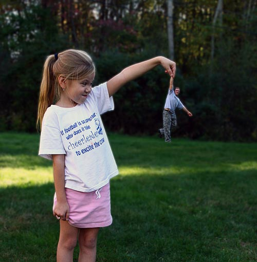 
*Forced perspective by [mtsonic](https://www.flickr.com/photos/mtsonic/2933383930/).*

Owing to our familiarity with perspective imaging, we take for granted that things which are larger, are closer. (When we play with this notion, it's called [*forced perspective*](http://naldzgraphics.net/photography/forced-perspective-photos/).) But it wasn't always this way, and it doesn't have to be. 

### Hierarchical size 

*Size = Importance*

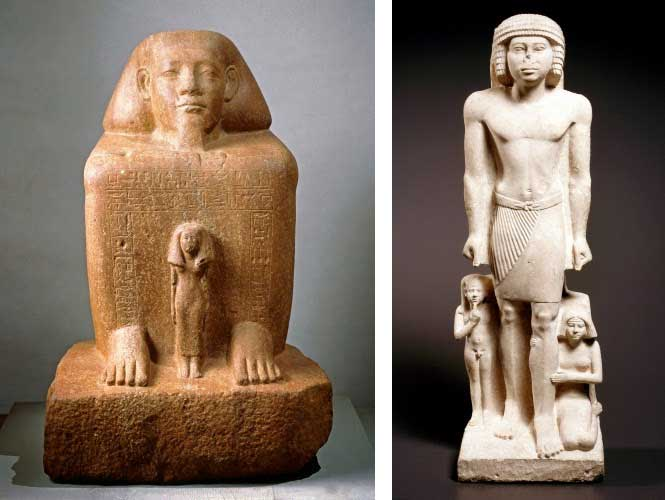 
*At left, from [here](http://www.curatorscorner.com/2014_10_01_archive.html?m=1): "Senwosret-senebefny, an Egyptian official in the Twelfth Dynasty (1937–1759 bce), depict the deceased squatting on the ground covered in a cloak. The small figure is Itneferuseneb, most likely Senwosret-senebefny’s wife." At right: Family Group, mortuary statue, ca 2371–2298 bce.*

This is *psychological* rather than *mechanical* representation.

### Perspectiveless Imaging

*Size = A Question of Composition*

The "lack" of perspective is a common feature in Asian, Indian, and Medieval European art. Notice how the characters are all the same size, even if they are further away. Well, "further away" from what? Who (or what) is the implied observer here? 

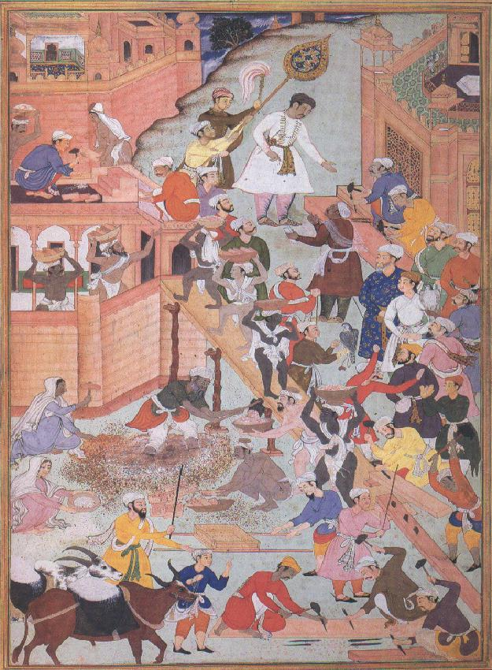 
*[Akbar Inspecting the Construction of Fatehpur-Sikri](http://www-personal.umich.edu/~pomorski/mug1.html)*, Mughal empire, India (c. 1590).

It's important to remember that *perspective is an invented technology for representing the 3D world in two dimensions*. It was invented in 1435, by Leon Battista Alberti (1404-1472), who provided the first theory of what we now call linear perspective in his book, *On Painting.* After 1435, the technology spread rapidly throughout Europe. 

 
*The Last Supper*, by Ugolino De Nerio (circa 1325), and Leonardo Da Vinci (circa 1494).

### Orthographic/Isometric and Other Projections 

Orthographic projection is an alternative to perspective projection, in which parallel lines don't converge. It is widely used in engineering drawings, for dimensioning parts. 

Orthographic projection has been known since antiquity; [according to Wikipedia](https://en.wikipedia.org/wiki/Orthographic_projection#Origin), Hipparchus used the projection in the 2nd century BC to determine the places of star-rise and star-set. In about 14 BC, Roman engineer Marcus Vitruvius Pollio used the projection to construct sundials and to compute sun positions.

Here is Hans Lencker's "Machine for Orthographic Projection" in 1571. You can think of this as an *orthographic camera*. 

 
*Hans Lencker's "Machine for Orthographic Projection" (1571), from [DrawingMachines.org](https://drawingmachines.org)*

![Alfred Molteni's Cranial Tracing Device, circa 1860]
(https://drawingmachines.org/images/machine/193/web/1860-62_AlfredMolteni_CranialTracingDevice_by_Broca.jpg) 
*Alfred Molteni's Cranial Tracing Device, circa 1860, from [DrawingMachines.org](https://drawingmachines.org)*

Furthermore, just because you have 3D-dimensional data in a computer, it doesn't mean that it must be rendered with perspective projection. *Perspective projection is simply the default rendering mode in OpenGL and DirectX.* 

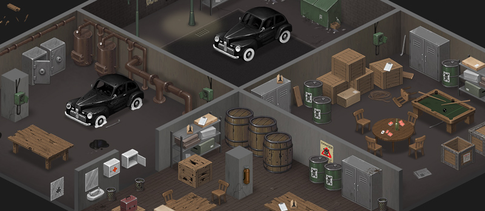 
Orthographic perspective in *Gangster Squad*.

In fact, there are a wide variety of alternative graphical projection methods, including orthographic () mode, above (also called isometric or "ortho"), and more. (For orthographic projection in openFrameworks, see [ofCamera](http://openframeworks.cc/documentation/3d/ofCamera.html) and [ofEnableOrtho()](http://openframeworks.cc/documentation/3d/ofCamera.html#show_enableOrtho).) Are you using linear perspective in your interactive VR? Ask yourself if you're just being *lazy*. 

 
*Alternative graphical projection methods.*

-- 

### Telecentric Lenses

A [*telecentric lens*](https://en.wikipedia.org/wiki/Telecentric_lens) is an unusual type of lens whose focal point is at infinity. It naturally produces an orthographic view of its subject. It can only work for small objects, i.e. smaller than the lens aperture. Such lenses are used in machine vision systems because image magnification is independent of the object's distance or position in the field of view.

This [video](https://www.youtube.com/watch?v=8xP4lr1ojTo) demonstrates telecentric imaging well: [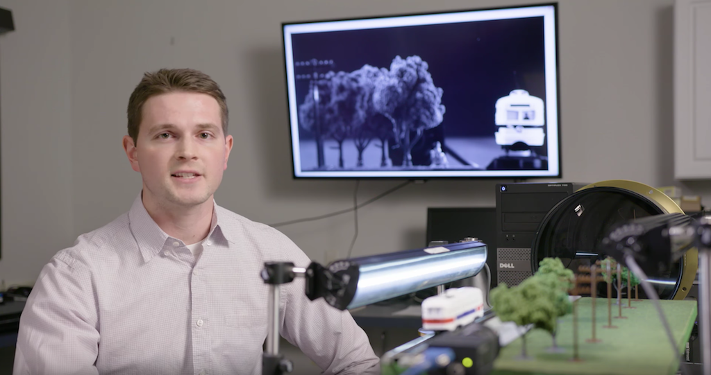](https://www.youtube.com/watch?v=8xP4lr1ojTo)

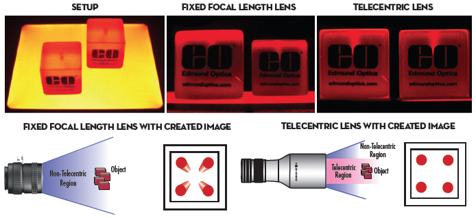 
*Telecentric imaging, from Edmund Optics.*

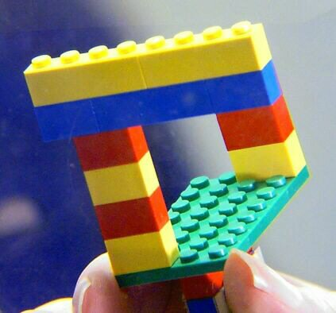 
*Illusion picture made with a digital camera and a telecentric lens system, [from here](http://www.lhup.edu/~dsimanek/3d/telecent.htm).*

You can see a telecentric lens used to document insects in the Berlin Natural History Museum in [this video at 1:43](https://www.youtube.com/watch?v=vkUJ9CBGg-w).

-- 

### Hypercentric / Pericentric Lenses

A hypercentric (or pericentric) lens provides a converging view of an object, letting you see the top and all around the sides, simultaneously. One of the most important use cases of hypercentric lenses in machine vision applications is thus  the 360 degree inspection of an object with a single image.  For this to work, the lens must be larger than the imaged object.  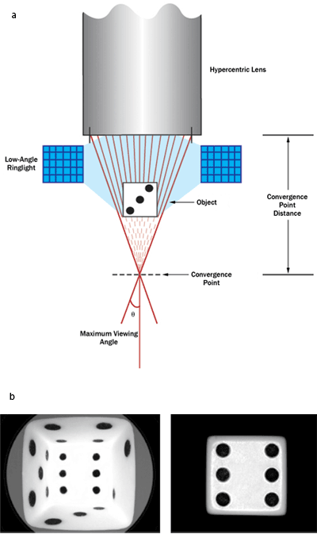

An [example](https://link.springer.com/article/10.1007/s00138-019-01032-w) is shown below. 

> <small>Here, the print on the label of a bottle shown in Fig. 1a must be inspected. The camera was mounted above the bottle with a perpendicular view down onto the object, as illustrated in Fig. 1b. The entrance pupil of a hypercentric lens lies in front of the lens. The object is placed between the entrance pupil and the front of the lens. In this setup, objects that are closer to the camera appear smaller in the image. Figure 1c shows the image obtained by a camera with a hypercentric lens. The bottle’s cap is imaged in the center and the entire label is visible and imaged as a circular ring. Unfortunately, this is achieved at the expense of severe perspective distortions of the object in the image. Figure 1d shows the bottle as observed by a traditional perspective camera.

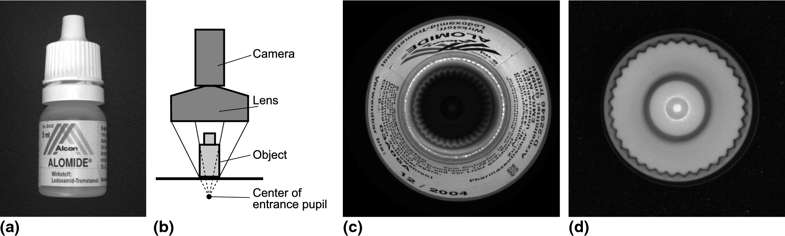

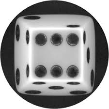

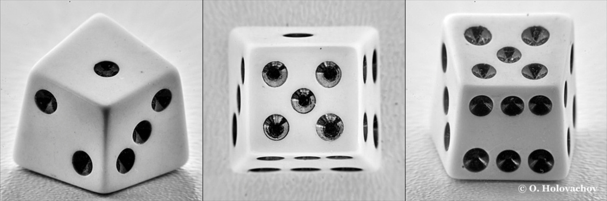
 
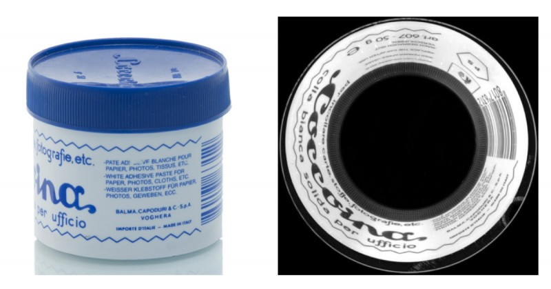

-- 

### Perspective Correction

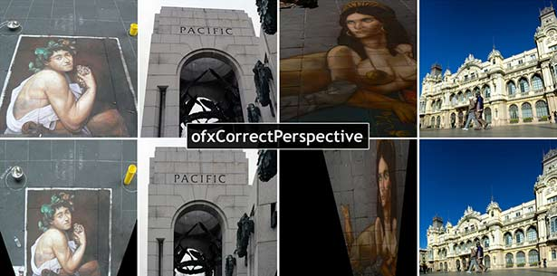 

#### ofxCorrectPerspective 

* [ofxCorrectPerspective](https://vimeo.com/95204456) on Vimeo
* [ofxCorrectPerspective](https://github.com/harisusmani/ofxCorrectPerspective) on GitHub

**[ofxCorrectPerspective](http://golancourses.net/2014/haris/05/14/capstone/)** by CMU student Haris Usmani is an OpenFrameworks add-on that performs automatic 2d rectification of images. It’s based on work done in “Shape from Angle Regularity” by Zaheer et al., ECCV 2012. Unlike previous methods of perspective correction, it does not require any user input (provided the image has EXIF data). Instead, it relies on the geometric constraint of ‘angle regularity’ where we leverage the fact that man-made designs are dominated by the 90 degree angle. It solves for the camera tilt and pan that maximizes the number of right angles, resulting in the fronto-parallel view of the most dominant plane in the image.
