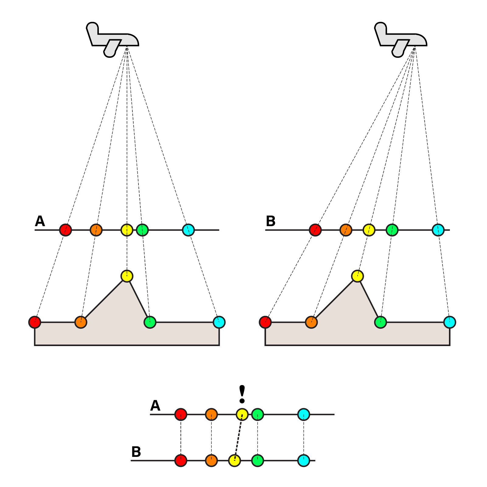

# Photogrammetry and 3D Scanning

The input to photogrammetry is *photographs*, and the output is typically a 3D model of some real-world object or scene. 

### History

---

### Triangulation from multiple images

3D shapes are determined by comparing corresponding points in multiple images. 

---

---

[Video on the History of Women in Photogrammetry](https://www.youtube.com/watch?v=kzgrwmaurKU) (warning, sexist old-timers) 

The Kelsh Stereoplotter (1940s), video: 

### Other Investigations  

[Calculating the 3D shape of lightning](http://calculatedimages.blogspot.com/2013/05/3d-lightning.html?m=1), from two people in completely different places getting a photo of the same lightning bolt.

  * [ScanLab created a fashion shoot with 3d laser scanners](http://www.dezeen.com/2014/06/26/scanlab-vivienne-westwood-first-laser-scanned-photoshoot-interview/)

				