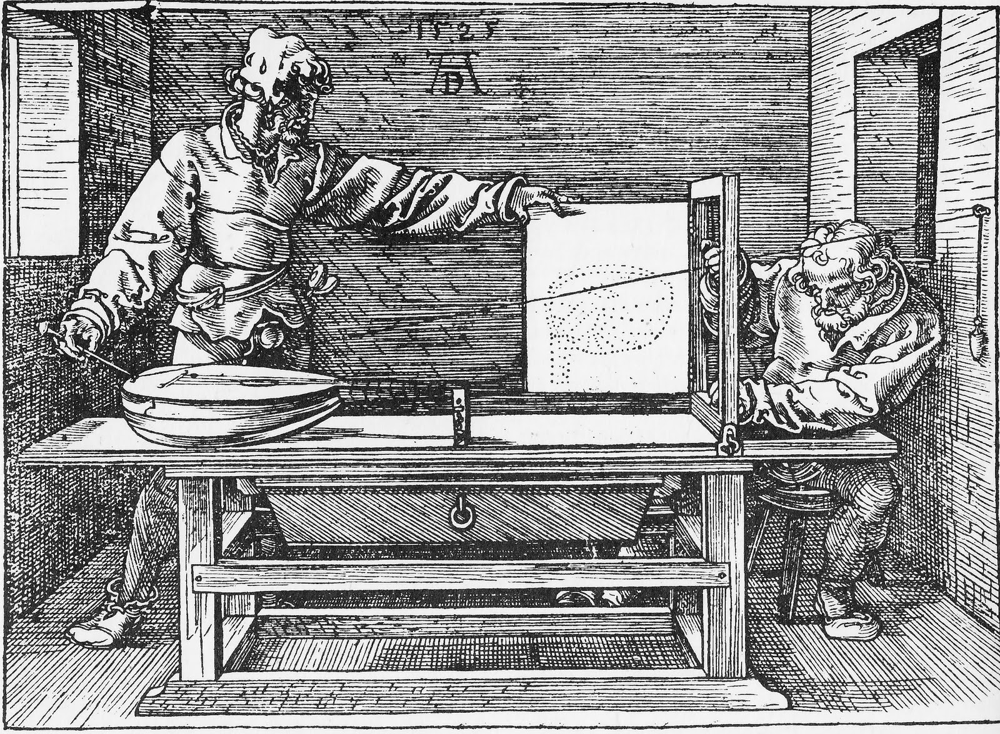
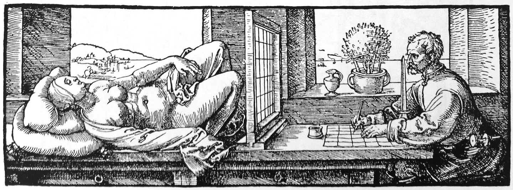
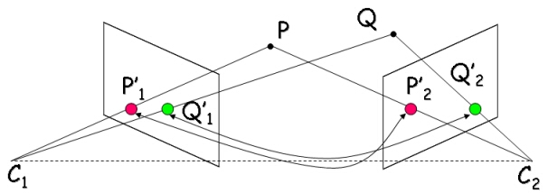
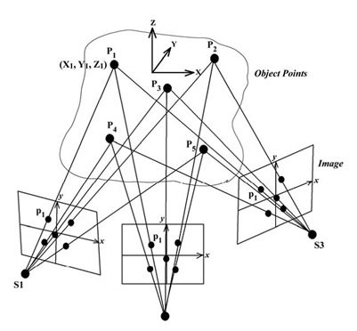
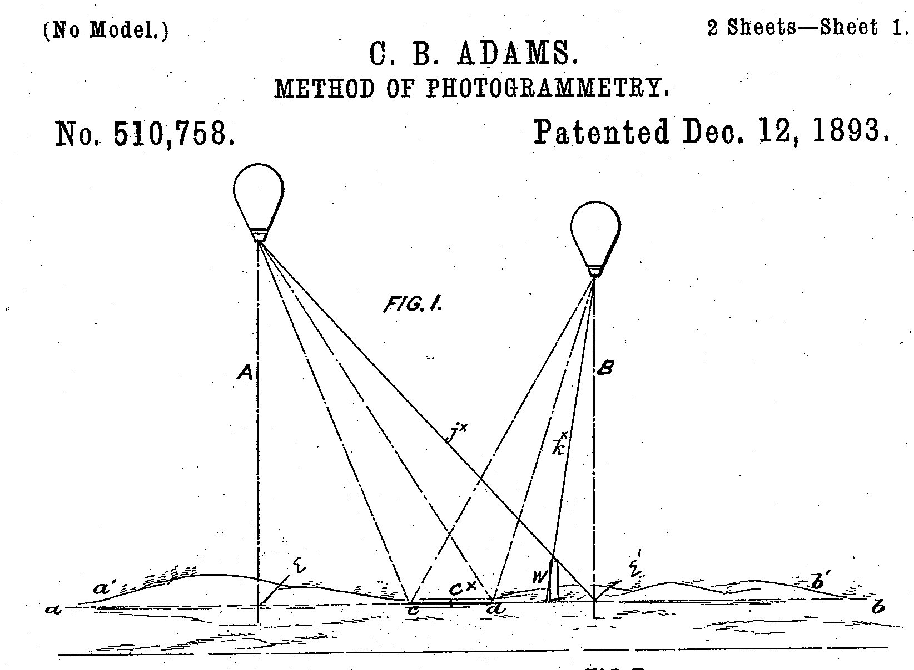
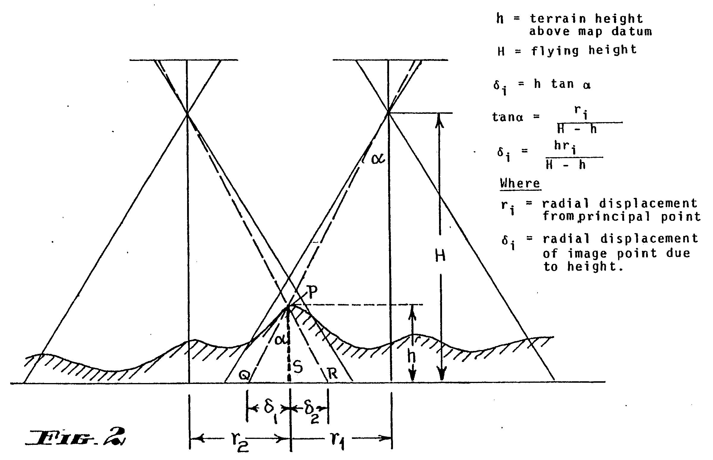
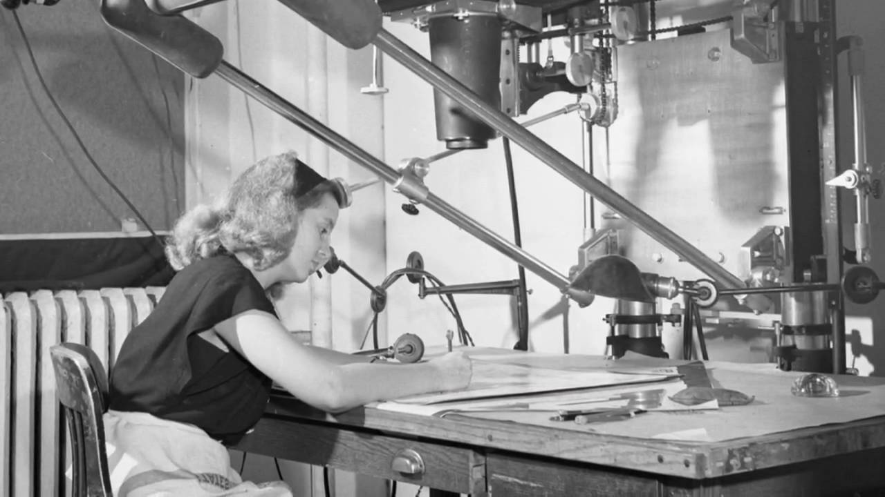
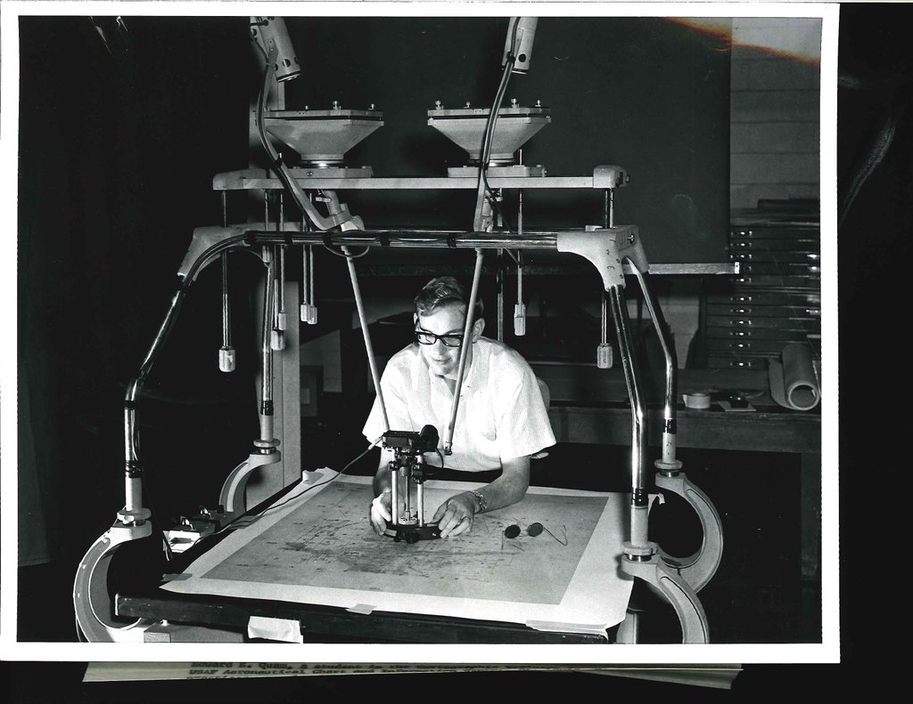
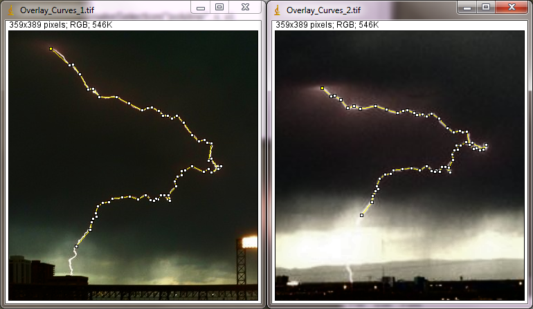
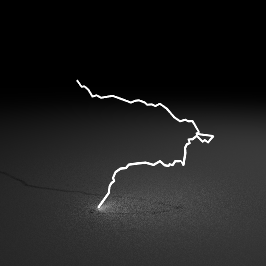

# Photogrammetry and 3D Scanning

The input to photogrammetry is *photographs*, and the output is typically a 3D model of some real-world object or scene. 

### History

---

### Triangulation from multiple images

---

---

[Video on the History of Women in Photogrammetry](https://www.youtube.com/watch?v=kzgrwmaurKU) (warning, sexist old-timers) 

The Kelsh Stereoplotter (1940s), video: 

### Other Investigations  

[Calculating the 3D shape of lightning](http://calculatedimages.blogspot.com/2013/05/3d-lightning.html?m=1), from two people in completely different places getting a photo of the same lightning bolt.

* Google Earth		
	* Using stereo photogrammetry to make google maps buildings. [Article](www.mastersketchup.com/why-google-doesnt-need-sketchup-anymore/) [Video](https://www.youtube.com/watch?v=N6Douyfa7l8)
   * [With satellite](http://eijournal.sensorsandsystems.com/newsite/wp-content/uploads/2012/06/cover_section3_grx.jpg)
* Real estate (look into the homes online) [Matterport](http://realestate.matterport.com/)
* LIDAR 
  * [ScanLab created a fashion shoot with 3d laser scanners](http://www.dezeen.com/2014/06/26/scanlab-vivienne-westwood-first-laser-scanned-photoshoot-interview/)
  * [Terrestrial laser scanning by CyArk]	(http://www.cyark.org/education/terrestrial-lidar-3d-laser-scanning	)
  * [Phantom by Scanlab] (http://scanlabprojects.co.uk/projects/newmuseumnewyork) VR Brazilian rainforest

				