# Capturing Places

--- 

### Where we are today: 360° Video 

Let's get this out of the way: You should all be aware that "360° video" is a thing, it's here, and is now a part of everyday life, (for example) built into YouTube. If you haven't had a chance to record some, perhaps you should give it a try. 

* Here you get to, *ahem*, see the "First-Ever War Zone in Virtual Reality": [Aleppo Syria in 360-degree video](http://www.ryot.org/syria-virtual-reality-war-zone-welcome-to-aleppo-ryot/940261) 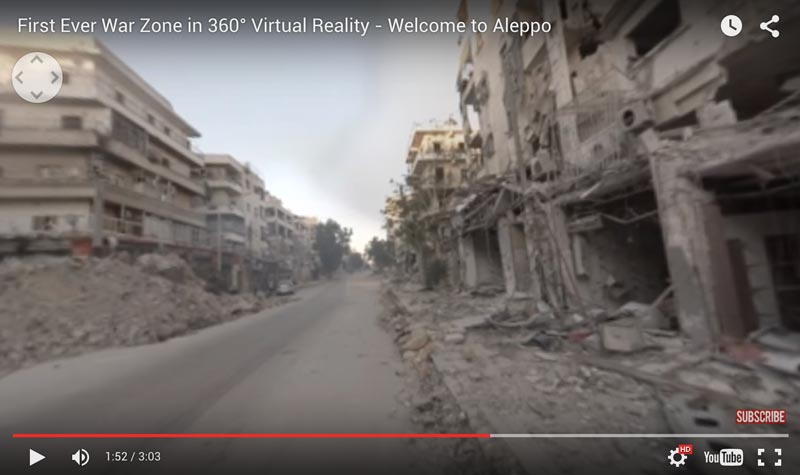

* Here's an interesting use of floating labels in 360: [Sharks in 3D](https://www.youtube.com/watch?v=aQd41nbQM-U&t=1m5s) 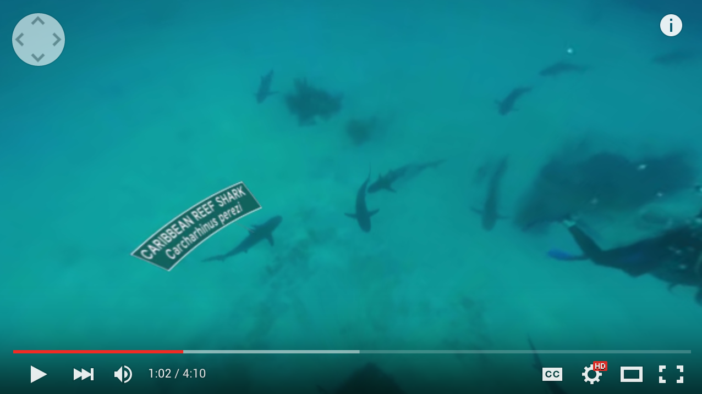

* Different players allow zooming and panning in different ways. It makes for some strange views. This video by Noa (["Grafitti on my Heart"](http://eyes.kolor.com/video/bd9a95b579eb5859c8d07fe0180daea0)) uses the Kolor player: 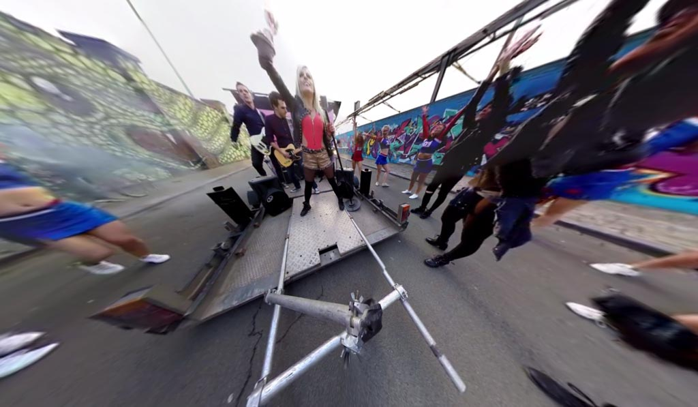.

#### We have several devices that can record 360 degree video: 

* [Ricoh Theta M15 360 Degree Spherical Panorama Camera](http://www.amazon.com/Ricoh-Theta-Degree-Spherical-Panorama/dp/B00OZCM70K/) 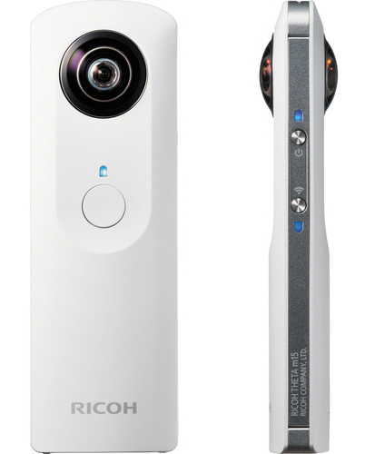

* [V.360 HD Camera Kit](http://www.amazon.com/gp/product/B00PSSGKRQ/)
 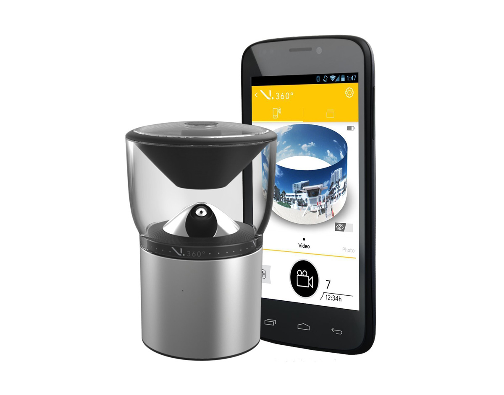

* [Sony HD Bloggie 360](http://www.sony.co.uk/hub/mobile-hd-snap-camera/bloggie-features/article/360-video-shooting) 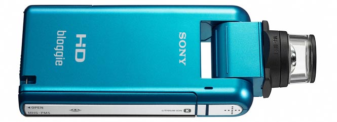 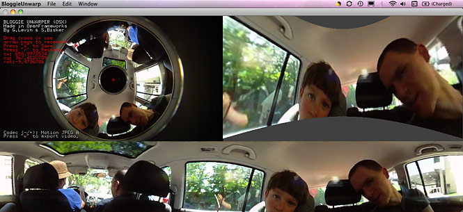

---

### Questioning Renaissance Perspective

For today's lecture we will presently interpose this presentation on alternatives to classical Western perspective. 

* [**Perspective Capture and Imaging**](https://github.com/golanlevin/ExperimentalCapture/blob/master/docs/perspective.md)

---

### Extreme Views

* [Trevor Paglen uses photography to reveal secret sites and satellites](https://www.youtube.com/watch?v=9Igfu0VwdkQ) as a mode of artistic practice. Trevor is "a guy who points his camera through astronomy telescopes at secret military sites to photograph things that are off limits to the public." To produce his work, he designs photographic processes using astronomy telescopes. (*Show 0:00-3:30*) 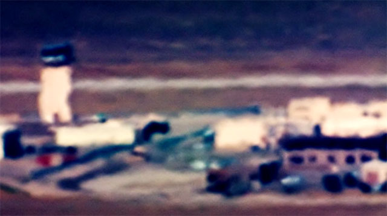

* British artist Mishka Henner [has been gathering satellite images](http://hyperallergic.com/230003/the-surreal-beauty-of-feedlots-by-satellite/) of feedlots, or Concentrated Animal Feeding Operations (CAFOs). Ordinarily, photographing CAFOs is illegal due to "[Ag-Gag](https://en.wikipedia.org/wiki/Ag-gag)" laws. 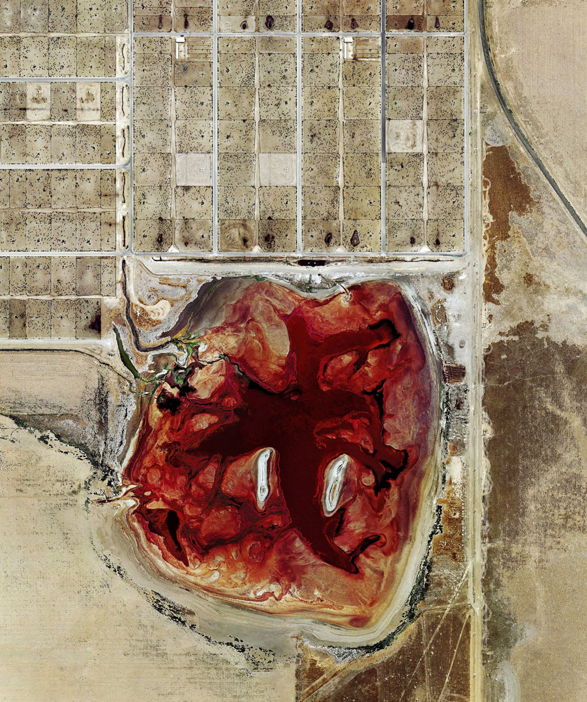

* An extreme view can be had using very simple means, providing an unusual physiological perception of extreme stereo. Here is a [Telestereoscope (Eyestilts) by Cassidy Curtis](http://eyestilts.com/images/scopebm_sunday.jpg) 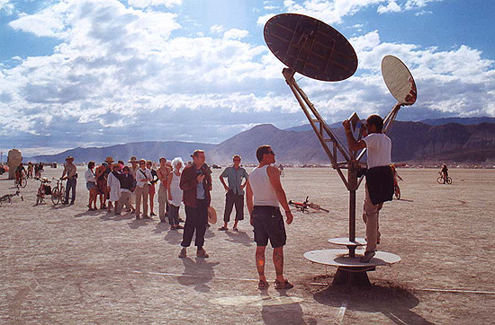

* *or breaking laws* with an extreme [Selfie Stick](http://imgur.com/LrpYIem) 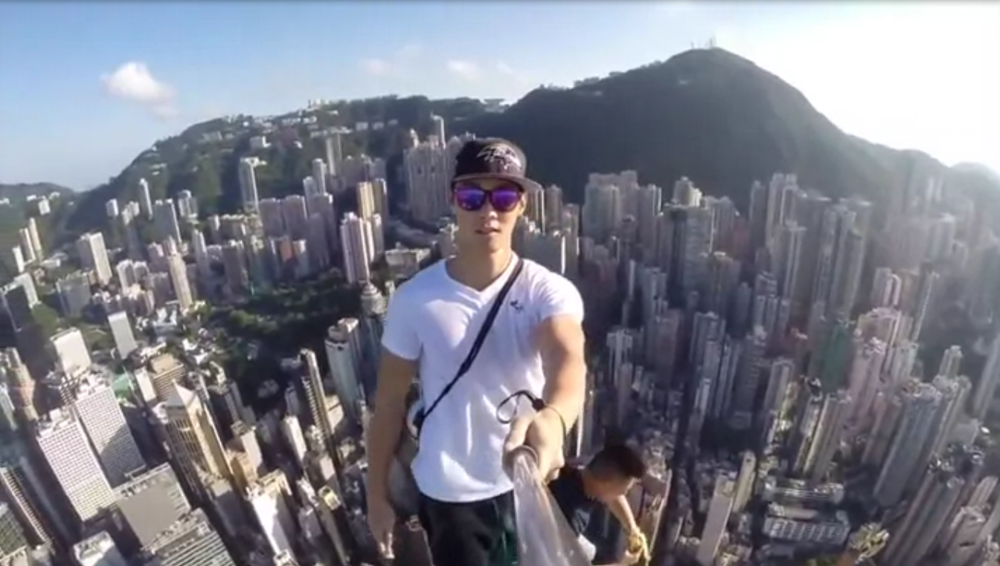

---

### Capturing Places through Mirrors 

* Spherical mirror arrays, which capture a scene from many simultaneous perspectives, [allow for interesting possibilities](http://yuichitaguchi.com/project/AxialCones/), including distortion correction, digital refocusing for artistic depth of field effects in wide-angle scenes, and wide-angle dense depth estimation.

* Images of what someone is looking at can be recovered from reflections in their eyes. See: Ko Nishino et al., ["Corneal Imaging System: Environment from Eyes". ](http://www1.cs.columbia.edu/CAVE/publications/pdfs/Nishino_IJCV06.pdf)

This has privacy considerations. [Identifiable Images of Bystanders Extracted from Corneal Reflections](http://journals.plos.org/plosone/article?id=10.1371/journal.pone.0083325) (Rob Jenkins, Christie Kerr). (See also [Motherboard](http://motherboard.vice.com/blog/humans-are-really-good-at-facial-recognition)).

---

### Temporal Play to Understand Space

* [35 years of Shinjuku Skyscraper Construction in 10 seconds]
(https://www.youtube.com/watch?v=laPU0bS8JOc&t=0m5s)
* Geoffrey Reggio and Philip Glass, Koyaanisqatsi (1982)
Koyaanisqatsi (Pt. 3, The Grid)
https://www.youtube.com/watch?v=fwPDFeXEMs4
47:48 - 55:29
* Keith Loutit, [The Lion City](https://vimeo.com/keithloutit/thelioncity). "The idea behind the extension of the tilt shift technique is for focus and distance to be something the viewer can experience. It also doubles to communicate the constant heat and humidity that hits you whenever you leave the comfort of air conditioning in Singapore."
* [Tokyo Time lapse (4k!)](https://www.youtube.com/watch?v=MFpaAKBQR_4&t=0m25s)
* Alvaro Cassinelli, [Khronos Projector](https://www.youtube.com/watch?v=hrr1Sgk-1Vc)
* Jeff Desom, [Spatialized timelapse of Hitchcock's Rear Window](http://www.criticalcommons.org/Members/ccManager/clips/spatialized-timelapse-of-hitchcocks-rear-window/view)
* David Rokeby, ["*Machine for Taking Time*"](http://www.davidrokeby.com/mftt_fdl.html). Two high-definition cameras were mounted on pan-tilt mounts on the east and west sides of the Foundation building in Montreal. 1024 images per camera per day were recorded from precise points of view for a year. The resulting database of about 750,000 images is explored by two computers, and they stitch together leisurely continuous pans through the city, staying true to the spatial trajectory but shifting unpredictably through time. 

* Claire Hentschker: Photogrammetry from High-Speed Footage (Adam Magyar, Stainless) https://vimeo.com/83664407

---
### Long Exposure (Light Painting)

Some spaces are uniquely defined by the objects moving within them, whose paths can be visualized through long exposure techniques.

* [Terence Chang, long exposure photos of airplane takeoffs](http://www.amusingplanet.com/2011/05/long-exposure-shots-of-airline-takeoffs.html)
* [Long Exposure Photographs of Gold Fireflies in Japan](http://www.thisiscolossal.com/2011/12/stunning-time-lapse-photographs-of-gold-fireflies-in-japan/)
* David Rokeby, [*Plot Against Time*](http://www.davidrokeby.com/PlotAgainstTime.html)

---
### Representing Places from Found/Multi/Crowd-Sourced Imagery

* [Aram Bartholl's *Dust*](http://datenform.de/rhizome2011-dust.html) is a 1:1 scale replica of one of the most played computer game maps in the world: the 3D model of ‘[de_dust](http://counterstrike.wikia.com/wiki/Dust)’ of the first person shooter game ‘Counter Strike’ as a permanent ‘building’ from concrete, making this map accessible as a large scale public sculpture.

* [Michael Kontopoulous, *Horizons*](https://vimeo.com/1609048).
What do all westerns have in common? *The horizon.* This is a video installation in which horizon shots from various Samurai and Spaghetti Western films have been stitched together to form one expanded environment. 

* Moving from the landscape of cinematic imagination to the landscape of banal *documentation*, Jason Salavon has created [image averages of homes-for-sale](http://salavon.com/work/Homes/) from classified advertisements in different metropolitan areas. 

 

The use of online databases of tagged images substantially expands our ability to learn about places, as they are seen by multitudes of people. 

 
In her series "*Photo Opportunities*", artist [Corinne Vionnet](http://www.corinnevionnet.com/-photo-opportunities.html) works to create landscapes generated from *thousands* of tourist photos. She takes efforts to align them first. ([Additional article](http://petapixel.com/2013/10/23/photo-opportunities-interview-artist-corinne-vionnet/)) 

Pep Ventosa is working in a similar way: 

* We've mentioned this project before, but databases can also work in an inverse way, to *imposing restrictions.* [Camera Restricta](https://github.com/golanlevin/ExperimentalCapture/blob/master/docs/conceptual-cameras.md#camera-restricta), a 'disobedient' camera designed to take unique photographs. By using data from geotagged photos the camera will refuse to operate in popular places. 

* Speaking of restrictions, your camera might even be disobedient by design. [This Apple patent would remotely disable protesters' phone cameras](http://www.zdnet.com/article/apple-patent-could-remotely-disable-protesters-phone-cameras/). This could prevent cinema bootlegging, but also see areas of political protest activity 'ring-fenced', disabling phone and tablet cameras.

* In *The Nine Eyes of Google Street View*, Canadian artist Jon Rafman collects the bizarre and beautiful sights captured by the Google streetview. There's no need to take new photos; one can just find them. [*The 9 Eyes of Google Streetview*](http://9-eyes.com/) 

* An inverse approach to this is [Paolo Cirio's *Street Ghosts*](http://streetghosts.net/) 

---

### 3D Spatio-Temporal Composites

* As James George pointed out last week, Microsoft Research [developed 3D models from thousands of tagged tourist photos](http://phototour.cs.washington.edu/).
* Noah Snavely, [Finding paths through the world's photos](http://phototour.cs.washington.edu/findingpaths/)
* [Blaise Agüera y Arcas of Microsoft, TEDGlobal](https://www.youtube.com/watch?v=4LxlhoemR3A) 3D panorama (show from 1:18)

--

### Spaces defined by *Moving* Cameras

 
[*Time Tunnel (Camera on a Car Wheel)*](https://vimeo.com/84162988), by Dirk Roy for Boris Blank/Yello

* [Roel Wouters, Camera Workshop at ECAL](http://gizmodo.com/these-designers-make-boring-old-video-cameras-do-imposs-1444863383)
* Jump rope camera: [*Full Circle* by Callum Cooper](https://vimeo.com/37077712)
* Hula hoop camera: [at Burning Man](https://www.youtube.com/watch?v=J9bZ_8lZZfE) (NSFW)
* Time Lapse with Motion compensation: [Earth Rotating Instead of Stars](https://www.youtube.com/watch?v=nkn2ZXWDl6k)
* Sometimes the camera is moving relative to the reference frame of gravity, but not to the apparent scene: [Studio Moniker, *Sally*](http://roelwouters.com/sally)
* [Camera shutter speed synchronized with helicopter blade frequency](https://www.youtube.com/watch?v=cxddi8m_mzk)

---

### LIDAR

* LIDAR-scanned woodland, [Marshmallow Laser Feast](http://thecreatorsproject.vice.com/en_au/blog/virtual-reality-lets-you-become-a-mystical-forest-creature?utm_source=tcptwitteranz)
* ScanLAB Projects + Daniel Steegmann use Oculus + LIDAR in [*PHANTOM*](http://scanlabprojects.co.uk/projects/newmuseumnewyork)
* Dotswarm's [Photogrammetry Point-Cloud Player](http://dotswarm.nz/ourWork.html#Sifted)
* Patricio Gonzalez Vivo has released an openFrameworks addon for ripping Google Streetview LIDAR spheres, which he uses in his exploration [*Skylines III: Point Cloud City*](https://vimeo.com/89982874)

We have a 1D LIDAR, the Hokuyo [URG-04LX-UG01](https://www.hokuyo-aut.jp/02sensor/07scanner/download/products/urg-04lx-ug01/) for which Dan Moore has created [ofxUrg](https://github.com/danthemellowman/ofxUrg): 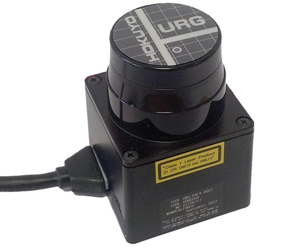

--- 

### Augmented Reality

* Microsoft's [Room Alive](http://www.theverge.com/2014/10/5/6912979/microsoft-roomalive-research-projector-system)
