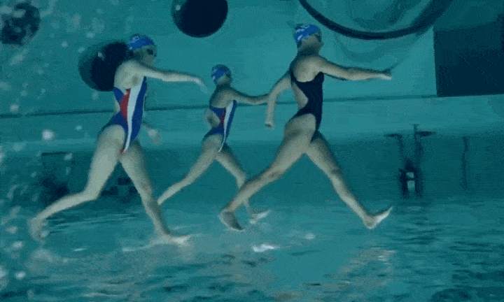
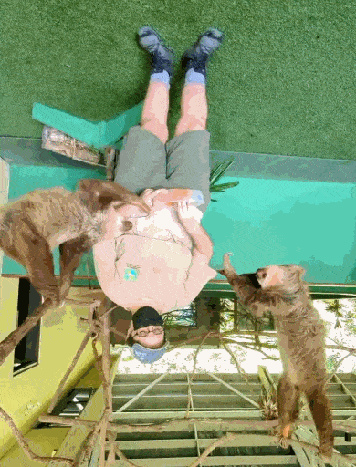
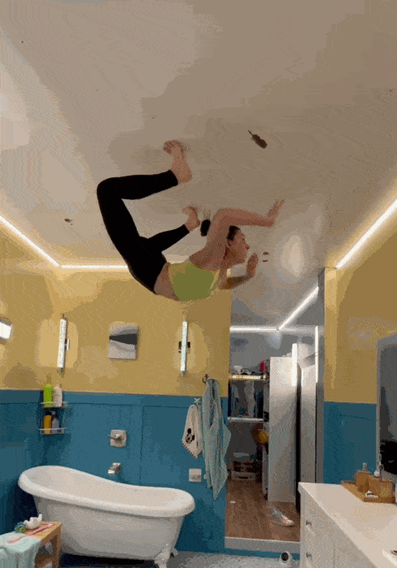
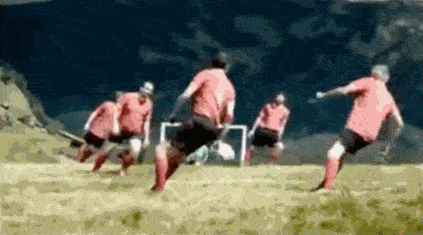
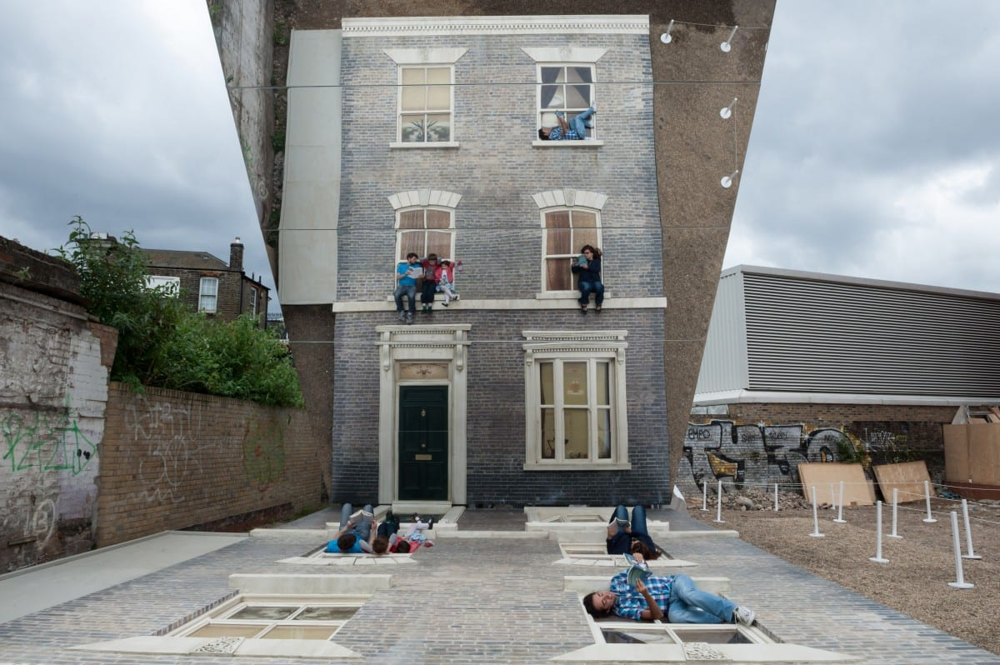
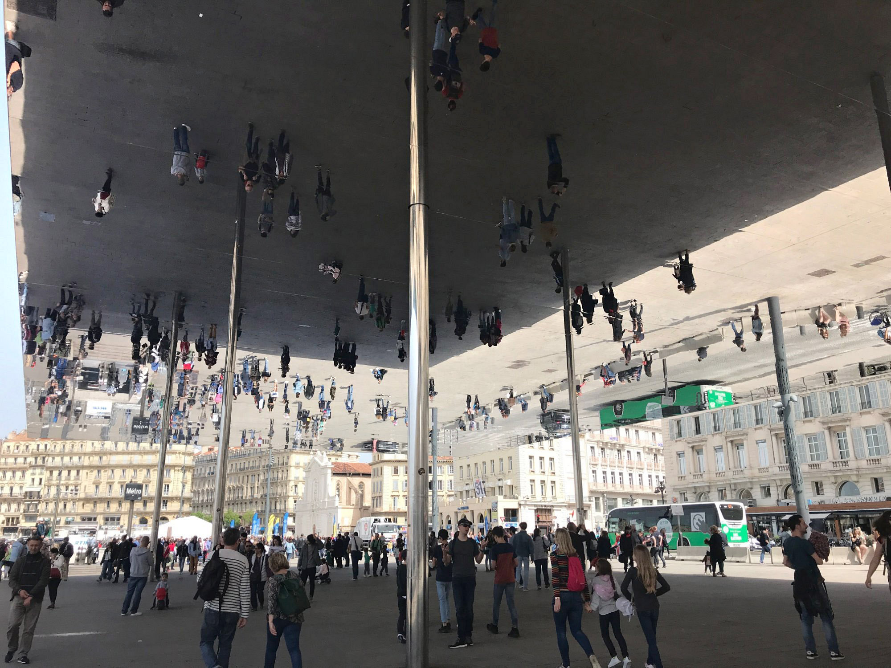
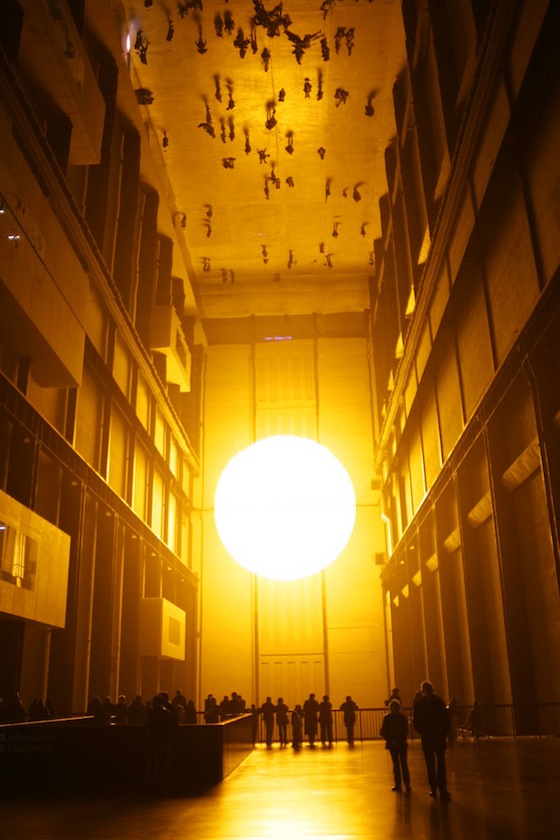

# Point of View: Inversion & Rotation

Flipping one's view upside-down to see the world in new ways. Works especially well with double-flips (i.e. flipping phenomena which are already "upside-down"). 

---

### Inversion

[Underwater upside-down view of synchronized swimmers](https://www.youtube.com/watch?v=NhEvyXfGZfY) (YouTube), by Fabio Ferioli / [Source](https://x.com/Rainmaker1973/status/1821496576377762118)

[Hanging bats filmed upside-down look like a Goth nightclub](https://www.youtube.com/watch?v=bS6KWNB5NEo)

[Inverted sloths by Andy Quitmeyer](https://x.com/HikingHack/status/1524772008973770754)

[Gymnastics in an upside-down house](https://www.youtube.com/shorts/l9g74jz_dEI)

---

### Rotation

Alpine Football

View of Juggling seen from above.

---

### ...With Mirrors

*Dalstonhouse* by Argentine artist, Leandro Erlich ([Vimeo](https://vimeo.com/236042664); [Article](https://www.dezeen.com/2013/06/26/dalston-house-by-leandro-erlich/))

[*L'Ombrière* (Mirror Roof Pavilion) by Norman Foster Architects](https://www.youtube.com/watch?v=iaj_9NqpYMY) (YouTube), Marseille, France

[The Weather Project (2003), Olafur Eliasson](https://www.youtube.com/watch?v=IsT9vEpfNq4)

