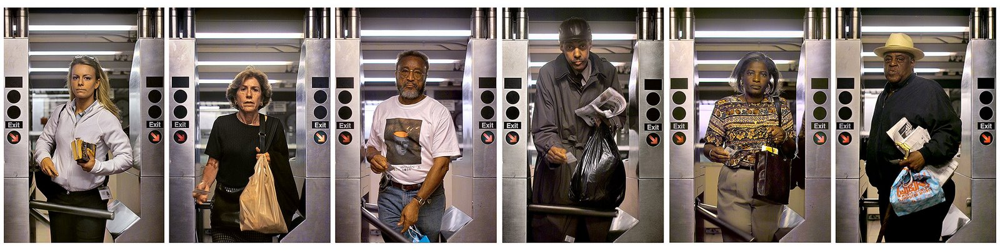

# Portraiture-Systems

Traditional portraiture often centers on a single encounter between artist and subject. In the works presented in these lectures, by contrast, artists develop systems, workflows, and frameworks that generate portraits through repetition, comparison, observation, or inference. Rather than asking how to make a single portrait, these projects ask how a portrait might emerge from a rule, a process, or a dataset.

---

## I. [Systems for Collection and Comparison](portraits_1_series.md)

In [these projects](portraits_1_series.md), the artist creates a standardized format for collecting portraits and then uses comparison as an analytical tool. The resulting works may compare people across time, across populations, before and after a transformation, or or in relation to siblings, twins, possessions, or other matched subjects. The portrait emerges through the differences revealed by a common framework.

* **The core question:** What can we learn about people by arranging multiple portraits into a comparative structure?
* **What is being standardized?** The representation.
* **The artist controls:** The format.

---

## II. [Candid Machinery](portraits_2_candid_machinery.md)

In [these projects](portraits_2_candid_machinery.md), the artist designs a situation rather than a picture. Subjects undergo the same test, ritual, provocation, endurance task, interview structure, or behavioral constraint. By standardizing an experience across many participants, the artist creates a system for eliciting candid and often involuntary responses. The portrait emerges through behavior rather than appearance.

* **The core question:** What can we learn about people by placing them inside a carefully designed situation?
* **What is being standardized?** The situation.
* **The artist controls**: The experience.

---

## III. [The Indirect Portrait](portraits_3_indirect_portrait.md)

In [these projects](portraits_3_indirect_portrait.md), the subject may never appear directly at all. Instead, artists construct portraits from traces, possessions, residues, documents, surveillance records, personal data, biological samples, or other forms of evidence. The viewer infers the person from what they leave behind. Portraits emerge through interpretation rather than depiction.

* **The core question:** What can we learn about people without depicting them directly?
* **What is being standardized?** The evidence.
* **The artist controls:** The data source.

---

## Summary

Together, these three lectures examine different approaches to understanding people through procedural portraiture.

* I	. [We compare their appearance.](portraits_1_series.md)
* II.	[We observe their behavior.](portraits_2_candid_machinery.md)
* III. [We infer them from traces.](portraits_3_indirect_portrait.md)