# Portraits: Systems for Collection and Comparison

---

### Screen Tests

A "Portrait Machine" at Warhol's Factory.

> Warhol's *Screen Tests* are a series of short, silent, black-and-white film portraits by Andy Warhol, made between 1964 and 1966. The Screen Tests, of which 472 survive, depict a wide range of figures, many of them part of the mid-1960s downtown New York cultural scene. Under Warhol’s direction, subjects of the Screen Tests attempted to sit motionless for around three minutes while being filmed, with the resulting movies projected in slow motion. The films represent a new kind of portraiture—a slowly moving, nearly still image of a person. The *Screen Tests* were initially inspired by a 1962 New York City Police Department booklet entitled *The Thirteen Most Wanted*, which showed mugshots of wanted criminals. Warhol began to incorporate the shooting of Screen Tests into the routine of his studio, The Factory, alongside the making of new paintings and other aspects of his enterprise. The filming of Screen Tests was rarely prearranged. There was an area set up for shooting, but the decision to make one was spontaneous, generally involving people who happened to be visiting the Factory.

> Warhol expert Callie Angell has called these films “the yearbook of the mid-1960s avant-garde.” Each test lasted as long as a single 100-foot roll of film. Each was shot at 24 frames per second and projected at two-thirds of that speed, a trick Warhol often used. 

[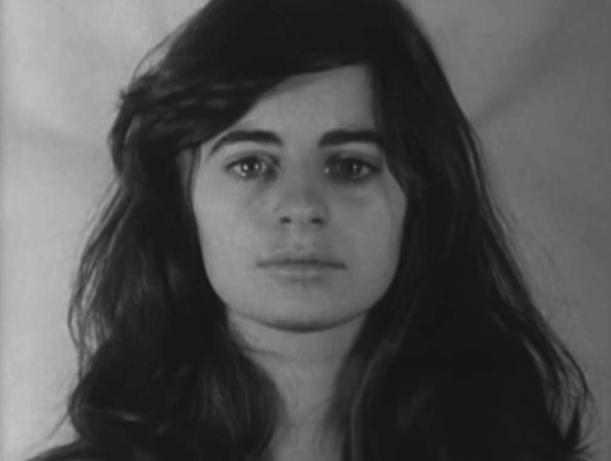](https://www.youtube.com/watch?v=rQEiOoMyvos)

> Many of the subjects appeared uncomfortable. Others seemed beaten. Some were insolent, provocative. Or insolent one moment and provocative the next. Mary Woronov observed in *Swimming Underground: My Years in the Warhol Factory* that the screen tests were like a psychological test: “You would see the person fighting with his image—trying to protect it. You can project your image for a few seconds, but after that it slips and your real self starts to show through. That’s why it was so great—you saw the person and the image.” [Source](http://sacksco.com/notes/dean_and_britta.html)

---

### Marcus Coates, *Dawn Chorus*

* Marcus Coates, [*Dawn Chorus* (2007)](https://www.youtube.com/watch?v=enpuy1WLezY)
* [Original audio](http://audio.theguardian.tv/sys-audio/Arts/Culture/2007/01/24/yellowhammerfinal.mp3) (MP3)
* [Original audio](sounds/dawn_chorus_original_yellowhammer_audio.mp3) (MP3)

---

### Faces Of Century

A common structure for typological portrait series is 'before-after', allowing comparison both *across* individuals (typologically: how do different people respond to the same transformation?) and *within* individuals (transformationally: what are the effects of this transformation on a person?). In this series by Jan Langer (and this related work by [Ana Oliveira](https://petapixel.com/2013/03/10/before-and-after-portraits-that-show-the-effects-of-time-and-aging/)), the passage of time across is depicted across decades:

> For his project called [*Faces Of Century*](https://www.demilked.com/young-vs-old-portraits-faces-of-century-jan-langer/), photographer Jan Langer captured over a dozen Czech centenarians and compared their pictures of when they were young, and when they were over 100 years old.

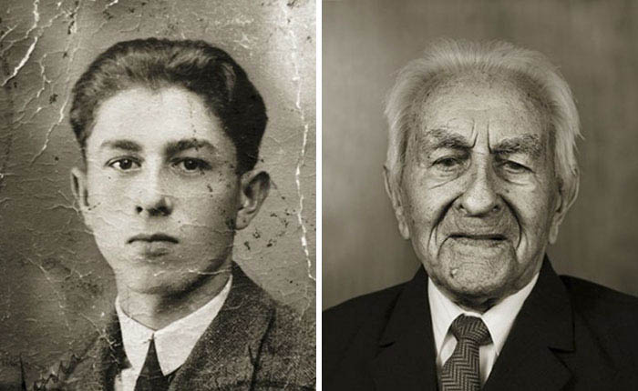

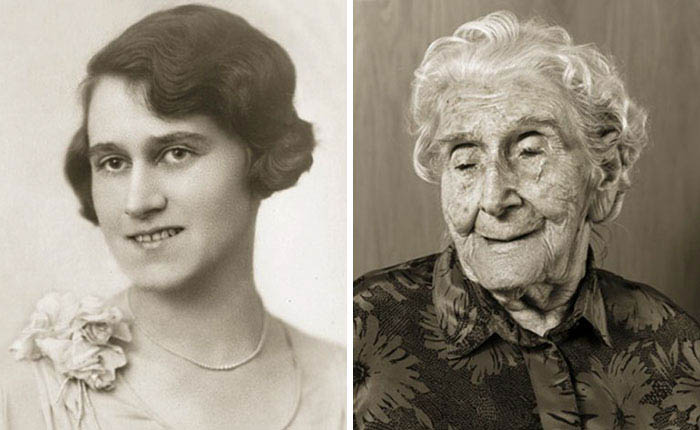

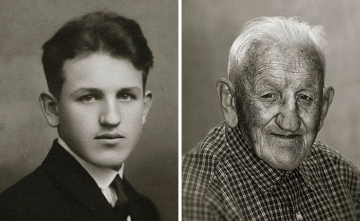

---

### The Brown Sisters

Every year for the past 40 years, Nicholas Nixon has photographed the four Brown sisters. The work depicts differentials of time, and between siblings. [Video](https://vimeo.com/107875653) • [New York Times article](https://www.nytimes.com/interactive/2014/10/03/magazine/01-brown-sisters-forty-years.html)

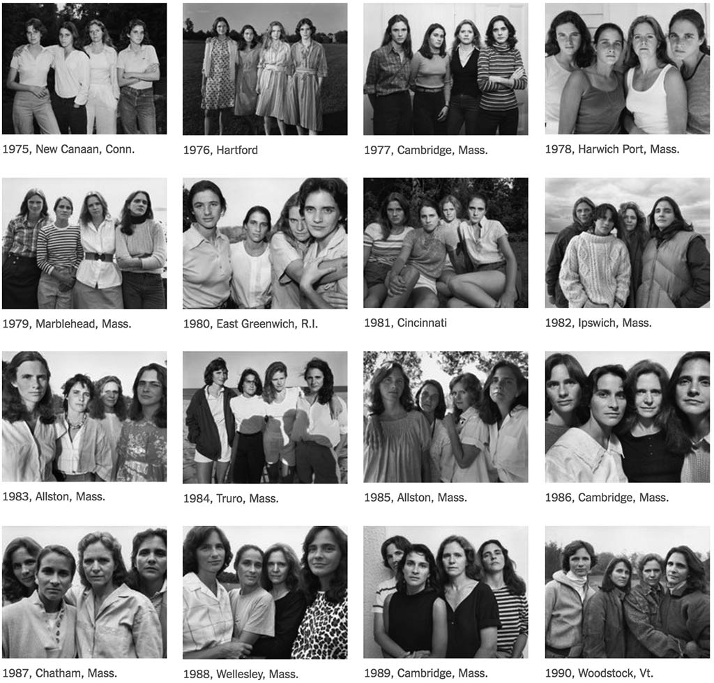

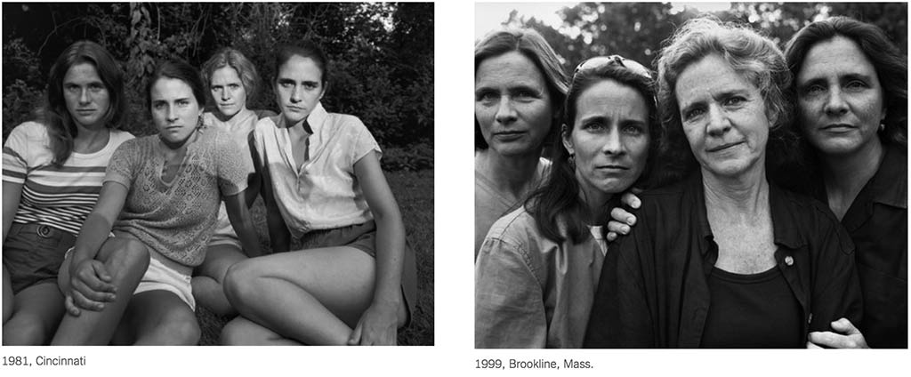

---

### Taryn Simon

Taryn Simon [discusses typological approaches in her portrait series](https://www.youtube.com/watch?v=lBatctT7iFo&t=58s), *A Living Man Declared Dead and Other Chapters*.

[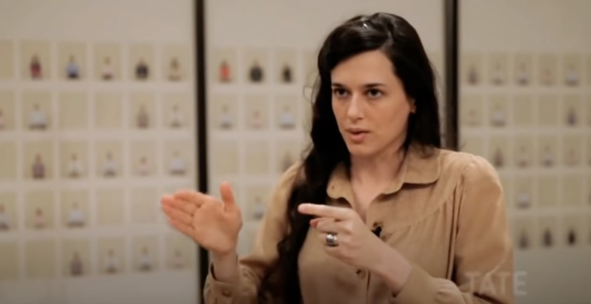](https://www.youtube.com/watch?v=lBatctT7iFo&t=58s)

---

### Faces Under Reflection

Transformations can be purely formal. This [series by Alex Beck](https://time.com/2848303/heres-what-faces-would-look-like-if-they-were-perfectly-symmetrical/) and this [related work by Julian Wolkenstein](https://petapixel.com/2012/10/02/a-portrait-project-showing-subjects-with-two-perfectly-symmetrical-faces/) shows how different people's faces appear when mirrored. 

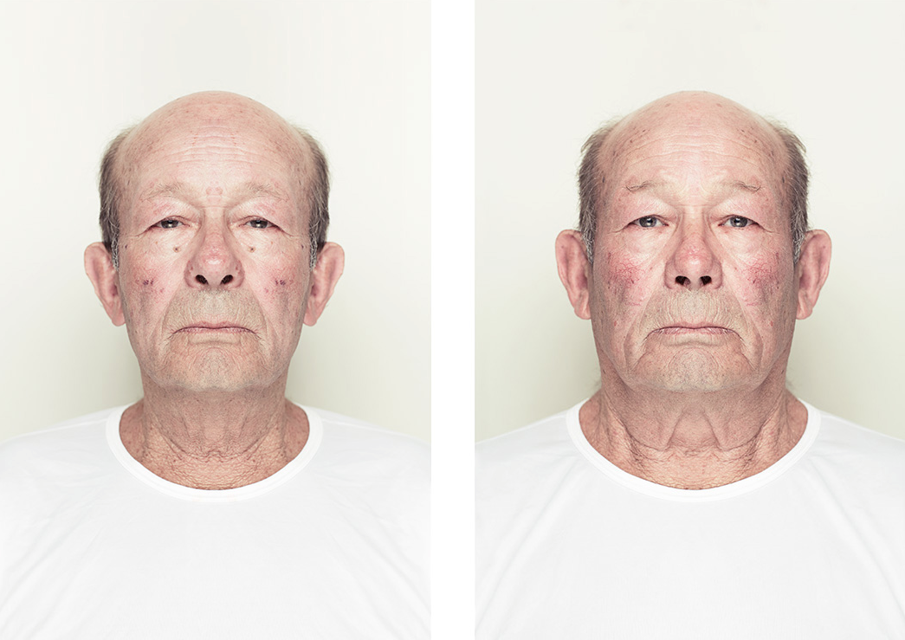


---

### Becoming Mel

> A [series of self-portraits](https://www.slrlounge.com/becoming-mel-self-portrait-series/) shows photographer Mel Keiser upon waking, and then after she’s readied herself to face the world. “The first picture is taken immediately upon waking, before I have a mental concept of my identity or self-image,” says Keiser, “The second picture is taken after I begin to feel like ‘Mel,’ usually after my physical self begins to reflect what I believe ‘Mel’ looks like.”

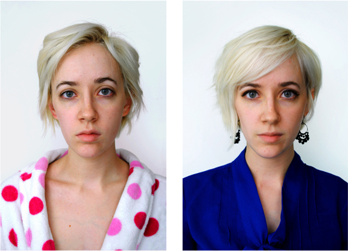

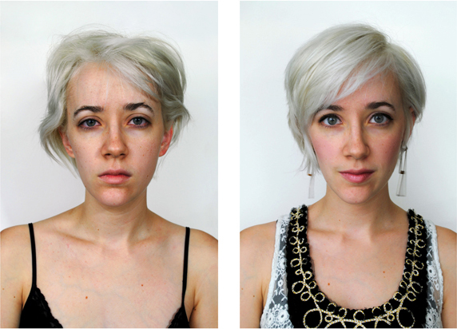

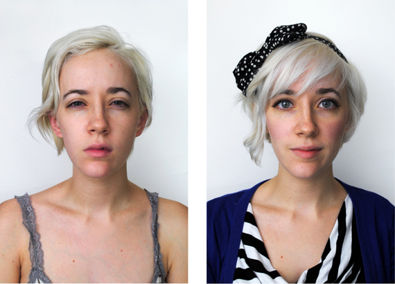

--- 

### Zhang Huan, *Skin (20 Self-Portraits)* (1997)

Self-portraiture under different conditions of manipulation.

> Zhang Huan's works are frequently based on his performance art, which is sometimes painful or perilous, but almost always involves using his own body as a surface for symbolic political commentary. "The body is the only direct way through which I come to know society and society comes to know me," Zhang says. "The body is the proof of identity. The body is language." Whereas his earliest performance works in China centered on physical endurance, after moving to New York, in 1998, Zhang's later works show the body as a productive intersection between personal and social identity. In *Skin (20 Self-Portraits)*, the artist's sequential manipulations of his skin and body parts create an alphabet of gestures-blocking his eyes, ears, and nose-that symbolizes anger and resistance. [From *The Order of Things*]

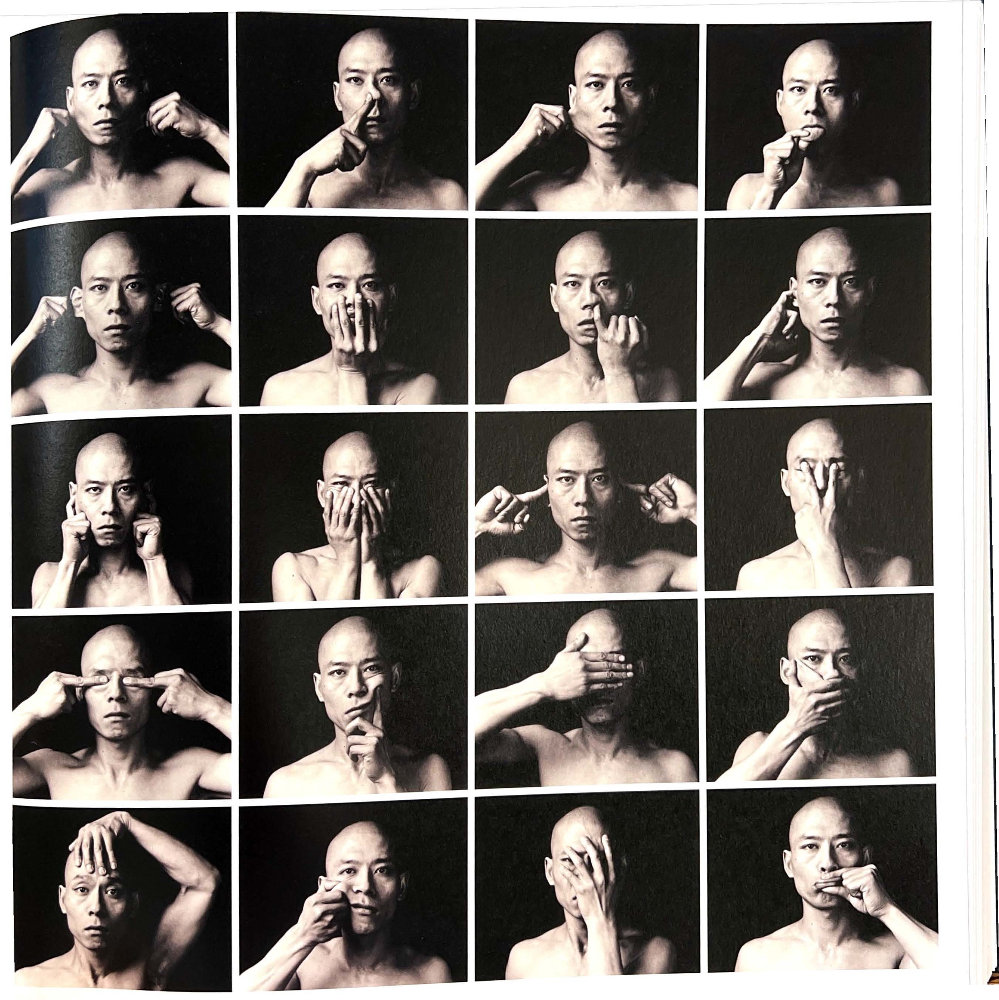

---

### Dieter Appelt, *The Mark on the Mirror Breathing Makes* (1977)

> Many of Dieter Appelt's works address his traumatic post-World War II experience of Germany through a series of photographed performances or "actions"-as he calls them, after Josef Beuys. This emphasis on dramatic performance may stem from the fact that Appelt was trained as an opera singer, and worked with the Deutsche Opera Berlin for eighteen years before turning to photography in 1979. Focusing on detailed photographic studies of elements of his body in performance, he utilizes extreme physicality and labored temporality to allude to issues of death, decay, rebirth, and the ephemeral. "I want to unmask time in a picture," Appelt has said. "I'm interested in having a succession of movements layered in one image. I use time like a mechanic, permanently layering memories and actual experiences ... like a time montage." His image of breath on a mirror breaks down that evanescent moment into a series of concrete actions, and distills time into a frame-by-frame sequential performance. [From *The Order of Things*]

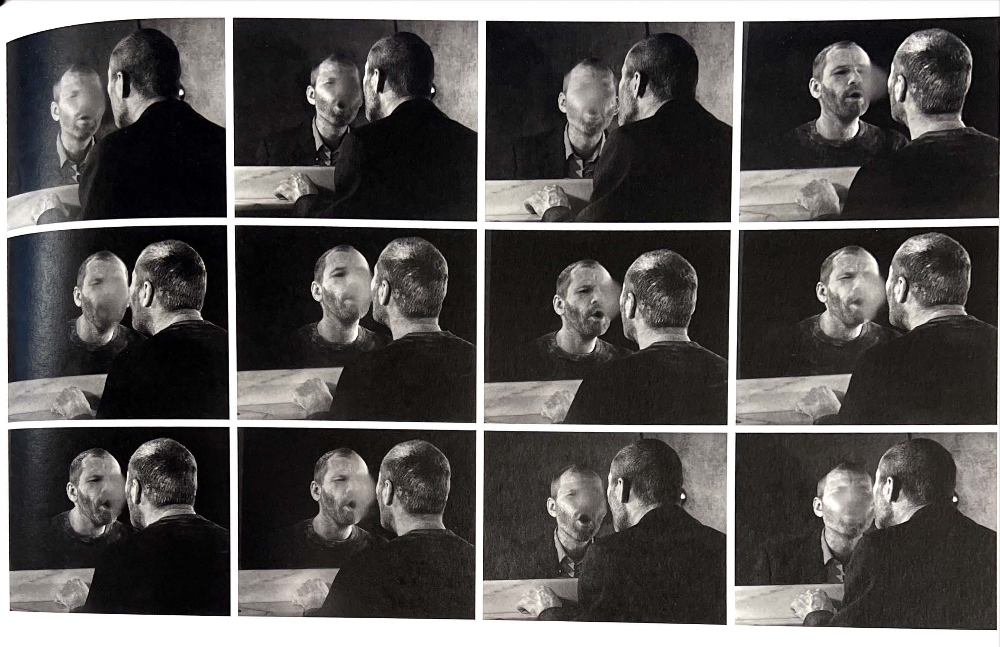

---

### Before and After

Danish artist [Nicolai Howalt](https://designyoutrust.com/2016/04/boxers-before-and-after-the-fight-beautiful-photography-project-by-nicolai-howalt/) created a series of boxers' portraits, taken before and after a fight.

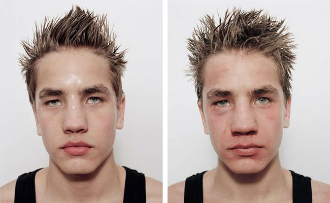

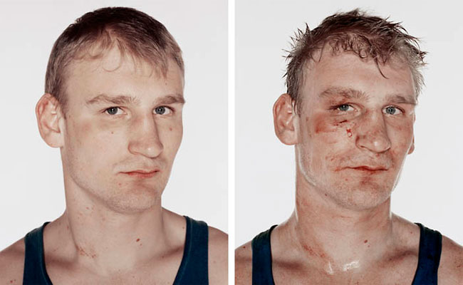

---

### Faces of Meth

> *Faces of Meth* is a drug education and prevention project run by the Multnomah County Sheriff's Office in Oregon. The project uses mugshots of repeat offenders to demonstrate the harmful and damaging effects of methamphetamine on its users. Deputy Bret King and his co-workers collected images of people charged with crimes related to methamphetamine addiction to document the change in physical appearance over time due to the use of the drug.

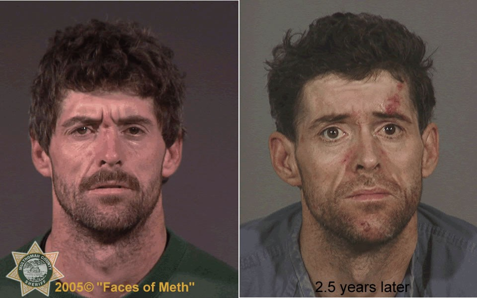


---

### We Are Not Dead

> Photographer Lalage Snow’s [*We Are Not Dead*](https://allthatsinteresting.com/4-amazing-contemporary-portrait-series) series visually depicts the state of mind soldiers found themselves in before, during, and after their operational tours in Afghanistan. Taken over a period of eight months, each individual was photographed on three separate occasions. The first photos were taken before heading to Afghanistan, the middle photographs were taken during the tour, and the final shots were taken once the subject had returned home.

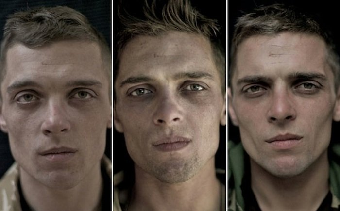


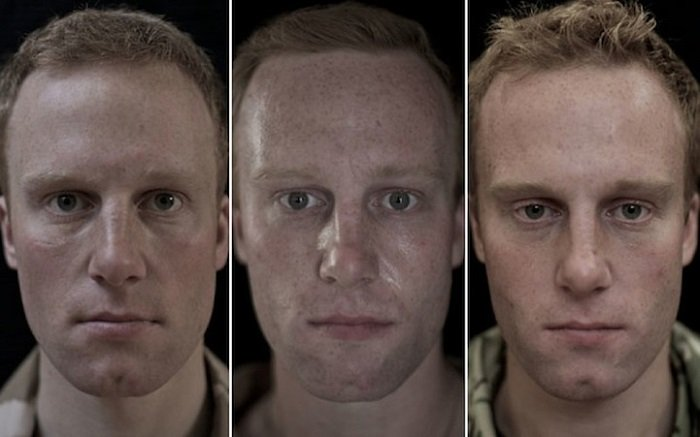

---

### Life Before Death

> Photographer Walter Schels was terrified of death, so much so he refused to see his mother after she passed away. Upon entering his 70s, Schels finally decided to overcome his fear through [a bold project](https://www.artfido.com/powerful-photo-series-showing-people-shortly-before-and-after-death/) – photographing individuals before and directly after their death. Schels and his partner Beate Lakotta began approaching potential individuals at hospices in Berlin and Hamburg, surprised to find few people said no. 

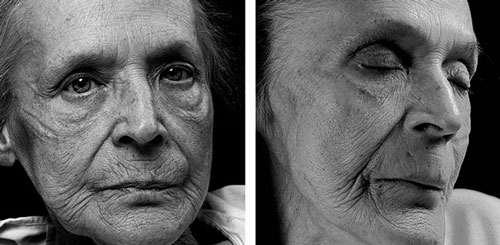

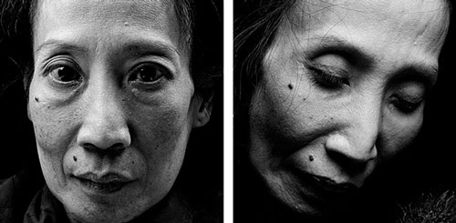

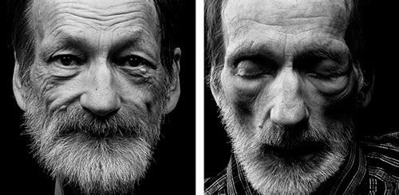

---

### National Geographic: Twins

> In January 2012, National Geographic published an article and portrait series that compared sets of identical twins. The photographer, Martin Schoeller, shot each set of twins in identical clothing, with the same lighting, and from the same angle. Both the article and photos sought to explore how and why twins differ despite sharing identical genetic makeup.

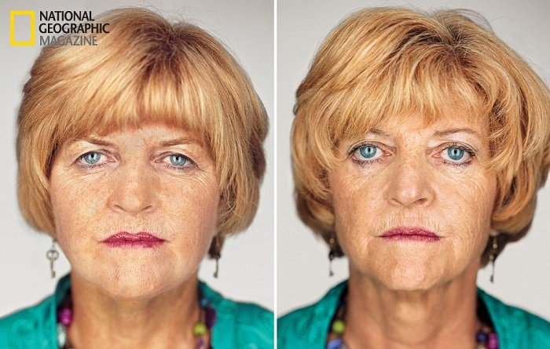 

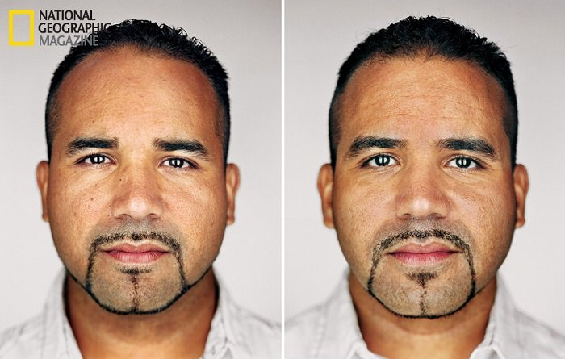 

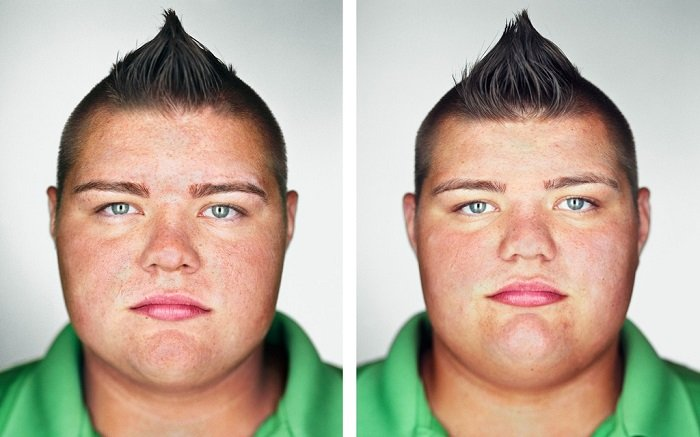 

---

### Alike But Not Alike

> For the past three years, Detroit-born, London-based photographer Peter Zelewski has been exploring the similarities and differences between sets of identical twins in his ongoing portrait photography series, [*Alike But Not Alike*](https://mymodernmet.com/identical-twins-portrait-photography-peter-zelewski/). 

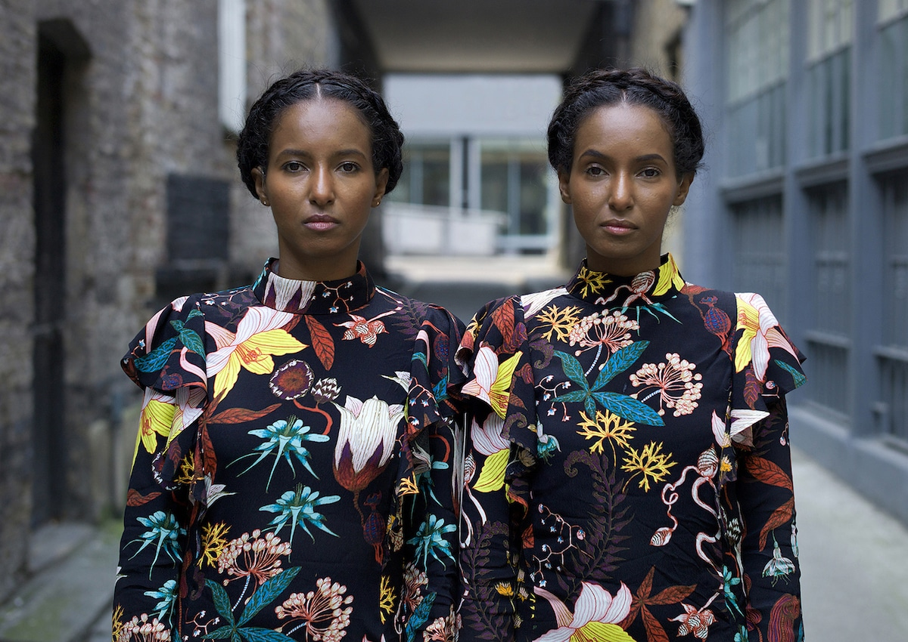

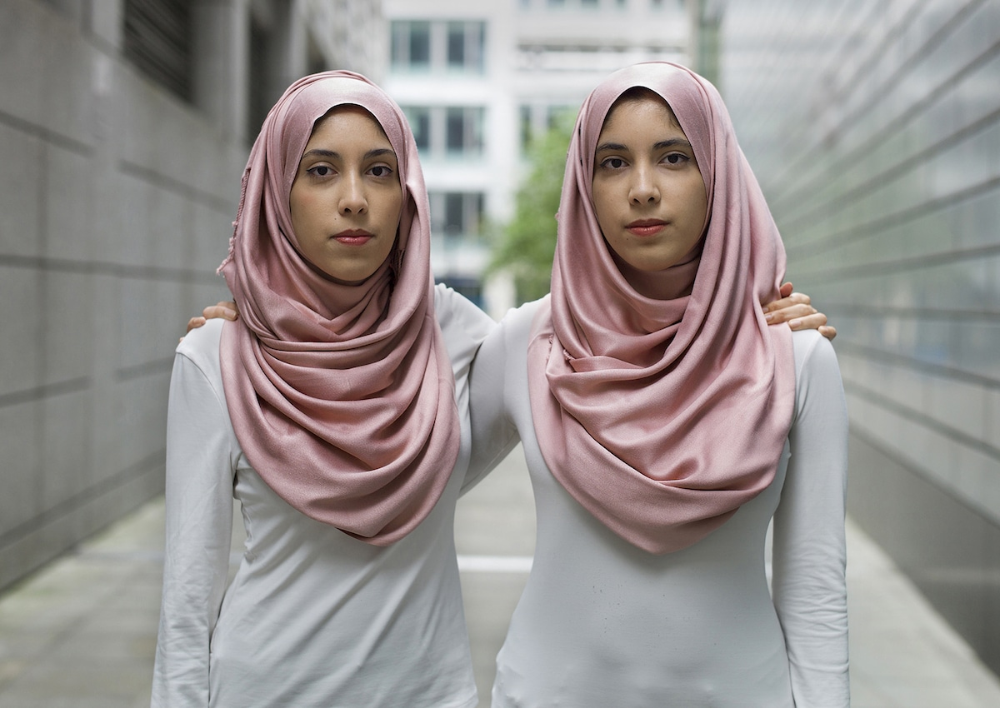

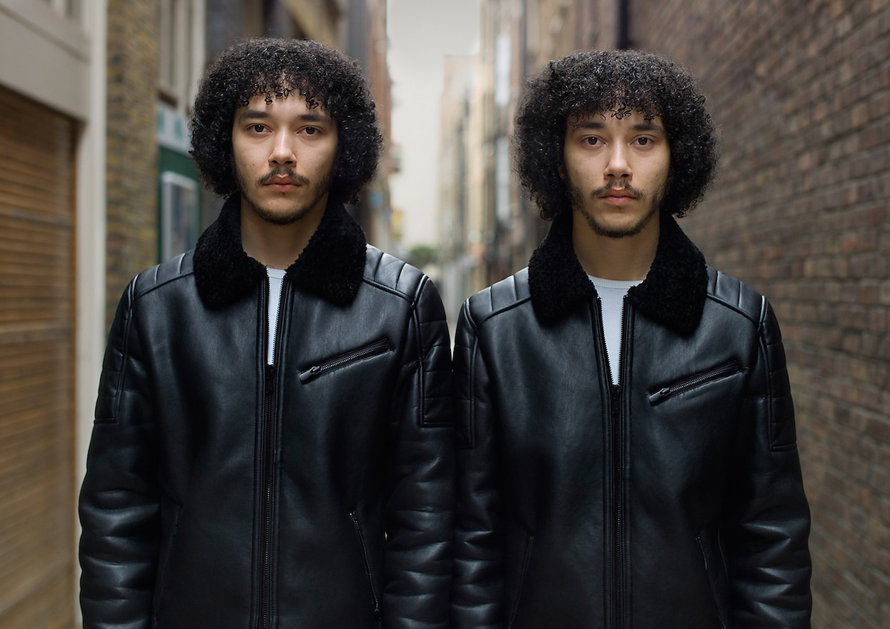

---

## People and their Stuff

### Material World

In the [*Material World: A Global Family Portrait*](http://www.npr.org/sections/pictureshow/2010/08/10/129113632/picturingpossessions) photo series (1994), Peter Menzel and other photographers took portraits of 30 statistically average families — with all of their worldly possessions displayed outside their homes.

[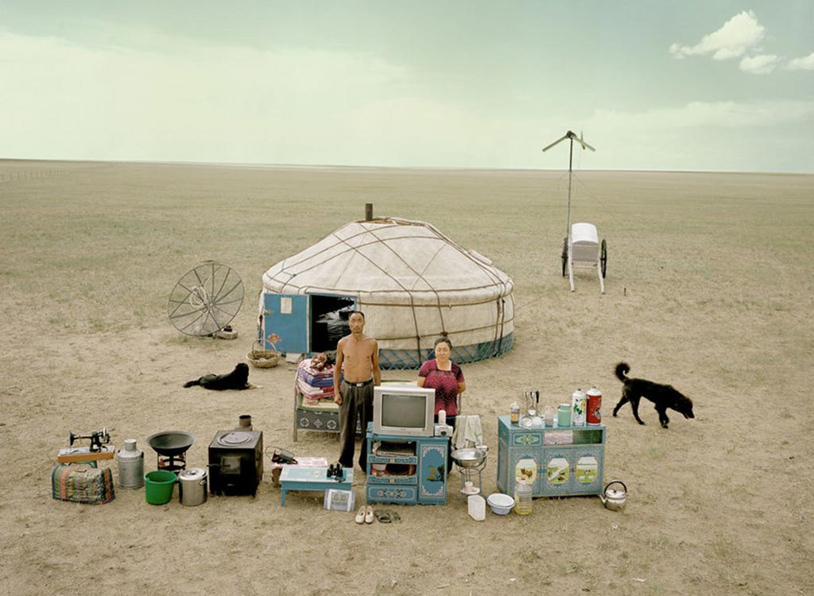](http://menzelphoto.com/galleries/material-world/)

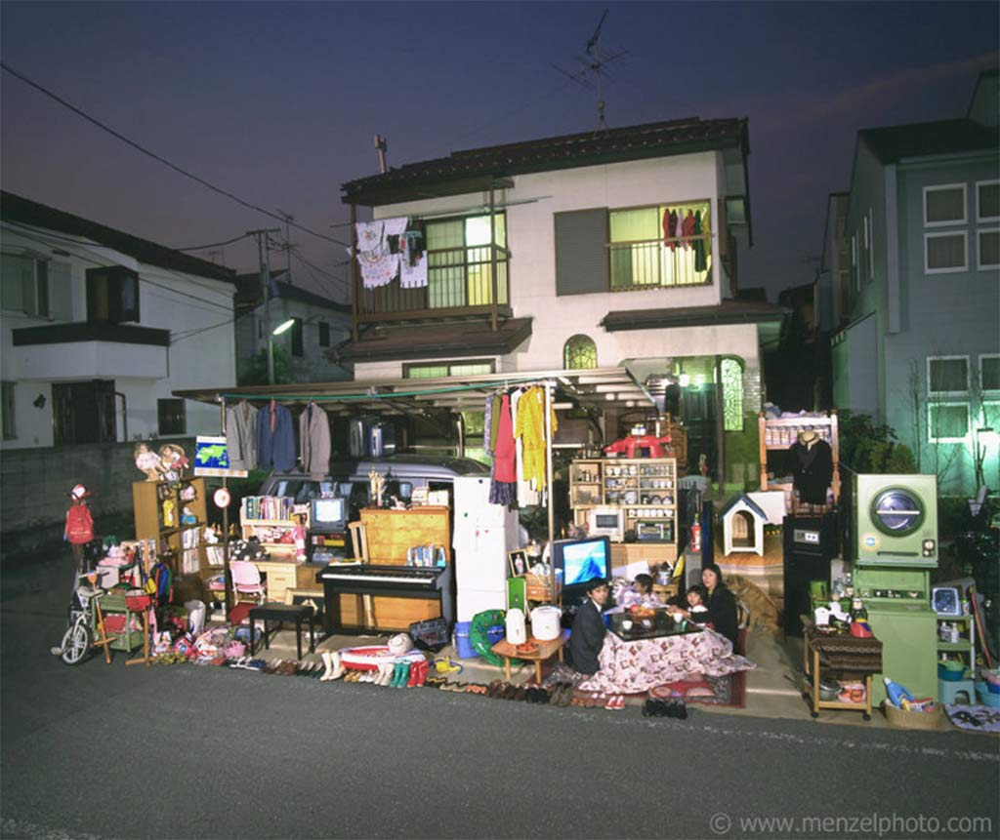

---

### Toy Stories

For [*Toy Stories*](https://www.gabrielegalimberti.com/toy-stories/), over two years, photographer Gabriele Galimbert

> visited more than 50 countries and created colorful images of boys and girls in their homes and neighborhoods with their most prized possessions: their toys. From Texas to India, Malawi to China, Iceland, Morocco, and Fiji, I recorded the spontaneous and natural joy that unites kids despite their diverse backgrounds. Whether the child owns a veritable fleet of miniature cars or a single stuffed monkey, the pride that they have is moving, funny, and thought provoking.

[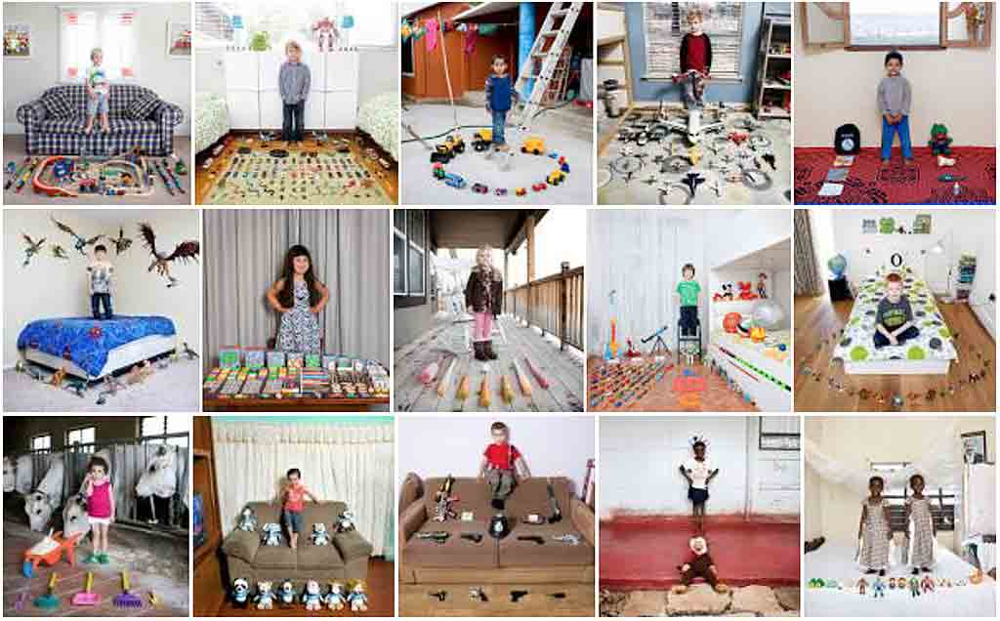](https://www.gabrielegalimberti.com/toy-stories/)

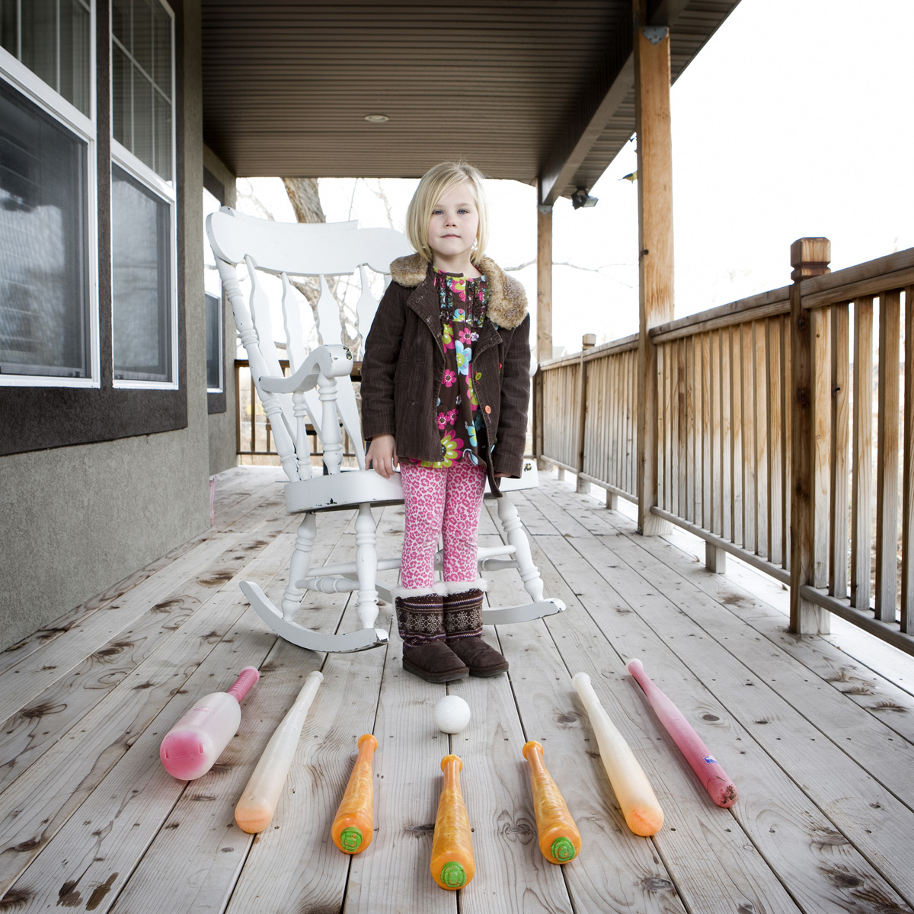

