# Portraits (I): Systems for Collection and Comparison

In these rule-based approaches to portraiture, artists devise systems for collecting, organizing, and comparing representations of people. Rather than treating each portrait as a unique image, they create standardized *formats* that can be repeated across many subjects. These works draw on the logic of the typology, the archive, the census, and the scientific collection. They use consistency as a tool for revealing difference.

Across these projects, the portrait is only one element in a larger comparative structure. The artist may photograph people before and after a transformation, revisit the same subjects across decades, compare siblings or twins, or examine how possessions, occupations, and social circumstances shape identity. By holding certain variables constant, these works make other variables visible. The resulting portraits allow us to look not only at individuals, but also at patterns within a larger group.

What unites these projects is their use of *procedural structure* to produce comparison at scale. By standardizing the form of representation, artists can create frameworks for observing how people differ across time, circumstance, biology, culture, and personal history. The resulting portraits are therefore not only depictions of individuals, but instruments for examining human variation.

* **The core question:** What can we learn about people by arranging multiple portraits into a comparative structure?
* **We use:** typologies, matched pairs, before-and-after transformations, and longitudinal studies.
* **The output:** People are visibly present, but their identities emerge differentially, through comparison rather than isolation.

---

### Screen Tests

A "Portrait Machine" at Warhol's Factory.

> Warhol's *Screen Tests* are a series of short, silent, black-and-white film portraits by Andy Warhol, made between 1964 and 1966. The Screen Tests, of which 472 survive, depict a wide range of figures, many of them part of the mid-1960s downtown New York cultural scene. Under Warhol’s direction, subjects of the Screen Tests attempted to sit motionless for around three minutes while being filmed, with the resulting movies projected in slow motion. The films represent a new kind of portraiture—a slowly moving, nearly still image of a person. The *Screen Tests* were initially inspired by a 1962 New York City Police Department booklet entitled *The Thirteen Most Wanted*, which showed mugshots of wanted criminals. Warhol began to incorporate the shooting of Screen Tests into the routine of his studio, The Factory, alongside the making of new paintings and other aspects of his enterprise. The filming of Screen Tests was rarely prearranged. There was an area set up for shooting, but the decision to make one was spontaneous, generally involving people who happened to be visiting the Factory.

[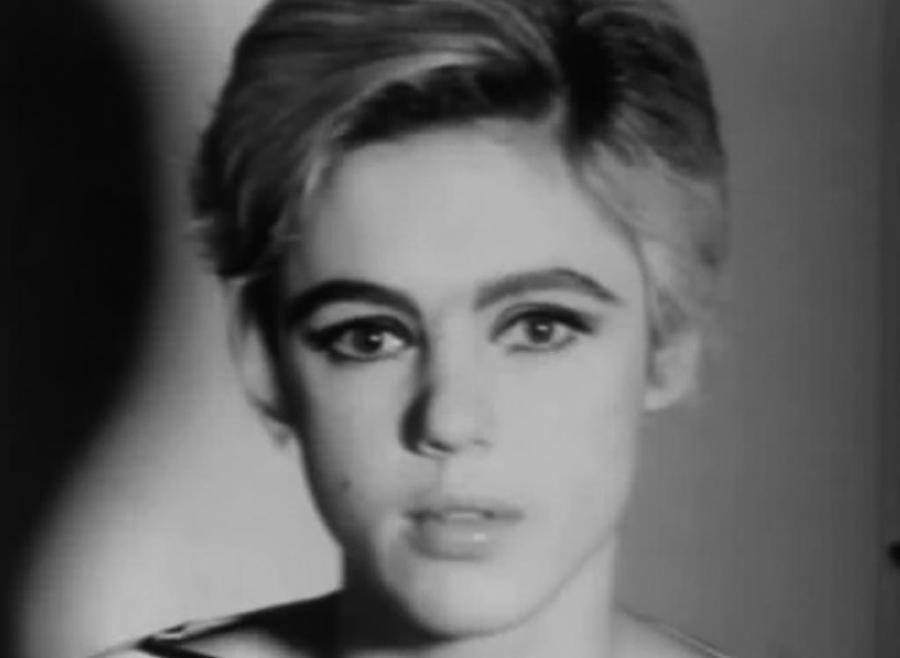](https://www.youtube.com/watch?v=p_C8NH_2Uv0)

> Warhol expert Callie Angell has called these films “the yearbook of the mid-1960s avant-garde.” Each test lasted as long as a single 100-foot roll of film. Each was shot at 24 frames per second and projected at two-thirds of that speed, a trick Warhol often used. 

[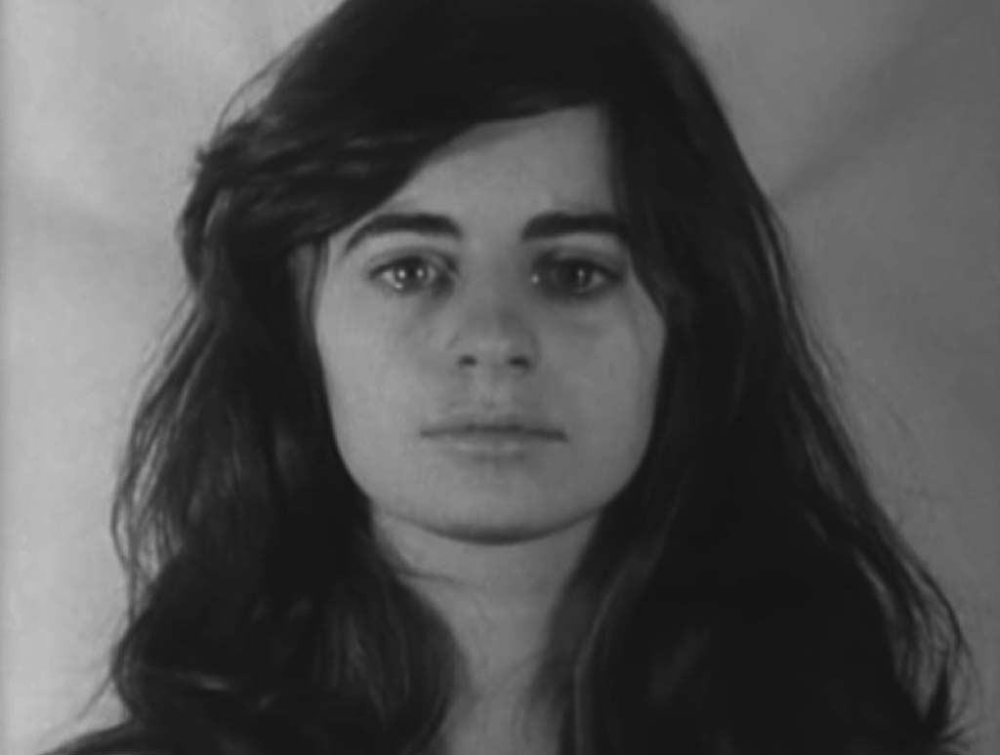](https://www.youtube.com/watch?v=_jjKiXKaqvA)

> Mary Woronov observed in *Swimming Underground: My Years in the Warhol Factory* that the screen tests were like a psychological test: “You would see the person fighting with his image—trying to protect it. You can project your image for a few seconds, but after that it slips and your real self starts to show through. That’s why it was so great—you saw the person and the image.” [Source](http://sacksco.com/notes/dean_and_britta.html)

Although Warhol's *Screen Tests* are often discussed as psychological portraits, they also establish a template that recurs throughout this presentation: a standardized format repeated across many subjects, allowing subtle differences to become visible through comparison.

---

### Marcus Coates, *Dawn Chorus*

* Marcus Coates, [*Dawn Chorus* (2007)](https://www.youtube.com/watch?v=enpuy1WLezY)
* [Original audio](sounds/dawn_chorus_original_yellowhammer_audio.mp3) (MP3)

Participants in this project first select a bird whose behavior or character they feel resembles their own. They then spend days learning a slowed-down recording of that bird's song, and perform it in a location of personal significance. When these performances are sped back up, the participants appear to sing as birds. Each participant occupies the same formal role within the system, yet each produces a distinct portrait of identity, affinity, and self-expression. A portrait emerges not from a single video but from a structured comparison among many participants subjected to the same formal procedure.

---

### The Brown Sisters

Every year since 1975, Nicholas Nixon has photographed the four Brown sisters in the same order and similar arrangement. The project transforms a conventional family portrait into a longitudinal study, allowing viewers to compare changes across decades as well as differences among siblings. [Video](https://vimeo.com/107875653) • [New York Times article](https://www.nytimes.com/interactive/2014/10/03/magazine/01-brown-sisters-forty-years.html)

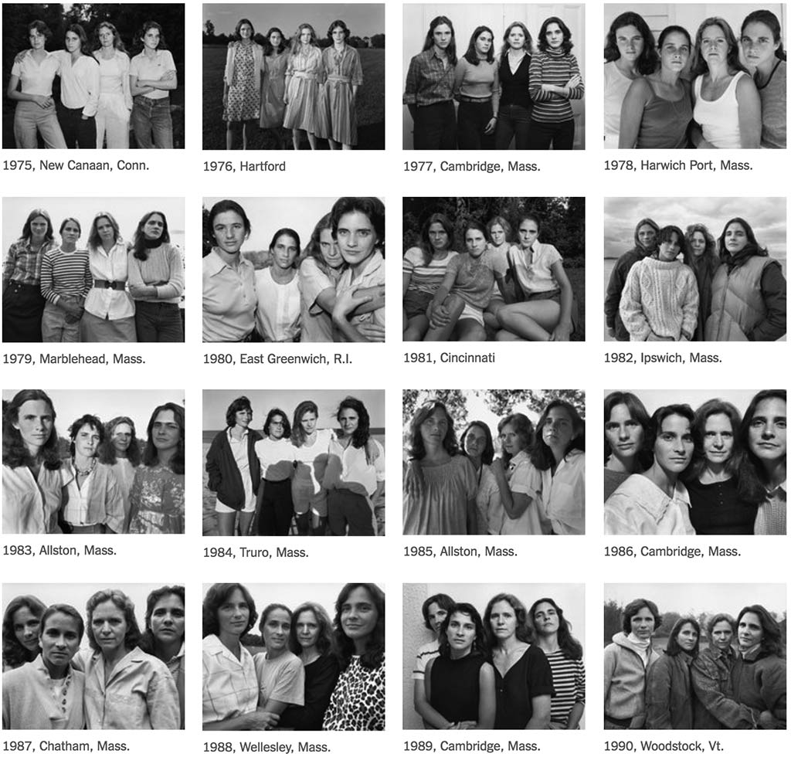

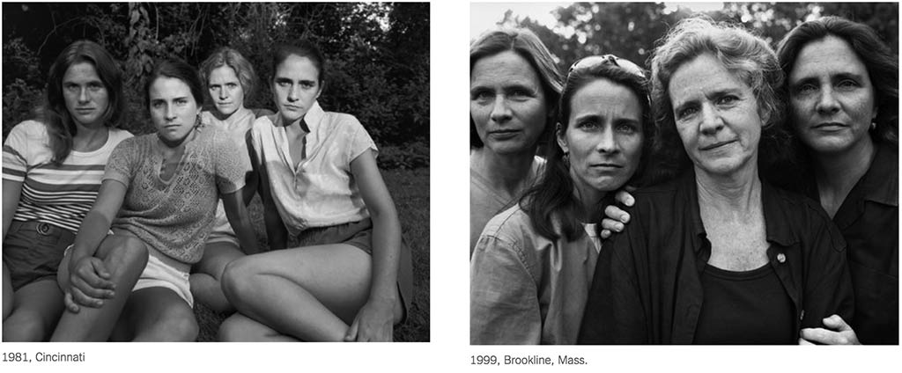

---

### The Only Woman

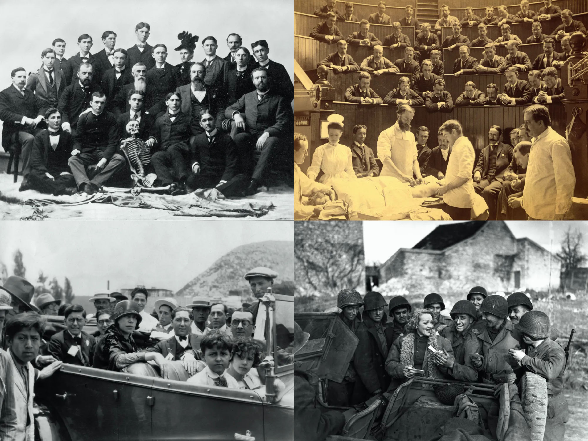

In the photo book ["The Only Woman" by Immy Humes](https://www.smithsonianmag.com/history/these-trailblazers-were-the-only-women-in-the-room-where-it-happened-180980468/), the author collected 100 historical photographs of lone women hidden among groups of men. She writes: 

> *A huge percentage of the photographic record of Western culture is incredibly boring: endless large groups of formally dressed, formally arranged men facing the camera. The overwhelming majority of these groups were all male—but it’s uncanny to see how many women snuck in, one at a time, to become the only woman in the room. I found pleasure in spotting these solitary women, and then, most of all, unraveling the mystery of them: What were they doing there?*

Humes's project demonstrates that typological portraiture can be curatorial: involving finding, rather than making, new photographs.

---

### Leaving and Waving

Deanna Dikeman's book [*Leaving and Waving*](https://deannadikeman.com/leaving-and-waving) presents 27 years of the author photographing her parents waving goodbye as she left their home after a visit.

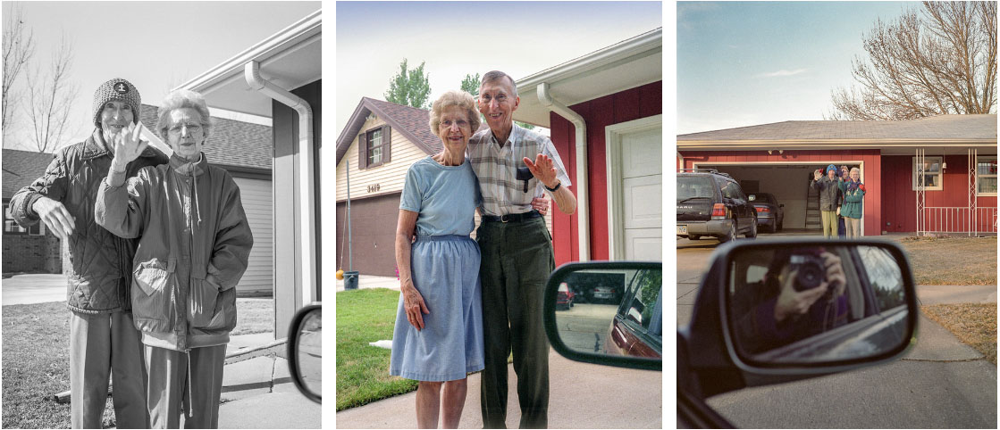

> For 27 years, I took photographs as I waved good-bye and drove away from visiting my parents at their home in Sioux City, Iowa. I started in 1991 with a quick snapshot, and I continued taking photographs with each departure. I never set out to make this series. I just took these photographs as a way to deal with the sadness of leaving. It gradually turned into our good-bye ritual. In 2009, there is a photograph where my father is no longer there. My mother continued to wave good-bye to me. In October of 2017 she passed away. When I left after her funeral, I took one more photograph, of the empty driveway. For the first time in my life, no one was waving back at me.

The repeated framing and ritualized gesture transform personal family snapshots into a differential record of aging, loss, absence, and continuity.

---

### Faces Of Century

A common strategy in comparative portraiture is the before-and-after structure, which allows comparison both within an individual and across a population. In [*Faces Of Century*](https://www.demilked.com/young-vs-old-portraits-faces-of-century-jan-langer/), photographer Jan Langer juxtaposes portraits of Czech centenarians with photographs of the same people taken many decades earlier, compressing a lifetime of change into a single visual comparison.

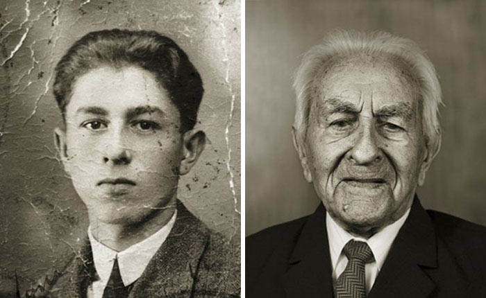

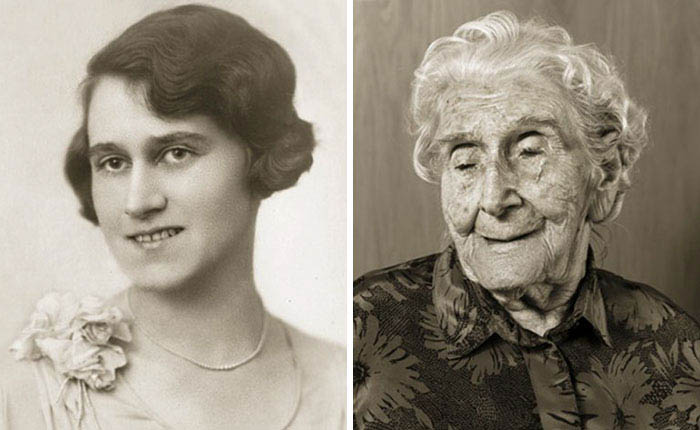

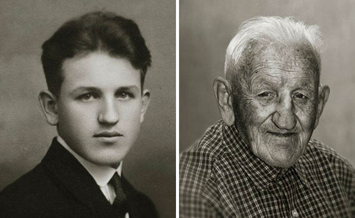

---

### Before and After

Danish artist [Nicolai Howalt](https://designyoutrust.com/2016/04/boxers-before-and-after-the-fight-beautiful-photography-project-by-nicolai-howalt/) created a series of boxers' portraits, taken immediately before and just after a fight, isolating the physical and psychological effects of a single event.

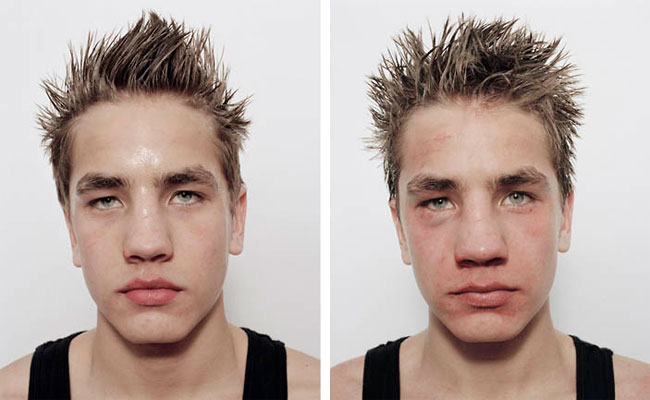

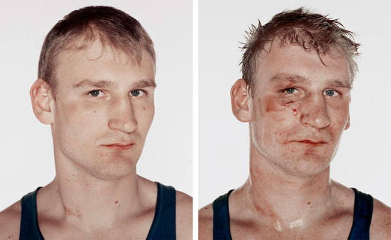

---

### Faces of Meth

> *Faces of Meth* is a drug education and prevention project run by the Multnomah County Sheriff's Office in Oregon. The project uses mugshots of repeat offenders to demonstrate the harmful and damaging effects of methamphetamine on its users. Deputy Bret King and his co-workers collected images of people charged with crimes related to methamphetamine addiction to document the change in physical appearance over time due to the use of the drug.

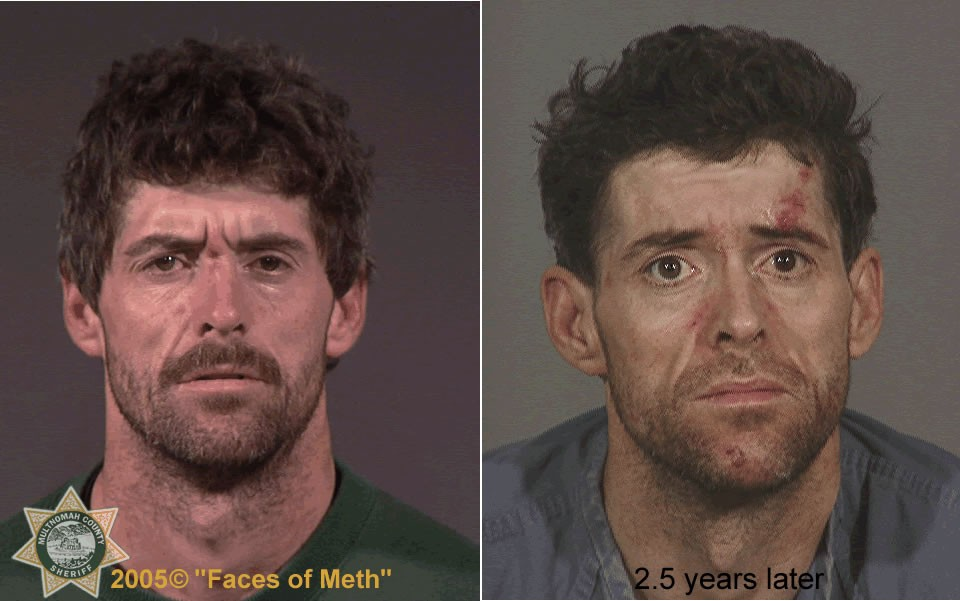

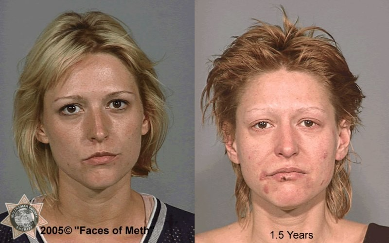

Although created as a public-health intervention rather than an artwork, the project has become a widely circulated example of comparative portraiture.

---

### We Are Not Dead

> Photographer Lalage Snow’s [*We Are Not Dead*](https://allthatsinteresting.com/4-amazing-contemporary-portrait-series) series visually depicts the state of mind soldiers found themselves in before, during, and after their operational tours in Afghanistan. Taken over a period of eight months, each individual was photographed on three separate occasions. The first photos were taken before heading to Afghanistan, the middle photographs were taken during the tour, and the final shots were taken once the subject had returned home.

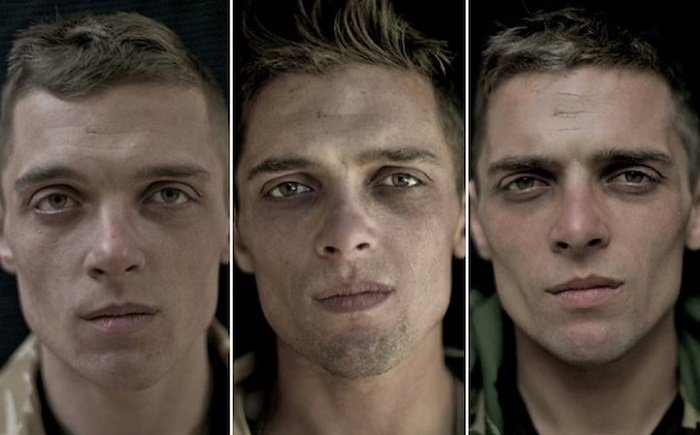

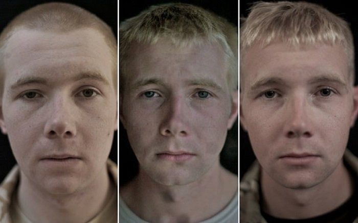

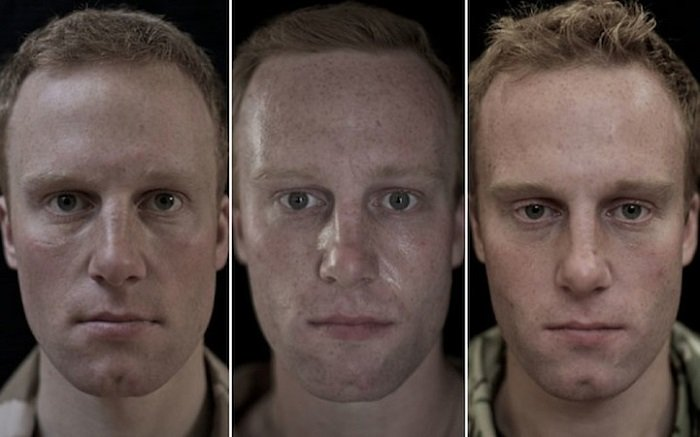

Like *The Brown Sisters*, this project tracks change through repeated portrait sessions. Here, however, the interval is a single military deployment.

---

### Life Before Death

> Photographer Walter Schels was terrified of death, so much so he refused to see his mother after she passed away. Upon entering his 70s, Schels finally decided to overcome his fear through [a bold project](https://www.artfido.com/powerful-photo-series-showing-people-shortly-before-and-after-death/) – photographing individuals before and directly after their death. Schels and his partner Beate Lakotta began approaching potential individuals at hospices in Berlin and Hamburg, surprised to find few people said no. 

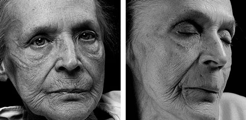

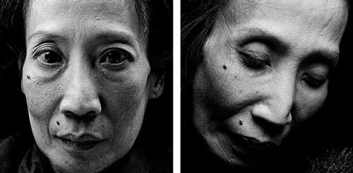

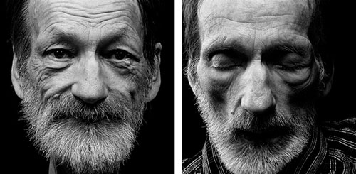

The project reduces the interval between comparison images to its absolute limit, asking how portraiture can depict the transition between life and death itself.

---

### Faces Under Reflection

A longstanding folk belief holds that the two sides of a person's face reveal different aspects of their personality. In this [series by Alex Beck](https://time.com/2848303/heres-what-faces-would-look-like-if-they-were-perfectly-symmetrical/) and this [related work by Julian Wolkenstein](https://petapixel.com/2012/10/02/a-portrait-project-showing-subjects-with-two-perfectly-symmetrical-faces/), each portrait is digitally split down the middle. The left half of the face is mirrored to create a perfectly symmetrical "LL" portrait, while the right half is mirrored to create a corresponding "RR" portrait.

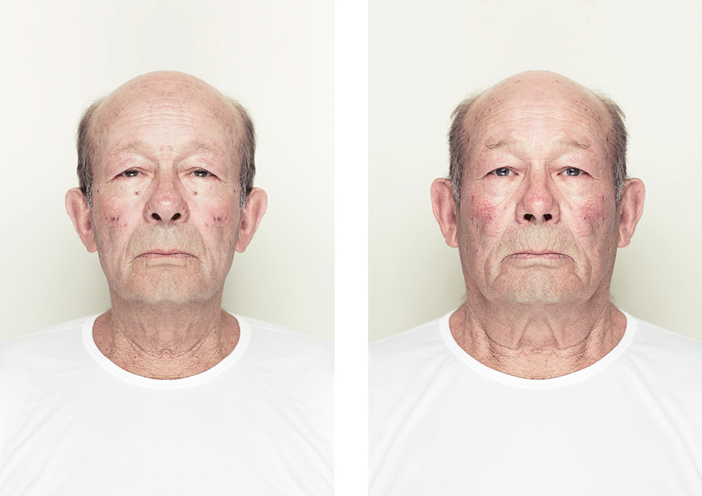

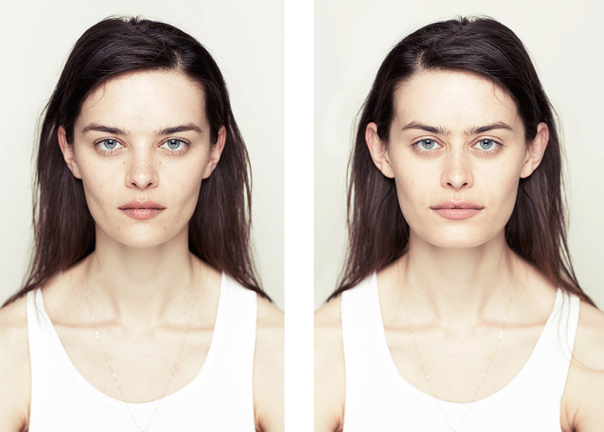

The resulting pairs can appear surprisingly different: one version may seem warmer, more confident, more severe, or more expressive than the other. Here, the primary comparison occurs between alternate versions of the same face, taken from the very same image.

---

### National Geographic: Twins

> In January 2012, National Geographic published an article and portrait series that compared sets of identical twins. The photographer, Martin Schoeller, shot each set of twins in identical clothing, with the same lighting, and from the same angle. Both the article and photos sought to explore how and why twins differ despite sharing identical genetic makeup.

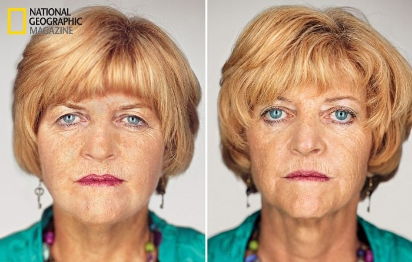 

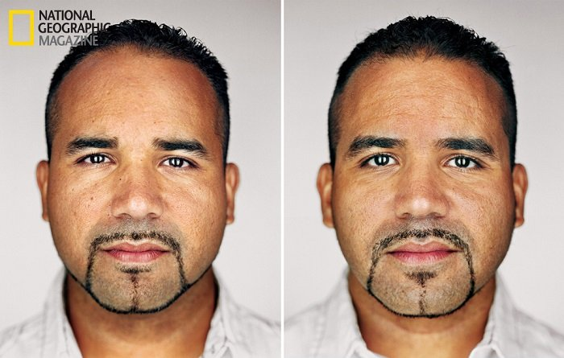 

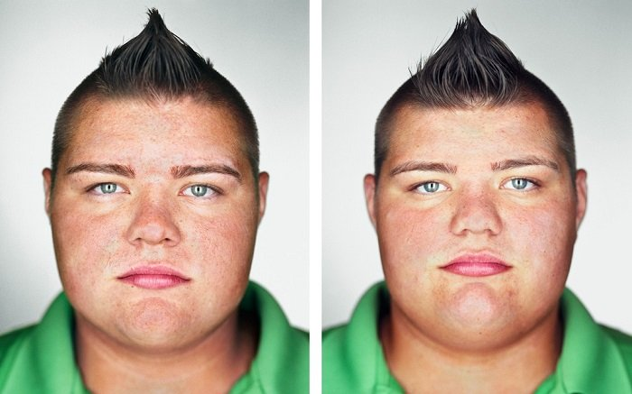 

---

### Alike But Not Alike

> For the past three years, Detroit-born, London-based photographer Peter Zelewski has been exploring the similarities and differences between sets of identical twins in his ongoing portrait photography series, [*Alike But Not Alike*](https://mymodernmet.com/identical-twins-portrait-photography-peter-zelewski/). 

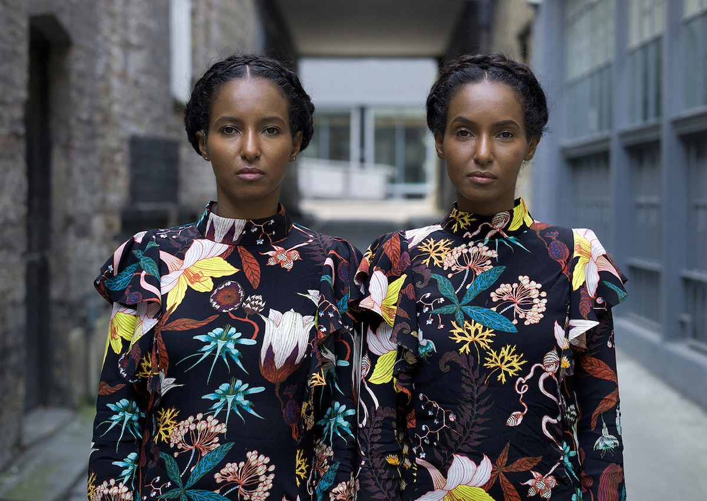

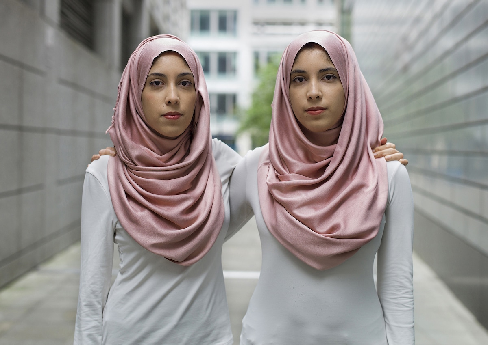

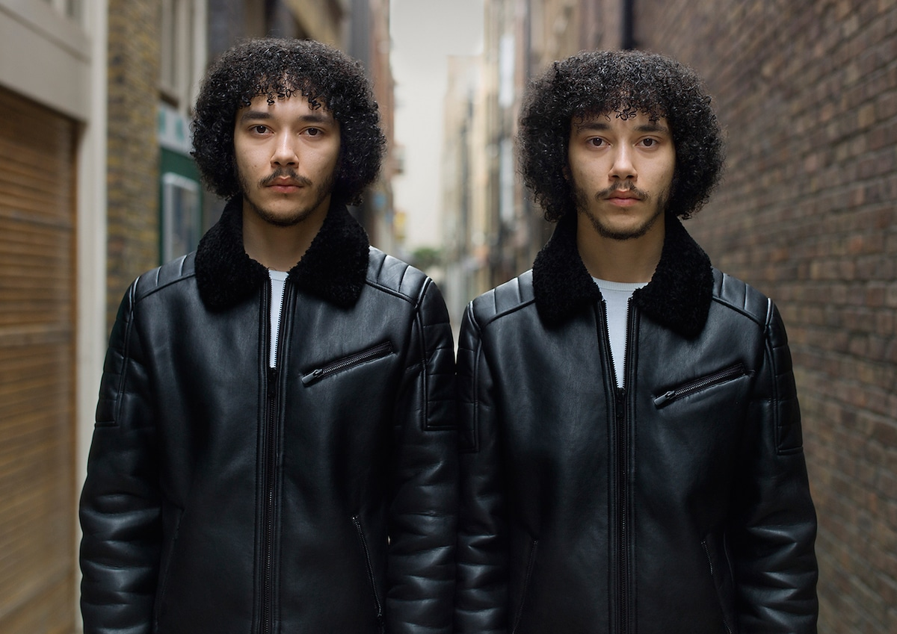

---

# People and their Stuff

### Material World

In the [*Material World: A Global Family Portrait*](http://www.npr.org/sections/pictureshow/2010/08/10/129113632/picturingpossessions) photo series (1994), Peter Menzel and other photographers took portraits of 30 statistically average families -- with all of their worldly possessions displayed outside their homes. 

The project shifts the focus of comparison from faces to possessions. By presenting families alongside all of their belongings, the series treats material culture as a measurable and comparable expression of identity.

[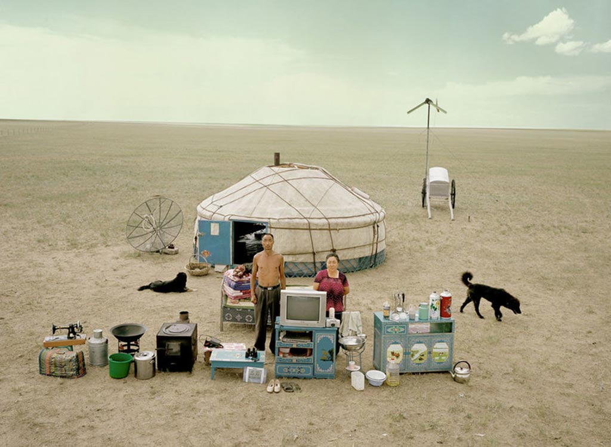](http://menzelphoto.com/galleries/material-world/)

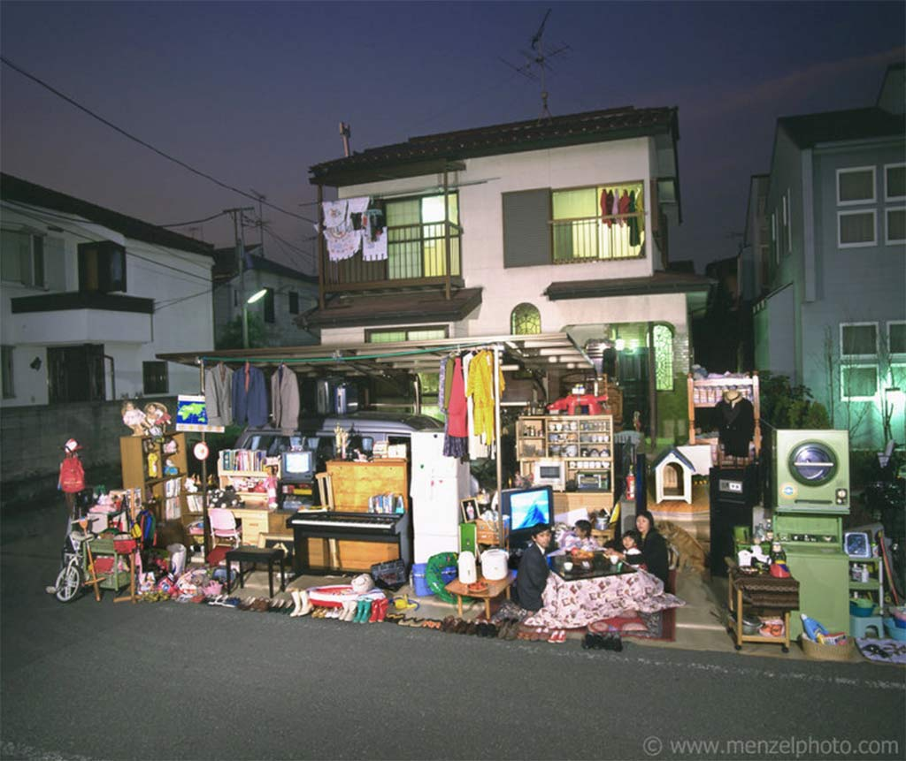

---

### Toy Stories

For [*Toy Stories*](https://www.gabrielegalimberti.com/toy-stories/), over two years, photographer Gabriele Galimbert

> visited more than 50 countries and created colorful images of boys and girls in their homes and neighborhoods with their most prized possessions: their toys. From Texas to India, Malawi to China, Iceland, Morocco, and Fiji, I recorded the spontaneous and natural joy that unites kids despite their diverse backgrounds. Whether the child owns a veritable fleet of miniature cars or a single stuffed monkey, the pride that they have is moving, funny, and thought provoking.

In these photos, personal identity is not only made clear through people's appearance, but also through the objects they choose to keep close.

[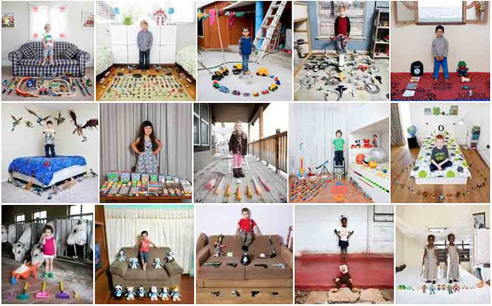](https://www.gabrielegalimberti.com/toy-stories/)

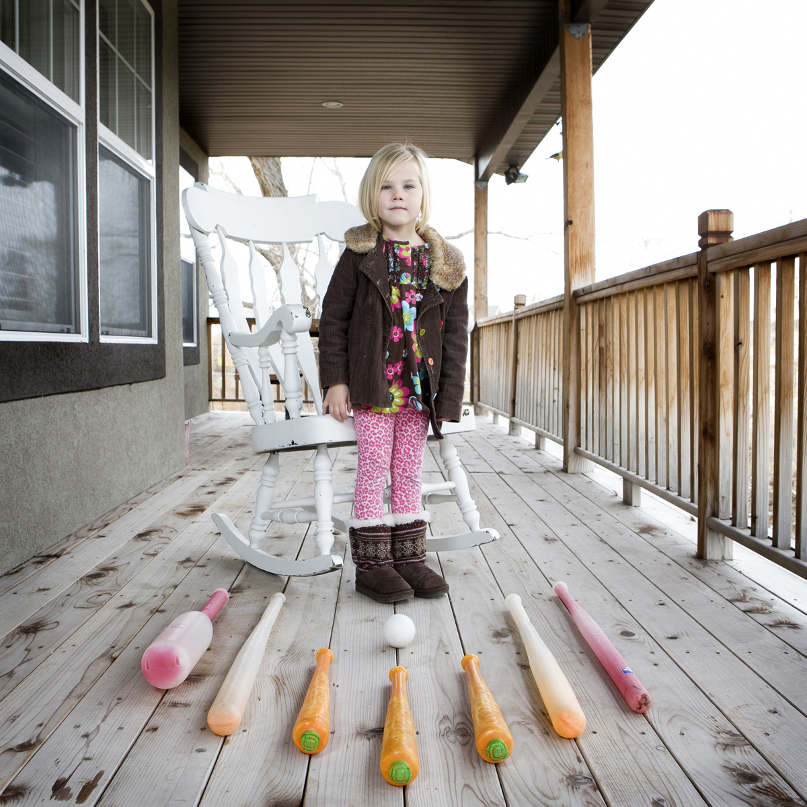

---

# Typological Self-Portraiture

### Becoming Mel

> A [series of self-portraits](https://www.slrlounge.com/becoming-mel-self-portrait-series/) shows photographer Mel Keiser upon waking, and then after she’s readied herself to face the world.

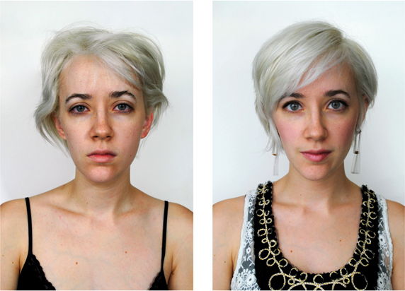

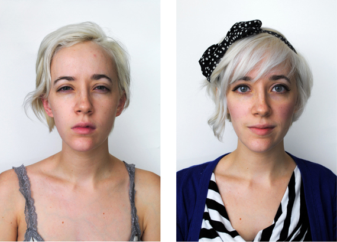

<!--
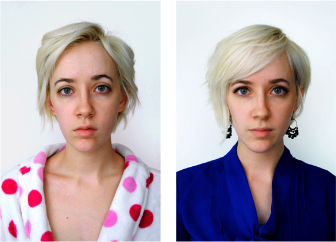
-->

---

### Zhang Huan, *Skin (20 Self-Portraits)* (1997)

Self-portraiture under different conditions of manipulation.

> Zhang Huan's works are frequently based on his performance art, which is sometimes painful or perilous, but almost always involves using his own body as a surface for symbolic political commentary. "The body is the only direct way through which I come to know society and society comes to know me," Zhang says. "The body is the proof of identity. The body is language." Whereas his earliest performance works in China centered on physical endurance, after moving to New York, in 1998, Zhang's later works show the body as a productive intersection between personal and social identity. In *Skin (20 Self-Portraits)*, the artist's sequential manipulations of his skin and body parts create an alphabet of gestures-blocking his eyes, ears, and nose-that symbolizes anger and resistance. [From *The Order of Things*]

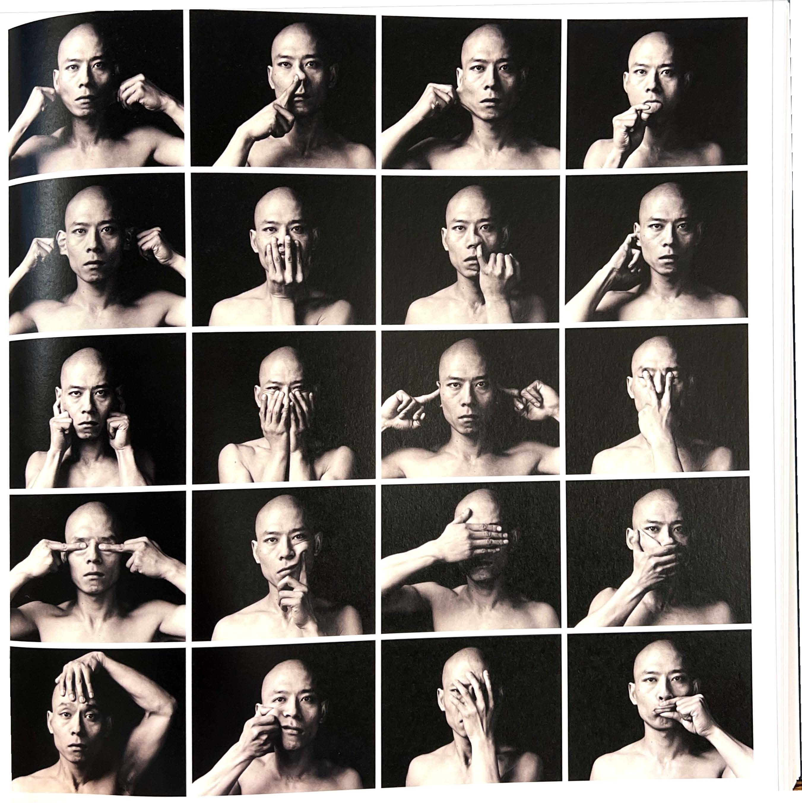

---

### Dieter Appelt, *The Mark on the Mirror Breathing Makes* (1977)

> Many of Dieter Appelt's works address his traumatic post-World War II experience of Germany through a series of photographed performances or "actions"-as he calls them, after Josef Beuys. This emphasis on dramatic performance may stem from the fact that Appelt was trained as an opera singer, and worked with the Deutsche Opera Berlin for eighteen years before turning to photography in 1979. Focusing on detailed photographic studies of elements of his body in performance, he utilizes extreme physicality and labored temporality to allude to issues of death, decay, rebirth, and the ephemeral. "I want to unmask time in a picture," Appelt has said. "I'm interested in having a succession of movements layered in one image. I use time like a mechanic, permanently layering memories and actual experiences ... like a time montage." His image of breath on a mirror breaks down that evanescent moment into a series of concrete actions, and distills time into a frame-by-frame sequential performance. [From *The Order of Things*]

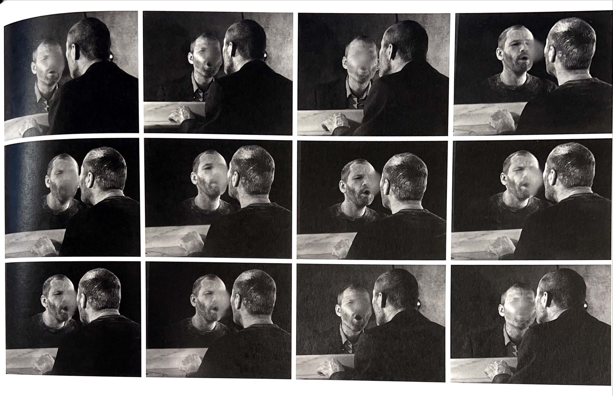

---

# For Further Study

### Taryn Simon

Taryn Simon [discusses typological approaches in her portrait series](https://www.youtube.com/watch?v=lBatctT7iFo&t=58s), *A Living Man Declared Dead and Other Chapters*.

[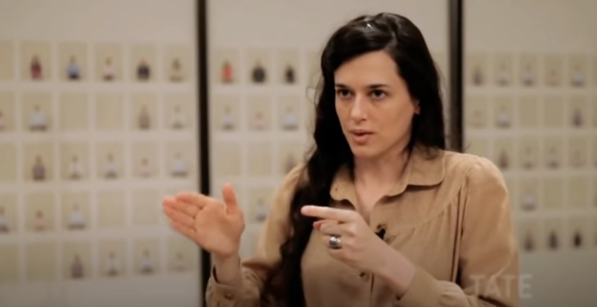](https://www.youtube.com/watch?v=lBatctT7iFo&t=58s)

---

### Ana Oliveira

[Ana Oliveira](https://petapixel.com/2013/03/10/before-and-after-portraits-that-show-the-effects-of-time-and-aging/) made before-and-after portraits that show the effects of time and aging.

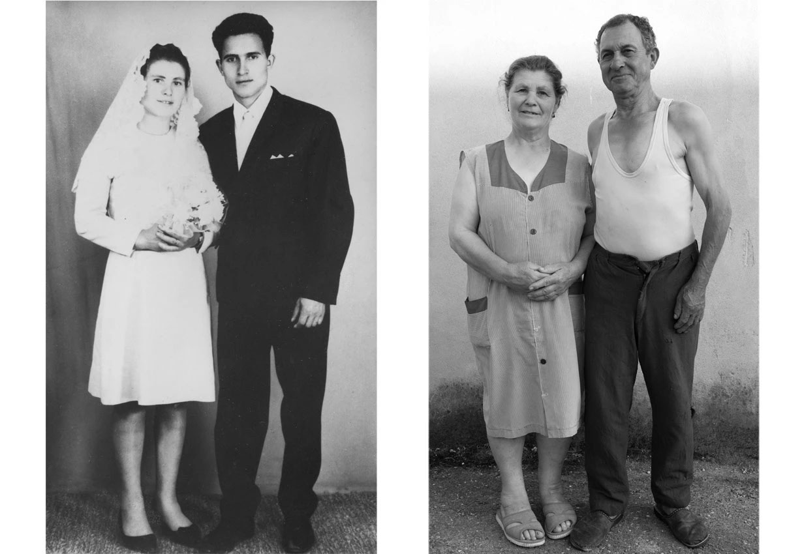

