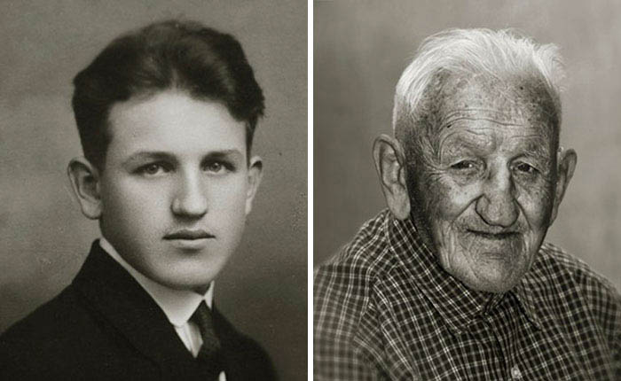
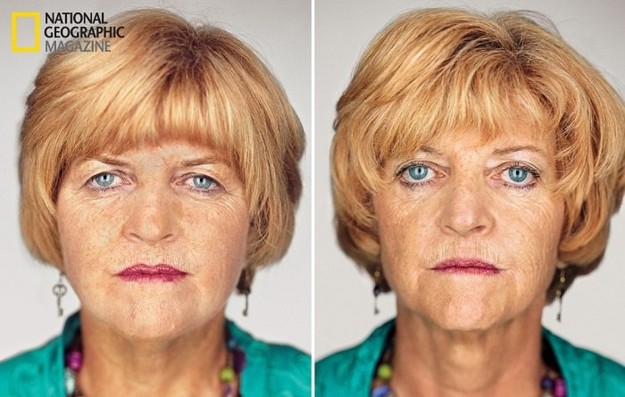
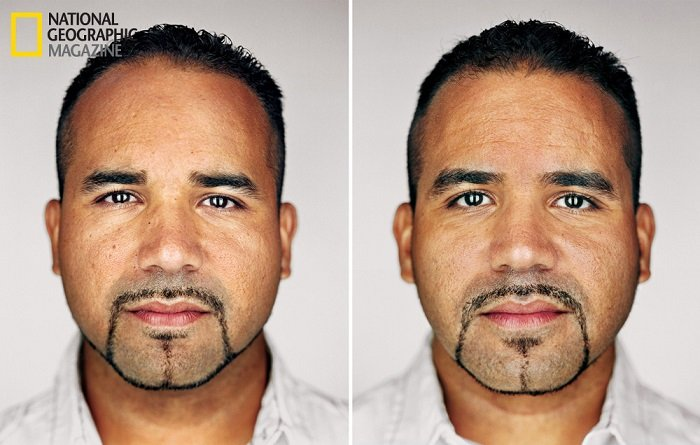
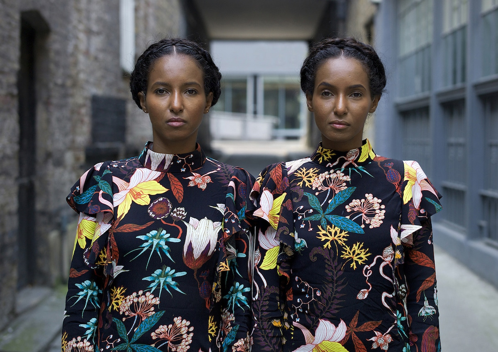
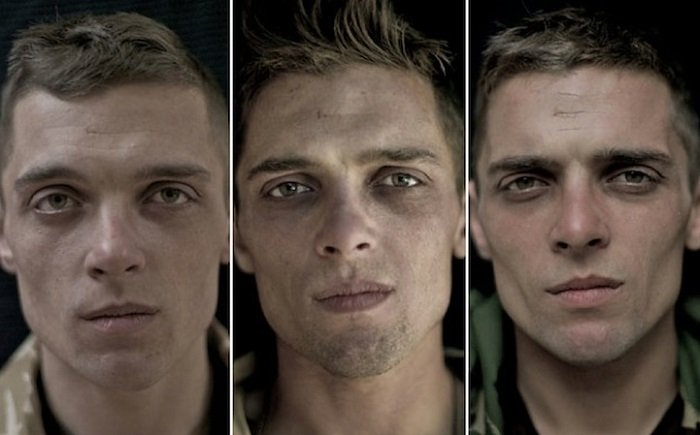

# Portraits: Typologies

* https://www.photopedagogy.com/typologies.html

---

### Screen Tests

Andy Warhol, [*Screen Tests*](https://www.youtube.com/watch?v=hLW_sXv44Uc) (1960s)

---

### The Brown Sisters

Every year for the past 40 years, Nicholas Nixon has photographed the four Brown sisters. [Video](https://vimeo.com/107875653) • [New York Times article](https://www.nytimes.com/interactive/2014/10/03/magazine/01-brown-sisters-forty-years.html)

---

### Faces Of Century

> For his project called [*Faces Of Century*](https://www.demilked.com/young-vs-old-portraits-faces-of-century-jan-langer/), photographer Jan Langer captured over a dozen Czech centenarians and compared their pictures of when they were young, and when they were over 100 years old.




---

### National Geographic: Twins

> In January 2012, National Geographic published an article and portrait series that compared sets of identical twins. The photographer, Martin Schoeller, shot each set of twins in identical clothing, with the same lighting, and from the same angle. Both the article and photos sought to explore how and why twins differ despite sharing identical genetic makeup.

 

 

 

---

### Alike But Not Alike

> For the past three years, Detroit-born, London-based photographer Peter Zelewski has been exploring the similarities and differences between sets of identical twins in his ongoing portrait photography series, [*Alike But Not Alike*](https://mymodernmet.com/identical-twins-portrait-photography-peter-zelewski/). 

---

### We Are Not Dead

> Photographer Lalage Snow’s [*We Are Not Dead*](https://allthatsinteresting.com/4-amazing-contemporary-portrait-series) series visually depicts the state of mind soldiers found themselves in before, during, and after their operational tours in Afghanistan. Taken over a period of eight months, each individual was photographed on three separate occasions. The first photos were taken before heading to Afghanistan, the middle photographs were taken during the tour, and the final shots were taken once the subject had returned home.




--- 

### Guys Who Look Like Jesus

Nancy Burson, [*Guys who Look Like Jesus*](https://www.nancyburson.com/portfolio/G0000oCZbt_Xbvy4/I0000iQ4msZO2eoQ)

 

---

### Image Averaging 

Jason Salavon, [*Portrait*](http://www.salavon.com/work/Portrait/) (2009)

---

## People and their Stuff

### Material World

In the [*Material World: A Global Family Portrait*](http://www.npr.org/sections/pictureshow/2010/08/10/129113632/picturingpossessions) photo series (1994), Peter Menzel and other photographers took portraits of 30 statistically average families — with all of their worldly possessions displayed outside their homes.

---

### Toy Stories

For [*Toy Stories*](https://www.gabrielegalimberti.com/toy-stories/), over two years, photographer Gabriele Galimbert

> visited more than 50 countries and created colorful images of boys and girls in their homes and neighborhoods with their most prized possessions: their toys. From Texas to India, Malawi to China, Iceland, Morocco, and Fiji, I recorded the spontaneous and natural joy that unites kids despite their diverse backgrounds. Whether the child owns a veritable fleet of miniature cars or a single stuffed monkey, the pride that they have is moving, funny, and thought provoking.

