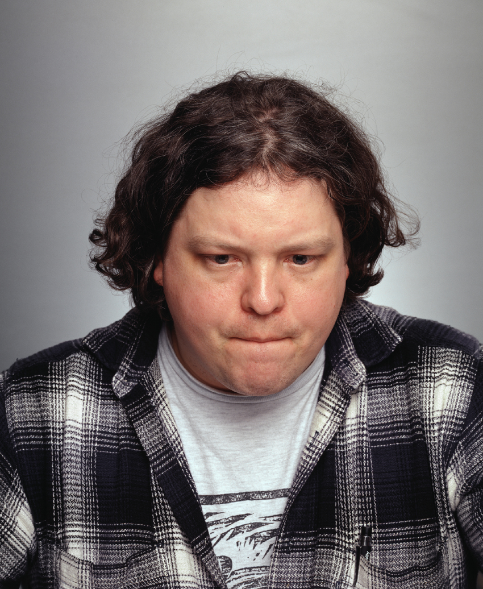
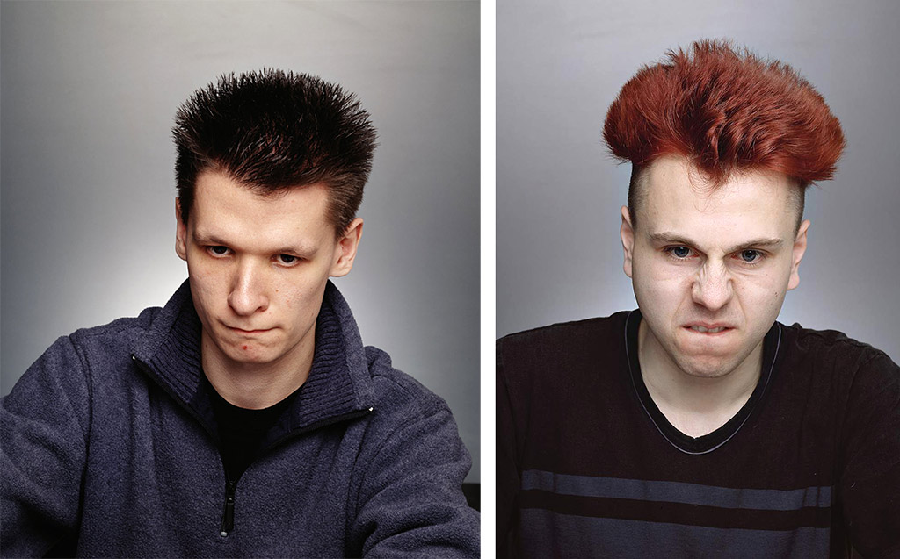

### Portraits (II)

---

*More rule-based approaches to portraiture (both with, and without, computation).*

---

Some more 3D portraits: 

* [Sophie Kahn, *Portraits*](https://www.sophiekahn.net/portraits)
* [Mathilde Marc & Hugo Arcier, *Camgirl Odalisque*](http://hugoarcier.com/en/camgirl-odalisque/)
* [Dmitry Zakharov, *Inside Me*](https://vimeo.com/106671329)
* [Marshmallow Laser Feast, *Duologue - Memex*](https://www.youtube.com/watch?v=dFrdG-ZPVLQ)
* [The *Visible Human Project*](https://www.youtube.com/watch?v=dPPjUtiAGYs) and [Croix Gagnon and Frank Schott, *12:31*](http://www.project1231.com/)

---

[Bob Sabiston, *Project Incognito*](https://youtu.be/xX5m3LqjuUc) (1997)

Very early work by the creator of [*The Waking Life*](https://www.youtube.com/watch?v=6DLga_hRwcQ) and [*A Scanner Darkly*](https://www.youtube.com/watch?v=hkjDUERgCQw). 

Sabiston's custom software applied forces, computed using optical flow, to buffet particles comprising vector-based drawings. Kyle McDonald's [ofxCv addon for openFrameworks](https://github.com/kylemcdonald/ofxCv) includes an example with two different optical flow algorithms. 

 
---

[Rachel Strickland, *Portable Portraits*](https://vimeo.com/9364721) (1990s)

Interviews with people about the contents of their bags, and other portable effects. 

--

[Maximilien van Aertryck and Axel Danielson, *Ten Meter Tower*](https://www.nytimes.com/2017/01/30/opinion/ten-meter-tower.html) (2017)

"Our objective in making this film was something of a psychology experiment: We sought to capture people facing a difficult situation, to make a portrait of humans in doubt. We’ve all seen actors playing doubt in fiction films, but we have few true images of the feeling in documentaries. To make them, we decided to put people in a situation powerful enough not to need any classic narrative framework. A high dive seemed like the perfect scenario."

--

[Beate Geissler & Oliver Gann, *Shooter*](http://www.taubertcontemporary.com/artists/geissler-sann/shooter/) (2000)

*Mad Bob, 120*

The title of each photograph is a combination of the name the gamer had given themselves and their individual pulse frequency in the moment the picture was taken. 

*Big Drozdowski, 115* (left). *Kai, 115* (right). 

"The photographs are taken in the very moment the depicted person is killing an opponent in the computer game. According to the artists, ‘The viewer witnesses a life-and-death game with no consequences’. ‘shooter’ presents a test set-up with which to analyse the human relation to real and virtual spaces and the associated gestures and facial expressions."

--

And: 

* [Tanja Hollander, *Photograph a Friend*](https://www.youtube.com/watch?v=0posLr4TTiI)
* [Nancy Burson, *Guys who Look Like Jesus*](https://raw.githubusercontent.com/golanlevin/ExperimentalCapture/master/docs/images/image-averaging/burson_jesus_guys.jpg)
