# Portraits (II): Candid Machinery

---

*In these rule-based approaches to portraiture, artists have devised systems, frameworks, and platforms for eliciting candid views of their subjects. They rely not on computation, but on the observational logic of [cinéma vérité](https://en.wikipedia.org/wiki/Cin%C3%A9ma_v%C3%A9rit%C3%A9) and the organizational logic of the [small multiple](https://en.wikipedia.org/wiki/Small_multiple).*

---

### More Turns

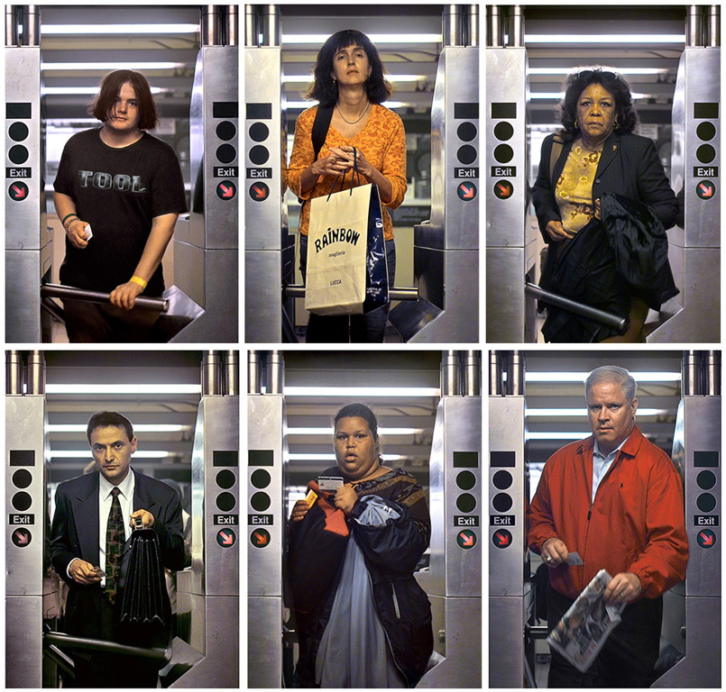

Bill Sullivan's [*More Turns*](https://www.moma.org/learn/moma_learning/walker-evans-subway-portraits-1938-41/) (2006) is a highly controlled photographic study of people passing through subway turnstiles. Sullivan equalizes his subjects by capturing all of them in the same action and from the same distance. 

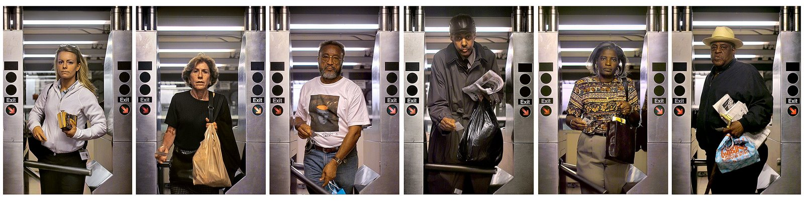

Sullivan writes:

> "*I needed something to be objective: I wanted the context to be clearly established. I wanted play a role in the situation, but I wanted the situation to take a photograph of itself for me. I would design the scenarios in which this could happen, and then the situation could be responsible for creating the picture. The poetry would be as much in the design of that scenario as from any photograph that might come from it. These situations would include me but I would disappear as any kind of typical photographer. I would simply play a role in the scenario. I would become someone waiting for an elevator, a man reading the New Yorker waiting for a friend to pass through the turnstile, or simply another tourist watching someone having his or her portrait done. The situations were mapped out, tests were made, and special clothing was worn. I became a spy for the obvious. I developed a situation so that various subjects could be defined by the constraints of exactly the same mechanical apparatus. The scenario consisted of someone passing through a subway turnstile. At the moment that the subjects passed through the turnstile, unknown to them, I took their picture stationed at a distance of eleven feet. I stood there turning pages of a magazine observing subjects out of the corner of my eye, waiting for only the moment when they pushed the turnstile bar to release the shutter.*" (Via [MoMA](https://www.moma.org/learn/moma_learning/walker-evans-subway-portraits-1938-41/)) 

---

### Ten Meter Tower

[Maximilien van Aertryck and Axel Danielson, *Ten Meter Tower*](https://www.nytimes.com/2017/01/30/opinion/ten-meter-tower.html) (2017)

> "*Our objective in making this film was something of a psychology experiment: We sought to capture people facing a difficult situation, to make a portrait of humans in doubt. We’ve all seen actors playing doubt in fiction films, but we have few true images of the feeling in documentaries. To make them, we decided to put people in a situation powerful enough not to need any classic narrative framework. A high dive seemed like the perfect scenario.*"

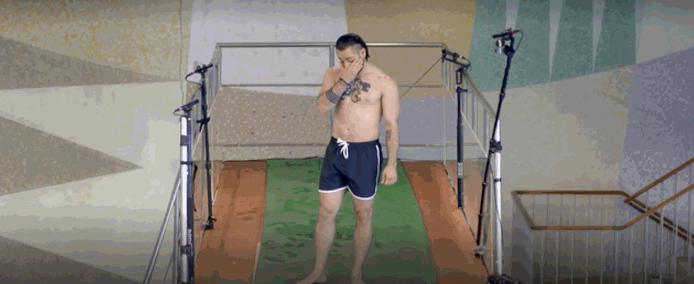

---

### People Staring at Computers

[“People Staring at Computers”](https://vimeo.com/25958231) (2011) was a photographic intervention by Kyle McDonald that pushed the legal limits of candid photography in commercially-controlled commercial spaces.

McDonald wrote an simple application that took one picture every minute. If it found a face, it uploaded the photo to his server. He installed the app in Apple stores around NYC over three days, collecting more than a thousand photos.

[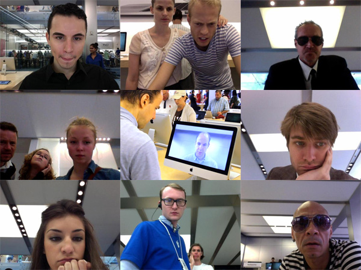](https://vimeo.com/25958231)

* I wasn't expecting the Secret Service" [article in WIRED](https://www.wired.com/2012/07/people-staring-at-computers/)

---

### Shooter

[Beate Geissler & Oliver Gann, *Shooter*](http://www.taubertcontemporary.com/artists/geissler-sann/shooter/) (2000)

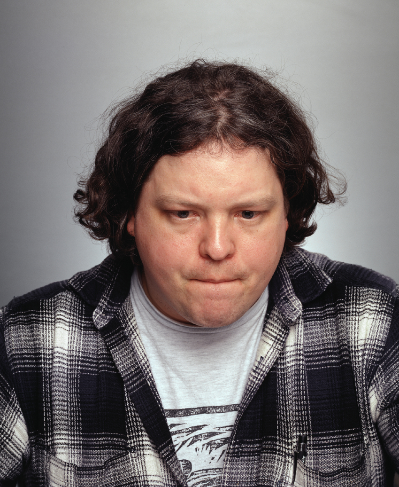
*Mad Bob, 120*

The title of each photograph is a combination of the name the gamer had given themselves and their individual pulse frequency in the moment the picture was taken. 

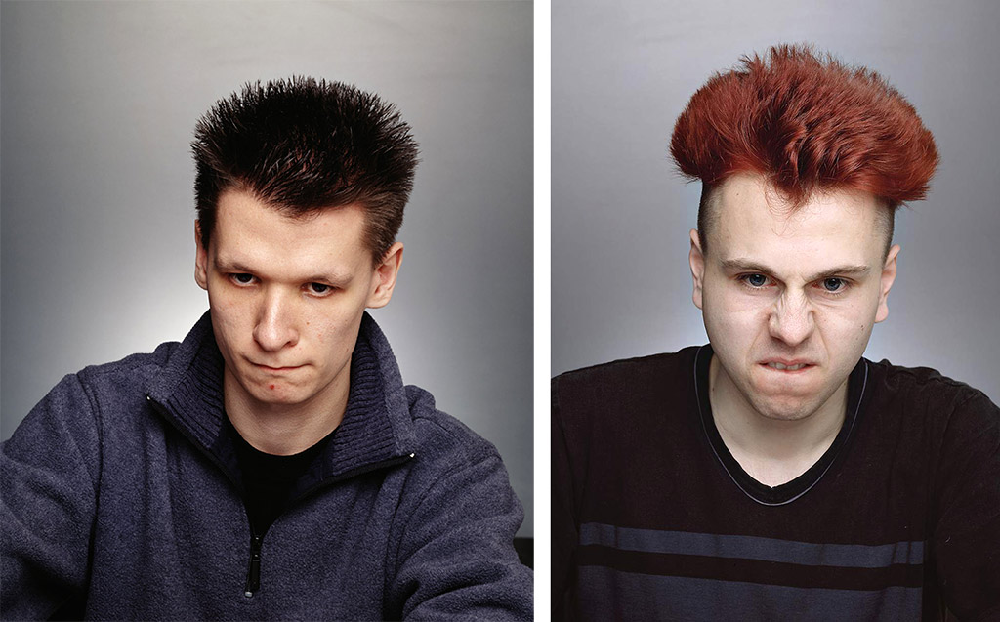
*Big Drozdowski, 115* (left). *Kai, 115* (right). 

> "*The photographs are taken in the very moment the depicted person is killing an opponent in the computer game. According to the artists, ‘The viewer witnesses a life-and-death game with no consequences’. ‘shooter’ presents a test set-up with which to analyse the human relation to real and virtual spaces and the associated gestures and facial expressions.*"

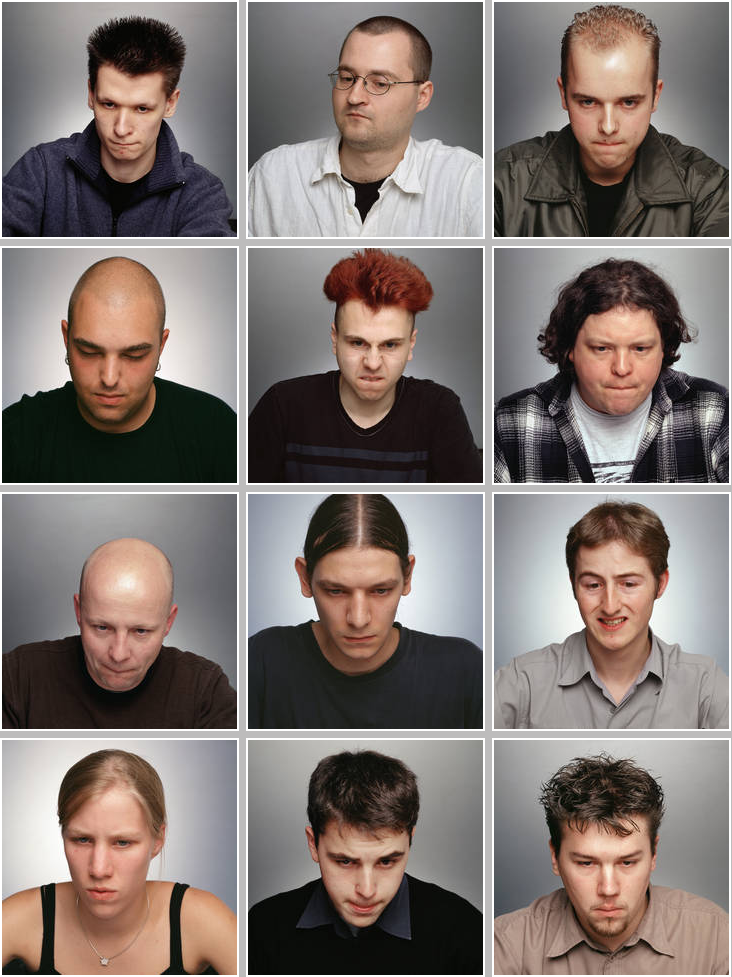

--- 

### The Stun Gun Photoshoot

Patrick Hall's [*Stun Gun Photoshoot*](https://www.patrickhall.photography/the-stun-gun-photoshoot) is a photo series showcasing the various emotions and reactions of people at the moment they are hit with a 300,000 volt stun gun. Hall's approach elicits utterly candid reactions ranging, interestingly, from pain to pleasure.  

[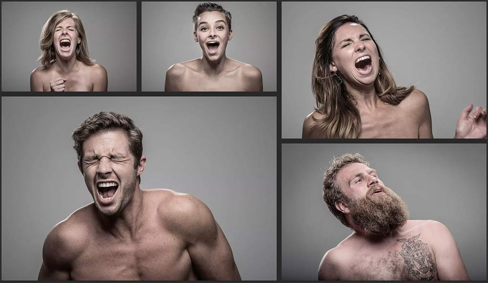](https://www.patrickhall.photography/the-stun-gun-photoshoot)

---

### Hysterical Literature

> "*[Hysterical Literature](http://hystericalliterature.com/sessions) is a video art series by NYC-based photographer and filmmaker Clayton Cubitt. It explores feminism, mind/body dualism, distraction portraiture, and the contrast between culture and sexuality.*"

[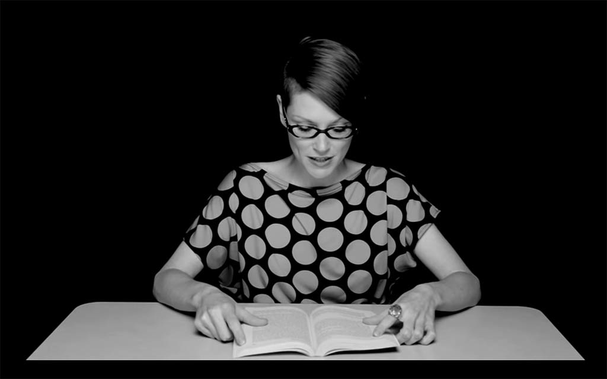](http://hystericalliterature.com/sessions)

One of the writers affiliated with the project, Amanda Hess, writes: 

> “*Hysterical Literature hits the internet at a time in human history where it is increasingly possible for women to obliterate that distinction [between sexual object and human subject], to express our sexuality without surrendering our agency.*”

---

### Portable Portraits

[Rachel Strickland, *Portable Portraits*](https://vimeo.com/9364721) (1990s)

Strickland conducts candid *cinema-verite* interviews with people about the contents of their bags, and other portable effects. Subjects exhaustively divulge their vernacular organizational strategies. An overview of the project is [here](https://spontaneouscinema.com/projects/portable-effects-a-survey-of-nomadic-design-practice/). 

[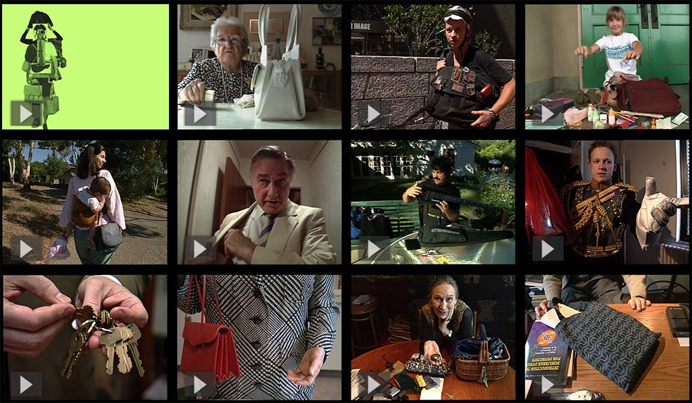](https://spontaneouscinema.com/projects/portable-effects-a-survey-of-nomadic-design-practice/)

Strickland writes: 

> "*Once upon a summertime expedition to Japan circa 1984, Strickland encountered expressions of a culture that’s enormously sophisticated in the ways of folding, stacking, rolling, nesting, carrying, miniaturizing, and transforming things. Transporting that inspiration home and proceeding to unpack it several years later, Portable Effects is a video anthropology project that investigates people’s design of the miniature environments we carry with us—in pockets, backpacks, briefcases, and handbags. Between setting forth in the morning and returning home at night, every person lives nomadically for a portion of each day. You can’t take everything with you—neither in your backpack nor in your head. Identifying essentials, and figuring out how to contain, arrange and keep track of them as you go, are instances of design thinking.*"

[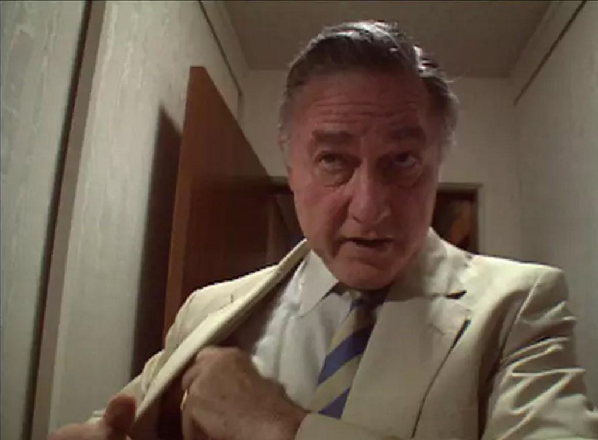](https://vimeo.com/9364721)

