# Portraits (II): Candid Machinery

---

In these rule-based approaches to comparative portraiture, artists devise systematized workflows, behavioral frameworks, and procedural situations for eliciting **candid** views of their subjects. They rely not on computation, but on the observational logic of [cinéma vérité](https://en.wikipedia.org/wiki/Cin%C3%A9ma_v%C3%A9rit%C3%A9) and the organizational logic of the [small multiple](https://en.wikipedia.org/wiki/Small_multiple). Rather than seeking authenticity through spontaneity alone, the artists engineer repeatable circumstances in which subtle differences in behavior, attention, stress, labor, vulnerability, or personality can emerge.

Across these projects, the "portrait machine" is not the camera but the *designed situation* surrounding it. The artist constructs a constrained social, physiological, or psychological apparatus, then steps back and allows the system to generate a series of involuntary and revealing human responses. The usual context of a portrait sitting is replaced by a repeated test, ritual, provocation, endurance task, or behavioral trap. Personality emerges not through the subject's pose but through their reaction.

What unites these projects is their use of procedural structure to produce *candidness at scale*. By standardizing conditions across many subjects, the artists create comparative instruments for observing how people navigate systems: social systems, technological systems, economic systems, bodily systems, and systems of attention itself. The resulting portraits are therefore not only depictions of individuals, but records of human behavior under designed conditions.

* **The core question:** What can we learn about people by placing them inside a carefully designed situation?
* **We use:** provocations, rituals, endurance tasks, constrained interactions, engineered circumstances.
* **The output:** People are visibly present, but their portraits emerge from behavior rather than their appearance.

---

### More Turns

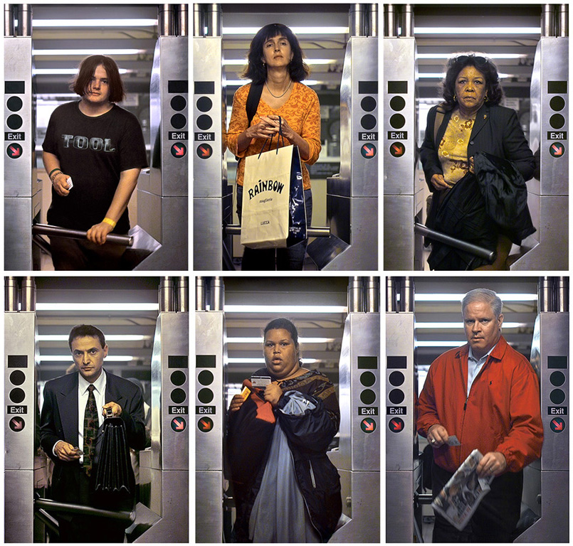

Bill Sullivan's [*More Turns*](https://www.moma.org/learn/moma_learning/walker-evans-subway-portraits-1938-41/) (2006) is a highly controlled photographic study of people passing through subway turnstiles. Sullivan equalizes his subjects by capturing all of them in the same action and from the same distance. 

Sullivan writes:

> "*I needed something to be objective: I wanted the context to be clearly established. I wanted play a role in the situation, but I wanted the situation to take a photograph of itself for me. I would design the scenarios in which this could happen, and then the situation could be responsible for creating the picture. The poetry would be as much in the design of that scenario as from any photograph that might come from it. These situations would include me but I would disappear as any kind of typical photographer. I would simply play a role in the scenario. I would become someone waiting for an elevator, a man reading the New Yorker waiting for a friend to pass through the turnstile, or simply another tourist watching someone having his or her portrait done. The situations were mapped out, tests were made, and special clothing was worn. I became a spy for the obvious. I developed a situation so that various subjects could be defined by the constraints of exactly the same mechanical apparatus. The scenario consisted of someone passing through a subway turnstile. At the moment that the subjects passed through the turnstile, unknown to them, I took their picture stationed at a distance of eleven feet. I stood there turning pages of a magazine observing subjects out of the corner of my eye, waiting for only the moment when they pushed the turnstile bar to release the shutter.*" (Via [MoMA](https://www.moma.org/learn/moma_learning/walker-evans-subway-portraits-1938-41/)) 

---

### Ten Meter Tower

[Maximilien van Aertryck and Axel Danielson, *Ten Meter Tower*](https://www.nytimes.com/2017/01/30/opinion/ten-meter-tower.html) (2017)

> "*Our objective in making this film was something of a psychology experiment: We sought to capture people facing a difficult situation, to make a portrait of humans in doubt. We’ve all seen actors playing doubt in fiction films, but we have few true images of the feeling in documentaries. To make them, we decided to put people in a situation powerful enough not to need any classic narrative framework. A high dive seemed like the perfect scenario.*"

---

### Time is Money

In [*Time is Money*](https://www.yurenev.com/projects/time-is-money) (2022-2025), Alexey Yurenev traveled across New York City and asked people of different professions how long it takes them to earn one dollar. He then used their responses to set the exposure time for their respective portraits while they worked.

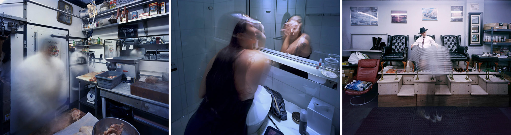 *Left to right: Butcher (144 seconds); Sex Worker (3.6 seconds); Shoe Shiner (60 seconds).*

> "[Boulevard du Temple](https://en.wikipedia.org/wiki/Boulevard_du_Temple_(photograph))", an image taken by Louis Daguerre in 1838, is considered to be the first photographic representation of human beings. It contains the silhouette of a man having his shoes shined, his image rendered sharp by virtue of his stillness during the 7-minute exposure. Just below him is the indistinct outline of the shoe shiner, whose movements as he works make his figure fainter. This first photograph of people, then, is also the first to depict class relations, wherein the degree of social visibility afforded to each subject is made literal by their impression on the photographic plate. 
> 
> As in Daguerre’s photograph, Yurenev's images make visible the distinctions between workers in different occupations: some subjects are seen clearly; others blur as they move about; and still others are nearly imperceptible. [...] These photographs document the city’s deepening social stratification and ask: At what point does a worker become invisible?

---

### Shooter

[Beate Geissler & Oliver Sann, *Shooter*](http://www.lifeisgood.biz/shooter/) (2000)

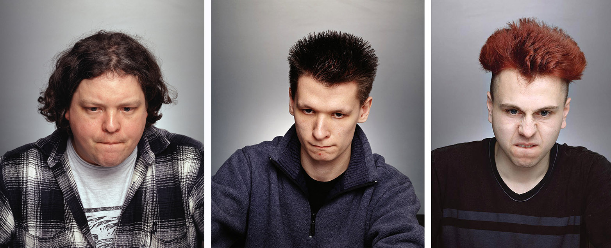 *Mad Bob, 120; Big Drozdowski, 115; Kai, 115.* 

This is what it looks like to kill someone. 

> "*The photographs are taken in the very moment the depicted person is killing an opponent in a first-person shooter computer game. According to the artists, ‘The viewer witnesses a life-and-death game with no consequences’. ‘shooter’ presents a test set-up with which to analyse the human relation to real and virtual spaces and the associated gestures and facial expressions.*"

The title of each photograph is a combination of the name the gamer had given themselves and their individual pulse frequency in the moment the picture was taken. 

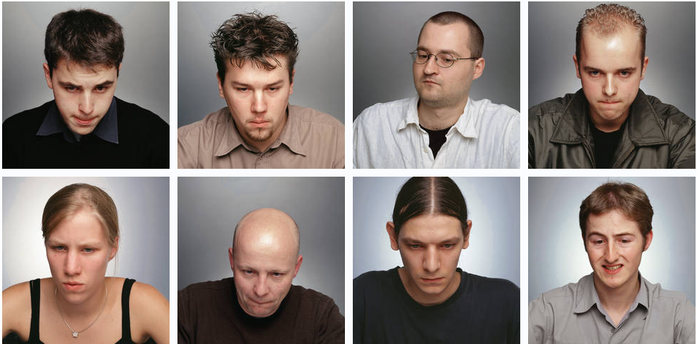

---

### People Staring at Computers

[“People Staring at Computers”](https://vimeo.com/25958231) (2011) was a photographic intervention by Kyle McDonald that pushed the legal limits of candid photography in commercially-controlled commercial spaces.

McDonald wrote a simple application that automatically took one picture every minute. If it found a face, it uploaded the photo to his server. He installed the app in Apple stores around NYC over three days, collecting more than a thousand photos.

[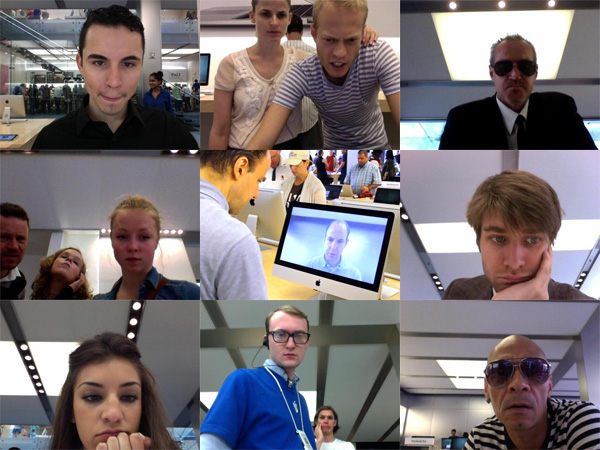](https://vimeo.com/25958231)

* I wasn't expecting the Secret Service" [article in WIRED](https://www.wired.com/2012/07/people-staring-at-computers/)

---

### Hysterical Literature

In the [*Hysterical Literature*](http://hystericalliterature.com/sessions) video series, participants attempt to read literary texts aloud while subjected to escalating off-camera physical distraction, producing involuntary interruptions and revealing tensions between composure, intellect, and control. Like many of the examples here, the work derives its power from a deliberately engineered situation that produces involuntary human responses.

> "*[Hysterical Literature](http://hystericalliterature.com/sessions) is a video art series by NYC-based photographer and filmmaker Clayton Cubitt. It explores feminism, mind/body dualism, distraction portraiture, and the contrast between culture and sexuality.*"

[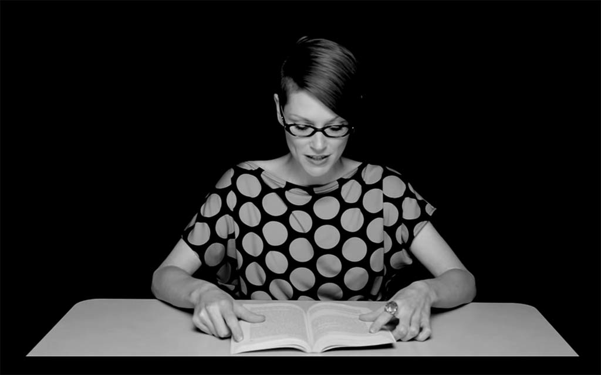](http://hystericalliterature.com/sessions)

One of the writers affiliated with the project, Amanda Hess, writes: 

> “*Hysterical Literature hits the internet at a time in human history where it is increasingly possible for women to obliterate that distinction [between sexual object and human subject], to express our sexuality without surrendering our agency.*”

---

### The Stun Gun Photoshoot

Patrick Hall's [*Stun Gun Photoshoot*](https://www.patrickhall.photography/the-stun-gun-photoshoot) is a photo series showcasing the various emotions and reactions of people at the moment they are hit with a 300,000 volt stun gun. Hall's approach elicits utterly candid reactions ranging, interestingly, from pain to pleasure.  

[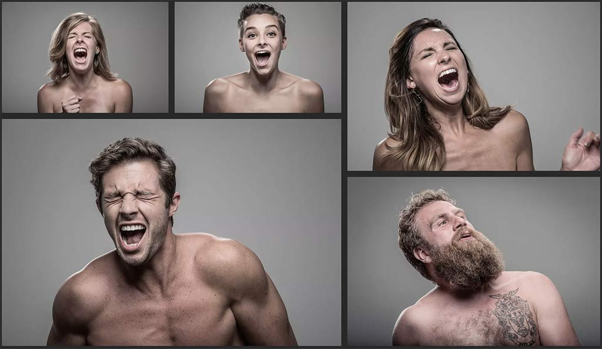](https://www.patrickhall.photography/the-stun-gun-photoshoot)

---

### Portable Portraits

[Rachel Strickland, *Portable Portraits*](https://vimeo.com/9364721) (1990s)

Strickland conducts candid *cinema-verite* interviews with people about the contents of their bags, and other portable effects. Subjects exhaustively divulge their vernacular organizational strategies. An overview of the project is [here](https://spontaneouscinema.com/projects/portable-effects-a-survey-of-nomadic-design-practice/). 

[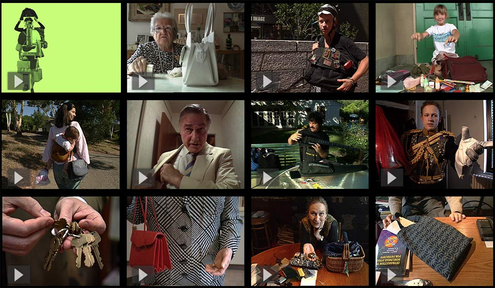](https://spontaneouscinema.com/projects/portable-effects-a-survey-of-nomadic-design-practice/)

Strickland writes: 

> "*Once upon a summertime expedition to Japan circa 1984, Strickland encountered expressions of a culture that’s enormously sophisticated in the ways of folding, stacking, rolling, nesting, carrying, miniaturizing, and transforming things. Transporting that inspiration home and proceeding to unpack it several years later, Portable Effects is a video anthropology project that investigates people’s design of the miniature environments we carry with us—in pockets, backpacks, briefcases, and handbags. Between setting forth in the morning and returning home at night, every person lives nomadically for a portion of each day. You can’t take everything with you—neither in your backpack nor in your head. Identifying essentials, and figuring out how to contain, arrange and keep track of them as you go, are instances of design thinking.*"

[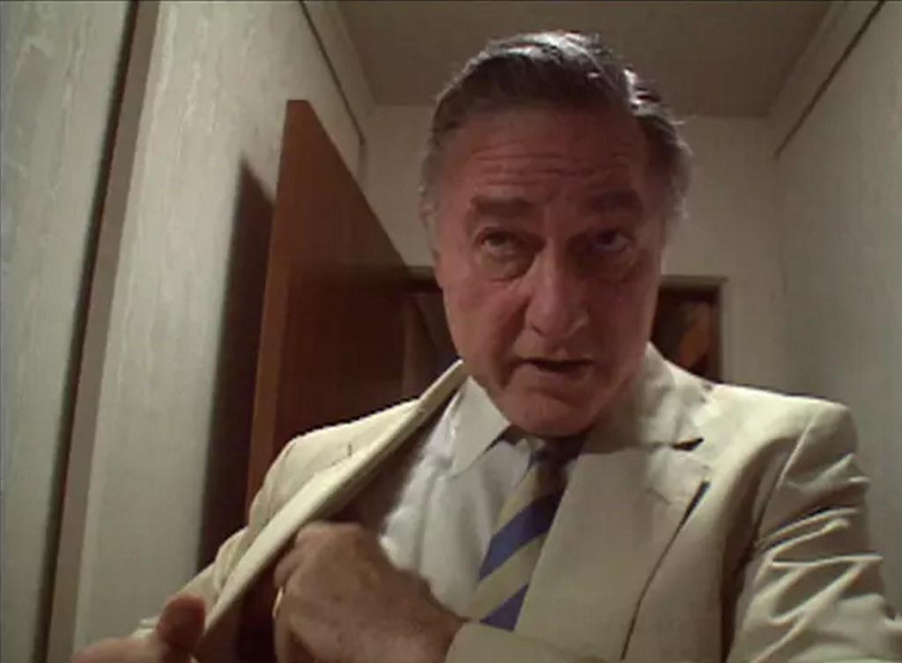](https://vimeo.com/9364721)

* [Portable Portrait: HENRY ROSE (1990)](https://vimeo.com/9364721)
* [Portable Portrait: THELMA GEHRY (1989)](https://vimeo.com/9370678)
* [Portable Portrait: PHYLIS MORRISON (1994)](https://vimeo.com/9299697)
* [Portable Portrait: REBECCA REILLY (1995)](https://vimeo.com/9370157)
* [Portable Portrait: JOANNA PFEIFFER (1990)](https://vimeo.com/9369129)

---

### Eva Teppe's Visualization for Elliott Carter

Eva Teppe's visualization for Elliott Carter's *Dialogue* (2005). 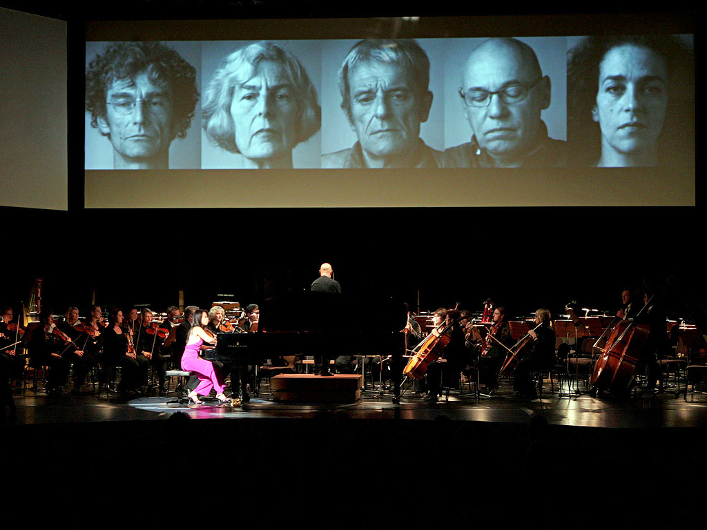

This stunning visualization, created by German video artist Eva Teppe, accompanied a performance by the Bruckner Orchester Linz at the 2005 Ars Electronica Festival, with Dennis Russell Davies conducting.

In this visualization, Teppe videotaped the faces of people listening to a recorded version of the concert. These face-videos were then presented while the orchestra performed the same music. The conductor kept the orchestra to within 3 seconds of the timing of the original recorded version. The result? Each subject's face portrays a different visualization of the music—a completely subjective, enormously multidimensional representation which is organically derived from the psychological impact of Carter's music on the unique personality and tastes of each subject, and our own subjective proclivities as interpreters of facial expressions. Viewing the performance, we each begin to identify with one or more of the subjects, based on the similarity of their reactions to our own. We develop a mental model, not only of the music we are listening to, but of the personalities of each of the subjects. We may even laugh when a subject's expression confirms our own inner feelings.

---

### The Artist is Present

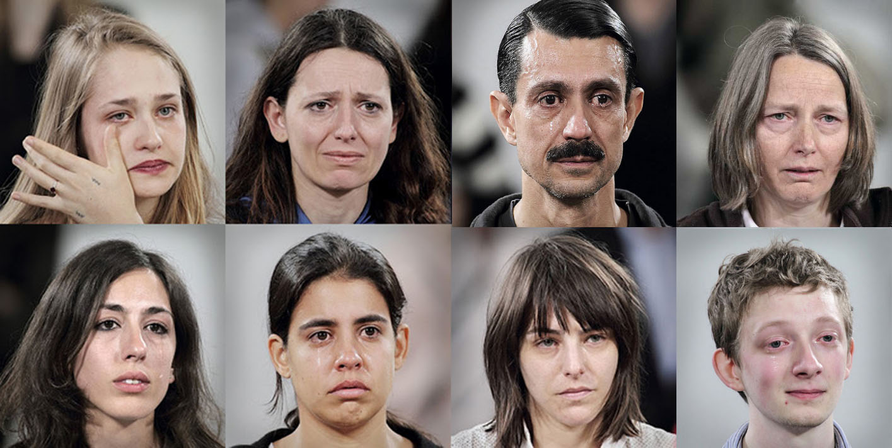

In her 3-month performance project at MoMA, [*The Artist is Present*](https://www.youtube.com/watch?v=taKQwPTtRjg) (2010), Marina Abramovic sat silently across a table from visitors. Participants could remain for as long as they wished, engaging only in sustained eye contact. Deprived of conversation, distraction, and social scripts, many subjects exhibited unexpectedly intense emotional responses, ranging from discomfort and nervousness to tears. [The accompanying series of portraits](https://www.flickr.com/photos/themuseumofmodernart/albums/72157623741486824/) are records of people subjected to the same simple condition: prolonged mutual gaze.

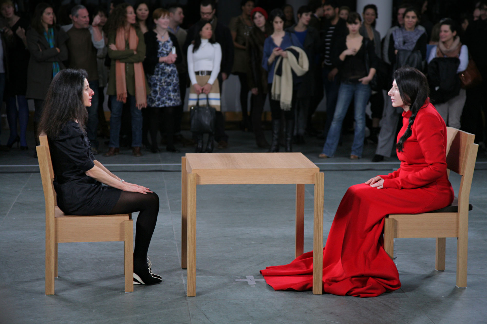

---

### For Further Study

Some additional examples: 

* Andy Warhol, [*Screen Tests*](portraits_1_series.md#screen-tests) (1964–66). Subjects sit silently for several minutes in front of a stationary film camera. Their microexpressions become monumental.
* Gillian Wearing, [*Signs that say what you want them to say*](https://www.tate.org.uk/art/artworks/wearing-signs-that-say-what-you-want-them-to-say-and-not-signs-that-say-what-someone-else-66092) (1992). Participants hold handwritten confessions in public space.
* Harun Farocki, [*Serious Games*](https://vimeo.com/370494311). Recordings of soldiers engaging in battle simulations.
* Erwin Wurm, [*One Minute Sculptures*](https://publicdelivery.org/erwin-wurm-one-minute-sculptures/). A collection of photos documenting absurd participatory temporary performance-sculptures.