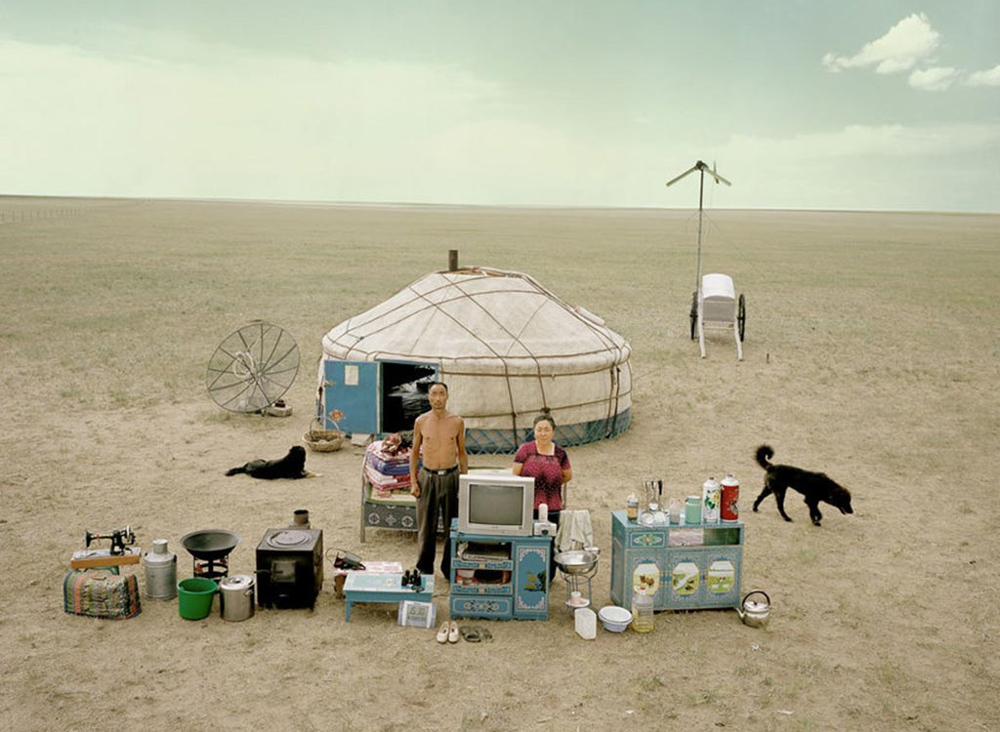
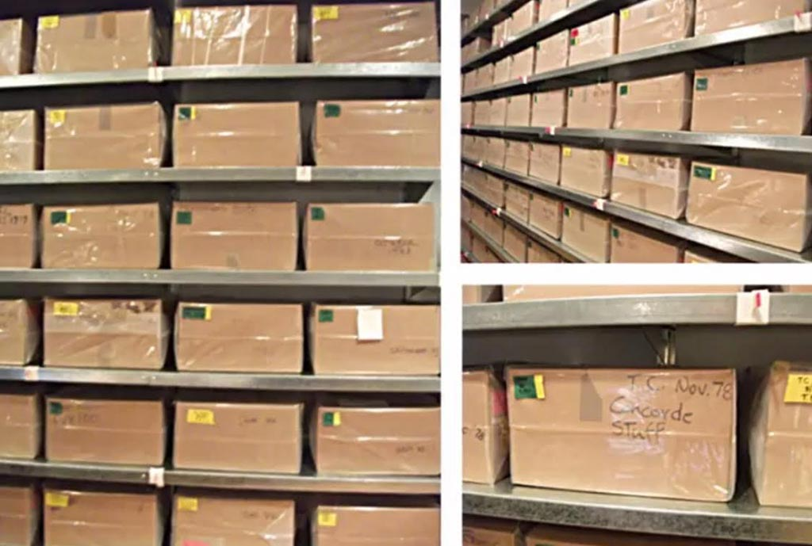

# Portraits (III): The Indirect Portrait

* [Portrait of Ross](#portrait-of-ross)
* [Lipsticks](#lipsticks)
* [Material World](#material-world)
* [Stranger Visions](#stranger-visions)
* [Time Capsules](*time-capsules)
* [Tracking Transience](#tracking-transience)
* [Browser History](#browser-history)
* [Evidence Locker](#evidence-locker)

---

### Portrait of Ross

[*Untitled (Portrait of Ross in L.A.)*](https://www.youtube.com/watch?v=37bSb-aQ4BM) (1991), by Felix Gonzalez-Torres, is an allegorical representation of the artist’s partner, Ross Laycock, who died of an AIDS-related illness in 1991. The installation is comprised of 175 pounds of candy, corresponding to Ross’s body weight before becoming ill. Viewers are encouraged to take a piece of candy, and the diminishing amount parallels Ross’s weight loss and suffering prior to his death.

---

### Lipsticks

Stacy Greene's [*Lipsticks*](http://stacygreene.com/portfolio/lipsticks/) (1992) "are a series color close-ups of used lipsticks, with each print titled with the name of the lipstick’s owner. They are distinguished by their striking variations in form and texture arising from the owners’ individual techniques of application. The everyday, factory, ‘ready-made’ product turned into a uniquely surreal and subconscious image – a sculpture evolving from a private daily ritual taken for granted. A personal object/process that reveals , through colors and shapes, a relationship of imprint at the periphery of the body."

---

### Material World

In [*Material World: A Global Family Portrait*](http://www.npr.org/sections/pictureshow/2010/08/10/129113632/picturingpossessions), photographer Peter Menzel and other photographers took portraits of 30 statistically average families with all of their worldly possessions displayed outside their homes.

---

### Time Capsules

Andy Warhol, [*Time Capsules*](http://www.phaidon.com/agenda/art/articles/2014/january/03/opening-warhols-time-capsules/)

---

### Tracking Transience

Hasan Elahi conceived [*Tracking Transience*](https://www.ted.com/talks/hasan_elahi) (2002-), a self-tracking system that constantly and publicly presents his exact location, activities, and other personal data. Elahi documents the beds where he sleeps, the food he eats, the toilets he uses, and more. This self-surveillance project is a critique of contemporary investigative techniques and provides an ongoing “alibi” for Elahi in the event of future accusations.

--- 

### Stranger Visions

Regarding Heather Dewey-Hagborg's tour-de-force [*Stranger Visions*](http://deweyhagborg.com/projects/stranger-visions) (2013), the artist writes:

> In *Stranger Visions* I collected hairs, chewed up gum, and cigarette butts from the streets, public bathrooms and waiting rooms of New York City. I extracted DNA from them and analyzed it to computationally generate 3d printed life size full color portraits representing what those individuals might look like, based on genomic research. Working with the traces strangers unwittingly left behind, the project was meant to call attention to the developing technology of forensic DNA phenotyping, the potential for a culture of biological surveillance, and the impulse towards genetic determinism. [*Video*](https://www.youtube.com/watch?v=o5ijy2xboZs)



---

### Browser History

While a student at CMU, Shan Huang developed [Quantified Selfie: Browser History Visualization*](http://golancourses.net/2014/shan/03/06/project-3-shan-browser-history-visualization/) (2014), a self-portrait compiled from the favicons of the web sites she visited over a six-month period.

---

### Evidence Locker

Jill Magid's [*Evidence Locker*](http://www.jillmagid.com/projects/evidence-locker-2) (2004) is a self-portrait compiled from public surveillance footage. 

> *​In 2004, Jill Magid spent 31 days in Liverpool, during which time she developed a close relationship with Citywatch (Merseyside Police and Liverpool City Council), whose function is citywide video surveillance- the largest system of its kind in England. The videos in her *Evidence Locker* were staged and edited by the artist and filmed by the police using the public surveillance cameras in the city centre. Wearing a bright red trench coat she would call the police on duty with details of where she was and ask them to film her in particular poses.*
