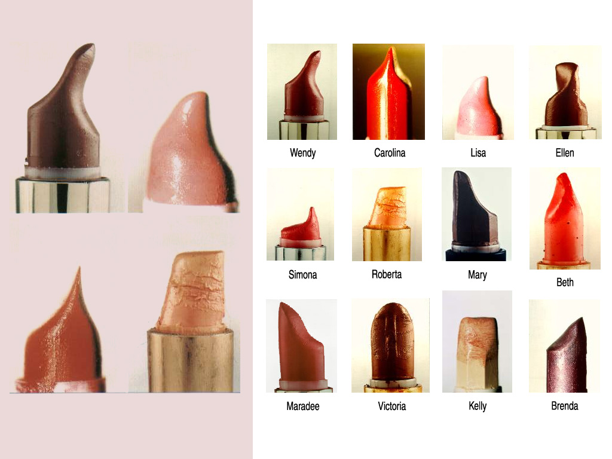
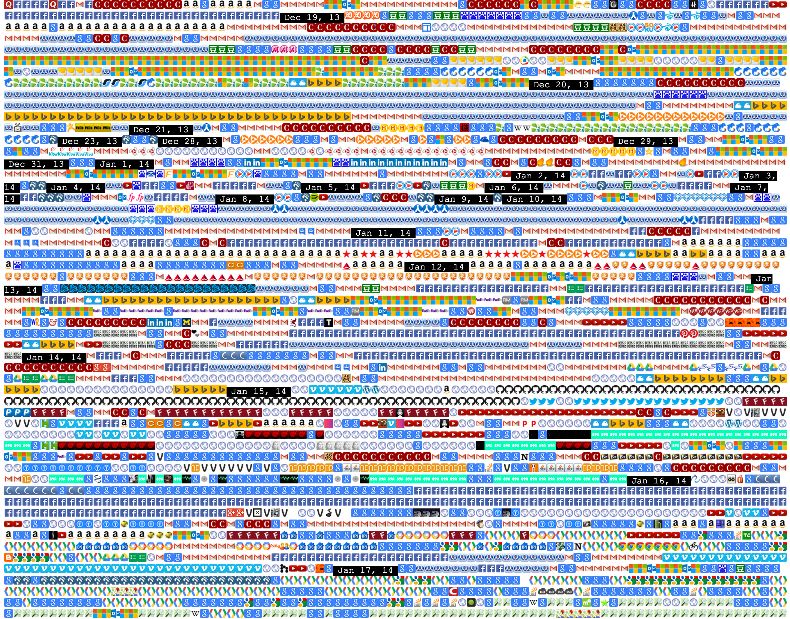
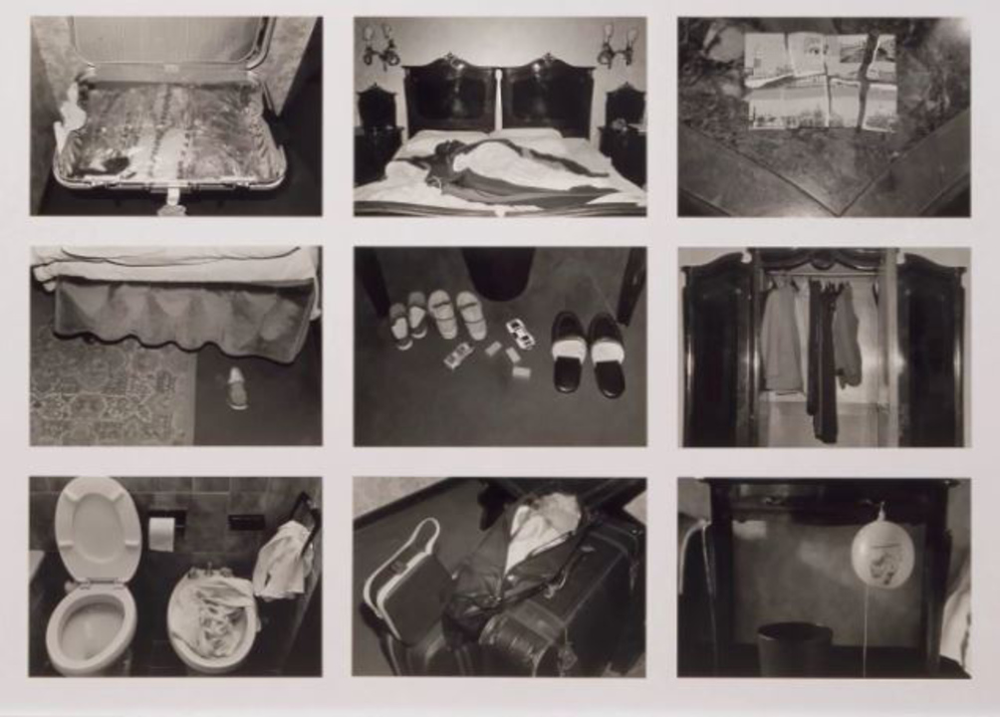
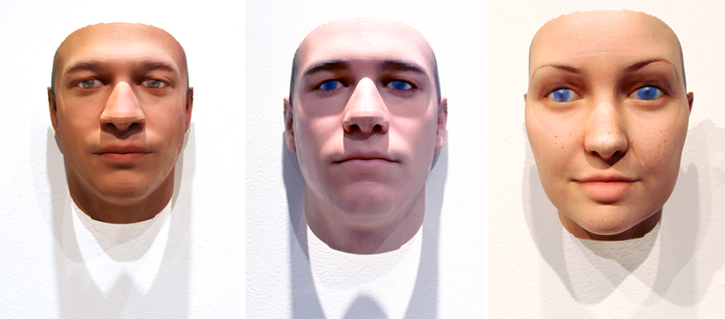
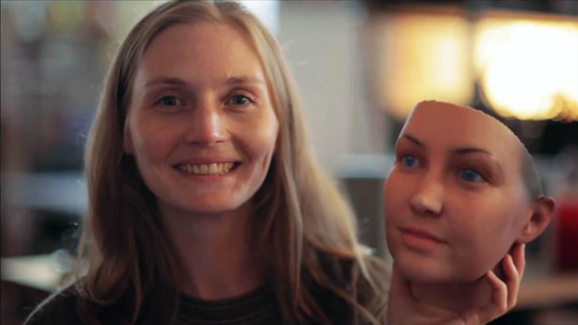
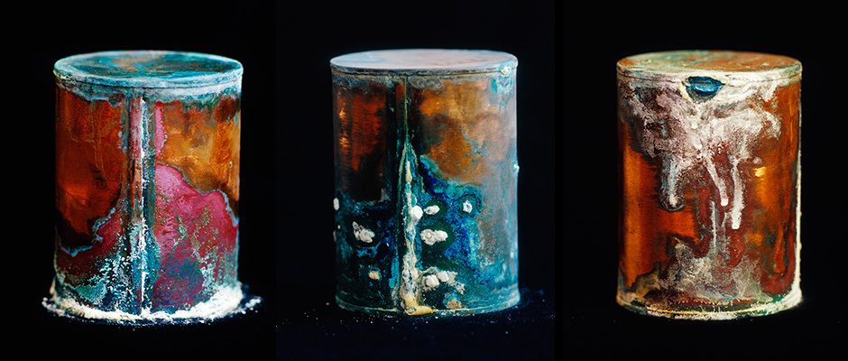
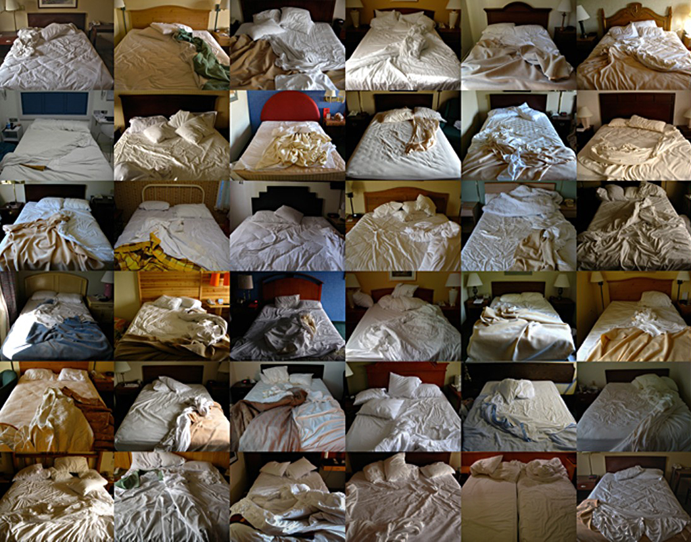
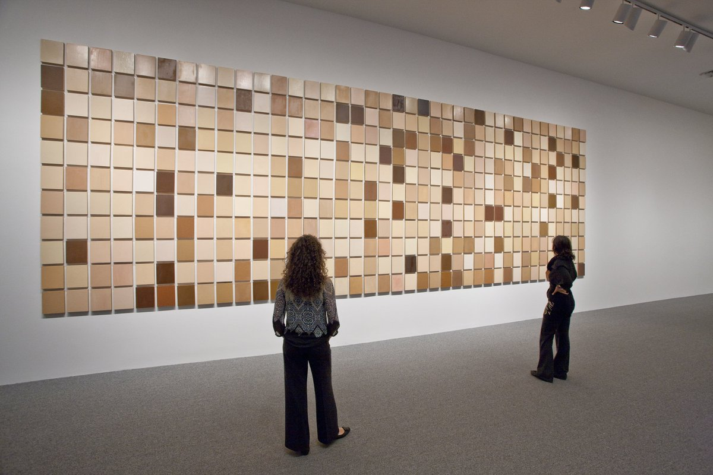
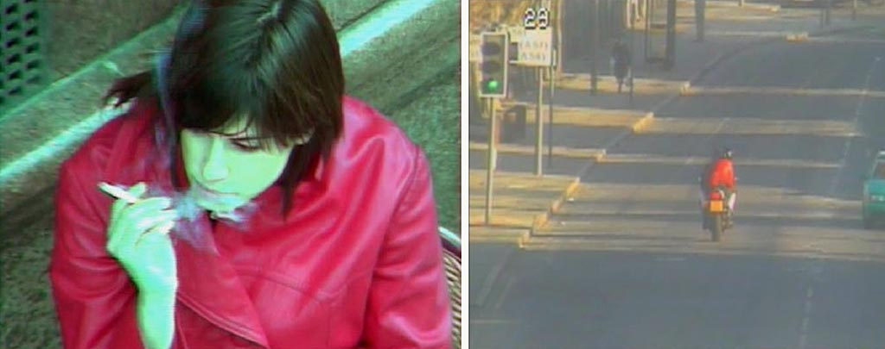
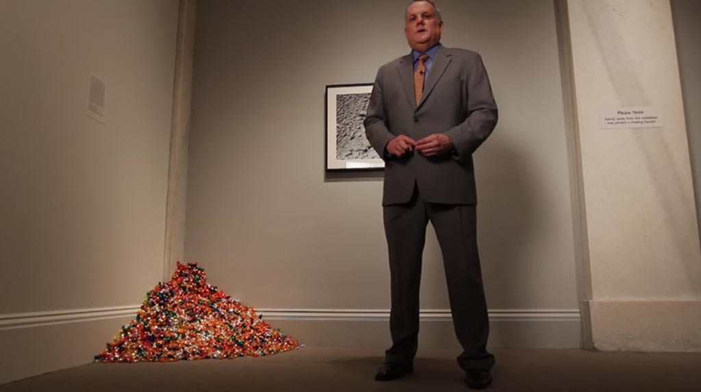

# Portraits (III): The Indirect Portrait

In these projects, artists construct portraits without relying on direct depictions of their subjects. Rather than photographing or otherwise observing a person directly, they work with traces and proxies: possessions, residues,  biological samples, personal data, and other forms of indirect evidence.

Across these projects, the subject may be absent, deceased, or entirely unknown. The artist assembles fragments and artifacts from which a portrait can be inferred. A room stands in for its occupant; a collection of possessions stands in for a life; a strand of hair stands in for a body. The viewer becomes an active participant in reconstructing the missing person from the evidence that remains.

What unites these projects is their use of procedural structures to transform traces into representations. By standardizing the kinds of evidence they collect, artists create frameworks for reasoning about identity through inference rather than direct observation. The resulting portraits emerge not through depiction, but through interpretation.

* **The core question:** What can we learn about people without depicting them directly?
* **We use:** possessions, traces, biological samples, archives, surveillance records, personal data.
* **The output:** People may be absent in a conventional sense, but their portraits emerge through interpretation rather than depiction.

---

### Stacy Greene, *Lipsticks*

Stacy Greene's [*Lipsticks*](http://stacygreene.com/portfolio/lipsticks/) (1992), per the artist,

> "are a series color close-ups of used lipsticks, with each print titled with the name of the lipstick’s owner. They are distinguished by their striking variations in form and texture arising from the owners’ individual techniques of application. The everyday, factory, ‘ready-made’ product turned into a uniquely surreal and subconscious image – a sculpture evolving from a private daily ritual taken for granted. A personal object/process that reveals , through colors and shapes, a relationship of imprint at the periphery of the body."

---

### Shan Huang, *Browser History*

While a Creative Coding student at CMU, Shan Huang developed [Quantified Selfie: Browser History Visualization*](http://golancourses.net/2014/shan/03/06/project-3-shan-browser-history-visualization/) (2014), a self-portrait compiled from the favicons of the web sites she visited over a six-month period. Rather than depicting her appearance, Huang represents herself through accumulated patterns of attention. The resulting image is a portrait assembled from behavior recorded indirectly through digital traces.

---

### The Hotel 

For her photo series, [*The Hotel*](https://www.youtube.com/watch?v=V5yLOcp-azI) (1981), Sophie Calle posed as a chambermaid in order to take photos of hotel rooms, as proxies for their inhabitants. 

> "Sophie Calle's voyeuristic fascination with the lives of others inspired *The Hotel*, a project she executed in the early 1980s while posing as a chambermaid at a hotel in Venice, Italy. Each work in the series is a portrait of a room she was assigned to clean, including photographs of the bed and personal belongings she found there, and a text by the artist offering her imaginative impression of the absent guests."

* More information about [Sophie Calle's hotel rooms](https://www.sfmoma.org/sophie-calles-voyeuristic-portraits-of-hotel-rooms/)

--- 

### Heather Dewey-Hagborg, *Stranger Visions*

Regarding Heather Dewey-Hagborg's tour-de-force [*Stranger Visions*](https://www.youtube.com/watch?v=o5ijy2xboZs) (2013), the artist writes:

> In *Stranger Visions* ([site](http://deweyhagborg.com/projects/stranger-visions)) I collected hairs, chewed up gum, and cigarette butts from the streets, public bathrooms and waiting rooms of New York City. I extracted DNA from them and analyzed it to computationally generate 3d printed life size full color portraits representing what those individuals might look like, based on genomic research. Working with the traces strangers unwittingly left behind, the project was meant to call attention to the developing technology of forensic DNA phenotyping, the potential for a culture of biological surveillance, and the impulse towards genetic determinism. [*Video*](https://www.youtube.com/watch?v=o5ijy2xboZs)



---

### Rose Selane, *64000 Attempts at Circulation*

In [*64000 Attempts at Circulation*](https://www.frieze.com/article/rose-salane-whitney-biennial-2022), the artist presents a collection of 64000 "slugs": arcade tokens and other fake coins that she acquired from a NYC Transit Authority auction. Each represents an instance — a *story* — of someone attempting to elude a fare on public transit. 

The tokens operate simultaneously as individual and collective portraits. Individually, they hint at the identity or circumstances of its owner; taken together, they form a portrait of thousands of anonymous acts of resistance, desperation, opportunism, and necessity.

---

### David Maisel, *Library of Dust*

David Maisel's [*Library of Dust*](https://davidmaisel.com/works/library-of-dust/) (2009) depicts approximately 3,500 individual copper canisters, each containing the cremated remains of patient from a state-run psychiatric hospital. The patients died at the hospital between 1883 and the 1970’s; their bodies have remained unclaimed by their families. Here the portrait has been reduced to a container and its contents, a totalizing reduction of a forgotten life.

---

### Hasan Elahi, *Tracking Transience*

Hasan Elahi conceived [*Tracking Transience*](https://www.ted.com/talks/hasan_elahi) (2002-), a self-tracking system that constantly and publicly presents his exact location, activities, and other personal data. Elahi documents the beds where he sleeps, the food he eats, the toilets he uses, and more. Instead of resisting surveillance, Elahi overwhelms it, producing an indirect self-portrait assembled entirely from traces of daily life. This self-surveillance project is a critique of contemporary investigative techniques and provides an ongoing “alibi” for Elahi in the event of future accusations.

--- 

### Photos from CPB

> The items seem inconsequential, but the story they tell is anything but. Each one was left behind by a migrant processed at an Arizona Customs and Border Protection facility where photographer, Tom Kiefer, worked as a part-time janitor for 11 years, much of it spent diligently rescuing these objects from the trash.

---

### Byron Kim, *Synecdoche*

[*Synecdoche*](https://puamsab.princeton.edu/2019/04/artist-feature-byron-kim-isabel-griffith-gorgati-21/) (1991-) is a collection of panels representing the skin color of hundreds of individuals who have sat for Byron Kim. It is housed in the National Gallery of Art in Washington, DC. Each panel functions as a *synecdoche*: a small sample of skin standing in for an entire person. (Compare with [*Humanae*](images/typologies/angelica_dass_humanae.jpg) by Angelica Dass)

---

## For Further Research

* Rafael Lozano-Hemmer, [*Pulse Room*](https://www.lozano-hemmer.com/pulse_room.php) (2006). 
* Jill Magid, [*Evidence Locker*](http://www.jillmagid.com/projects/evidence-locker-2) (2004).
* Angelica Dass, [*Humanae*](images/typologies/angelica_dass_humanae.jpg) (2020).
* Song Dong, [*Waste Not*](https://smarthistory.org/song-dong-waste-not/) (2005).
* Felix Gonzalez-Torres, [*Untitled (Portrait of Ross in L.A.)*](https://www.youtube.com/watch?v=37bSb-aQ4BM) (1991).

---

<!--

---

### Evidence Locker

Jill Magid's [*Evidence Locker*](http://www.jillmagid.com/projects/evidence-locker-2) (2004) is a self-portrait compiled from public surveillance footage. 

> *​In 2004, Jill Magid spent 31 days in Liverpool, during which time she developed a close relationship with Citywatch (Merseyside Police and Liverpool City Council), whose function is citywide video surveillance- the largest system of its kind in England. The videos in her *Evidence Locker* were staged and edited by the artist and filmed by the police using the public surveillance cameras in the city centre. Wearing a bright red trench coat she would call the police on duty with details of where she was and ask them to film her in particular poses.*

---

### Felix Gonzalez-Torres, *Portrait of Ross in L.A.*

[*Untitled (Portrait of Ross in L.A.)*](https://www.youtube.com/watch?v=37bSb-aQ4BM) (1991), by Felix Gonzalez-Torres, is an allegorical representation of the artist’s partner, Ross Laycock, who died of an AIDS-related illness in 1991. The installation is comprised of 175 pounds of candy, corresponding to Ross’s body weight before becoming ill. Viewers are encouraged to take a piece of candy, and the diminishing amount parallels Ross’s weight loss and suffering prior to his death.

-->