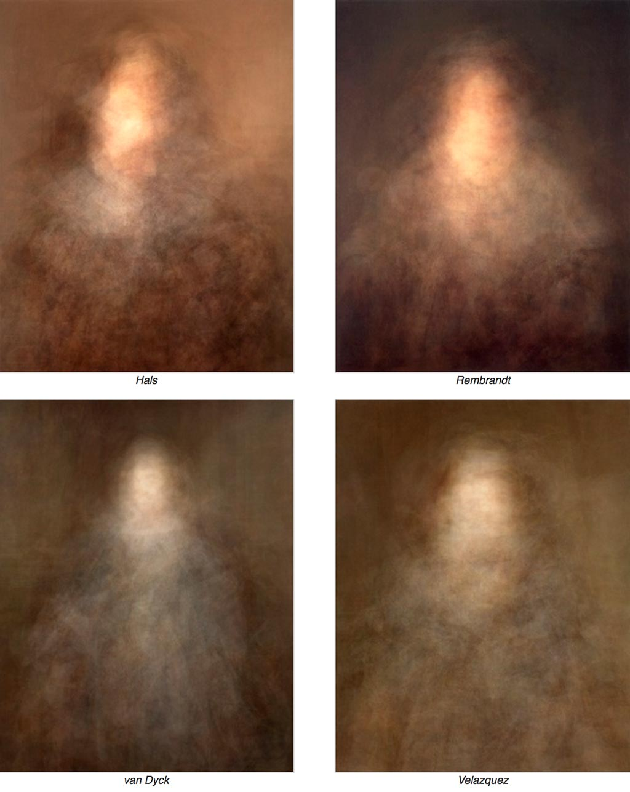
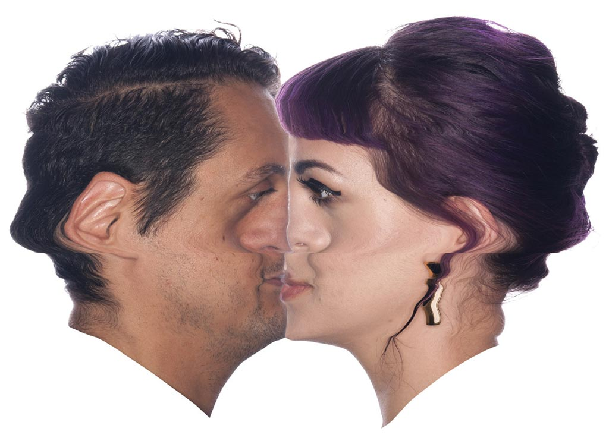

# Portraits: Link Landfill

---

And: 

* [Tanja Hollander, *Photograph a Friend*](https://www.youtube.com/watch?v=0posLr4TTiI) (Journey to photograph all of her facebook friends)
* [Nancy Burson, *Guys who Look Like Jesus*](https://raw.githubusercontent.com/golanlevin/ExperimentalCapture/master/docs/images/image-averaging/burson_jesus_guys.jpg) 

---

Some more 3D portraits: 

* [Sophie Kahn, *Portraits*](https://www.sophiekahn.net/portraits)
* [Mathilde Marc & Hugo Arcier, *Camgirl Odalisque*](http://hugoarcier.com/en/camgirl-odalisque/)
* [Dmitry Zakharov, *Inside Me*](https://vimeo.com/106671329)
* [Marshmallow Laser Feast, *Duologue - Memex*](https://www.youtube.com/watch?v=dFrdG-ZPVLQ)
* [The *Visible Human Project*](https://www.youtube.com/watch?v=dPPjUtiAGYs) and [Croix Gagnon and Frank Schott, *12:31*](http://www.project1231.com/)

---

### Project Incognito

[Bob Sabiston, *Project Incognito*](https://youtu.be/xX5m3LqjuUc) (1997)

Very early work by the creator of [*The Waking Life*](https://www.youtube.com/watch?v=6DLga_hRwcQ) and [*A Scanner Darkly*](https://www.youtube.com/watch?v=hkjDUERgCQw). 

Sabiston's custom software applied forces, computed using optical flow, to buffet particles comprising vector-based drawings. Kyle McDonald's [ofxCv addon for openFrameworks](https://github.com/kylemcdonald/ofxCv) includes an example with two different optical flow algorithms. There's also an [implementation for Processing](https://www.openprocessing.org/sketch/84287) (Java).

--- 
Jason Salavon, [*Portrait*](http://www.salavon.com/work/Portrait/) (2009)

---
Rollin Leonard, [*Crash Kiss*](http://rollinleonard.com/2016/Crash%20Kiss%20Kate%20Rollin%20animation/) (2013)

---

###Links

* [Akten & Quayola, *Forms*](http://www.memo.tv/forms/)
* [Matt Pyke et al., *Furry's Posse*](https://vimeo.com/7467703)
* [Universal Everything, *Walking City*](https://vimeo.com/85596568)
* [audio](http://audio.theguardian.tv/sys-audio/Arts/Culture/2007/01/24/yellowhammerfinal.mp3) and then [Marcus Coates, *Dawn Chorus*](https://www.youtube.com/watch?v=PCCpnDtgxXk) 
* [*Visible Human Project*](https://www.youtube.com/watch?v=dPPjUtiAGYs) and [Croix Gagnon and Frank Schott, *12:31*](http://www.project1231.com/)
* [JK Keller's daily photos, 16 years](https://www.youtube.com/watch?v=CcLPn46Xsv8)
* Bill Viola: [*The Passions*](http://www.getty.edu/art/exhibitions/viola/art.html)
  * [The Quintet of the Astonished](https://www.youtube.com/watch?v=As7OtWMYPRc)
  * [Silent Mountain](https://www.youtube.com/watch?v=e2Eam0GMjZg)
  * [The making of Emergence](https://www.youtube.com/watch?v=hx5Cu7U-Fkg)
  * [Six Heads (The Passions)](https://www.youtube.com/watch?v=RnVCJJeuFaE)
  * [Observance (2002)](https://www.youtube.com/watch?v=TCiQBOkt-rs)
  * [The Dreamers](https://www.youtube.com/watch?v=mJpv4Z1X3CY)
* [Rollin Leonard, Crash Portraits](http://rollinleonard.com/projects/2013/lilia360/)
* [Sophie Kahn](http://www.sophiekahn.net/#!Laura:RGB, 2011/zoom/c199t/image1afu)
* [Marshmallow Laser Feast	Duologue - Memex](https://www.youtube.com/watch?v=dFrdG-ZPVLQ)
* [Michael Arrigo, Visualizing Melinda](https://vimeo.com/117179641)
* [Andre Uhl, Infinity Portrait](https://vimeo.com/93704024)
* [Infinite Realities | Lee Perry-Smith](https://www.youtube.com/watch?v=BUO1k52OBos)
* [Lorna Barnshaw, *Reality Reduction*](https://www.behance.net/gallery/Reality-Reduction/8137337)
* [Hugo Arcier, *Camgirl Odalisque*](http://hugoarcier.com/en/camgirl-odalisque/)
* [Mike Pelletier, *Kinect Portraits*](http://mikepelletier.nl/Kinect-Portraits-1)
* [Dmitry Zakharov, Inside Me](https://vimeo.com/106671329)
* [Mark Payne	](http://metredux.tumblr.com/)
* [Rachel Strickland, *Portable Portraits*](https://vimeo.com/9364721)

We also viewed: 

* [Backwards (Retrograde) Time](backwards.md)
* [Looping (Canon) Time](looping.md)
* [Bullet-Time (Array Videography)](bullettime.md)

---

Unseen

* [Pixillation](pixillation.md)
* [Overcranking](overcranking.md)

And: 

* [James George at *Eyeo 2015* (Vimeo)](https://vimeo.com/134973504)
* [James George & Jonathan Minard, *CLOUDS*](http://cloudsdocumentary.com/)
* [Nancy Burson, *Guys who Look Like Jesus*](https://raw.githubusercontent.com/golanlevin/ExperimentalCapture/master/docs/images/image-averaging/burson_jesus_guys.jpg)
* [Cassandra C. Jones (CMU MFA '04), *Snap Motion Reanimations*](http://www.cassandracjones.com/snap-motion-re-animations)
* [Paul Debevec's *light stage rendering*](http://www.pauldebevec.com/Research/LS/)
* [John Gerrard, *Infite Freedom Exercise*](https://www.youtube.com/watch?v=xUKC11NEK0A)
* [Corneal reflectography](http://petapixel.com/2012/08/17/great-scott-corneal-imaging-is-a-real-thing/)
* Nobumichi Asai, [OMOTE 1](https://vimeo.com/103425574)
* Nobumichi Asai, [OMOTE 2](https://vimeo.com/117029335)

RGBD: 

* [Andrew Gant, *Alexandra*](https://vimeo.com/71444158)
* [Ellen Page	Quantic Dream	](http://www.fastcodesign.com/3020630/ellen-page-is-naked-in-the-uncanny-valley)

And 

* [Shinseungback Kimyonghun, Cloud Faces](http://ssbkyh.com/works/cloud_face/)
* ["Onformative (Cedric Kiefer, Julia Laub)", Google Faces](http://www.onformative.com/lab/googlefaces/)
* [Lev Manovitch et. al	, *Selfie City*](http://selfiecity.net/#)

Additionally: 

* Tanja Hollander, [Photograph a Friend](https://www.youtube.com/watch?v=0posLr4TTiI)
* [Computational Portraiture](http://prostheticknowledge.tumblr.com/post/101297249296/computational-portraiture-a-class-at-nyu-itp-run) (link from James George)
* Luke DuBois, [Fashionably Late for the Relationship](https://vimeo.com/30496329), (2008). Using a visual averaging computational process, a three-day long public performance by Lián Amaris Sifuentes was algorithmically time-compressed into a 63 minute video work.
* [Dove Evolution](https://www.youtube.com/watch?v=iYhCn0jf46U)
* Sam Taylor-Wood, [*Hysteria*](https://www.youtube.com/watch?v=33PZhpay8gM)
* In Sam Taylor-Wood's [*Hysteria*](https://www.youtube.com/watch?v=33PZhpay8gM) (1997), a woman displays extreme emotions in slow-motion. "There are no sounds, so the viewer cannot be certain whether she is moved by joy, despair or both." [Citation](http://www.absolutearts.com/artsnews/2002/01/25/29597.html)*
* John Gerrard, ["Infinite Freedom Exercise" (2011)](https://www.youtube.com/watch?v=xUKC11NEK0A), [landscapes](https://www.youtube.com/watch?v=R9t2ApMEPX0)

[PRNet](https://github.com/YadiraF/PRNet) uses machine learning to allow estimation of a 3D face from a single 2D photo.  

