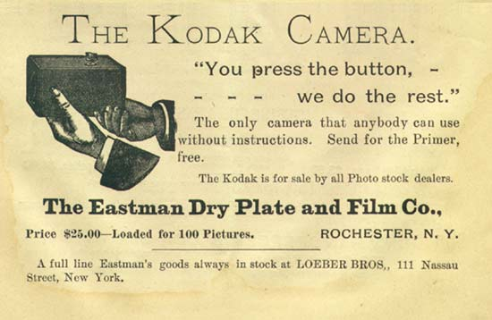

# Scientific Photography
##### This page written by Nica Ross
---

### Reading Summary: Photography and Scientific Observation
By Kelley Wilder

Kelley Wilder is Professor of Photographic History, Director of the [Photographic History Research Centre] (https://photographichistory.wordpress.com/), and Director of the Institute of Art and Design at De Montfort University, Leicester. From 2000-2003 she was Assistant Editor on the Correspondence of William Henry Fox Talbot, and she served on the Advisory Board of the Talbot Catalogue Raisonné Project at the Bodleian Library. She is the author of numerous books and articles on photography, archives and science, including Photography and Science (Reaktion 2009) and with Gregg Mitman, Documenting the World: Film, Photography and the Scientific Record (Chicago 2016).

#### **Thesis**: Photography revolutionized scientific observation by providing objectivity, technical reliability, and extended visibility, yet faced challenges and contradictions.

#### **Photography and Observation**
- Early scientific observation required innate skill and years of practice.
- Photography's promise to simplify and enhance scientific observation:
  - Mechanical, optical, and objective nature of photography.
  - Idealized as passive and objective, in contrast to human observation.

*Advertisement for Kodak #1 or #2 camera in the 1890s.*

#### Pre-Photographic Scientific Observation, 2 Examples

- The Dogon People of Mali identified Sirius "A"'s dwarf star twin Sirius "B" long before Alvan Clark first spotted the dwarf star using a telescope in 1862.

- Giuseppe Arcimboldo's residence as court painter to  Emperor Maximilian II gave him access to the Emperor's vast collections of rare flora and fauna and his patronage of science as well as art. During his residency he had access to scholars like the botanist Carolus Clusius and his work bridged biological observation and portraiture. 

#### **Emulsion Explainer**

*16 mm film still, One Big Eye (2024) by Sobia Ahmad*

‘One Big Eye’ is a hand-processed 16mm film shot at Pando, an ancient grove of aspen trees that extends across 106 acres in south-central Utah. Seemingly 47,000 individual trees, it is unified by a single immense root system, making it a ‘forest of one.’
The footage was processed at home over the kitchen sink over nine months using an experimental coffee-based developer, which includes other non-toxic, domestic materials such as washing soda, vitamin C powder, and salt. We see this materially focused film practice as an opportunity to rethink ecological entanglements between us and a more-than-human world.

- **Colloid**: A colloid is a type of mixture where one substance is dispersed evenly throughout another. The particles in a colloid are larger than molecules but small enough to remain suspended, without settling out like in a suspension. 
- **Photographic Emulsion**: Photographic emulsion is a colloid because it has tiny solid particles (silver crystals typically) spread out in a liquid-like gelatin. These silver crystals capture light when you take a photo. Even though it's called "emulsion," it's really a colloid where the solid particles (silver) are mixed into a sticky liquid (gelatin).
- There are a wide array of photographic emulsions including **black-and-white emulsions**, **color film emulsions**, **infrared emulsions**, **instant film emulsions**, **alternative process emulsions**, and **X-ray emulsions**.

*George Eastman with a Kodak camera in 1890.*

#### **The Impact of Photography on Scientific Methods**

- Photography's two key promises according to the essay:
  - **Passivity**: Minimal human interference for objectivity.
  - **Extended vision**: Ability to capture what is invisible to the human eye (e.g., ultraviolet radiation).

  
  [Making an image of a Black Hole] (https://drive.google.com/file/d/1YdOrxGm0zEuH-Cuv-0wbWH7Wq8C4fLTj/view?usp=drive_link)

Wikipedia describes a black hole as "a region of spacetime where gravity is so strong that nothing, not even light and other electromagnetic waves, is capable of possessing enough energy to escape it. Einstein's theory of general relativity predicts that a sufficiently compact mass can deform spacetime to form a black hole. The boundary of no escape is called the event horizon. A black hole has a great effect on the fate and circumstances of an object crossing it, but it has no locally detectable features according to general relativity. In many ways, a black hole acts like an ideal black body, as it reflects no light."

Seeing Color in Space. [Video Link](https://drive.google.com/file/d/1U_ZPWdqXMYc6pRAcYBIB0Y5IPwL-_0TG/view?usp=sharing)

#### Challenges to the notion of passivity and objectivity in scientific photography.

- **Human Intervention**: Photographers made decisions about framing, exposure, and developing, introducing subjectivity.

- **Technical Limitations**: Variations in emulsions, lenses, and cameras led to inconsistent results, challenging objectivity.

- **Image Interpretation**: Human interpretation of negatives and positives added subjective judgment, affecting the accuracy of observations.
- **Complexity in Observations**: In fields like astronomy, photographers focused more on managing the process than the object itself, reducing objectivity.
- **Conflicting Results**: Inconsistent photographic data, such as during the transit of Venus, led to debates on the reliability of photography for scientific measurements.

#### Further Resources & References
- Marvin Heiferman's book [Seeing Science:
How Photography Reveals the Universe, 2019] (https://aperture.org/books/seeing-science-how-photography-reveals-the-universe/)
- Bernice Abbott's book [Documenting Science, 1958] (https://cmu.primo.exlibrisgroup.com/permalink/01CMU_INST/6lpsnm/alma991003712429704436)
	- [A video about Bernice Abbott's Science Photography](https://drive.google.com/file/d/1YdOrxGm0zEuH-Cuv-0wbWH7Wq8C4fLTj/view?usp=drive_link)
 Magnetic Field by Bernice Abbott, 1982

